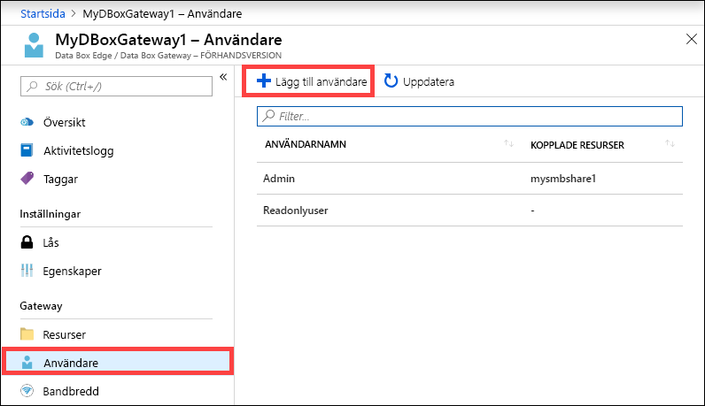
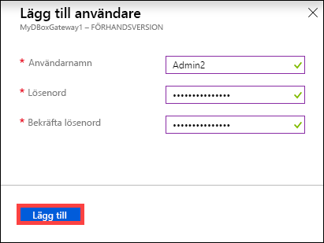
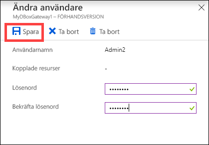
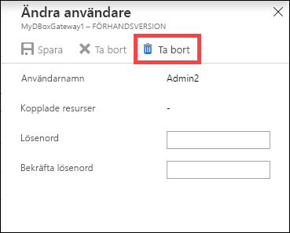
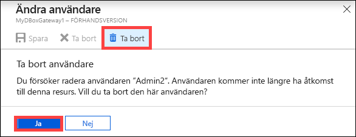
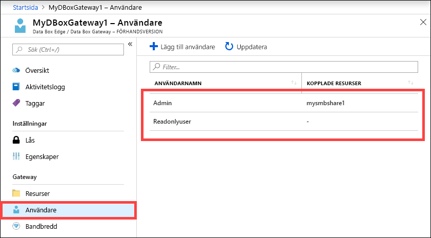

# Använda Azure-portalen för att hantera användare i Azure Data Box Gateway 

Den här artikeln beskriver hur du hanterar användare i din Azure Data Box Gateway. Du kan hantera Azure Data Box Gateway via Azure-portalen eller via det lokala webbgränssnittet. Använd Azure-portalen om du vill lägga till, ändra eller ta bort användare.

I den här artikeln kan du se hur du:

> [!div class="checklist"]
> * Lägga till en användare
> * Ändra användare
> * Ta bort en användare 

## Om användare

Användare kan ha skrivskyddad åtkomst eller fullständig behörighet. Som namnet antyder kan användare med skrivskyddad åtkomst endast visa data som delas. Användare med fullständig behörighet kan läsa data som delas, skriva till dessa resurser och ändra eller ta bort delade data. 

 - **Användare med fullständig behörighet** – En lokal användare med fullständig åtkomst. 
 - **Skrivskyddad användare** – En lokal användare med skrivskyddad åtkomst. Dessa användare är kopplade till resurser som tillåter skrivskyddade åtgärder.

Användarbehörigheterna definieras när användaren skapas i samband med att resurserna skapas. När behörigheterna som associeras med en användare har definierats kan dessa ändras med hjälp av Utforskaren. 

## Lägga till en användare

Lägg till en användare genom att följa de här instruktionerna på Azure-portalen.

1. Gå till din Data Box Gateway-resurs på Azure-portalen och gå sedan till **Översikt**. Klicka på **+ Lägg till användare** i kommandofältet.

    

2. Ange användarnamnet och lösenordet för den användare som du vill lägga till. Bekräfta lösenordet och klicka på **Lägg till**.

    

    > [!IMPORTANT] 
    > Dessa användare har reserverats av systemet och bör inte användas: Administrator, EdgeUser, EdgeSupport, HcsSetupUser, WDAGUtilityAccount, CLIUSR, DefaultAccount, Guest.  

3. Du meddelas när användargenereringen startar och när den är klar. När användaren har skapats klickar du på **Uppdatera** i kommandofältet för att visa den uppdaterade listan med användare.

## Ändra användare

Du kan ändra lösenordet som associeras med en användare när användaren har skapats. Välj och klicka i listan med användare. Ange och bekräfta det nya lösenordet. Spara ändringarna.
 

## Ta bort en användare

Utför följande steg på Azure-portalen om du vill ta bort en användare.

1. Markera och klicka på en användare i listan över användare och klicka sedan på **Ta bort**.  

   

2. Bekräfta borttagningen när du uppmanas att göra det. 

   

Listan över användare uppdateras för att återspegla den borttagna användaren.

## Nästa steg

- Lär dig hur du [hanterar bandbredd](data-box-gateway-manage-bandwidth-schedules.md).
