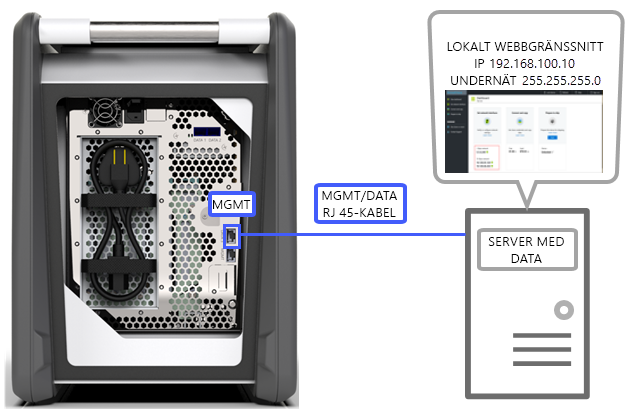
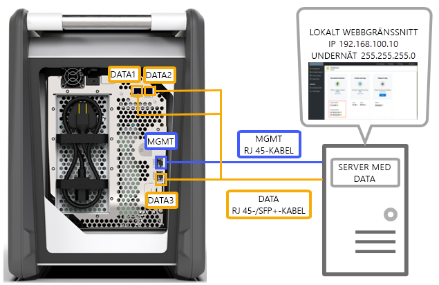
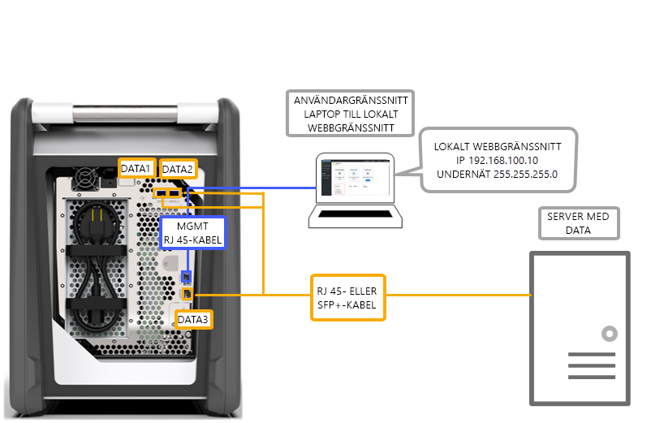
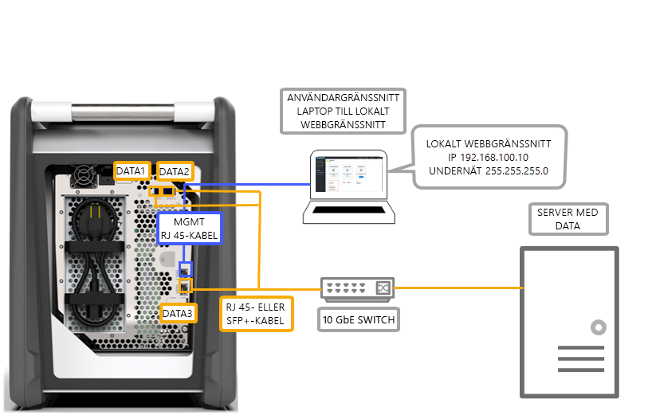
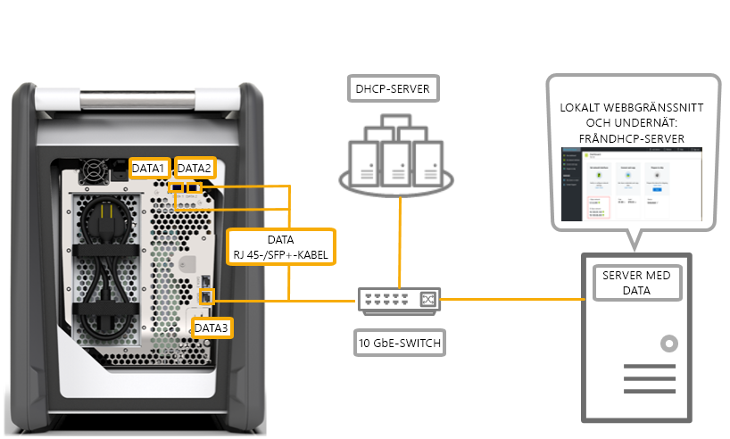

# Alternativ för kabelanslutning av Azure Data Box

I den här artikeln beskrivs olika sätt som du kan kabelansluta Azure Data Box för dataöverföring.

## Överföring via MGMT-port

Det är alternativet är den absolut minsta konfigurationen för Data Box-enheten. Du kan konfigurera endast MGMT-porten för både hantering och data.

Innan du börjar ska du kontrollera att du har:

- En RJ45 Ethernet-kabel för MGMT.
- En datakälla som kör ett [operativsystem som stöds](data-box-system-requirements.md#supported-operating-systems-for-clients).

Kabelanslut enheten med hjälp av följande steg.

1. Använd en RJ45-kabel för att ansluta MGMT-porten till servern som innehåller data.

    

2. Ställ in följande på servern:

    - **IP-adress** på 192.168.100.5
    - **Undernät** på 255.255.255.0

3. Öppna det lokala webbgränssnittet på enheten på 192.168.100.10. Logga in och lås upp Data Box-enheten med upplåsningslösenordet från Azure-portalen.

## Överföring via DATA-port med statiska IP-adresser

Du kan konfigurera två portar för Data Box-enheten, MGMT-porten för hanteringstrafik och en av dataportarna för data. Dataportarna kan vara DATA 1, DATA 2 eller DATA 3.

Vi rekommenderar starkt att om du bara konfigurerar en dataport bör den vara en 10-GbE-port som DATA 1 eller DATA 2. En 1-GbE-port skulle dramatiskt öka tiden det tar att överföra data.

Innan du börjar ska du kontrollera att du har:

- En RJ45 Ethernet-kabel för MGMT.
- En 10-GbE SFP+ Twinax-kopparkabel för varje 10-GbE-dataport som du vill ansluta.
- En eller flera datakällor som kör ett [operativsystem som stöds](data-box-system-requirements.md#supported-operating-systems-for-clients).

### Alternativ 1 – Första installation via server

Kabelanslut enheten med hjälp av följande steg.

1. Använd en RJ45 Ethernet-kabeln från servern direkt till MGMT-porten för konfiguration.
2. Använd en RJ45-kabel för DATA 3 eller SFP+-kabel för att ansluta DATA 1 eller DATA 2 till servern som fungerar som datakälla. Vi rekommenderar att du använder 10-GbE DATA 1- eller DATA 2-portar för bra prestanda.
3. Ställ in följande på servern:

   - **IP-adress** på 192.168.100.5
   - **Undernät** på 255.255.255.0

     

3. Öppna det lokala webbgränssnittet på enheten på 192.168.100.10. Logga in och lås upp Data Box-enheten med upplåsningslösenordet från Azure-portalen.
4. Tilldela statiska IP-adresser till dataportarna du har konfigurerat.

### Alternativ 2 – Första installation via en separat dator

Kabelanslut enheten med hjälp av följande steg.

1. Använd en RJ45 Ethernet-kabel från den separata datorn direkt till HANTERINGs porten för konfiguration.
2. Använd en RJ45-kabel för DATA 3 eller SFP+-kabel för att ansluta DATA 1 eller DATA 2 till servern. Vi rekommenderar att du använder 10-GbE DATA 1- eller DATA 2-portar för bra prestanda. Dataportarna ansluts via en 10-GbE-switch till servern med data.
3. Konfigurera Ethernet-adaptern på den bärbara datorn du använder för att ansluta enheten med:

   - **IP-adress** : 192.168.100.5
   - **Undernät** : 255.255.255.0.
  
   

3. Öppna det lokala webbgränssnittet på enheten på 192.168.100.10. Logga in och lås upp Data Box-enheten med upplåsningslösenordet från Azure-portalen.
4. Identifiera IP-adresserna som tilldelats av DHCP-servern.

## Överföring via DATA-port med statiska IP-adresser med en switch 

Använd den här konfigurationen för flera datakällor i 1 GbE- och 10 gbE-nätverk.

Innan du börjar ska du kontrollera att du har:

- En RJ45 Ethernet-kabel för MGMT.
- En 10-GbE SFP+ Twinax-kopparkabel för varje 10-GbE-dataport som du vill ansluta.
- En eller flera datakällor som kör ett [operativsystem som stöds](data-box-system-requirements.md#supported-operating-systems-for-clients). Dessa datakällor kan vara i olika nätverk som 1 GbE- eller 10-GbE-nätverk.

Kabelanslut enheten med hjälp av följande steg.

1. Använd en RJ45 Ethernet-kabeln från servern direkt till MGMT-porten för konfiguration.
2. Använd en RJ45-kabel för DATA 3 eller SFP+-kabel för att ansluta DATA 1 eller DATA 2 till servern. Vi rekommenderar att du använder 10-GbE DATA 1- eller DATA 2-portar för bra prestanda.
3. Konfigurera Ethernet-adaptern på den bärbara datorn du använder för att ansluta enheten med:

   - **IP-adress** : 192.168.100.5
   - **Undernät** : 255.255.255.0.

     

3. Öppna det lokala webbgränssnittet på enheten på 192.168.100.10. Logga in och lås upp Data Box-enheten med upplåsningslösenordet från Azure-portalen.
4. Tilldela statiska IP-adresser till dataportarna du har konfigurerat.

## Överföring via DATA-port i en DHCP-miljön

Använd den här konfigurationen om enheten kommer att finnas i DHCP-miljön.

Innan du börjar ska du kontrollera att du har:

- En RJ45-kabel om du vill ansluta DATA 1.
- En 10-GbE SFP+ Twinax-kopparkabel för varje 10-GbE-dataport som du vill ansluta.
- En eller flera datakällor som kör ett [operativsystem som stöds](data-box-system-requirements.md#supported-operating-systems-for-clients). Dessa datakällor kan vara i olika nätverk som 1 GbE- eller 10-GbE-nätverk.

Kabelanslut enheten med hjälp av följande steg.

1. Använd en RJ45- eller SFP+-kabel via en switch (där DHCP-servern är tillgänglig) till servern.

    

2. Använd DHCP-server eller DNS-server för att identifiera IP-adressen.
3. Via en server på samma nätverk öppnar du det lokala webbgränssnittet för enheten som använder IP-adressen som har tilldelats av DHCP-servern. Logga in och lås upp Data Box-enheten med upplåsningslösenordet från Azure-portalen.

## Nästa steg

- När du har kabelanslutit enheten går du till [Kopiera data till Azure Data Box](data-box-deploy-copy-data.md).
