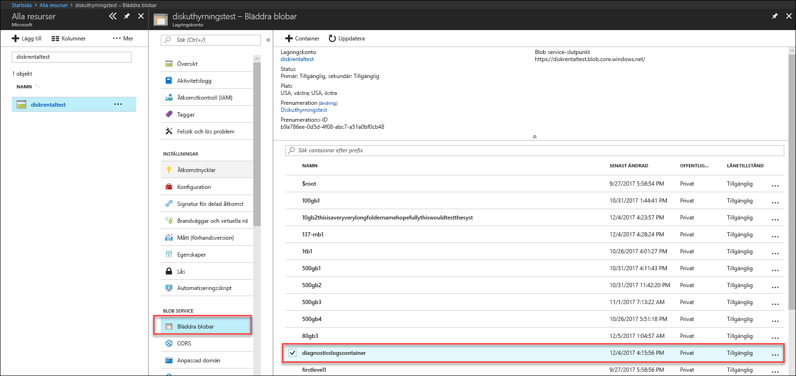
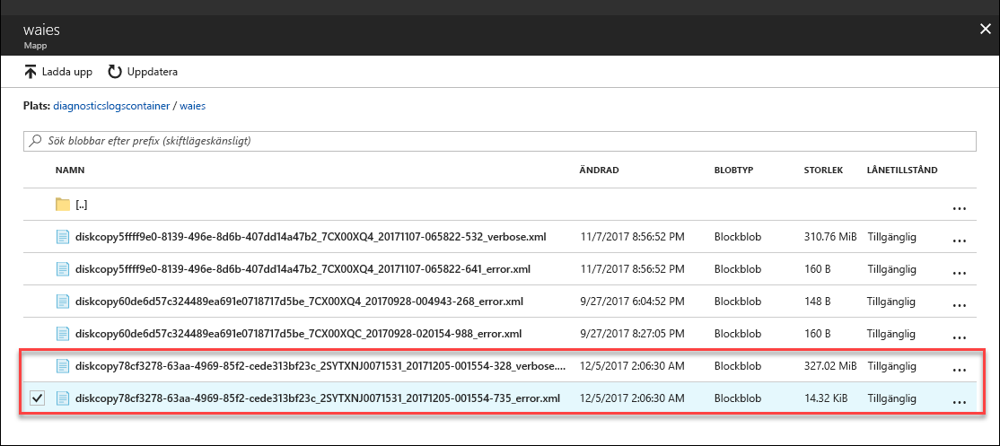

# <a name="troubleshoot-issues-in-azure-data-box-disk"></a>Felsöka problem i Azure Data Box-Disk

Den här artikeln gäller för Microsoft Azure Data Box-Disk och beskriver de arbetsflöden som används för att felsöka eventuella problem som du ser när du distribuerar den här lösningen. 

Den här artikeln innehåller följande avsnitt:

- Ladda ned diagnostikloggar
- Frågeaktivitetsloggar
- Fel med verktyget Data Box Disk Unlock
- Fel med verktyget Data Box Disk Split Copy

## <a name="download-diagnostic-logs"></a>Ladda ned diagnostikloggar

Om det uppstår några fel under datakopieringsprocessen visar portalen en sökväg till den mapp där diagnostikloggarna finns. 

Diagnostikloggarna kan vara:
- Felloggar
- Utförliga loggar  

För att navigera till sökvägen för kopieringsloggen går du till det lagringskonto som associerats med din Data Box-beställning. 

1.  Gå till **Allmänt > Beställningsinformation** och anteckna det lagringskonto som är associerat med din beställning.
 

2.  Gå till **Alla resurser** och sök efter det lagringskonto som identifierades i föregående steg. Välj och klicka på lagringskontot.

    

3.  Gå till **Blob Service > Bläddra efter blobar** och leta efter den blob som motsvarar lagringskontot. Gå till **diagnosticslogcontainer > waies**. 

    

    Du bör se både felloggarna och utförliga loggar för datakopiering. Välj och klicka på varje fil och ladda sedan ned en lokal kopia.

## <a name="query-activity-logs"></a>Frågeaktivitetsloggar

Använd aktivitetsloggarna för att hitta ett fel när du felsöker eller övervakar hur en användare i organisationen ändrat en resurs. Via aktivitetsloggarna kan du fastställa:

- Vilka åtgärder som utfördes på resurserna i din prenumeration.
- Den som initierade åtgärden.
- När åtgärden utfördes.
- Status för åtgärden.
- Värdena för andra egenskaper som kan hjälpa dig undersöka åtgärden.

Aktivitetsloggen innehåller alla skrivåtgärder (till exempel PUT, POST, DELETE) som utförts på dina resurser, men inte läsåtgärderna (till exempel GET).

Aktivitetsloggar bibehålls i 90 dagar. Du kan fråga efter alla datumintervall förutsatt att startdatumet inte är mer än 90 dagar bakåt i tiden. Du kan även filtrera med någon av de inbyggda frågorna i Insights. Till exempel kan du klicka på ett fel och sedan välja och klicka på specifika fel för att förstå rotorsaken.

## <a name="data-box-disk-unlock-tool-errors"></a>Fel med verktyget Data Box Disk Unlock


| Felmeddelande/verktygsbeteende      | Rekommendationer                                                                                               |
|-------------------------------------------------------------------------------------------------------------------------------------|------------------------------------------------------------------------------------------------------|
| Ingen<br><br>Upplåsningsverktyget för Data Box-disk kraschar.                                                                            | BitLocker är inte installerad. Kontrollera att den värddator som kör upplåsningsverktyget för Data Box-disk har BitLocker installerat.                                                                            |
| Aktuellt .NET Framework stöds inte. De versioner som stöds är 4.5 och senare.<br><br>Verktyget avslutas med ett meddelande.  | .NET 4.5 är inte installerat. Installera .NET 4.5 eller senare på den värddator som kör upplåsningsverktyget för Data Box-disk.                                                                            |
| Det gick inte att låsa upp eller verifiera några volymer. Kontakta Microsoft-supporten.  <br><br>Verktyget misslyckas med att låsa upp eller verifiera låsta enheter. | Verktyget kunde inte låsa upp någon av de låsta enheterna med den angivna nyckeln. Kontakta Microsoft-supporten om du vill ha hjälp.                                                |
| Följande volymer är olåsta och verifierade. <br>Enhetsbeteckningar för volymen: E:<br>Det gick inte att låsa upp alla volymer med följande nycklar: werwerqomnf, qwerwerqwdfda <br><br>Verktyget låser upp vissa enheter och visar lyckade och misslyckade enhetsbeteckningar.| Slutfördes delvis. Det gick inte att låsa upp några av enheterna med den angivna nyckeln. Kontakta Microsoft-supporten om du vill ha hjälp. |
| Det gick inte att hitta låsta volymer. Kontrollera att den disk som mottogs från Microsoft är korrekt ansluten och är låst.          | Verktyget kan inte hitta några låsta enheter. Antingen är enheterna redan upplåsta eller så identifieras de inte. Kontrollera att enheterna är anslutna och att de är låsta.                                                           |
| Allvarligt fel: Ogiltig parameter<br>Parameternamn: invalid_arg<br>ANVÄNDNING:<br>DataBoxDiskUnlock /PassKeys:<lista_över_nycklar_separerade_med_semikolon><br><br>Exempel: DataBoxDiskUnlock /PassKeys:passkey1;passkey2;passkey3<br>Exempel: DataBoxDiskUnlock /SystemCheck<br>Exempel: DataBoxDiskUnlock /Help<br><br>/PassKeys:       Hämta den här nyckeln från Azure DataBox diskbeställning. Nyckeln låser upp dina diskar.<br>/ Hjälp:           Det här alternativet innehåller hjälp om cmdlet-syntax och exempel.<br>/SystemCheck:    Det här alternativet kontrollerar om datorn uppfyller kraven för att köra verktyget.<br><br>Tryck på valfri tangent för att avsluta. | En ogiltig parameter har angetts. De enda tillåtna parametrarna är /SystemCheck och /PassKey/Help.                                                                            |

## <a name="data-box-disk-split-copy-tool-errors"></a>Fel med verktyget Data Box Disk Split Copy

|Felmeddelande/varningar  |Rekommendationer |
|---------|---------|
|[Information] Hämta BitLocker-lösenordet för volymen: m <br>[Fel] Undantag inträffade vid hämtning av BitLocker-nyckel för volymen m:<br> Sekvensen innehåller inga element.|Det här felet utlöses om Data Box-måldisken är offline. <br> Använd verktyget `diskmgmt.msc` till onlinediskar.|
|[Fel] Ett undantag uppstod: WMI-åtgärden misslyckades:<br> Method=UnlockWithNumericalPassword, ReturnValue=2150694965, <br>Win32Message = Formatet för det angivna återställningslösenordet är ogiltigt. <br>BitLocker-återställningslösenord är 48 siffror. <br>Kontrollera att återställningslösenordet har rätt format och försök sedan igen.|Använda verktyget Data Box Disk Unlock för att först låsa upp diskarna och prova kommandot igen. Mer information finns i <li> [Låsa upp Data Box-disk för Windows-klienter](data-box-disk-deploy-set-up.md#unlock-disks-on-windows-client). </li><li> [Låsa upp Data Box-disk för Linux-klienter](data-box-disk-deploy-set-up.md#unlock-disks-on-linux-client). </li>|
|[Fel] Ett undantag uppstod: Det finns en DriveManifest.xml-fil på målenheten. <br> Detta anger att målenheten kanske har förberetts med en annan journalfil. <br>För att lägga till mer data till samma enhet använder du föregående journalfil. För att ta bort befintliga data och återanvända målenheten för ett nytt importjobb tar du bort DriveManifest.xml på enheten. Kör det här kommandot igen med en ny journalfil.| Det här felet tas emot när du försöker använda samma uppsättning enheter för flera importsessioner. <br> Använda endast en uppsättning enheter för endast en delnings- och kopieringssession.|
|[Fel] Ett undantag uppstod: CopySessionId importdata-sept-test-1 refererar till en tidigare session för kopiering och inte kan återanvändas för en ny session för kopiering.|Det här felet rapporteras när du försöker använda samma jobbnamn för ett nytt jobb som använts för ett tidigare slutfört jobb.<br> Tilldela det nya jobbet ett unikt namn.|
|[Info] Målfilens eller katalogens namn överskrider NTFS-längdbegränsningen. |Det här meddelandet rapporteras när målfilen bytte namn på grund av en lång filsökväg.<br> Ändra dispositionsalternativet i `config.json`-filen för att styra det här beteendet.|
|[Fel] Ett undantag uppstod: Felaktiga JSON-escape-sekvensen. |Det här meddelandet rapporteras när config.json har ett format som inte är giltigt. <br> Verifiera din `config.json` med hjälp av [JSONlint](https://jsonlint.com/) innan du sparar filen.|

## <a name="deployment-issues-for-linux"></a>Distributionsproblem för Linux

Det här avsnittet beskriver några av de viktigaste problemen inför under distributionen av Data Box-Disk när du använder en Linux-klient för kopiering av data.

### <a name="issue-drive-getting-mounted-as-read-only"></a>Ärende: Disken är komma monterad som skrivskyddad
 
**Orsak** 

Detta kan bero på en felaktig filsystem. 

Ommontering en enhet som Läs-och fungerar inte med Data Box-diskar. Det här scenariot stöds inte med enheter dekrypteras av dislocker. Du kanske har har monteras enheten med följande kommando:

    `# mount -o remount, rw /mnt/DataBoxDisk/mountVol1`

Även om den ommontering lyckades, behålls inte data.

**Lösning**

Gör följande på din Linux-dator:

1. Installera den `ntfsprogs` paketet för verktyget ntfsfix.
2. Demontera monteringspunkterna från verktyget upplåsning av enheten. Antal monteringspunkter varierar för enheter.

    ```
    unmount /mnt/DataBoxDisk/mountVol1
    ```

3. Kör `ntfsfix` på motsvarande sökväg. Det markerade talet får vara samma som steg 2.

    ```
    ntfsfix /mnt/DataBoxDisk/bitlockerVol1/dislocker-file
    ```

4. Kör följande kommando för att ta bort viloläge metadata som kan orsaka problem för montering.

    ```
    ntfs-3g -o remove_hiberfile /mnt/DataBoxDisk/bitlockerVol1/dislocker-file /mnt/DataBoxDisk/mountVol1
    ```

5. Gör en ren demonteringen.

    ```
    ./DataBoxDiskUnlock_x86_64 /unmount
    ```

6. Gör en ren upplåsning och montera.
7. Testa monteringspunkten genom att skriva en fil.
8. Demontera och återmontera för att verifiera fil-persistence.
9. Fortsätt med Datakopieringen.
 
### <a name="issue-error-with-data-not-persisting-after-copy"></a>Ärende: Fel med data som inte spara efter kopiering
 
**Orsak** 

Om du ser att enheten inte har data när den var demontera (även om data har kopierats till det), så är det möjligt att du monteras på en enhet som Läs-och när enheten har monterats som skrivskyddade.

**Lösning**
 
Om så är fallet, se lösningen på [enheter komma monterats som skrivskyddade](#issue-drive-getting-mounted-as-read-only).

Om det inte är fallet, kopiera loggarna från mappen med verktyget Data Box Disk låsa upp och [kontakta Microsoft Support](data-box-disk-contact-microsoft-support.md).

## <a name="deployment-issues-for-windows"></a>Problem med distribution för Windows

Det här avsnittet beskrivs några av de viktigaste problemen inför under distributionen av Data Box-Disk när du använder en Windows-klient för kopiering av data

### <a name="issue-could-not-unlock-drive-from-bitlocker"></a>Ärende: Det gick inte att låsa upp enheten från BitLocker
 
**Orsak** 

Du har använt lösenord i BitLocker-dialogrutan och försök att låsa upp disken via BitLocker låsa upp enheter dialogrutan. Detta kan inte fungera. 

**Lösning**

För att låsa upp Data Box-diskar, måste du använda verktyget Data Box Disk låsa upp och ange lösenord från Azure-portalen. Mer information finns i [Självstudie: Packa upp, Anslut och lås Azure Data Box-Disk](data-box-disk-deploy-set-up.md#connect-to-disks-and-get-the-passkey).
 
### <a name="issue-could-not-unlock-or-verify-some-volumes-contact-microsoft-support"></a>Ärende: Det gick inte att låsa upp eller verifiera några volymer. Kontakta Microsoft-supporten.
 
**Orsak** 

Du kan se följande fel i felloggen och går inte att låsa upp eller verifiera några volymer.

`Exception System.IO.FileNotFoundException: Could not load file or assembly 'Microsoft.Management.Infrastructure, Version=1.0.0.0, Culture=neutral, PublicKeyToken=31bf3856ad364e35' or one of its dependencies. The system cannot find the file specified.`
 
Detta anger att du förmodligen saknar rätt version av Windows PowerShell på Windows-klient.

**Lösning**

Du kan installera [Windows PowerShell-v 5.0](https://www.microsoft.com/download/details.aspx?id=54616) och försök igen.
 
Om du fortfarande inte kan låsa upp volymerna, kopiera loggar från mappen med verktyget Data Box Disk låsa upp och [kontakta Microsoft Support](data-box-disk-contact-microsoft-support.md).

## <a name="next-steps"></a>Nästa steg

- Lär dig hur du [hanterar Data Box-disk via Azure-portalen](data-box-portal-ui-admin.md).
