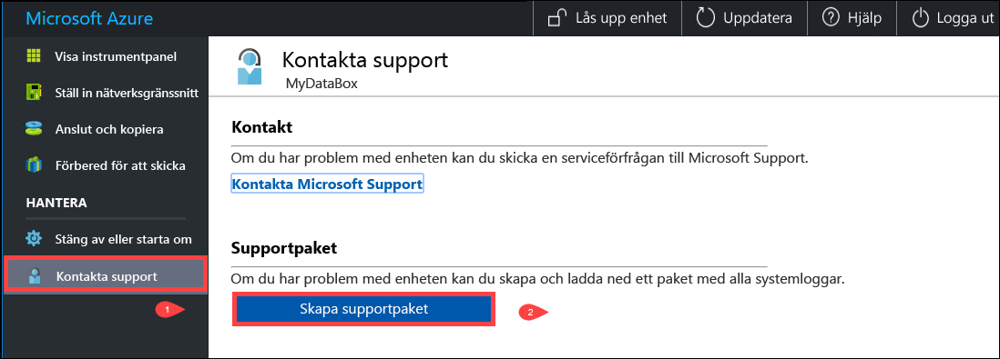
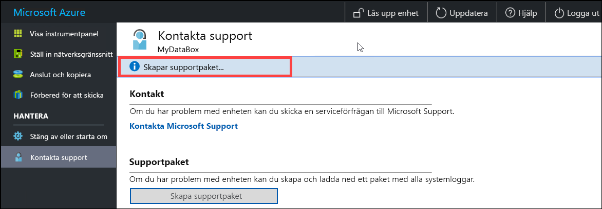
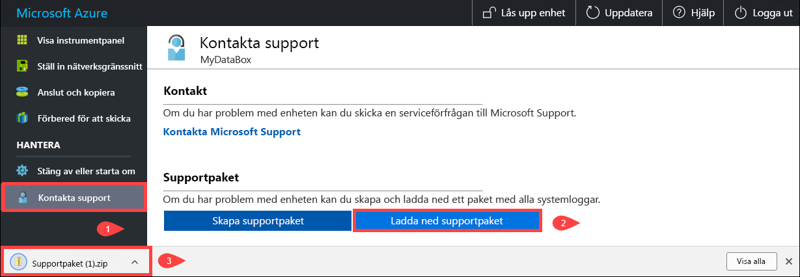
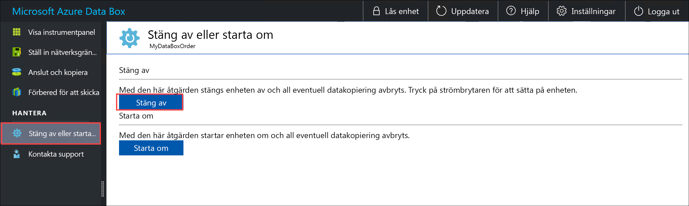
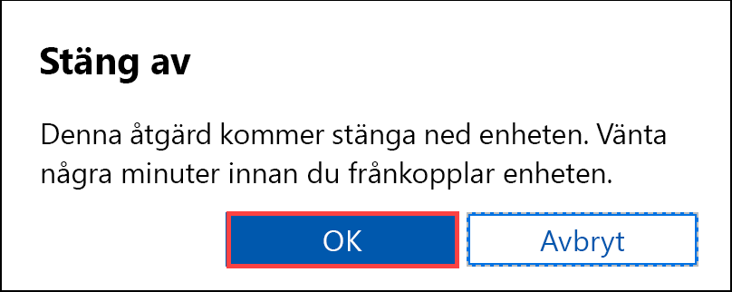
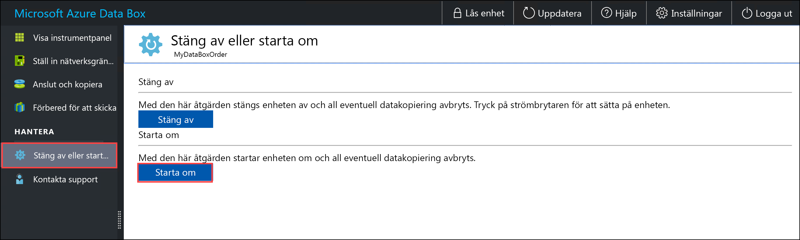
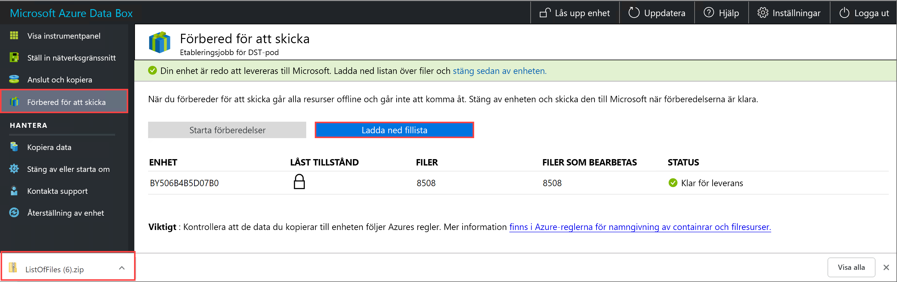
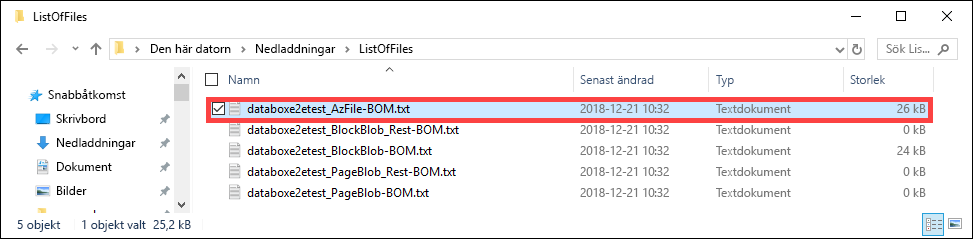
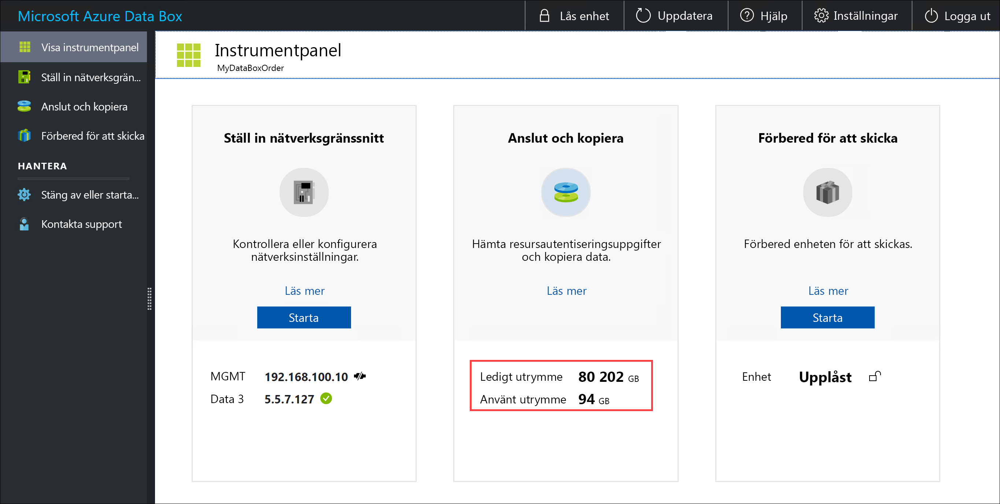
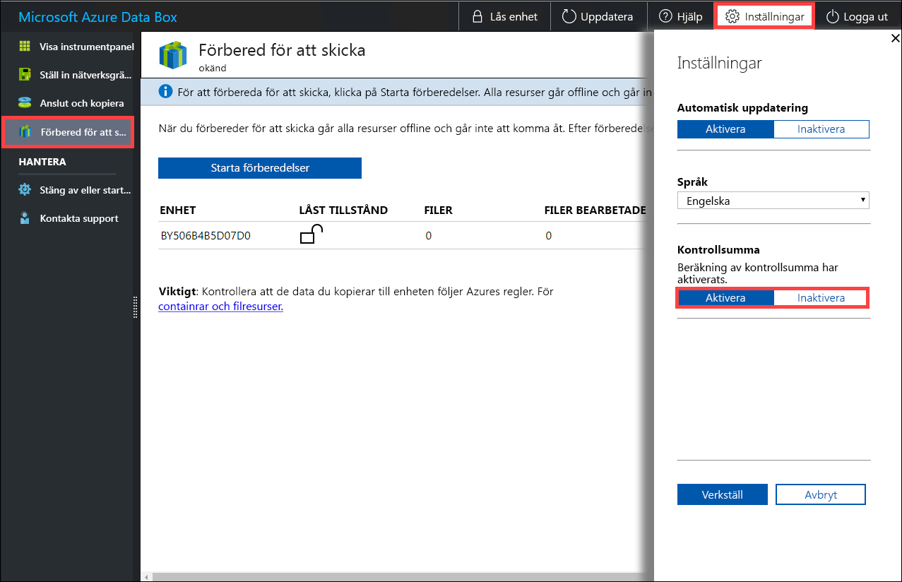

# <a name="use-the-local-web-ui-to-administer-your-data-box-and-data-box-heavy"></a>Använd det lokala webb gränssnittet för att administrera Data Box-enhet och Data Box Heavy

I den här artikeln beskrivs några konfigurations-och hanterings uppgifter som utförs på Data Box-enhet och Data Box Heavy enheter. Du kan hantera Data Box-enhet och Data Box Heavy enheter via Azure Portal användar gränssnittet och det lokala webb gränssnittet för enheten. Den här artikeln fokuserar på uppgifter som utförs med hjälp av det lokala webb gränssnittet.

Det lokala webb gränssnittet för Data Box-enhet och för Data Box Heavy används för den inledande konfigurationen av enheten. Du kan också använda det lokala webb gränssnittet för att stänga av eller starta om enheten, köra diagnostiska tester, uppdatera program vara, Visa kopierings loggar, radera lokala data från enheten och generera ett support paket för Microsoft Support. På en Data Box Heavy enhet med två oberoende noder kan du komma åt två separata lokala webb-UIs som motsvarar varje nod i enheten.

[!INCLUDE [Data Box feature is in preview](../../includes/data-box-feature-is-preview-info.md)]

## <a name="generate-support-package"></a>Generera supportpaket

Om det uppstår enhetsproblem kan du skapa ett supportpaket från systemloggarna. Microsoft Support använder det här paketet för att felsöka problemet.

Utför följande steg för att generera ett support paket:

1. I det lokala webb gränssnittet går du till **kontakta support**. Du kan också välja **inkludera minnes dum par**. Välj sedan **skapa support paket**.

    En minnesdump är innehållet i enhetens minne, som sparas efter ett systemfel.

    Du bör inte välja alternativet **inkludera minnes dum par** om inte support ber om något. Det tar lång tid att samla in ett support paket som innehåller minnes dum par och känsliga data ingår.

    

    Ett supportpaket samlas in. Den här åtgärden tar några minuter om du bara inkluderar system loggar. Om du inkluderar minnes dum par tar det mycket längre tid.

    

2. När du har skapat ett support paket väljer du **Hämta support paket**.

    

3. Bläddra och välj nedladdningsplats. Öppna mappen för att visa innehållet.

    

## <a name="erase-local-data-from-your-device"></a>Radera lokala data från din enhet

Du kan använda det lokala webb gränssnittet för att radera lokala data från din enhet innan du återställer dem till Azure-datacentret.

> [!IMPORTANT]
> Det går inte att ångra data radering. Innan du tar bort lokala data från enheten måste du säkerhetskopiera filerna.

Utför följande steg för att radera lokala data från enheten:

1. Gå till **data radering** i det lokala webb gränssnittet.
2. Ange enhetens lösen ord och välj **Radera data**.

    

3. I bekräftelse meddelandet väljer du **Ja** för att fortsätta. En data radering kan ta så lång tid som 50 minuter.

   Se till att säkerhetskopiera dina lokala data innan du tar bort dem från enheten. Det går inte att ångra data radering.

    

## <a name="shut-down-or-restart-your-device"></a>Stänga av eller starta om enheten

Du kan stänga av eller starta om enheten med hjälp av det lokala webb gränssnittet. Vi rekommenderar att du tar resurserna offline på värden och sedan på enheten innan du startar om. Detta minimerar risken för skadade data. Se till att data kopieringen inte pågår när du stänger av enheten.

Följ stegen nedan om du vill stänga av enheten.

1. I det lokala webbgränssnittet går du till **Stäng av eller starta om**.

2. Välj **Stäng av**.

    

3. När du uppmanas att bekräfta, väljer du **OK** för att fortsätta.

    

När enheten är avstängd använder du strömknappen på frontpanelen för att starta enheten.

Utför följande steg för att starta om din Data Box.

1. I det lokala webbgränssnittet går du till **Stäng av eller starta om**.
2. Välj **starta om**.

    

3. När du uppmanas att bekräfta, väljer du **OK** för att fortsätta.

   Enheten stängs av och startar sedan om.

## <a name="download-bom-or-manifest-files"></a>Ladda ned strukturlista eller manifestfiler

STRUKTUR listan eller manifest filen innehåller en lista över de filer som kopieras till Data Box-enhet eller Data Box Heavy. De här filerna genereras för en import ordning när du förbereder enheten för leverans.

Innan du börjar ska du följa de här stegen för att ladda ned STRUKTURLISTE-eller manifest fil för import ordningen:

1. Gå till det lokala webb gränssnittet för din enhet. Kontrol lera att enheten har slutfört **Förbered för att skicka** steget. När enhetsförberedelserna har slutförts visas enhetens status som **Klar för leverans**.

    

2. Välj **Hämta lista med filer** för att ladda ned listan med filer som kopierades till data Box-enhet.

    <!--  -->

3. I Utforskaren genereras separata listor över filer beroende på vilket protokoll som används för att ansluta till enheten och vilken Azure Storage typ som används.

    <!--  -->
    

   Följande tabell mappar filnamnen med den typ av Azure Storage-lagring och det anslutningsprotokoll som används.

    |Filnamn  |Azure Storage-typ  |Anslutningsprotokoll som används |
    |---------|---------|---------|
    |utSAC1_202006051000_BlockBlob-BOM.txt     |Blockblobar         |SMB/NFS         |
    |utSAC1_202006051000_PageBlob-BOM.txt     |Sidblobar         |SMB/NFS         |
    |utSAC1_202006051000_AzFile-BOM.txt    |Azure Files         |SMB/NFS         |
    |utsac1_PageBlock_Rest-BOM.txt     |Sidblobar         |REST        |
    |utsac1_BlockBlock_Rest-BOM.txt    |Blockblobar         |REST         |

Du använder den här listan för att bekräfta överföringen av filerna till Azure Storage-kontot när Data Box returnerats till Azure-datacentret. En exempelmanifestfil visas nedan.

> [!NOTE]
> På en Data Box Heavy finns två uppsättningar med filer (BOM-filer) som motsvarar de två noderna på enheten.

```xml
<file size="52689" crc64="0x95a62e3f2095181e">\databox\media\data-box-deploy-copy-data\prepare-to-ship2.png</file>
<file size="22117" crc64="0x9b160c2c43ab6869">\databox\media\data-box-deploy-copy-data\connect-shares-file-explorer2.png</file>
<file size="57159" crc64="0x1caa82004e0053a4">\databox\media\data-box-deploy-copy-data\verify-used-space-dashboard.png</file>
<file size="24777" crc64="0x3e0db0cd1ad438e0">\databox\media\data-box-deploy-copy-data\prepare-to-ship5.png</file>
<file size="162006" crc64="0x9ceacb612ecb59d6">\databox\media\data-box-cable-options\cabling-dhcp-data-only.png</file>
<file size="155066" crc64="0x051a08d36980f5bc">\databox\media\data-box-cable-options\cabling-2-port-setup.png</file>
<file size="150399" crc64="0x66c5894ff328c0b1">\databox\media\data-box-cable-options\cabling-with-switch-static-ip.png</file>
<file size="158082" crc64="0xbd4b4c5103a783ea">\databox\media\data-box-cable-options\cabling-mgmt-only.png</file>
<file size="148456" crc64="0xa461ad24c8e4344a">\databox\media\data-box-cable-options\cabling-with-static-ip.png</file>
<file size="40417" crc64="0x637f59dd10d032b3">\databox\media\data-box-portal-admin\delete-order1.png</file>
<file size="33704" crc64="0x388546569ea9a29f">\databox\media\data-box-portal-admin\clone-order1.png</file>
<file size="5757" crc64="0x9979df75ee9be91e">\databox\media\data-box-safety\japan.png</file>
<file size="998" crc64="0xc10c5a1863c5f88f">\databox\media\data-box-safety\overload_tip_hazard_icon.png</file>
<file size="5870" crc64="0x4aec2377bb16136d">\databox\media\data-box-safety\south-korea.png</file>
<file size="16572" crc64="0x05b13500a1385a87">\databox\media\data-box-safety\taiwan.png</file>
<file size="999" crc64="0x3f3f1c5c596a4920">\databox\media\data-box-safety\warning_icon.png</file>
<file size="1054" crc64="0x24911140d7487311">\databox\media\data-box-safety\read_safety_and_health_information_icon.png</file>
<file size="1258" crc64="0xc00a2d5480f4fcec">\databox\media\data-box-safety\heavy_weight_hazard_icon.png</file>
<file size="1672" crc64="0x4ae5cfa67c0e895a">\databox\media\data-box-safety\no_user_serviceable_parts_icon.png</file>
<file size="3577" crc64="0x99e3d9df341b62eb">\databox\media\data-box-safety\battery_disposal_icon.png</file>
<file size="993" crc64="0x5a1a78a399840a17">\databox\media\data-box-safety\tip_hazard_icon.png</file>
<file size="1028" crc64="0xffe332400278f013">\databox\media\data-box-safety\electrical_shock_hazard_icon.png</file>
<file size="58699" crc64="0x2c411d5202c78a95">\databox\media\data-box-deploy-ordered\data-box-ordered.png</file>
<file size="46816" crc64="0x31e48aa9ca76bd05">\databox\media\data-box-deploy-ordered\search-azure-data-box1.png</file>
<file size="24160" crc64="0x978fc0c6e0c4c16d">\databox\media\data-box-deploy-ordered\select-data-box-option1.png</file>
<file size="115954" crc64="0x0b42449312086227">\databox\media\data-box-disk-deploy-copy-data\data-box-disk-validation-tool-output.png</file>
<file size="6093" crc64="0xadb61d0d7c6d4deb">\databox\data-box-cable-options.md</file>
<file size="6499" crc64="0x080add29add367d9">\databox\data-box-deploy-copy-data-via-nfs.md</file>
<file size="11089" crc64="0xc3ce6b13a4fe3001">\databox\data-box-deploy-copy-data-via-rest.md</file>
<file size="9126" crc64="0x820856b5a54321ad">\databox\data-box-overview.md</file>
<file size="10963" crc64="0x5e9a14f9f4784fd8">\databox\data-box-safety.md</file>
<file size="5941" crc64="0x8631d62fbc038760">\databox\data-box-security.md</file>
<file size="12536" crc64="0x8c8ff93e73d665ec">\databox\data-box-system-requirements-rest.md</file>
<file size="3220" crc64="0x7257a263c434839a">\databox\data-box-system-requirements.md</file>
<file size="2823" crc64="0x63db1ada6fcdc672">\databox\index.yml</file>
<file size="4364" crc64="0x62b5710f58f00b8b">\databox\data-box-local-web-ui-admin.md</file>
<file size="3603" crc64="0x7e34c25d5606693f">\databox\TOC.yml</file>
```

Den här filen innehåller en lista över alla filer som kopierades i Data Box-enhet eller Data Box Heavy. I den här filen relaterar *crc64*-värdet till kontrollsumman som genererats för den motsvarande filen.

## <a name="view-available-capacity-of-the-device"></a>Visa tillgänglig kapacitet på enheten

Du kan använda enhetsinstrumentpanelen för att visa tillgänglig och använd kapacitet för enheten.

1. I det lokala webbgränssnittet går du till **Visa instrumentpanel**.
2. Under **Anslut och kopiera** visas ledigt och använt utrymme på enheten.

    

## <a name="skip-checksum-validation"></a>Hoppa över validering av kontrollsummor

Kontrollsummor genereras för dina data som standard när du förbereder för att skicka. Beroende på datatyp (små filstorlekar) kan prestanda i vissa sällsynta fall vara långsamma. I sådana fall kan du hoppa över kontrollsumman.

Beräkning av kontroll Summa under förberedelse till leverans görs bara för import order och inte för export order.

Vi rekommenderar starkt att du inte inaktiverar kontroll summan, om inte prestandan påverkas allvarligt.

1. I det övre högra hörnet av det lokala webb gränssnittet på enheten går du till **Inställningar**.

    

2. **Inaktivera** validering av kontrollsummor
3. Välj **Använd**.

> [!NOTE]
> Alternativet för att hoppa över beräkning av kontroll summa är endast tillgängligt när Azure Data Box har låsts upp. Du ser inte det här alternativet när enheten är låst.

## <a name="enable-smb-signing"></a>Aktivera SMB-signering

SMB-signering (Server Message Block) är en funktion genom vilken kommunikation som använder SMB kan signeras digitalt på paket nivå. Den här signeringen förhindrar attacker som ändrar SMB-paket under överföring.

Mer information om SMB-signering finns i [Översikt över Server Message Block signering](https://support.microsoft.com/help/887429/overview-of-server-message-block-signing).

Så här aktiverar du SMB-signering i din Azure-enhet:

1. I det övre högra hörnet av det lokala webb gränssnittet på enheten väljer du **Inställningar**.

    

2. **Aktivera** SMB-signering.

    

3. Välj **Använd**.
4. I det lokala webbgränssnittet går du till **Stäng av eller starta om**.
5. Välj **starta om**.

## <a name="enable-backup-operator-privileges"></a>Aktivera ansvarig för säkerhets kopiering

Dina webb GRÄNSSNITTs användare har behörighet som ansvarig för säkerhets kopiering på SMB-resurser som standard. Om du inte vill ha det kan du använda **behörigheten aktivera back operator** för att inaktivera eller aktivera privilegierna.

Mer information finns i säkerhets kopierings ansvariga i [Active Directory säkerhets grupper](/windows/security/identity-protection/access-control/active-directory-security-groups#backup-operators).

Så här aktiverar du behörighet för ansvarig för säkerhets kopiering i din Azure-enhet:

1. I det övre högra hörnet av det lokala webb gränssnittet på enheten väljer du **Inställningar**.

   

2. **Aktivera** Behörighet för säkerhets kopierings ansvarig.

   

3. **Välj Använd**.
4. I det lokala webbgränssnittet går du till **Stäng av eller starta om**.
5. Välj **starta om**.

## <a name="enable-acls-for-azure-files"></a>Aktivera ACL: er för Azure Files

Metadata på filer överförs som standard när användare laddar upp data via SMB till din Data Box-enhet. Metadata innehåller åtkomst kontrol listor (ACL: er), filattribut och tidsstämplar. Om du inte vill det kan du använda **ACL: er för Azure Files** för att inaktivera eller aktivera den här funktionen.

<!--For more information about metadata that is transferred, see [Preserving the ACLs and metadata with Azure Data Box](./data-box-local-web-ui-admin.md#enable-backup-operator-privileges) - IN DEVELOPMENT-->

> [!Note]
> Om du vill överföra metadata med filer måste du vara ansvarig för säkerhets kopiering. När du använder den här funktionen kontrollerar du att lokala användare av webb gränssnittet är ansvariga för säkerhets kopiering. Se [Aktivera behörighet för säkerhets kopierings ansvariga](#enable-backup-operator-privileges).

Så här aktiverar du överföring av ACL: er för Azure Files:

1. I det övre högra hörnet av det lokala webb gränssnittet på enheten väljer du **Inställningar**.

    

2. **Aktivera** ACL: er för Azure Files.

     
  
3. Välj **Använd**.
4. I det lokala webbgränssnittet går du till **Stäng av eller starta om**.
5. Välj **starta om**.

## <a name="enable-tls-11"></a>Aktivera TLS 1,1

Som standard använder Azure Data Box Transport Layer Security (TLS) 1,2 för kryptering eftersom det är säkrare än TLS 1,1. Men om du eller dina klienter använder en webbläsare för att komma åt data som inte stöder TLS 1,2, kan du Aktivera TLS 1,1.

Mer information om TLS finns i [Azure Data Box Gateway säkerhet](../databox-gateway/data-box-gateway-security.md).

Så här aktiverar du TLS 1,1 i din Azure-enhet:

1. I det övre högra hörnet av det lokala webb gränssnittet på enheten väljer du **Inställningar**.

    

2. **Aktivera** TLS 1,1.

    

3. Välj **Använd**.
4. I det lokala webbgränssnittet går du till **Stäng av eller starta om**.
5. Välj **starta om**.

## <a name="next-steps"></a>Nästa steg

- Lär dig hur du [hanterar data Box-enhet och data Box Heavy via Azure Portal](data-box-portal-admin.md).
