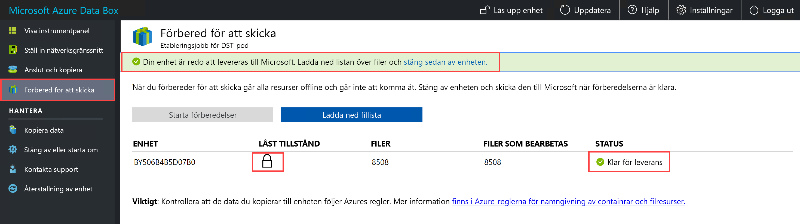

# <a name="use-the-local-web-ui-to-administer-your-data-box"></a>Använda det lokala webbgränssnittet för att administrera din Data Box

Den här artikeln beskriver några av de konfigurations- och hanteringsuppgifter som kan utföras med Data Box. Du kan hantera Data Box via Azure-portalens användargränssnitt och det lokala webbgränssnittet för enheten. Den här artikeln fokuserar på de uppgifter som du kan utföra med det lokala webbgränssnittet.

Det lokala webbgränssnittet för Data Box används för den initiala konfigurationen av enheten. Du kan även använda det lokala webbgränssnittet för att stänga av eller starta om Data Box, köra diagnostiktest, uppdatera programvara, visa kopieringsloggar och generera ett loggpaket för Microsoft Support.

Den här artikeln innehåller följande självstudier:

- Generera ett supportpaket
- Stänga av eller starta om enheten
- Visa tillgänglig kapacitet på enheten
- Hoppa över validering av kontrollsummor 

## <a name="generate-support-package"></a>Generera supportpaket

Om det uppstår enhetsproblem kan du skapa ett supportpaket från systemloggarna. Microsoft Support använder det här paketet för att felsöka problemet. Generera ett supportpaket genom att utföra följande steg:

1. I det lokala webbgränssnittet går du till **Kontakta support** och klickar på **Skapa supportpaket**.

    

2. Ett supportpaket samlas in. Den här åtgärden tar några minuter.

    

3. När supportpaketet är klart klickar du på **Ladda ned supportpaket**. 

    

4. Bläddra och välj nedladdningsplats. Öppna mappen för att visa innehållet.

    


## <a name="shut-down-or-restart-your-device"></a>Stänga av eller starta om enheten

Du kan stänga av eller starta om din Data Box med hjälp av det lokala webbgränssnittet. Innan du startar om rekommenderar vi att du tar ned resurserna offline på värden och sedan enheten. Detta minskar risken för skadade data. Se till att datakopiering inte pågår när du stänger av enheten.

Utför följande steg för att stänga av din Data Box.

1. I det lokala webbgränssnittet går du till **Stäng av eller starta om**.
2. Klicka på **Stäng av**.

    

3. När du uppmanas att bekräfta klickar du på **OK** för att fortsätta.

    

När enheten är avstängd använder du strömknappen på frontpanelen för att starta enheten.

Utför följande steg för att starta om din Data Box.

1. I det lokala webbgränssnittet går du till **Stäng av eller starta om**.
2. Klicka på **Starta om**.

    

3. När du uppmanas att bekräfta klickar du på **OK** för att fortsätta.

   Enheten stängs av och startar sedan om.

## <a name="download-bom-or-manifest-files"></a>Ladda ned strukturlista eller manifestfiler

Strukturlistan (BOM, Bill of Material) eller manifestfilerna innehåller listan över de filer som kopieras till Data Box. De här filerna skapas när du förbereder Data Box för leverans.

Innan du börjar kontrollerar du att steget **Förbered för att skicka** har slutförts för Data Box. Följ stegen nedan för att hämta strukturlistan eller manifestfilerna:

1. Gå till det lokala webbgränssnittet för din Data Box. Du ser att steget Förbered för att skicka har slutförts för Data Box. När enhetsförberedelserna har slutförts visas enhetens status som **Klar för leverans**.

    

2. Klicka på **Ladda ned fillista** för att ladda ned listan med filer som kopierades på din Data Box.

    

3. I Utforskaren ser du att en separat lista över filer genereras beroende på vilket protokoll som användes för att ansluta till enheten och vilken typ av Azure Storage-lagring du använde.

    

   Följande tabell mappar filnamnen med den typ av Azure Storage-lagring och det anslutningsprotokoll som används.

    |Filnamn  |Azure Storage-typ  |Anslutningsprotokoll som används |
    |---------|---------|---------|
    |databoxe2etest_BlockBlob.txt     |Blockblobar         |SMB/NFS         |
    |databoxe2etest_PageBlob.txt     |Sidblobbar         |SMB/NFS         |
    |databoxe2etest_AzFile-BOM.txt    |Azure Files         |SMB/NFS         |
    |databoxe2etest_PageBlock_Rest-BOM.txt     |Sidblobbar         |REST        |
    |databoxe2etest_BlockBlock_Rest-BOM.txt    |Blockblobar         |REST         |

Du använder den här listan för att bekräfta överföringen av filerna till Azure Storage-kontot när Data Box returnerats till Azure-datacentret. En exempelmanifestfil visas nedan.

```xml
<file size="52689" crc64="0x95a62e3f2095181e">\databox\media\data-box-deploy-copy-data\prepare-to-ship2.png</file>
<file size="22117" crc64="0x9b160c2c43ab6869">\databox\media\data-box-deploy-copy-data\connect-shares-file-explorer2.png</file>
<file size="57159" crc64="0x1caa82004e0053a4">\databox\media\data-box-deploy-copy-data\verify-used-space-dashboard.png</file>
<file size="24777" crc64="0x3e0db0cd1ad438e0">\databox\media\data-box-deploy-copy-data\prepare-to-ship5.png</file>
<file size="162006" crc64="0x9ceacb612ecb59d6">\databox\media\data-box-cable-options\cabling-dhcp-data-only.png</file>
<file size="155066" crc64="0x051a08d36980f5bc">\databox\media\data-box-cable-options\cabling-2-port-setup.png</file>
<file size="150399" crc64="0x66c5894ff328c0b1">\databox\media\data-box-cable-options\cabling-with-switch-static-ip.png</file>
<file size="158082" crc64="0xbd4b4c5103a783ea">\databox\media\data-box-cable-options\cabling-mgmt-only.png</file>
<file size="148456" crc64="0xa461ad24c8e4344a">\databox\media\data-box-cable-options\cabling-with-static-ip.png</file>
<file size="40417" crc64="0x637f59dd10d032b3">\databox\media\data-box-portal-admin\delete-order1.png</file>
<file size="33704" crc64="0x388546569ea9a29f">\databox\media\data-box-portal-admin\clone-order1.png</file>
<file size="5757" crc64="0x9979df75ee9be91e">\databox\media\data-box-safety\japan.png</file>
<file size="998" crc64="0xc10c5a1863c5f88f">\databox\media\data-box-safety\overload_tip_hazard_icon.png</file>
<file size="5870" crc64="0x4aec2377bb16136d">\databox\media\data-box-safety\south-korea.png</file>
<file size="16572" crc64="0x05b13500a1385a87">\databox\media\data-box-safety\taiwan.png</file>
<file size="999" crc64="0x3f3f1c5c596a4920">\databox\media\data-box-safety\warning_icon.png</file>
<file size="1054" crc64="0x24911140d7487311">\databox\media\data-box-safety\read_safety_and_health_information_icon.png</file>
<file size="1258" crc64="0xc00a2d5480f4fcec">\databox\media\data-box-safety\heavy_weight_hazard_icon.png</file>
<file size="1672" crc64="0x4ae5cfa67c0e895a">\databox\media\data-box-safety\no_user_serviceable_parts_icon.png</file>
<file size="3577" crc64="0x99e3d9df341b62eb">\databox\media\data-box-safety\battery_disposal_icon.png</file>
<file size="993" crc64="0x5a1a78a399840a17">\databox\media\data-box-safety\tip_hazard_icon.png</file>
<file size="1028" crc64="0xffe332400278f013">\databox\media\data-box-safety\electrical_shock_hazard_icon.png</file>
<file size="58699" crc64="0x2c411d5202c78a95">\databox\media\data-box-deploy-ordered\data-box-ordered.png</file>
<file size="46816" crc64="0x31e48aa9ca76bd05">\databox\media\data-box-deploy-ordered\search-azure-data-box1.png</file>
<file size="24160" crc64="0x978fc0c6e0c4c16d">\databox\media\data-box-deploy-ordered\select-data-box-option1.png</file>
<file size="115954" crc64="0x0b42449312086227">\databox\media\data-box-disk-deploy-copy-data\data-box-disk-validation-tool-output.png</file>
<file size="6093" crc64="0xadb61d0d7c6d4deb">\databox\data-box-cable-options.md</file>
<file size="6499" crc64="0x080add29add367d9">\databox\data-box-deploy-copy-data-via-nfs.md</file>
<file size="11089" crc64="0xc3ce6b13a4fe3001">\databox\data-box-deploy-copy-data-via-rest.md</file>
<file size="9126" crc64="0x820856b5a54321ad">\databox\data-box-overview.md</file>
<file size="10963" crc64="0x5e9a14f9f4784fd8">\databox\data-box-safety.md</file>
<file size="5941" crc64="0x8631d62fbc038760">\databox\data-box-security.md</file>
<file size="12536" crc64="0x8c8ff93e73d665ec">\databox\data-box-system-requirements-rest.md</file>
<file size="3220" crc64="0x7257a263c434839a">\databox\data-box-system-requirements.md</file>
<file size="2823" crc64="0x63db1ada6fcdc672">\databox\index.yml</file>
<file size="4364" crc64="0x62b5710f58f00b8b">\databox\data-box-local-web-ui-admin.md</file>
<file size="3603" crc64="0x7e34c25d5606693f">\databox\TOC.yml</file>
```

Den här filen innehåller listan över alla filer som kopierades på Data Box. I den här filen relaterar *crc64*-värdet till kontrollsumman som genererats för den motsvarande filen.

## <a name="view-available-capacity-of-the-device"></a>Visa tillgänglig kapacitet på enheten

Du kan använda enhetsinstrumentpanelen för att visa tillgänglig och använd kapacitet för enheten. 

1. I det lokala webbgränssnittet går du till **Visa instrumentpanel**.
2. Under **Anslut och kopiera** visas ledigt och använt utrymme på enheten.

    


## <a name="skip-checksum-validation"></a>Hoppa över validering av kontrollsummor

Kontrollsummor genereras för dina data som standard när du förbereder för att skicka. Beroende på datatyp (små filstorlekar) kan prestanda i vissa sällsynta fall vara långsamma. I sådana fall kan du hoppa över kontrollsumman. 

Vi rekommenderar starkt att du inte inaktiverar kontrollsumman såvida inte prestanda påverkas allvarligt.

1. I det övre högra hörnet av det lokala webbgränssnittet på enheten går du till Inställningar.

    

2. **Inaktivera** validering av kontrollsummor
3. Klicka på **Verkställ**.

## <a name="next-steps"></a>Nästa steg

- Lär dig hur du [hanterar Data Box via Azure-portalen](data-box-portal-admin.md).

