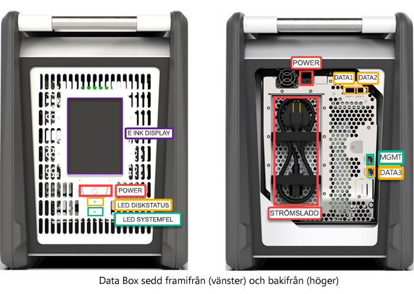
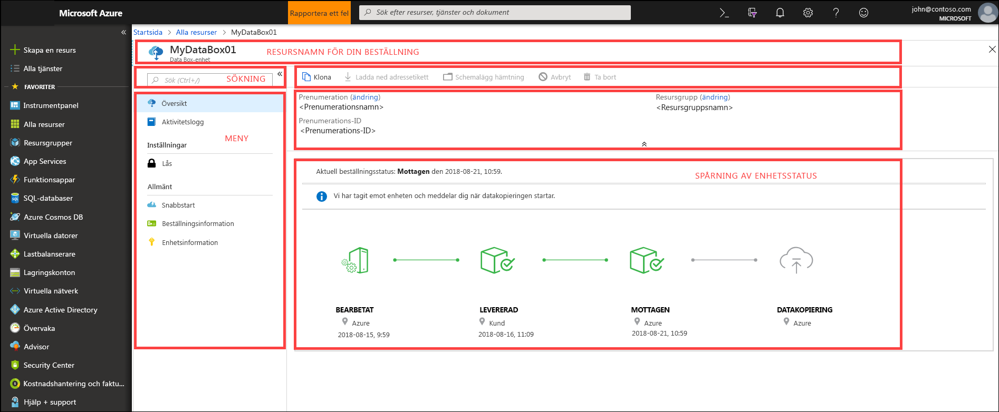

# Vad är Azure Data Box?

Med Microsoft Azure Data Box-molnlösningen kan du skicka terabyte med data till Azure på ett snabbt, prisvärt och tillförlitligt sätt. Den säkra dataöverföringen påskyndas genom att skicka en upphovsrättsskyddad Data Box-lagringsenhet. Varje lagringsenhet har en maximal användbar lagringskapacitet på 80 TB och transporteras till ditt datacenter via en regional transportör. Enheten har ett robust hölje för att skydda data under överföringen.

Du kan beställa Data Box-enheten via Azure-portalen. När enheten har tagits emot kan du konfigurera den snabbt med hjälp av det lokala webbgränssnittet. Kopiera data från dina servrar till enheten och skicka sedan tillbaka enheten till Azure. I Azure-datacentret överförs dina data automatiskt från enheten till Azure. Hela processen spåras från slutpunkt till slutpunkt av Data Box-tjänsten på Azure-portalen.

## Användningsfall

Data Box passar bäst för överföring av data som är större än 40 TB i scenarier med obefintlig eller begränsad nätverksanslutning. Dataflytten kan vara enstaka, periodisk eller en inledande massdataöverföring följt av periodiska överföringar. Här följer olika scenarier där Data Box kan användas för dataöverföring.

 - **Engångsmigrering** – när stora mängder lokala data flyttas till Azure. 
     - Flytta ett mediebibliotek från offlineband i Azure för att skapa ett mediebibliotek online.
     - Migrera VM-servergrupp, SQLServer och program till Azure
     - Flytta historiskdata till Azure för djupanalys och rapportering med hjälp av HDInsight

 - **Inledande bulköverföring** – när en inledande massöverföring utförs med hjälp av Data Box (startvärde) följt av inkrementella överföringar över nätverket. 
     - Till exempel används partners med säkerhetskopieringslösningar som Commvault och Data Box för att flytta den första stora historiska säkerhetskopieringen till Azure. När du är klar överförs inkrementella data via nätverket till Azure Storage.

- **Periodiska uppladdningar** – när stora mängder data genereras med jämna mellanrum och behöver flyttas till Azure. Till exempel i energiutforskning, där videoinnehåll genereras på oljeplattformar och vindkraftsparker.      

## Fördelar

Data Box har utformats för att flytta stora mängder data till Azure med knapp eller obefintlig påverkan av nätverket. Lösningen har följande fördelar:

- **Hastighet** – Data Box använder nätverksgränssnitt med 1 Gbit/s eller 10 Gbit/s för att flytta upp till 80 TB data till Azure.

- **Skydd** – Data Box har inbyggt säkerhetsskydd för enheten, data och tjänsten.
    - Enheten har ett robust hölje som skyddas av manipuleringsskyddade skruvar och säkerhetsförslutna klistermärken. 
    - Data på enheten skyddas alltid med AES 256-bitars kryptering.
    - Enheten kan bara låsas upp med ett lösenord som anges i Azure-portalen.
    - Tjänsten skyddas av säkerhetsfunktionerna i Azure.
    - När dina data har laddats upp till Azure rensas diskarna på enheten i enlighet med standarderna NIST 800-88r1.
    
    Mer information finns i [Säkerhet och dataskydd i Azure Data Box](data-box-security.md).

## Funktioner och specifikationer

Den Data Box-enheten har följande funktioner i den här versionen.

| Specifikationer                                          | Beskrivning              |
|---------------------------------------------------------|--------------------------|
| Vikt                                                  | < 23 kg                |
| Dimensioner                                              | Enhet – bredd: 309,0 mm, höjd: 430,4 mm, djup: 502,0 mm |            
| Rackutrymme                                              | 7 U när den placeras i rack på sidan (kan inte rackmonteras)|
| Kablar som krävs                                         | 1 x strömkabel (ingår)   2 RJ45-kablar   2 x SFP + Twinax-kopparkablar|
| Lagringskapacitet                                        | 100 TB-enheten har 80 TB användbar kapacitet efter RAID 5-skydd|
| Nätverksgränssnitt                                      | 2 x 1 GbE-gränssnitt – MGMT, DATA 3.   MGMT – för hantering som inte kan konfigureras av användaren används för installationen   DATA3 – för data som konfigureras av användaren och är dynamiskt som standard   MGMT och DATA 3 kan även fungera som 10 GbE   2 x 10 GbE-gränssnitt – DATA 1, DATA 2   Båda är för data och kan konfigureras som dynamiska (standard) eller statiska |
| Media för dataöverföring                                     | RJ45, SFP+-koppar för 10 GbE-Ethernet  |
| Säkerhet                                                | Robust enhetshölje med manipuleringssäkra anpassade skruvar   Säkerhetsförslutna klistermärken placerade längst ned på enheten|
| Dataöverföringshastighet                                      | Upp till 80 TB per dag via 10 GbE-nätverksgränssnitt        |
| Hantering                                              | Lokalt webbgränssnitt – initial engånginstallation och konfiguration   Azure-portalen – daglig enhetshantering        |

## Data Box-komponenter

Data Box innehåller följande komponenter:

* **Data Box-enhet** – en fysisk enhet som tillhandahåller primärlagring, hanterar kommunikation med molnlagring och bidrar till att ge säkerhet och sekretess för alla data som lagras på enheten. Data Box-enheten har en användbar lagringskapacitet på 80 TB. 

    

    
* **Data Box-tjänsten** – ett tillägg till Azure-portalen som gör att du kan hantera en Data Box-enhet via ett webbgränssnitt som du kan komma åt från olika geografiska platser. Använd Data Box-tjänsten för att utföra daglig administration av din Data Box-enhet. Tjänstens uppgifter är till exempel hur du skapar och hanterar beställningar, visar och hanterar aviseringar och hanterar filresurser.  

    

    Mer information finns i [Använda Data Box-tjänsten för att administrera din Data Box-enhet](data-box-portal-ui-admin.md).

* **Lokalt webbgränssnitt** – ett webbaserat gränssnitt som används för att konfigurera enheten så att den kan ansluta till det lokala nätverket och sedan registrera enheten med Data Box-tjänsten. Använd även det lokala webbgränssnittet till att stänga av och starta om Data Box-enheten, visa kopieringsloggar och kontakta Microsoft Support om du vill skicka en tjänstbegäran.

    

    Information om hur du använder det webbaserade gränssnittet finns i [Använda det webbaserade gränssnittet för att administrera din Data Box](data-box-portal-ui-admin.md).

## Arbetsflödet

Ett typiskt flöde omfattar följande steg:

1. **Beställning** – skapa en beställning i Azure-portalen och ange leveransinformation och Azure-mållagringskonto för dina data. Om enheten är tillgänglig förbereder och skickar Azure enheten med ett spårnings-ID.

2. **Ta emot** – när enheten har levererats kabelansluter du enheten för nätverket och startar med angivna kablar. Aktivera och anslut till enheten. Konfigurera enhetsnätverket och montera filresurser på den värddator som du vill kopiera data från.

3. **Kopiera data** – kopiera data till Data Box-resurser.

4. **Returnera** – förbered, stäng av och skicka tillbaka enheten till Azure-datacentret.

5. **Ladda upp** – data kopieras automatiskt från enheten till Azure. Enhetsdiskarna raderas på ett säkert sätt enligt riktlinjerna från National Institute of Standards and Technology (NIST).

Under den här processen meddelas du via e-post om alla statusändringar. Mer information om det detaljerade flödet finns på sidan om att [distribuera Data Box i Azure-portalen](data-box-deploy-ordered.md).

## Regional tillgänglighet

Data Box kan överföra data baserat på den region där tjänsten har distribuerats, det land som enheten levereras till och det målkonto för lagring i Azure dit du överför data. 

- **Tjänstens tillgänglighet** – för den här versionen är Data Box-tjänsten tillgänglig i följande regioner:
    - Alla regioner i USA – USA, västra centrala, USA, västra 2, USA, västra, USA, södra centrala, USA, centrala, USA, norra centrala, USA, östra samt USA, östra 2.
    - EU – Europa, västra och Europa, norra.
    - Storbritannien – Storbritannien, södra och Storbritannien, västra.
    - Frankrike – Frankrike, centrala och Frankrike, södra.

- **Destinationslagringskonton** – de lagringskonton som lagrar data som är tillgängliga i alla Azure-regioner där tjänsten är tillgänglig.  

## Nästa steg

- Titta på [systemkraven för Data Box](data-box-system-requirements.md).
- Förstå [Data Box-begränsningarna](data-box-limits.md).
- Distribuera snabbt [Azure Data Box Disk](data-box-quickstart-portal.md) på Azure-portalen.

