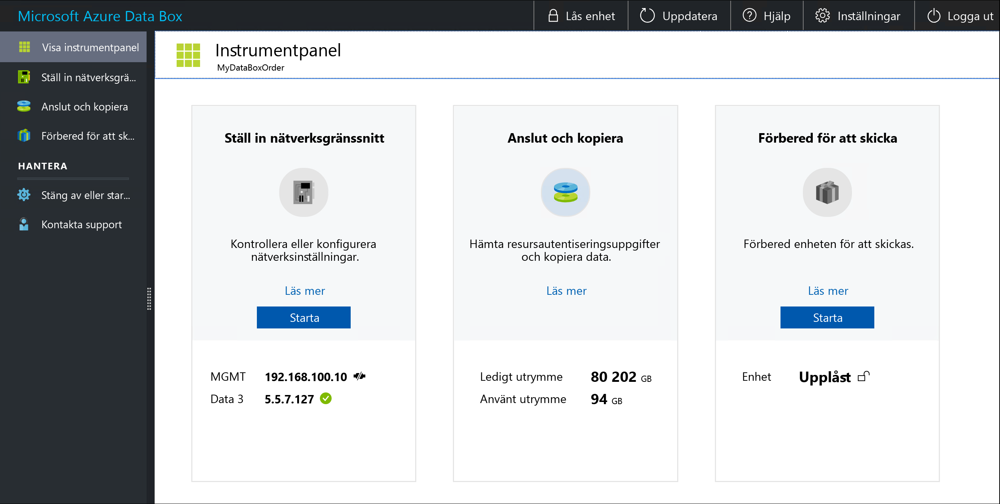

# Vad är Azure Data Box?

Med moln lösningen Microsoft Azure Data Box-enhet kan du skicka flera terabyte data till och från Azure på ett snabbt, Billigt och tillförlitligt sätt. Den säkra dataöverföringen påskyndas genom att skicka en upphovsrättsskyddad Data Box-lagringsenhet. Varje lagringsenhet har en maximal användbar lagringskapacitet på 80 TB och transporteras till ditt datacenter via en regional transportör. Enheten har ett robust hölje för att skydda data under överföringen.

Du kan beställa Data Box-enhet-enheten via Azure Portal för att importera eller exportera data från Azure. När enheten har tagits emot kan du konfigurera den snabbt med hjälp av det lokala webbgränssnittet. Beroende på om du ska importera eller exportera data kopierar du data från dina servrar till enheten eller vice versa och skickar tillbaka enheten till Azure. Om du importerar data till Azure överförs dina data automatiskt från enheten till Azure i Azure-datacentret. Hela processen spåras från slutpunkt till slutpunkt av Data Box-tjänsten på Azure-portalen.

[!INCLUDE [Data Box feature is in preview](../../includes/data-box-feature-is-preview-info.md)]

## Användningsfall

Data Box passar bäst för överföring av data som är större än 40 TB i scenarier med obefintlig eller begränsad nätverksanslutning. Dataflytten kan vara enstaka, periodisk eller en inledande massdataöverföring följt av periodiska överföringar. 

Här följer de olika scenarier där Data Box-enhet kan användas för att importera data till Azure.

 - **Engångsmigrering** – när stora mängder lokala data flyttas till Azure. 
     - Flytta ett mediebibliotek från offlineband i Azure för att skapa ett mediebibliotek online.
     - Migrera VM-servergrupp, SQLServer och program till Azure
     - Flytta historiskdata till Azure för djupanalys och rapportering med hjälp av HDInsight

 - **Inledande bulköverföring** – när en inledande massöverföring utförs med hjälp av Data Box (startvärde) följt av inkrementella överföringar över nätverket. 
     - Till exempel används partners med säkerhetskopieringslösningar som Commvault och Data Box för att flytta den första stora historiska säkerhetskopieringen till Azure. När du är klar överförs inkrementella data via nätverket till Azure Storage.

- **Periodiska uppladdningar** – när stora mängder data genereras med jämna mellanrum och behöver flyttas till Azure. Till exempel i energiutforskning, där videoinnehåll genereras på oljeplattformar och vindkraftsparker. 

Här följer de olika scenarier där Data Box-enhet kan användas för att exportera data från Azure.

- **Haveri beredskap** – när en kopia av data från Azure återställs till ett lokalt nätverk. Detta görs vanligt vis vid ett haveri beredskaps scenario där en stor del av Azure-data exporteras till Data Box-enhet. Microsoft levererar sedan den här Data Box-enhet och data återställs på dina anläggningar under en kort tids period. 

- **Säkerhets krav** – när du behöver kunna exportera data till Azure på grund av myndighets krav eller säkerhets krav. Azure Storage är till exempel tillgängligt i molnet med hemliga och överordnade hemligheter och du kan använda Data Box-enhet för att exportera data från Azure. 

- **Migrera tillbaka till lokalt eller till en annan moln tjänst leverantör** – när du vill flytta alla data tillbaka till lokal, eller till en annan moln tjänst leverantör, exportera data via data Box-enhet för att migrera arbets belastningarna.

## Fördelar

Data Box har utformats för att flytta stora mängder data till Azure med knapp eller obefintlig påverkan av nätverket. Lösningen har följande fördelar:

- **Hastighet** – data Box-enhet använder 1 Gbit/s eller 10 Gbit/s nätverks gränssnitt för att flytta upp till 80 TB data till och från Azure.

- **Skydd** – Data Box har inbyggt säkerhetsskydd för enheten, data och tjänsten.
  - Enheten har ett robust hölje som skyddas av manipuleringsskyddade skruvar och säkerhetsförslutna klistermärken. 
  - Data på enheten skyddas alltid med AES 256-bitars kryptering.
  - Enheten kan bara låsas upp med ett lösenord som anges i Azure-portalen.
  - Tjänsten skyddas av säkerhetsfunktionerna i Azure.
  - När dina data har laddats upp till Azure för en import ordning rensas diskarna på enheten rent i enlighet med NIST 800-88r1-standarder. För en export ordning raderas diskarna när enheten når Azure-datacentret.
    
    Mer information finns i [Säkerhet och dataskydd i Azure Data Box](data-box-security.md).

## Funktioner och specifikationer

Den Data Box-enheten har följande funktioner i den här versionen.

| Specifikationer                                          | Description              |
|---------------------------------------------------------|--------------------------|
| Vikt                                                  | < 23 kg                |
| Dimensioner                                              | Enhet – bredd: 309,0 mm, höjd: 430,4 mm, djup: 502,0 mm |            
| Rackutrymme                                              | 7 U när den placeras i rack på sidan (kan inte rackmonteras)|
| Kablar som krävs                                         | 1 x strömkabel (ingår)   2 RJ45-kablar   2 x SFP + Twinax-kopparkablar|
| Lagringskapacitet                                        | 100 TB-enheten har 80 TB användbar kapacitet efter RAID 5-skydd|
| Energiklassificering                                            | Nätaggregatet är klassificerat för 700 W.   Normalt förbrukar enheten 375 W.|
| Nätverksgränssnitt                                      | 2 x 1 GbE-gränssnitt – MGMT, DATA 3.   MGMT – för hantering som inte kan konfigureras av användaren används för installationen   DATA3 – för data som konfigureras av användaren och är dynamiskt som standard   MGMT och DATA 3 kan även fungera som 10 GbE   2 x 10 GbE-gränssnitt – DATA 1, DATA 2   Båda är för data och kan konfigureras som dynamiska (standard) eller statiska |
| Dataöverföring                                      | Både import och export stöds.  |
| Media för dataöverföring                                     | RJ45, SFP+-koppar för 10 GbE-Ethernet  |
| Säkerhet                                                | Robust enhetshölje med manipuleringssäkra anpassade skruvar   Säkerhetsförslutna klistermärken placerade längst ned på enheten|
| Dataöverföringshastighet                                      | Upp till 80 TB per dag via 10 GbE-nätverksgränssnitt        |
| Hantering                                              | Lokalt webbgränssnitt – initial engånginstallation och konfiguration   Azure-portalen – daglig enhetshantering        |

## Data Box-komponenter

Data Box innehåller följande komponenter:

* **Data Box-enhet** – en fysisk enhet som tillhandahåller primärlagring, hanterar kommunikation med molnlagring och bidrar till att ge säkerhet och sekretess för alla data som lagras på enheten. Data Box-enheten har en användbar lagringskapacitet på 80 TB. 

    

    
* **Data Box-tjänsten** – ett tillägg till Azure-portalen som gör att du kan hantera en Data Box-enhet via ett webbgränssnitt som du kan komma åt från olika geografiska platser. Använd Data Box-tjänsten för att utföra daglig administration av din Data Box-enhet. Tjänstens uppgifter är till exempel hur du skapar och hanterar beställningar, visar och hanterar aviseringar och hanterar filresurser.  

    

    Mer information finns i [Använda Data Box-tjänsten för att administrera din Data Box-enhet](data-box-portal-ui-admin.md).

* **Lokalt webbgränssnitt** – ett webbaserat gränssnitt som används för att konfigurera enheten så att den kan ansluta till det lokala nätverket och sedan registrera enheten med Data Box-tjänsten. Använd även det lokala webbgränssnittet till att stänga av och starta om Data Box-enheten, visa kopieringsloggar och kontakta Microsoft Support om du vill skicka en tjänstbegäran.

    

    Information om hur du använder det webbaserade gränssnittet finns i [Använda det webbaserade gränssnittet för att administrera din Data Box](data-box-portal-ui-admin.md).

## Arbetsflödet

Ett typiskt import flöde innehåller följande steg:

1. **Beställning** – skapa en beställning i Azure-portalen och ange leveransinformation och Azure-mållagringskonto för dina data. Om enheten är tillgänglig förbereder och skickar Azure enheten med ett spårnings-ID.

2. **Ta emot** – när enheten har levererats kabelansluter du enheten för nätverket och startar med angivna kablar. Aktivera och anslut till enheten. Konfigurera enhetsnätverket och montera filresurser på den värddator som du vill kopiera data från.

3. **Kopiera data** – kopiera data till Data Box-resurser.

4. **Returnera** – förbered, stäng av och skicka tillbaka enheten till Azure-datacentret.

5. **Ladda upp** – data kopieras automatiskt från enheten till Azure. Enhetsdiskarna raderas på ett säkert sätt enligt riktlinjerna från National Institute of Standards and Technology (NIST).

Under den här processen meddelas du via e-post om alla statusändringar. Mer information om det detaljerade flödet finns på sidan om att [distribuera Data Box i Azure-portalen](data-box-deploy-ordered.md).

Ett typiskt export flöde innehåller följande steg:

1. **Order** – skapa en export ordning i Azure Portal, ange skeppnings information och käll Azure Storage-kontot för dina data. Om enheten är tillgänglig förbereder Azure en enhet. Data kopieras från Azure Storage-kontot till Data Box-enhet. När data kopieringen är klar levererar Microsoft enheten med ett ID för leverans spårning.

2. **Ta emot** – när enheten har levererats kabelansluter du enheten för nätverket och startar med angivna kablar. Aktivera och anslut till enheten. Konfigurera enhets nätverket och montera resurser på värddatorn som du vill kopiera data till.

3. **Kopiera data** – kopiera data från data Box-enhet resurser till lokala data servrar.

4. **Returnera** – förbered, stäng av och skicka tillbaka enheten till Azure-datacentret.

5. **Data radering** – enhets diskarna raderas på ett säkert sätt enligt rikt linjerna i National Institute of Standards and Technology (NIST).

Under export processen får du ett meddelande via e-post om alla status ändringar. Mer information om det detaljerade flödet finns på sidan om att [distribuera Data Box i Azure-portalen](data-box-deploy-export-ordered.md).

## Regional tillgänglighet

Data Box-enhet kan överföra data baserat på den region där tjänsten distribueras, land/region dit enheten levereras och det Azure Storage-konto som du överför data till. 

### För import

- **Tjänst tillgänglighet** – när du använder data Box-enhet för import-eller export order kan du få information om regions tillgänglighet genom att gå till [Azure-produkter som är tillgängliga per region](https://azure.microsoft.com/global-infrastructure/services/?products=databox&regions=all). Export funktionen på Data Box-enhet är för närvarande en för hands version. 

    För import order kan Data Box-enhet också distribueras i Azure Government molnet. Mer information finns i [Vad är Azure Government?](../azure-government/documentation-government-welcome.md). 

- **Mål lagrings konton** – de lagrings konton som lagrar data är tillgängliga i alla Azure-regioner där tjänsten är tillgänglig.

## Nästa steg

- Titta på [systemkraven för Data Box](data-box-system-requirements.md).
- Förstå [Data Box-begränsningarna](data-box-limits.md).
- Distribuera snabbt [Azure Data Box](data-box-quickstart-portal.md) i Azure-portalen.