# <a name="use-the-azure-portal-to-administer-your-data-box"></a>Använda Azure-portalen för att administrera din Data Box

Den här artikeln beskriver några av de komplexa arbetsflöden och de administrativa uppgifter som du kan utföra med Data Box. Du kan hantera Data Box via Azure-portalen eller via det lokala webbgränssnittet. 

Den här artikeln fokuserar på de uppgifter som du kan utföra med Azure-portalen. Använd Azure-portalen för att hantera beställningar, hantera Data Box och spåra beställningens status från början till slut.


## <a name="cancel-an-order"></a>Annullera en beställning

Ibland kan du behöva annullera en beställning som du gjort. Du kan bara annullera en beställning innan beställningen behandlas. När beställningen har behandlats och Data Box förberetts går det inte längre att annullera beställningen. 

Följ stegen nedan om du vill annullera en beställning.

1.  Gå till **Översikt > Avbryt**. 

    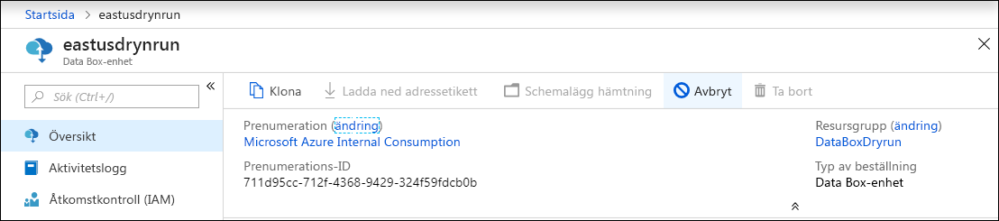

2.  Fyll i en orsak som beskriver varför du vill annullera beställningen.  

    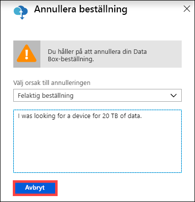

3.  När beställningen har annullerats uppdateras statusen för ordern på portalen och visas som **Avbruten**. 

## <a name="clone-an-order"></a>Klona en order

Kloning är användbart i vissa situationer. Exempelvis har en användare kanske använt Data Box för att överföra vissa data. Allteftersom mer data genereras behövs en till Data Box för att överföra dessa data till Azure. I så fall behöver du bara klona samma order.

Följ stegen nedan om du vill klona en order.

1.  Gå till **Översikt > Klona**. 

    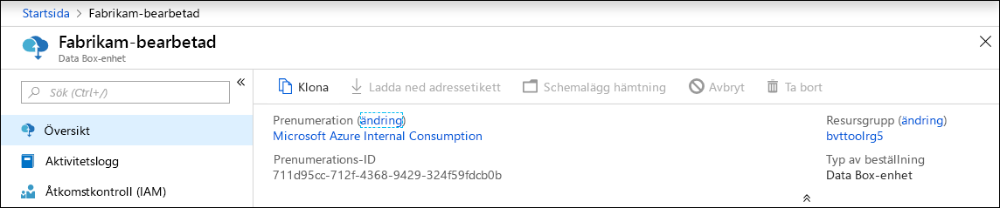

2.  All information för ordern förblir densamma. Namnet på beställningen är det ursprungliga ordernamnet, med tillägget *-Klon*. Markera kryssrutan för att bekräfta att du har läst sekretessinformationen. Klicka på **Skapa**.

Klonen skapas på några minuter och portalen uppdateras och visar den nya ordern.


## <a name="delete-order"></a>Ta bort en order

Du kanske vill ta bort en order när den har verkställts. Ordern innehåller din personliga information, till exempel namn, adress och kontaktuppgifter. Den här personliga informationen tas bort när ordern tas bort.

Du kan bara ta bort order som har slutförts eller avbrutits. Följ steg nedan om du vill ta bort en order.

1. Gå till **Alla resurser**. Sök efter din order.

2. Klicka på den order som du vill ta bort och gå till **Översikt**. Klicka på **Ta bort** i kommandofältet.

    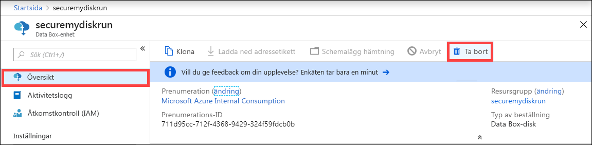

3. Ange namnet på ordern när du uppmanas att bekräfta borttagningen av ordern. Klicka på **Ta bort**.

## <a name="download-shipping-label"></a>Ladda ned adressetikett

Du kan behöva ladda ned adressetiketten om E-ink-skärmen på din Data Box inte fungerar och inte visar returfraktsedeln. 

Följ stegen nedan om du behöver ladda ned en fraktsedel.

1.  Öppna **Översikt > Ladda ned adressetikett**. Det här alternativet är endast tillgängligt när enheten har skickats. 

    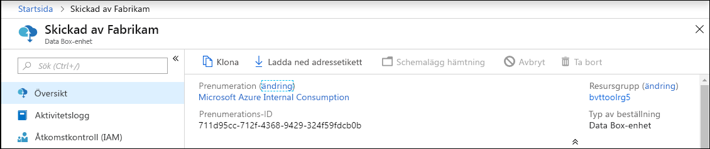

2.  Med det här alternativet laddas följande returfraktsedel ned. Spara etiketten och skriv ut den. Vik och sätt in etiketten i den genomskinliga fickan på enheten. Se till att etiketten syns tydligt. Ta bort eventuella klistermärken som finns på enheten från föregående leverans.

    

## <a name="edit-shipping-address"></a>Redigera leveransadress

Du kan behöva ändra leveransadressen när beställningen har gjorts. Det här alternativet är endast tillgängligt innan enheten skickas. När enheten har skickats är det här alternativet inte längre tillgängligt.

Följ stegen nedan om du vill redigera ordern.

1. Gå till **Orderdetaljer > Redigera leveransadress**.

    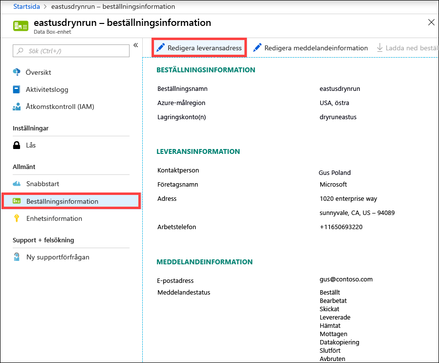

2. Redigera och verifiera leveransadressen och spara sedan ändringarna.

    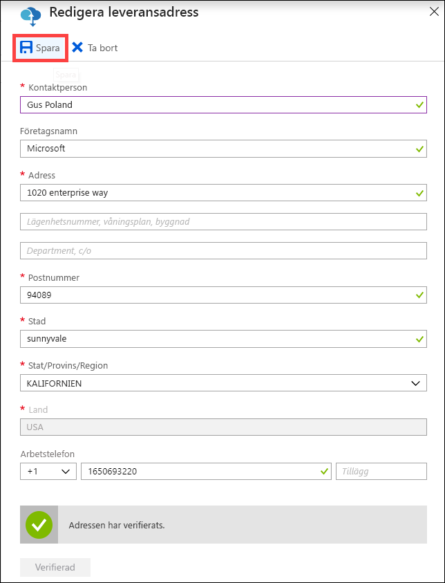

## <a name="edit-notification-details"></a>Redigera meddelandeinformation

Du kan behöva ändra vilka användare som ska få e-postmeddelanden om orderstatusen. Exempelvis ska en användare kanske meddelas när enheten levereras eller hämtas. En annan användare kanske behöver informeras när datakopieringen är klar, så att han kan kontrollera att alla data finns i Azure Storage-kontot innan de raderas från källan. I dessa fall kan du redigera meddelandeinformationen.

Följ stegen nedan om du vill redigera meddelandeinformationen.

1. Gå till **Orderdetaljer > Redigera meddelandeinformation**.

    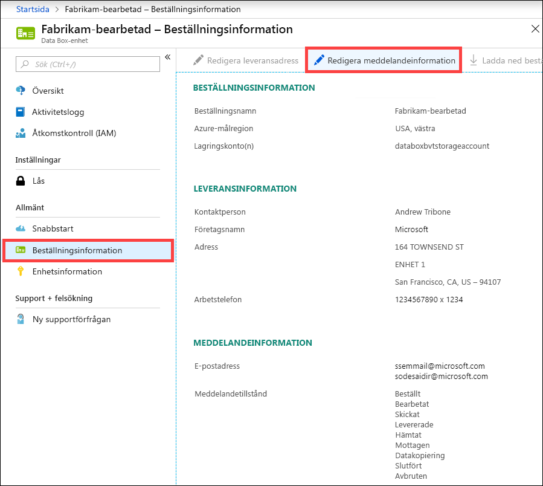

2. Nu kan du redigera meddelandeinformationen och spara ändringarna.
 
    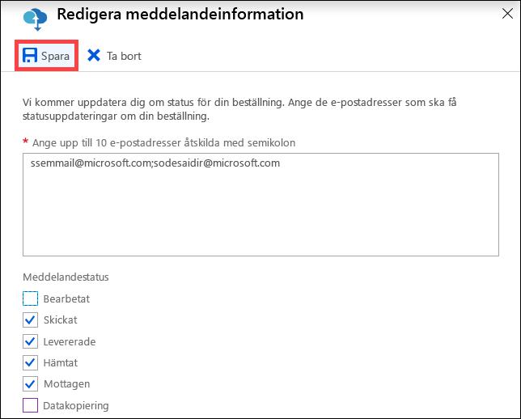


## <a name="download-order-history"></a>Ladda ned beställningshistorik

När Data Box-beställningen är klar raderas data på enheten. När enhetsrensningen är klar kan du ladda ned beställningshistoriken i Azure-portalen.

Ladda ned beställningshistoriken med hjälp av följande steg.

1. I Data Box-beställningen går du till **Översikt**. Kontrollera att beställningen är komplett. Om beställningen är komplett enhetsrensningen har slutförts går du till **Beställningsinformation**. Alternativet **Ladda ned beställningshistorik** är tillgängligt.

    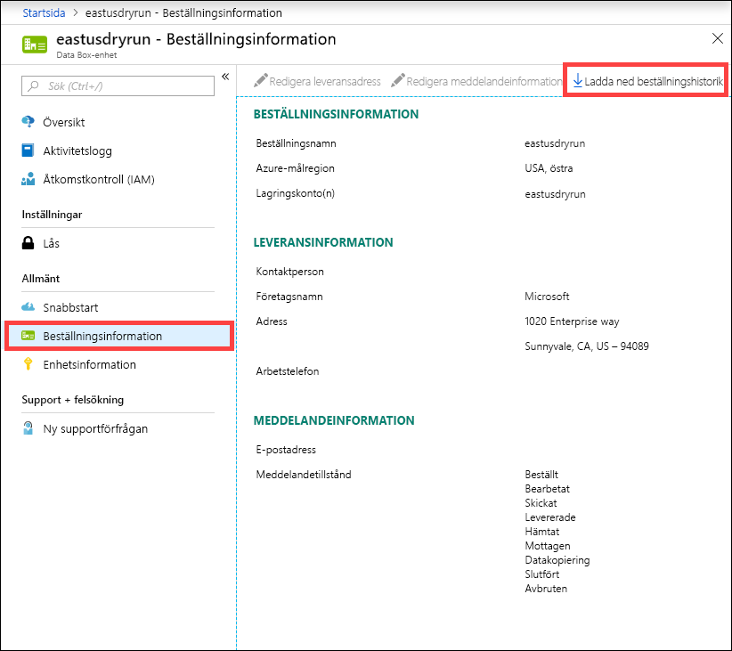

2. Klicka på **Ladda ned beställningshistorik**. I den nedladdade historiken visas en post för transportspårningsloggar. Om du rullar ned till slutet av loggen visas följande länkar:
    
   - **Kopieringsloggar** – innehåller listan över filer med fel vid datakopieringen från Data Box till ditt Azure-lagringskonto.
   - **Granskningsloggar** – innehåller information att slå på och dela åtkomst på Data Box när den finns utanför Azure-datacentret.
   - **BOM-filer** – innehåller listan över filer (även kallat filmanifest) som du kan ladda ned under **Förbered för att skicka** och innehåller namn, storlekar och kontrollsummor för filer.

       ```
       -------------------------------
       Microsoft Data Box Order Report
       -------------------------------
       Name                                               : DataBoxTestOrder                              
       StartTime(UTC)                                     : 10/31/2018 8:49:23 AM +00:00                       
       DeviceType                                         : DataBox                                           
       -------------------
       Data Box Activities
       -------------------
       Time(UTC)                 | Activity                       | Status          | Description  
       
       10/31/2018 8:49:26 AM     | OrderCreated                   | Completed       |                                                   
       11/2/2018 7:32:53 AM      | DevicePrepared                 | Completed       |                                                   
       11/3/2018 1:36:43 PM      | ShippingToCustomer             | InProgress      | Shipment picked up. Local Time : 11/3/2018 1:36:43        PM at AMSTERDAM-NLD                                                                                
       11/4/2018 8:23:30 PM      | ShippingToCustomer             | InProgress      | Processed at AMSTERDAM-NLD. Local Time : 11/4/2018        8:23:30 PM at AMSTERDAM-NLD                                                                        
       11/4/2018 11:43:34 PM     | ShippingToCustomer             | InProgress      | Departed Facility in AMSTERDAM-NLD. Local Time :          11/4/2018 11:43:34 PM at AMSTERDAM-NLD                                                               
       11/5/2018 1:38:20 AM      | ShippingToCustomer             | InProgress      | Arrived at Sort Facility LEIPZIG-DEU. Local Time :        11/5/2018 1:38:20 AM at LEIPZIG-DEU                                                                
       11/5/2018 2:31:07 AM      | ShippingToCustomer             | InProgress      | Processed at LEIPZIG-DEU. Local Time : 11/5/2018          2:31:07 AM at LEIPZIG-DEU                                                                            
       11/5/2018 4:05:58 AM      | ShippingToCustomer             | InProgress      | Departed Facility in LEIPZIG-DEU. Local Time :            11/5/2018 4:05:58 AM at LEIPZIG-DEU                                                                    
       11/5/2018 4:35:43 AM      | ShippingToCustomer             | InProgress      | Transferred through LUTON-GBR. Local Time :              11/5/2018 4:35:43 AM at LUTON-GBR                                                                         
       11/5/2018 4:52:15 AM      | ShippingToCustomer             | InProgress      | Departed Facility in LUTON-GBR. Local Time :              11/5/2018 4:52:15 AM at LUTON-GBR                                                                        
       11/5/2018 5:47:58 AM      | ShippingToCustomer             | InProgress      | Arrived at Sort Facility LONDON-HEATHROW-GBR.            Local Time : 10/5/2018 5:47:58 AM at LONDON-HEATHROW-GBR                                                
       11/5/2018 6:27:37 AM      | ShippingToCustomer             | InProgress      | Processed at LONDON-HEATHROW-GBR. Local Time :            11/5/2018 6:27:37 AM at LONDON-HEATHROW-GBR                                                            
       11/5/2018 6:39:40 AM      | ShippingToCustomer             | InProgress      | Departed Facility in LONDON-HEATHROW-GBR. Local          Time : 11/5/2018 6:39:40 AM at LONDON-HEATHROW-GBR                                                    
       11/5/2018 8:13:49 AM      | ShippingToCustomer             | InProgress      | Arrived at Delivery Facility in LAMBETH-GBR. Local        Time : 11/5/2018 8:13:49 AM at LAMBETH-GBR                                                         
       11/5/2018 9:13:24 AM      | ShippingToCustomer             | InProgress      | With delivery courier. Local Time : 11/5/2018            9:13:24 AM at LAMBETH-GBR                                                                               
       11/5/2018 12:03:04 PM     | ShippingToCustomer             | Completed       | Delivered - Signed for by. Local Time : 11/5/2018        12:03:04 PM at LAMBETH-GBR                                                                          
       1/25/2019 3:19:25 PM      | ShippingToDataCenter           | InProgress      | Shipment picked up. Local Time : 1/25/2019 3:19:25        PM at LAMBETH-GBR                                                                                       
       1/25/2019 8:03:55 PM      | ShippingToDataCenter           | InProgress      | Processed at LAMBETH-GBR. Local Time : 1/25/2019          8:03:55 PM at LAMBETH-GBR                                                                            
       1/25/2019 8:04:58 PM      | ShippingToDataCenter           | InProgress      | Departed Facility in LAMBETH-GBR. Local Time :            1/25/2019 8:04:58 PM at LAMBETH-GBR                                                                    
       1/25/2019 9:06:09 PM      | ShippingToDataCenter           | InProgress      | Arrived at Sort Facility LONDON-HEATHROW-GBR.            Local Time : 1/25/2019 9:06:09 PM at LONDON-HEATHROW-GBR                                                
       1/25/2019 9:48:54 PM      | ShippingToDataCenter           | InProgress      | Processed at LONDON-HEATHROW-GBR. Local Time :            1/25/2019 9:48:54 PM at LONDON-HEATHROW-GBR                                                            
       1/25/2019 10:30:20 PM     | ShippingToDataCenter           | InProgress      | Departed Facility in LONDON-HEATHROW-GBR. Local          Time : 1/25/2019 10:30:20 PM at LONDON-HEATHROW-GBR                                                   
       1/26/2019 2:17:10 PM      | ShippingToDataCenter           | InProgress      | Arrived at Sort Facility BRUSSELS-BEL. Local Time        : 1/26/2019 2:17:10 PM at BRUSSELS-BEL                                                              
       1/26/2019 2:31:57 PM      | ShippingToDataCenter           | InProgress      | Processed at BRUSSELS-BEL. Local Time : 1/26/2019        2:31:57 PM at BRUSSELS-BEL                                                                          
       1/26/2019 3:37:53 PM      | ShippingToDataCenter           | InProgress      | Processed at BRUSSELS-BEL. Local Time : 1/26/2019        3:37:53 PM at BRUSSELS-BEL                                                                          
       1/27/2019 11:01:45 AM     | ShippingToDataCenter           | InProgress      | Departed Facility in BRUSSELS-BEL. Local Time :          1/27/2019 11:01:45 AM at BRUSSELS-BEL                                                                 
       1/28/2019 7:11:35 AM      | ShippingToDataCenter           | InProgress      | Arrived at Delivery Facility in AMSTERDAM-NLD.            Local Time : 1/28/2019 7:11:35 AM at AMSTERDAM-NLD                                                     
       1/28/2019 9:07:57 AM      | ShippingToDataCenter           | InProgress      | With delivery courier. Local Time : 1/28/2019            9:07:57 AM at AMSTERDAM-NLD                                                                             
       1/28/2019 1:35:56 PM      | ShippingToDataCenter           | InProgress      | Scheduled for delivery. Local Time : 1/28/2019            1:35:56 PM at AMSTERDAM-NLD                                                                            
       1/28/2019 2:57:48 PM      | ShippingToDataCenter           | Completed       | Delivered - Signed for by. Local Time : 1/28/2019        2:57:48 PM at AMSTERDAM-NLD                                                                         
       1/29/2019 2:18:43 PM      | PhysicalVerification           | Completed       |                                              
       1/29/2019 3:49:50 PM      | DeviceBoot                     | Completed       | Appliance booted up successfully                  
       1/29/2019 3:49:51 PM      | AnomalyDetection               | Completed       | No anomaly detected.                               
       1/29/2019 4:55:00 PM      | DataCopy                       | Started         |                                                 
       2/2/2019 7:07:34 PM       | DataCopy                       | Completed       | Copy Completed.                                   
       2/4/2019 7:47:32 PM       | SecureErase                    | Started         |                                                  
       2/4/2019 8:01:10 PM      | SecureErase                    | Completed       | Azure Data Box:DEVICESERIALNO has been sanitized          according to NIST 800-88 Rev 1.                                                                       

       ------------------
       Data Box Log Links
       ------------------

       Account Name         : Gus                                                       
       Copy Logs Path       : databoxcopylog/DataBoxTestOrder_CHC533180024_CopyLog_73a81b2d613547a28ecb7b1612fe93ca.xml
       Audit Logs Path      : azuredatabox-chainofcustodylogs\7fc6cac9-9cd6-4dd8-ae22-1ce479666282\chc533180024
       BOM Files Path       : azuredatabox-chainofcustodylogs\7fc6cac9-9cd6-4dd8-ae22-1ce479666282\chc533180024      
       ```
     Du kan sedan gå till lagringskontot och visa kopieringsloggarna.

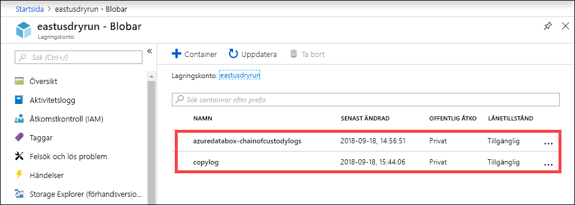

Du kan även visa loggar för försörjningskedjan som innehåller granskningsloggar och BOM-filer.

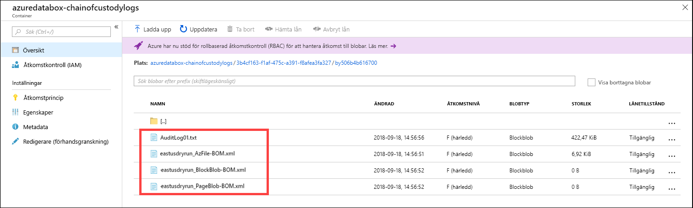

## <a name="view-order-status"></a>Visa orderstatus

När enhetens status ändras i portalen meddelas du via e-post.

|Orderstatus |Beskrivning |
|---------|---------|
|Beställt     | En beställning har gjorts. <br>Om enheten är tillgänglig identifierar Microsoft en enhet för leverans och förbereder enheten. <br> Om enheten inte är tillgänglig omedelbart bearbetas ordern när enheten blir tillgänglig. Ordern kan ta flera dagar till några månader att behandla. Om ordern inte kan uppfyllas inom 90 dagar annulleras den och du får ett meddelande.         |
|Bearbetad     | Orderbearbetningen har slutförts. Enligt din order förbereds enheten för leverans i datacentret.         |
|Skickat     | Beställningen har skickats. Använd det spårnings-ID som visas i din order i portalen för att spåra leveransen.        |
|Levererade     | Försändelsen har levererats till den adress som angetts i ordern.        |
|Hämtat     |Din returleverans har hämtats och genomsökts av transportören.         |
|Mottaget     | Enheten tas emot och genomsöks vid Azure-datacentret. <br> När leveransen kontrolleras startar enhetsöverföringen.      |
|Datakopiering     | Data kopieras. Spåra kopieringsprocessen för din order i Azure-portalen. <br> Vänta tills datakopieringen är klar. |
|Slutfört       |Ordern har slutförts.<br> Kontrollera att dina data finns i Azure innan du tar bort lokala data från servrarna.         |
|Slutfört med fel| Datakopieringen slutfördes men fel inträffade under kopieringen. <br> Granska kopieringsloggarna med hjälp av sökvägen som anges i Azure-portalen.   |
|Avbrutna            |Ordern har avbrutits. <br> Antingen annullerade du beställningen eller så påträffades ett fel som gjorde att tjänsten avbröt ordern. Om ordern inte kan uppfyllas inom 90 dagar annulleras den också och du får ett meddelande.     |
|Rensa | Data på enhetsdiskarna raderas. Enhetsrensningen anses slutförd när beställningshistoriken är tillgänglig för nedladdning i Azure-portalen.|


## <a name="next-steps"></a>Nästa steg

- Lär dig hur du [felsöker problem med Data Box](data-box-faq.md).
