# Administrera din Data Box Disk (förhandsversion) på Azure-portalen

Självstudierna i den här artikeln gäller för förhandsversionen av Microsoft Azure Data Box Disk. Den här artikeln beskriver några av de komplexa arbetsflöden och de administrativa uppgifter som du kan utföra med Data Box Disk. 

Du kan hantera Data Box Disk via Azure Portal. Den här artikeln fokuserar på de uppgifter som du kan utföra på Azure Portal. Använd Azure Portal för att hantera beställningar, hantera diskar och spåra orderstatusen från början till slut.

> [!IMPORTANT]
> Azure Data Box Disk är tillgänglig som en förhandsversion. Granska [Azures användningsvillkor för förhandsversionen](https://azure.microsoft.com/support/legal/preview-supplemental-terms/) innan du distribuerar den här lösningen.

## Annullera en beställning

Ibland kan du behöva annullera en beställning som du gjort. Du kan bara annullera en beställning innan diskförberedelsen påbörjas. När arbetet med diskarna och orderbehandlingen har påbörjats går det inte längre att annullera beställningen. 

Följ stegen nedan om du vill annullera en beställning.

1.  Gå till **Översikt > Avbryt**. 

    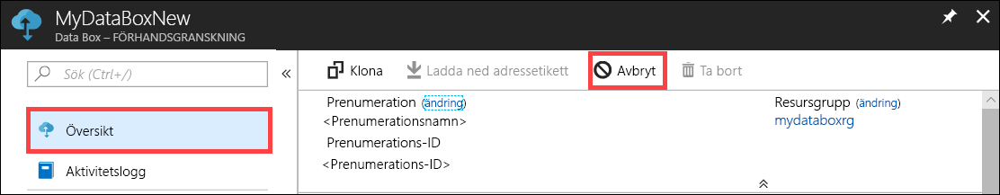

2.  Fyll i en orsak som beskriver varför du vill annullera beställningen.  

    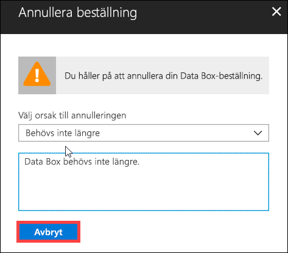

3.  När beställningen har annullerats uppdateras statusen för ordern på portalen och visas som **Avbruten**.

    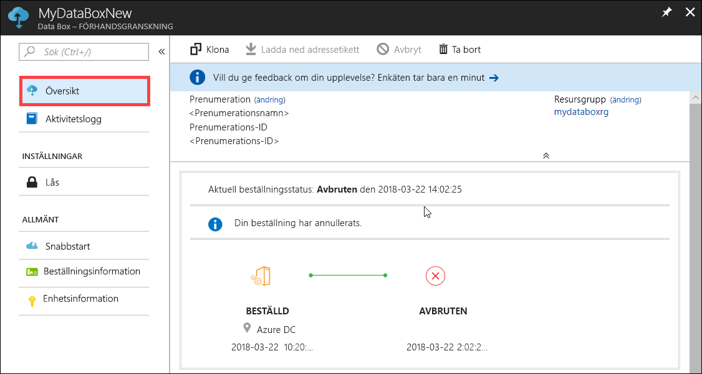

Du får inget e-postmeddelande när beställningen har annullerats.

## Klona en order

Kloning är användbart i vissa situationer. En användare kanske exempelvis har använt Data Box Disk för att överföra vissa data. Allteftersom mer data genereras finns behov av fler diskar för att överföra dessa data till Azure. I så fall behöver du bara klona samma order.

Följ stegen nedan om du vill klona en order.

1.  Gå till **Översikt > Klona**. 

    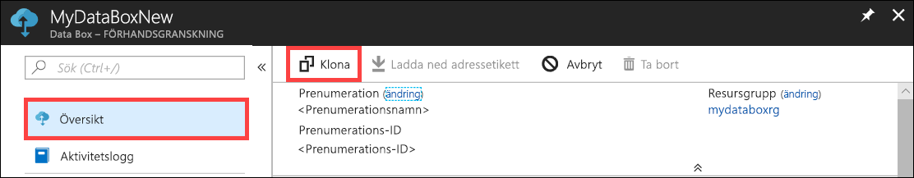

2.  All information för ordern förblir densamma. Namnet på beställningen är det ursprungliga ordernamnet, med tillägget *-Klon*. Markera kryssrutan för att bekräfta att du har läst sekretessinformationen. Klicka på **Skapa**.    

Klonen skapas på några minuter och portalen uppdateras och visar den nya ordern.

[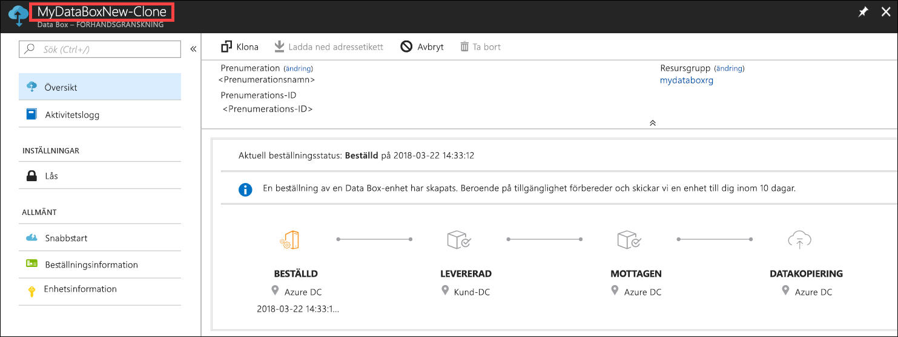](media/data-box-portal-ui-admin/clone-order3.png#lightbox) 

## Ta bort en order

Du kanske vill ta bort en order när den har verkställts. Ordern innehåller din personliga information, till exempel namn, adress och kontaktuppgifter. Den här personliga informationen tas bort när ordern tas bort.

Du kan bara ta bort order som har slutförts eller avbrutits. Följ steg nedan om du vill ta bort en order.

1. Gå till **Alla resurser**. Sök efter din order.

    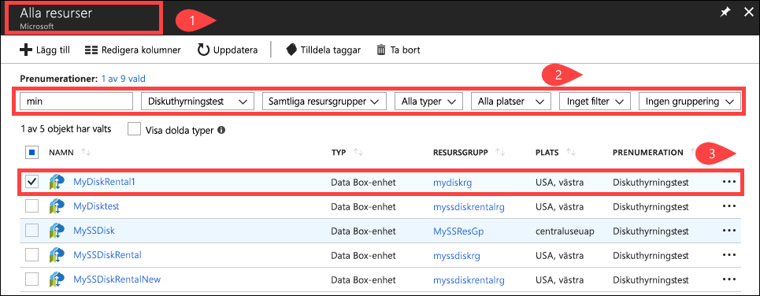

2. Klicka på den order som du vill ta bort och gå till **Översikt**. Klicka på **Ta bort** i kommandofältet.

    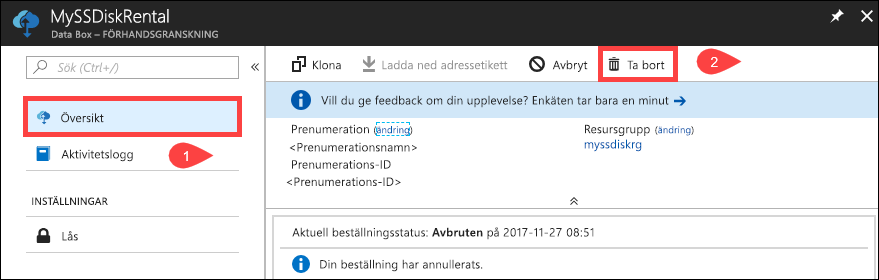

3. Ange namnet på ordern när du uppmanas att bekräfta borttagningen av ordern. Klicka på **Ta bort**.

     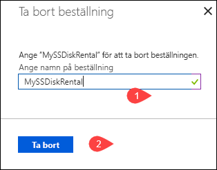

## Ladda ned adressetikett

Du kan behöva ladda ned fraktsedeln om du tappar bort returfraktsedeln som skickades med dina diskar eller om den saknas. 

Följ stegen nedan om du behöver ladda ned en fraktsedel.
1.  Öppna **Översikt > Ladda ned adressetikett**. Det här alternativet är endast tillgängligt när disken har skickats. 

    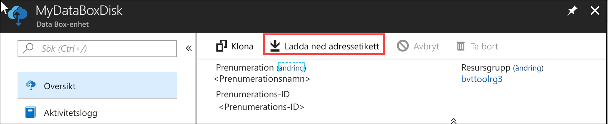

2.  Med det här alternativet laddas följande returfraktsedel ned. Spara fraktsedeln, skriv ut den och sätt fast den på returpaketet.

    

## Redigera leveransadress

Du kan behöva ändra leveransadressen när beställningen har gjorts. Det här alternativet är endast tillgängligt innan disken skickas. När disken har skickats är det här alternativet inte tillgänglig längre.

Följ stegen nedan om du vill redigera ordern.

1. Gå till **Orderdetaljer > Redigera leveransadress**.

    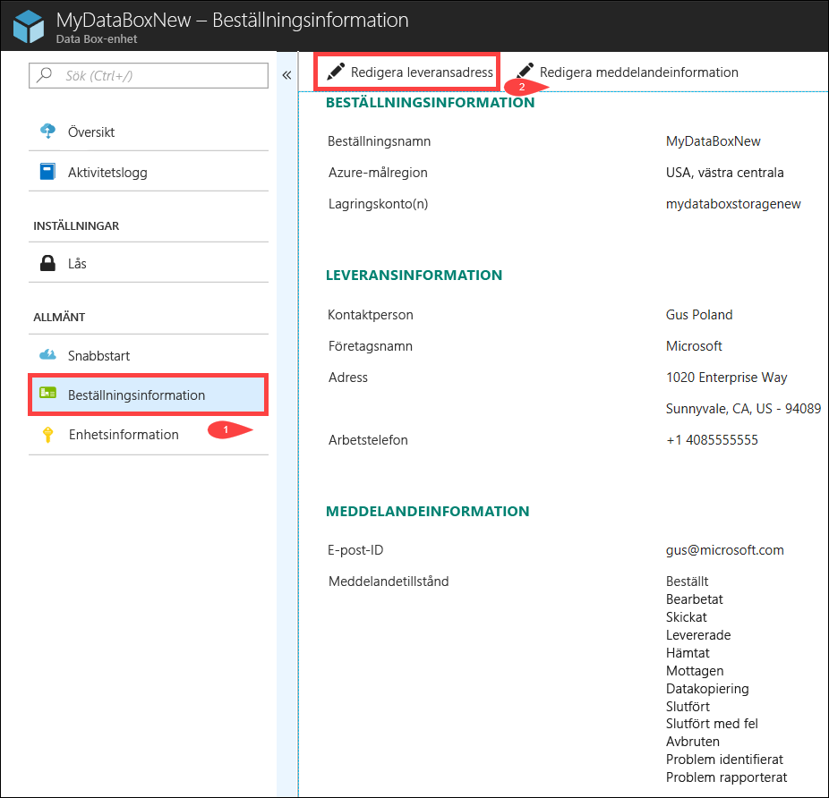

2. Nu kan du redigera leveransadressen och spara ändringarna.

    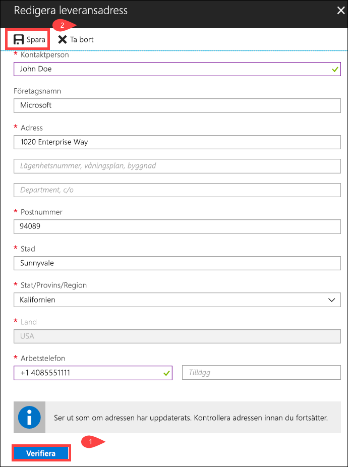

## Redigera meddelandeinformation

Du kan behöva ändra vilka användare som ska få e-postmeddelanden om orderstatusen. Exempelvis kanske en användare ska meddelas när disken levereras eller hämtas. En annan användare kanske behöver informeras när datakopieringen är klar, så att han kan kontrollera att alla data finns i Azure Storage-kontot innan de raderas från källan. I dessa fall kan du redigera meddelandeinformationen.

Följ stegen nedan om du vill redigera meddelandeinformationen.

1. Gå till **Orderdetaljer > Redigera meddelandeinformation**.

    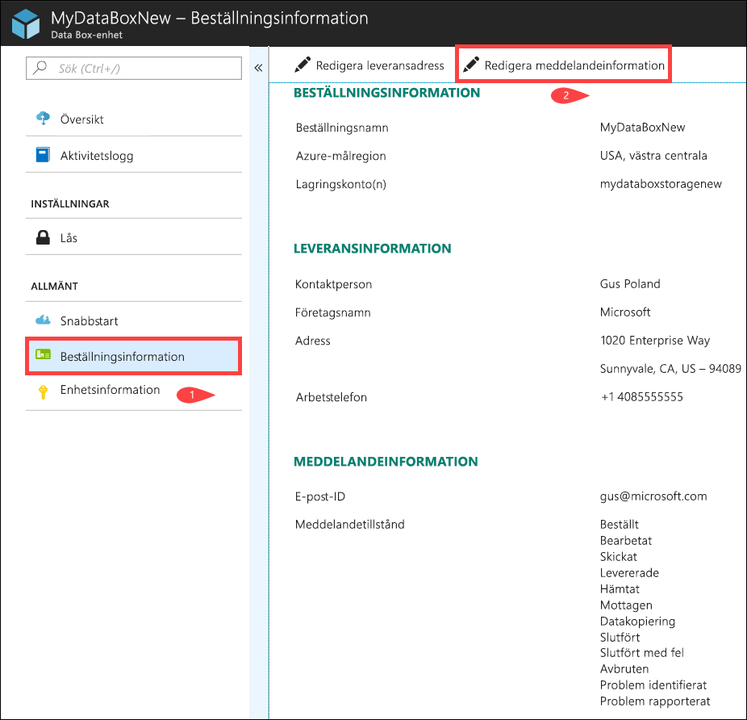

2. Nu kan du redigera meddelandeinformationen och spara ändringarna.
 
    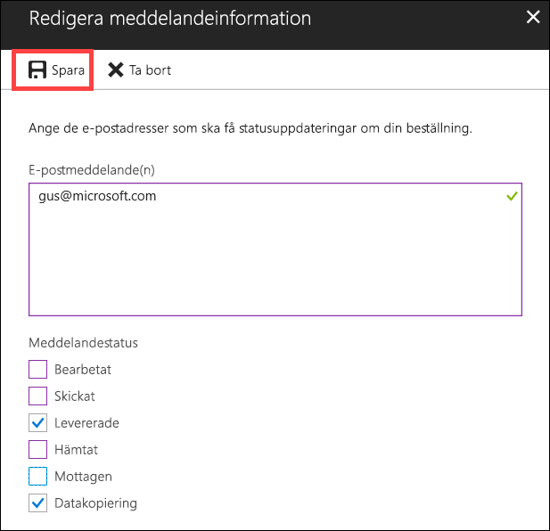

## Visa orderstatus

|Orderstatus |Beskrivning |
|---------|---------|
|Beställt     | En beställning har gjorts.   Om diskarna inte är tillgängliga får du ett meddelande.  Om diskarna är tillgängliga identifierar Microsoft en disk för leverans och förbereder diskpaketet.        |
|Bearbetad     | Orderbearbetningen har slutförts.   Under orderbearbetningen utförs följande åtgärder:<li>Diskarna krypteras med AES-128 BitLocker-kryptering. </li> <li>Data Box-diskarna låses för att förhindra obehörig åtkomst.</li><li>Nyckeln som låser upp diskarna genereras under den här processen.</li>        |
|Skickat     | Beställningen har skickats. Du bör få beställningen inom en till två dagar.        |
|Levererade     | Beställningen har levererats till adressen som angetts i ordern.        |
|Hämtat     |Ditt returpaket har hämtats.   När leveransen har tagits emot på Azure-datacentret laddas data automatiskt upp till Azure.         |
|Mottaget     | Dina diskar har tagits emot på Azures datacenter. Datakopieringen startar inom kort.        |
|Kopierade data     |Data kopieras.  Vänta tills datakopieringen är klar.         |
|Slutfört       |Ordern har slutförts.  Kontrollera att dina data finns i Azure innan du tar bort lokala data från servrarna.         |
|Slutfört med fel| Datakopieringen slutfördes men det uppstod fel.   Granska kopieringsloggarna med hjälp av sökvägen som anges i **Översikt**. Mer information finns i [Hämta diagnostikloggar](data-box-disk-troubleshoot.md#download-diagnostic-logs).   |
|Avbrutna            |Ordern har avbrutits.   Antingen annullerade du beställningen eller så påträffades ett fel som gjorde att tjänsten avbröt ordern.     |

## Nästa steg

- Lär dig hur du [felsöker problem med Data Box Disk](data-box-disk-troubleshoot.md).
