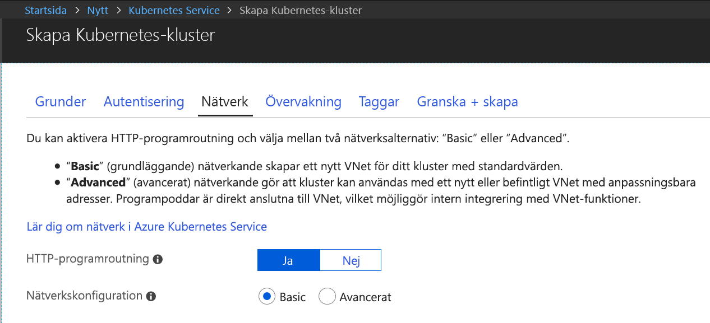
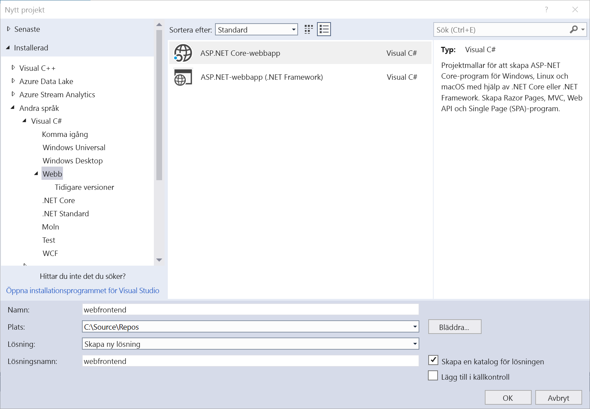
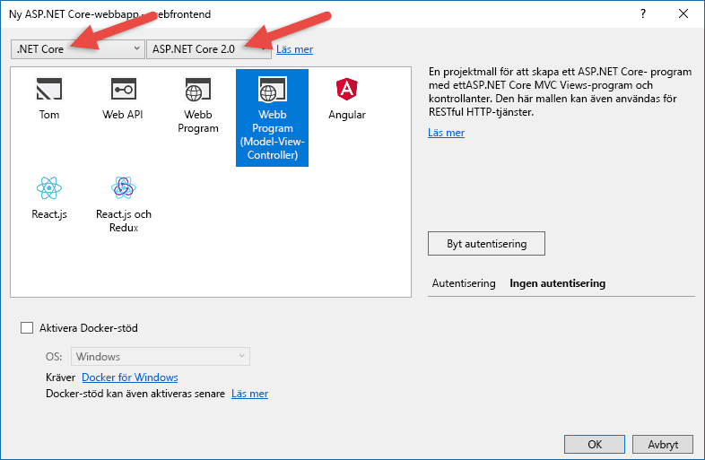
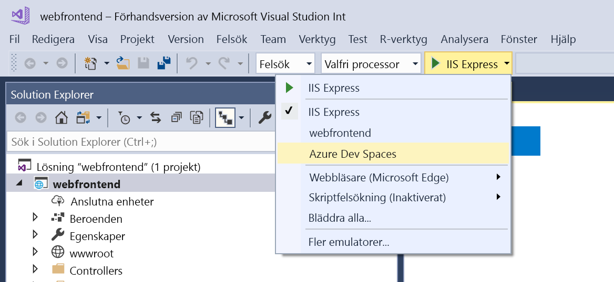
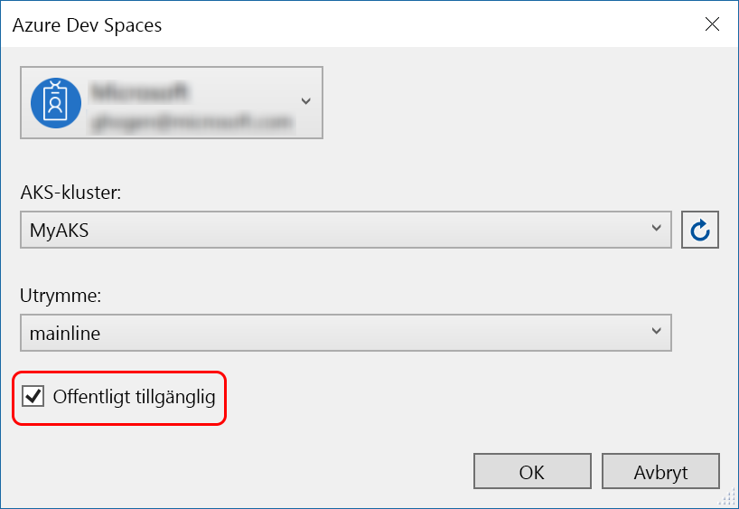
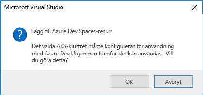

# Komma igång med Azure Dev Spaces med .NET Core och Visual Studio

I den här guiden får du lära dig hur du:

- Ställa in Azure Dev Spaces med ett hanterat Kubernetes-kluster i Azure.
- Iterativt utvecklar kod i containrar med Visual Studio.
- Oberoende utvecklar två separata tjänster och använder Kubernetes DNS-tjänstidentifiering för att anropa en annan tjänst.
- Effektivt utvecklar och testar din kod i en teammiljö.

> [!Note]
> **Om du fastnar** du kan när som helst referera till avsnittet [Felsökning](troubleshooting.md) eller lägga upp en kommentar på den här sidan.

## Skapa ett Kubernetes-kluster som är aktiverat för Azure Dev Spaces

1. Logga in på Azure Portal på http://portal.azure.com.
1. Välj **Skapa en resurs** > sök efter **Kubernetes** > välj **Kubernetes Service** > **Skapa**.

   Utför följande steg under varje rubrik för att skapa AKS-klustret.

    - **PROJEKTINFORMATION**: välj en Azure-prenumeration och en ny eller befintlig Azure-resursgrupp.
    - **KLUSTERINFORMATION**: ange namn, region (för närvarande måste du välja USA, östra; USA, östra 2; USA, centrala; Europa, västra; USA, västra 2; Asien, sydöstra, Kanada, centrala eller Kanada, östra), version och DNS-prefix för AKS-klustret.
    - **SKALNING**: välj en VM-storlek för AKS-agentnoderna och sedan antalet noder. Om du håller på att komma igång med Azure Dev Spaces är en nod tillräckligt för att utforska alla funktioner. Antalet noder kan enkelt justeras när som helst efter att klustret har distribuerats. Observera att VM-storleken inte kan ändras efter att ett AKS-kluster har skapats. Men när ett AKS-kluster har distribuerats kan du enkelt skapa ett nytt AKS-kluster med större virtuella datorer och använda Dev Spaces för att distribuera till större kluster igen om du behöver skala upp.

   Se till att välja Kubernetes version 1.9.6 eller senare.

   

   Välj **Nästa: Autentisering** när det är klart.

1. Välj din önskade inställning för rollbaserad åtkomstkontroll (RBAC). Azure Dev Spaces har stöd för kluster med RBAC aktiverat eller inaktiverat.

    

1. Se till att routning av HTTP-program är aktiverat.

   

    > [!Note]
    > När du vill aktivera [http-programroutning](/azure/aks/http-application-routing) i ett befintligt kluster använder du kommandot: `az aks enable-addons --resource-group myResourceGroup --name myAKSCluster --addons http_application_routing`

1. Välj **Granska + skapa** och välj sedan **Skapa** när du är klar.

## Skaffa Visual Studio-verktygen
1. Installera den senaste versionen av [Visual Studio 2017](https://www.visualstudio.com/vs/)
1. Se till att följande arbetsbelastning är markerad i Visual Studio-installationsprogrammet:
    * ASP.NET och webbutveckling
1. Installera [Visual Studio Tools för Kubernetes](https://aka.ms/get-azds-visualstudio)

## Skapa en webbapp som körs i en container

I det här avsnittet ska du skapa en ASP.NET Core-webbapp och köra den i en container i Kubernetes.

### Skapa en ASP.NET-webbapp

Skapa ett nytt projekt i Visual Studio 2017. För närvarande måste projektet vara ett **ASP.NET Core-webbprogram**. Ge projektet namnet ”**webfrontend**”.

Välj mallen **Webbprogram (MVC, Model-View-Controller)** och välj **.NET Core** och **ASP.NET Core 2.0** som mål i de två listrutorna överst i dialogrutan. Klicka på **OK** för att skapa projektet.

### Aktivera Dev Spaces för ett AKS-kluster

För projektet som du nyss skapat väljer du **Azure Dev Spaces** i listrutan för startinställningar, som du ser nedan.

I nästa dialogruta som visas kontrollerar du att du har loggat in med rätt konto och väljer sedan ett befintligt Kubernetes-kluster eller skapar ett nytt.

Lämna standardinställningen `default` i listrutan **Utrymme** tills vidare. Du lär dig mer om det här alternativet längre fram. Markera kryssrutan **Offentligt tillgänglig**, så att webbprogrammet är tillgängligt via en offentlig slutpunkt. Den här inställningen är inte obligatorisk, men är användbar för att demonstrera några begrepp längre fram i den här genomgången. Men oroa dig inte, du kan felsöka din webbplats med hjälp av Visual Studio oavsett om du väljer inställningen eller inte.

Välj eller skapa klustret genom att klicka på **OK**.

Om du väljer ett kluster som inte har konfigurerats för användning med Azure Dev Spaces tillfrågas du om du vill konfigurera det.

Välj **OK**.

 En bakgrundsaktivitet startas och de nödvändiga inställningarna konfigureras. Åtgärden tar flera minuter att slutföra. Du kan kontrollera att åtgärden fortfarande körs genom att hovra med muspekaren över ikonen för **bakgrundsaktiviteter** i det nedre vänstra hörnet i statusfältet, som du ser i följande bild.

> [!Note]
> Du kan inte felsöka programmet förrän utvecklingsmiljön har skapats.

### Titta på filerna som lagts till i projektet
Medan utvecklingsmiljön skapas kan du titta på filerna som lades till i projektet när du valde att använda en utvecklingsmiljö.

Först ser du att en mapp med namnet `charts` har lagts till och att ett [Helm-diagram](https://docs.helm.sh) har skapats för ditt program i den här mappen. Dessa filer används för att distribuera ditt program till utvecklingsmiljön.

Du ser att en fil med namnet `Dockerfile` har lagts till. Den här filen innehåller information som behövs för att paketera ditt program i Docker-standardformatet.

Slutligen ser du en fil med namnet `azds.yaml`, som innehåller den utvecklingstidskonfiguration som krävs av utvecklingsmiljön.

## Felsöka en container i Kubernetes
När utvecklingsmiljön har skapats kan du felsöka programmet. Lägg till en brytpunkt i koden, till exempel på rad 20 i filen `HomeController.cs` där variabeln `Message` anges. Starta felsökningen genom att trycka på **F5**. 

Visual Studio kommunicerar med utvecklingsmiljön för att skapa och distribuera programmet och öppnar sedan en webbläsare där webbprogrammet körs. Det kan verka som om containern körs lokalt, men i själva verket körs den i utvecklingsmiljön i Azure. localhost-adressen beror på att Azure Dev Spaces skapar en tillfällig SSH-tunnel för containern som körs i AKS.

Klicka på länken **Om** längst upp på sidan för att utlösa brytpunkten. Du har fullständig åtkomst till felsökningsinformation precis som när koden körs lokalt, t.ex. anropsstack, lokala variabler, undantagsinformation och så vidare.

## Iterativ kodutveckling

Azure Dev Spaces handlar om mer än att bara få kod att köra i Kubernetes – det handlar om att du snabbt och löpande kan se effekten av dina kodändringar i en Kubernetes-miljö i molnet.

### Uppdatera en innehållsfil
1. Leta upp filen `./Views/Home/Index.cshtml` och gör en ändring i HTML-koden. Ändra till exempel rad 70, `<h2>Application uses</h2>`, till något som: `<h2>Hello k8s in Azure!</h2>`
1. Spara filen.
1. Gå till webbläsaren och uppdatera sidan. Den uppdaterade HTML-koden bör visas på webbsidan.

Vad hände? Redigering av innehållsfiler som HTML och CSS kräver inte omkompilering i en .NET Core-webbapp. En aktiv F5-session synkroniserar automatiskt ändrade innehållsfiler i containern som körs i AKS, så att du genast kan se dina innehållsändringar.

### Uppdatera en kodfil
Uppdateringar av kodfiler kräver lite mer arbete eftersom .NET Core-appar måste återskapas och skapa uppdaterade binärfiler för programmet.

1. Stoppa felsökaren i Visual Studio.
1. Öppna kodfilen `Controllers/HomeController.cs` och ändra meddelandet som ska visas på sidan Om: `ViewData["Message"] = "Your application description page.";`
1. Spara filen.
1. Starta felsökningen igen genom att trycka på **F5**. 

I stället för att återskapa och distribuera om en ny containeravbildning varje gång koden ändras, vilket ofta tar lång tid, kompilerar Azure Dev Spaces om koden inkrementellt i befintliga containern för snabbare redigerings- och felsökningsförlopp.

Uppdatera webbappen i webbläsaren och gå till sidan Om. Nu bör ditt anpassade meddelande visas i användargränssnittet.

## Nästa steg

> [!div class="nextstepaction"]
> [Lär dig mer om teamutveckling](team-development-netcore-visualstudio.md)
