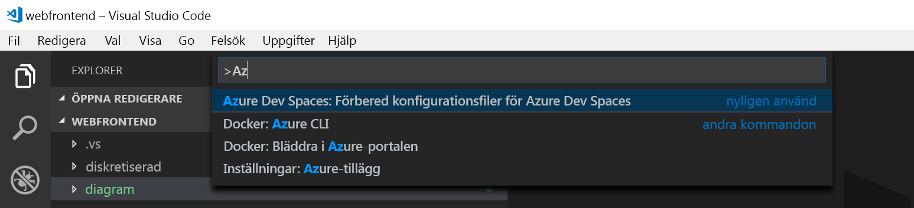
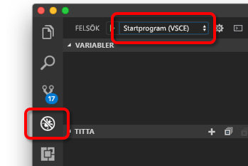
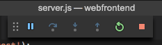

# <a name="quickstart-create-a-kubernetes-dev-space-with-azure-dev-spaces-nodejs"></a>Snabbstart: Skapa ett Kubernetes-utvecklarutrymme med Azure Dev Spaces (Node.js)

I den här guiden får du lära dig hur du:

- Ställa in Azure Dev Spaces med ett hanterat Kubernetes-kluster i Azure.
- Utveckla kod iterativt i behållare med VS Code och kommandoraden.
- Felsök kod som körs i ditt kluster.

> [!Note]
> **Om du fastnar** du kan när som helst referera till avsnittet [Felsökning](troubleshooting.md) eller lägga upp en kommentar på den här sidan. Du kan också försöka med den mer ingående [självstudien](get-started-nodejs.md).

## <a name="prerequisites"></a>Nödvändiga komponenter

- En Azure-prenumeration. Om du inte har en Azure-prenumeration, kan du skapa ett [kostnadsfritt konto](https://azure.microsoft.com/free).
- Ett [Kubernetes-kluster](https://ms.portal.azure.com/#create/microsoft.aks) som kör Kubernetes 1.9.6, i regionerna Usa, östra, Europa, västra eller Kanada, östra med **Http-programroutning** aktiverat.

  

- Visual Studio Code som du kan hämta [här](https://code.visualstudio.com/download).

## <a name="set-up-azure-dev-spaces"></a>Konfigurera Azure Dev Spaces

1. Installera [Azure CLI](/cli/azure/install-azure-cli?view=azure-cli-latest) (version 2.0.33 eller högre).
1. Ställ in Dev Spaces på ditt AKS-kluster: `az aks use-dev-spaces -g MyResourceGroup -n MyAKS`
1. Ladda ned [Azure Dev Spaces-tillägget](https://aka.ms/get-azds-code) för VS Code.
1. Installera tillägget: `code --install-extension path-to-downloaded-extension/azds-0.1.1.vsix`

## <a name="build-and-run-code-in-kubernetes"></a>Skapa och köra kod i Kubernetes

1. Hämta exempelkoden från GitHub: [https://github.com/Azure/dev-spaces](https://github.com/Azure/dev-spaces) 
1. Ändra katalogen till mappen webfrontend: `cd dev-spaces/samples/nodejs/getting-started/webfrontend`
1. Skapa Docker- och Helm-diagramtillgångar: `azds prep --public`
1. Skapa dina utvecklarutrymmen i AKS. Kör det här kommandot från webbklientdelen **rotkodsmappen** i terminalfönstret: `azds up`
1. Skanna konsolens utdata för information om den URL som skapades av `up`-kommandot. Den kommer att vara i formen: 

   `Service 'webfrontend' port 'http' is available at <url>` 

   Öppna webbadressen i ett webbläsarfönster. Du bör nu se hur webbappen läses in. 

### <a name="update-a-content-file"></a>Uppdatera en innehållsfil
Azure Dev Spaces handlar om mer än att bara få kod att köra i Kubernetes – det handlar om att du snabbt och löpande kan se effekten av dina kodändringar i en Kubernetes-miljö i molnet.

1. Leta upp filen `./public/index.html` och gör en ändring i HTML-koden. Ändra till exempel sidans bakgrundsfärg till en blå nyans:

    ```html
    <body style="background-color: #95B9C7; margin-left:10px; margin-right:10px;">
    ```

1. Spara filen. Efter en liten stund visas ett meddelande i terminalfönstret som meddelar att en fil i den aktiva behållaren har uppdaterats.
1. Gå till webbläsaren och uppdatera sidan. Nu bör du se färguppdateringen som du gjorde.

Vad hände? Ändringar av innehållsfiler som HTML och CSS kräver inte att Node.js-processen startas om. Ett aktivt `azds up`-kommando synkroniserar i stället automatiskt modifierade innehållsfiler direkt i den aktiva behållaren i Azure, så att du snabbt ser dina innehållsändringar.

### <a name="test-from-a-mobile-device"></a>Testa från en mobil enhet
Om du öppnar webbappen på en mobil enhet ser du att användargränssnittet inte visas korrekt på en liten enhet.

Du kan komma runt det här problemet genom att lägga till en `viewport`-metatagg:
1. Öppna filen `./public/index.html`
1. Lägg till en `viewport`-metatagg i det befintliga `head`-elementet:

    ```html
    <head>
        <!-- Add this line -->
        <meta name="viewport" content="width=device-width, initial-scale=1">
    </head>
    ```

1. Spara filen.
1. Uppdatera enhetens webbläsare. Nu bör webbappen återges korrekt på enheten. 

Detta är ett exempel på hur vissa problem inte upptäcks förrän du testar på de enheter som appen är avsedd att användas på. Med Azure Dev Spaces kan du snabbt omarbeta koden och kontrollera ändringarna på målenheterna.

### <a name="update-a-code-file"></a>Uppdatera en kodfil
Uppdateringar av kodfiler på serversidan kräver lite mer arbete eftersom en Node.js-app måste startas om.

1. Tryck på `Ctrl+C` (för att stoppa `azds up`) i terminalfönstret.
1. Öppna kodfilen `server.js` och redigera tjänstens välkomstmeddelande: 

    ```javascript
    res.send('Hello from webfrontend running in Azure!');
    ```

3. Spara filen.
1. Kör `azds up` i terminalfönstret. 

När du gör det återskapas behållaravbildningen och Helm-diagrammet distribueras på nytt. Bekräfta att kodändringarna har tillämpats genom att läsa in sidan i webbläsaren igen.

Det finns dock en ännu *snabbare kodutvecklingsmetod*, som vi ska titta närmare på i nästa avsnitt. 

## <a name="debug-a-container-in-kubernetes"></a>Felsöka en behållare i Kubernetes

I det här avsnittet ska du använda VS Code för att direkt felsöka våra behållare som körs i Azure. Du får också lära dig hur du kan få en snabbare redigera-kör-test-loop.


### <a name="initialize-debug-assets-with-the-vs-code-extension"></a>Initiera felsökningstillgångar med VS Code-tillägget
Du måste först konfigurera kodprojektet så att VS Code kommunicerar med vår utvecklarmiljö i Azure. VS Code-tillägget för Azure Dev Spaces har ett hjälpkommando för att konfigurera felsökningskonfigurationen. 

Öppna **Kommandopaletten** (med hjälp av menyn **Visa | Kommandopalett**) och använd automatisk komplettering för att ange och välja det här kommandot: `Azure Dev Spaces: Create configuration files for connected development`. 

Då läggs felsökningskonfigurationen för Azure Dev Spaces till under mappen `.vscode`.



### <a name="select-the-azds-debug-configuration"></a>Välj AZDS-felsökningskonfigurationen
1. Du öppnar felsökningsvyn genom att klicka på felsökningsikonen i **aktivitetsfältet** längs kanten i VS Code.
1. Välj **Start program (AZDS)** (Starta program (AZDS)) som aktiv felsökningskonfiguration.



> [!Note]
> Om du inte ser några Azure Dev Spaces-kommandon på kommandopaletten kontrollerar du att du har installerat VS Code-tillägget för Azure Dev Spaces.

### <a name="debug-the-container-in-kubernetes"></a>Felsöka behållaren i Kubernetes
Tryck på **F5** för att felsöka koden i Kubernetes.

Ungefär som `up`-kommandot så synkroniseras koden till utvecklarutrymmet när du startar felsökning och en behållare har skapats och distribuerats till Kubernetes. Den här gången är felsökaren kopplad till fjärrbehållaren.

> [!Tip]
> Statusfältet i VS Code innehåller en klickbar URL.

Lägg till en brytpunkt i en kodfil på serversidan, t.ex. i `app.get('/api'...` i `server.js`. Uppdatera sidan i webbläsaren eller tryck på knappen ”Say It Again” (Säg det igen), så kommer du till brytpunkten och kan börja stega igenom koden.

Du har fullständig åtkomst till felsökningsinformation precis som när koden körs lokalt, t.ex. anropsstack, lokala variabler, undantagsinformation och så vidare.

### <a name="edit-code-and-refresh-the-debug-session"></a>Redigera koden och uppdatera felsökningssessionen
Gör en kodändring medan felsökaren är aktiv. Du kan till exempel ändra hello-meddelandet igen:

```javascript
app.get('/api', function (req, res) {
    res.send('**** Hello from webfrontend running in Azure! ****');
});
```

Spara filen och klicka på knappen **Uppdatera** i **fönstret Felsökningsåtgärder**. 



I stället för att skapa och distribuera om en ny behållaravbildning varje gång koden ändras, vilket ofta tar lång tid, startar Azure Dev Spaces om Node.js-processen mellan felsökningssessioner för att snabba upp redigerings- och felsökningsförloppet.

Uppdatera webbappen i webbläsaren eller tryck på knappen *Say It Again* (Säg det igen). Nu bör ditt anpassade meddelande visas i användargränssnittet.

### <a name="use-nodemon-to-develop-even-faster"></a>Snabba upp utvecklingen ännu mer med NodeMon

`webfrontend`-exempelprojektet har konfigurerats för att använda [nodemon](https://nodemon.io/), ett populärt verktyg för snabbare Node.js-utveckling som är fullt kompatibelt med Azure Dev Spaces.

Prova följande steg:
1. Stoppa VS Code-felsökaren.
1. Klicka på ikonen Felsök i **aktivitetsfältet** längs kanten i VS-kod. 
1. Välj **Attach (AZDS)** (Koppla (AZDS)) som aktiv felsökningskonfiguration.
1. Tryck på F5.

I den här konfigurationen konfigureras behållaren att starta *nodemon*. När kodredigeringar görs på servern startar *nodemon* automatiskt om Node-processen, precis som när du utvecklar lokalt. 
1. Redigera hello-meddelande igen i `server.js` och spara filen.
1. Bekräfta att ändringarna har tillämpats genom att uppdatera webbläsaren eller genom att klicka på knappen *Say It Again* (Säg det igen).

**Nu vet du hur du snabbt kan arbeta med kod och felsöka direkt i Kubernetes!**

## <a name="next-steps"></a>Nästa steg

> [!div class="nextstepaction"]
> [Arbeta med flera behållare och utveckling i team](get-started-nodejs.md#call-a-service-running-in-a-separate-container)