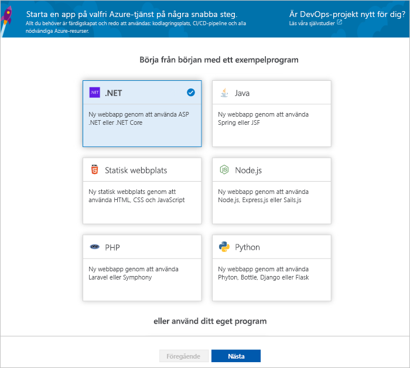
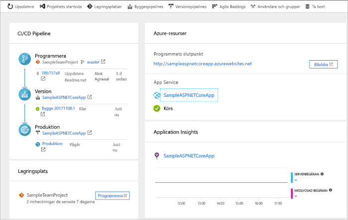
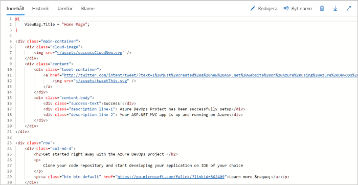
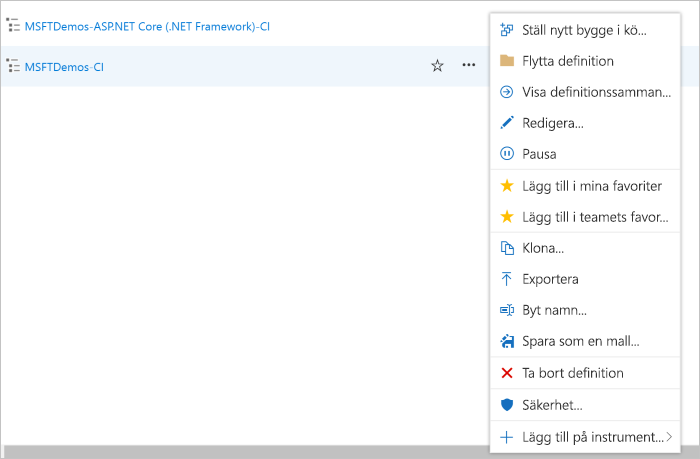

# Skapa en CI/CD-pipeline för .NET med Azure DevOps Projects

Konfigurera kontinuerlig integrering (CI) och kontinuerlig leverans (CD) för ditt .NET Core- eller ASP.NET-program med DevOps Projects. DevOps Projects förenklar den initiala konfigurationen av en bygg- och versionspipeline i Azure Pipelines.

Om du inte har en Azure-prenumeration kan du skaffa en kostnadsfritt via [Visual Studio Dev Essentials](https://visualstudio.microsoft.com/dev-essentials/).

## Logga in på Azure Portal

DevOps Projects skapar en CI/CD-pipeline i Azure DevOps. Du kan skapa en ny Azure DevOps-organisation eller använda en befintlig organisation. DevOps Projects skapar även Azure-resurser i den Azure-prenumeration som du väljer.

1. Logga in på [Microsoft Azure Portal](https://portal.azure.com).

1. I den vänstra fönsterrutan väljer du ikonen **Skapa en resurs** i det vänstra navigeringsfältet och söker sedan efter **DevOps Projects**.  

3.  Välj **Skapa**.

    

## Välj ett exempelprogram och en Azure-tjänst

1. Välj .NET-exempelprogrammet. .NET-exempel innehåller antingen ASP.NET-ramverket med öppen källkod eller det plattformsoberoende .NET Core-ramverket.

    

1. Välj .NET Core-programramverket.  
    Det här exemplet är ett ASP.NET Core MVC-program.
    
2. Välj **Nästa**.  
    Web App på Windows är det distributionsmål som är standard.  Du kan alternativt välja Web App on Linux eller Web App for Containers.  Det programramverk som du valde tidigare avgör vilken typ av distributionsmål som finns tillgängliga för Azure-tjänsten här.  
    
3. Låt standardinställningen för tjänsten vara och välj **Nästa**.

## Konfigurera Azure DevOps och en Azure-prenumeration 

1. Skapa en ny kostnadsfri Azure DevOps-organisation eller använd en befintlig organisation.

    a. Välj ett namn för projektet. 

    b. Välj din Azure-prenumeration och plats, välj ett namn för programmet och välj sedan **Klar**.  
    Efter några minuter visas DevOps Projects-instrumentpanelen i Azure-portalen. Ett exempelprogram konfigureras i en lagringsplats i din Azure DevOps-organisation, en version körs och programmet distribueras till Azure. Den här instrumentpanelen ger insyn i kodlagringsplatsen, CI/CD-pipelinen och ditt program i Azure.
    

2. Till höger på instrumentpanelen väljer du **Bläddra** för att visa det program som körs.

     

## Genomför ändringar i koden och kör CI/CD

 DevOps Projects skapade en Git-lagringsplats i Azure Repos eller GitHub. Visa lagringsplatsen och gör kodändringar i programmet genom att utföra följande:

1. Till vänster om DevOps Projects-instrumentpanelen väljer du länken för din **huvudgren**.  
Den här länken öppnar en vy till den nyligen skapade Git-lagringsplatsen.

1. Om du vill visa webbadressen för den klonade lagringsplatsen väljer du **Klona** längst upp till höger i webbläsaren.  
Du kan klona Git-lagringsplatsen till din favorit-IDE.  I kommande steg kan du använda webbläsaren för att göra och checka in ändringar i koden direkt till huvudgrenen.

1. Till vänster i webbläsaren går du till filen **Views/Home/index.cshtml**.

1. Välj **Redigera** och gör en ändring i h2-rubriken. Du kan till exempel skriva **Komma igång direkt med Azure DevOps Projects** eller göra någon annan ändring.

    

1. Välj **Checka in** och spara sedan ändringarna.

1. I webbläsaren går du till instrumentpanelen för Azure DevOps-projektet.  Du bör nu se att en version håller på att skapas. De ändringar du utfört skapas och distribueras automatiskt via en CI/CD-pipeline.

## Granska CI/CD-pipelinen

I föregående steg konfigurerade Azure DevOps Projects automatiskt en fullständig CI/CD-pipeline. Utforska och anpassa pipelinen efter behov. Bekanta dig med Azure DevOps-bygg- och versionspipelines genom att utföra följande steg.

1. Välj **Bygg-pipelines** längst upp på DevOps Projects-instrumentpanelen.  
Länken öppnar en webbläsarflik och Azure DevOps-bygg-pipelinen för det nya projektet.

1. Välj ellipsen (...).  Den här åtgärden öppnar en meny där du kan starta flera aktiviteter, till exempel lägga till en ny version i en kö, pausa en version och redigera bygg-pipelinen.

1. Välj **Redigera**.

    

1. I den här fönsterrutan kan du granska de olika uppgifterna för bygg-pipelinen.  
 Versionen utför olika uppgifter som att hämta källor från Git-lagringsplatsen, återställa beroenden och publicera utdata som används för distributioner.

1. Välj bygg-pipelinens namn längst upp i bygg-pipelinen.

1. Ändra på din bygg-pipeline till något mer beskrivande och välj alternativet för att **spara och placera i kö**. Välj sedan **Spara**.

1. Under ditt bygg-pipelinenamn väljer du **Historik**.   
I fönsterrutan **Historik** ser du en spårningslogg över de senaste ändringarna för versionen.  Azure Pipelines spårar alla ändringar som görs av bygg-pipelinen, vilket innebär att du kan jämföra versioner.

1. Välj **Utlösare**.  
DevOps Projects skapade automatiskt en CI-utlösare, och varje incheckning till lagringsplatsen startar en ny version.  Du kan välja att inkludera eller exkludera grenar från CI-processen.

1. Välj **Kvarhållning**.  
Beroende på ditt scenario kan du ange principer för att behålla eller ta bort ett visst antal versioner.

1. Välj **Byggen och versioner** och sedan **Versioner**.  
DevOps Projects skapar en versionspipeline för att hantera distributioner till Azure.

1.  Välj ellipsen (...) till vänster intill din versionspipeline och välj sedan **Redigera**.  
Versionspipelinen innehåller en pipeline som definierar versionsprocessen.  

1. Under **Artefakter** väljer du **Släpp**.  Den bygg-pipeline du undersökte i de föregående stegen skapar de utdata som används för artefakten. 

1. Intill ikonen **Släpp** väljer du **Utlösare av kontinuerlig distribution**.  
Den här versionspipelinen har en aktiverad CD-utlösare som kör en distribution varje gång en ny versionsartefakt är tillgänglig. Du kan även inaktivera utlösaren så att dina distributioner kräver manuell körning.  

1. Till vänster väljer du **Uppgifter**.   
Uppgifter är de aktiviteter som distributionsprocessen utför. I det här exemplet skapades en uppgift för att distribuera till Azure App-tjänsten.

1. Till höger väljer du alternativet för att **visa versioner**. Den här vyn visar en historik över versioner.

1. Välj ellipsen (...) bredvid en av versionerna och välj **Öppna**.  
Det finns flera menyer att utforska, till exempel en versionssammanfattning, tillhörande arbetsobjekt och tester.

1. Välj **Incheckningar**.   
Den här vyn visar kodincheckningar som är associerade med den specifika distributionen. 

1. Välj **Loggar**.  
Loggarna innehåller användbar information om distributionsprocessen. De kan visas både under och efter distributionerna.

## Rensa resurser

Du kan ta bort Azure App Service och andra relaterade resurser som du skapade när de inte längre behövs. Använd funktionen **Ta bort** på DevOps Projects-instrumentpanelen.

## Nästa steg

Se den här självstudien för att lära dig mer om att ändra dessa bygg- och versionspipelines för att uppfylla behoven i ditt team:

> [!div class="nextstepaction"]
> [Anpassa CD-process](https://docs.microsoft.com/azure/devops/pipelines/release/define-multistage-release-process?view=vsts)

## Videoklipp

> [!VIDEO https://www.youtube.com/embed/itwqMf9aR0w]
