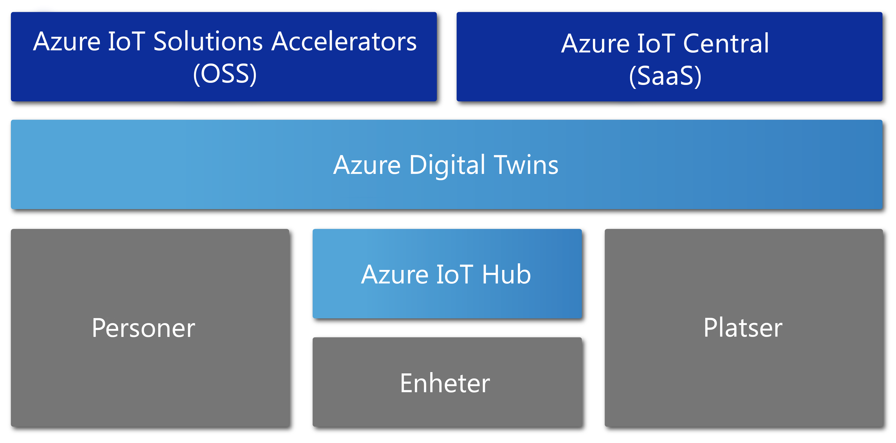

# Översikt över Azure Digital Twins

Azure Digital Twins är en Azure IoT-tjänst som skapar omfattande modeller av den fysiska miljön. Det kan skapa diagram för spatial intelligens för att modellera relationer och interaktioner mellan människor, utrymmen och enheter.

Med Azure Digital Twins kan du köra frågor mot data från ett fysiskt utrymme i stället för ett stort antal skilda sensorer. Den här tjänsten hjälper dig att skapa återanvändbara, mycket skalbara, spatialt medvetna upplevelser som länkar strömmande data över hela den digitala och den fysiska världen. Dina appar har förbättrats med funktionerna för unikt relevant sammanhangsberoende. Azure Digital Twins kan användas för följande exempeluppgifter för att:

- Förutse underhållsbehov för en fabrik.
- Analysera energikrav i realtid för ett elnät.
- Optimera användningen av tillgängliga utrymmen för ett kontor.

Azure Digital Twins gäller för alla typer av miljöer. Några exempel är lager, kontor, skolor, sjukhus och banker. Det kan även användas för idrottsarenor, fabriker, parkeringar, parker, smarta rutnät och städer. Azure Digital Twins kan användas i följande exempelscenarier för att:
 
- Spåra daglig temperatur för flera tillstånd. 
- Övervaka upptagna drönarvägar.
- Identifiera autonoma fordon. 
- Analysera användningsnivåerna för en byggnad. 
- Hitta den mest använda kassan i din butik. 

Vad ditt verkliga affärsscenario än är går det att etablera en motsvarande digital instans via Azure Digital Twins.

Följande videoklipp tar en närmare titt på Azure Digital Twins.

> [!VIDEO https://www.youtube.com/embed/TvN_NxpgyzQ]

## De viktigaste funktionerna

Azure Digital Twins har följande viktiga funktioner.

### Diagram för spatial intelligens

[*Diagrammet för spatial intelligens*](./concepts-objectmodel-spatialgraph.md), eller *den rumsliga grafen*, är en virtuell representation av den fysiska miljön. Du kan använda det för att skapa relationer mellan personer, platser och enheter.

Tänk dig en smart verktygsapp som hanterar flera elmätare som är anslutna i ett stadsområde. Tillverkaren av det smarta verktyget måste korrekt övervaka och förutse användning av och debitering för elektricitet. Varje enhet och sensorn måste modelleras med kontext om platsen och den kund som ska faktureras. Du kan använda diagrammet för spatial intelligens för att modellera de här typerna av komplexa relationer.

### Digitala tvillingobjektmodeller

[Digitala tvillingobjektmodeller](./concepts-objectmodel-spatialgraph.md) är fördefinierade enhetsprotokoll och dataschema. De justerar lösningens domänspecifika behov att påskynda och förenkla utvecklingen.

Till exempel skulle ett program för rumsanvändning kunna använda fördefinierade utrymmestyper som campus, våning och rum.

### Flera och kapslade klientorganisationer

Du kan skapa lösningar som skalar på ett säkert sätt och som kan återanvändas för flera klientorganisationer. Du kan även skapa flera underklientorganisationer som kan kommas åt och användas på ett isolerat och säkert sätt.

Ett exempel är en app för användning av utrymme som är konfigurerad för att isolera en klients data från andra klienter i en enda byggnad. Eller så används appen för att kombinera data för en enda klient med flera byggnader.

### Avancerade funktioner för databearbetning

Med [användardefinierade funktioner](./concepts-user-defined-functions.md) kan du definiera och köra anpassade funktioner mot inkommande [enhetsdata](./concepts-device-ingress.md) för att skicka signaler till fördefinierade slutpunkter. Den här avancerade funktionen förbättrar anpassning och automatisering av enhetsuppgifter.

Ett exempel är ett smart jordbruksprogram som innehåller en användardefinierad funktion för att utvärdera avläsningar av jordfuktsensorer och göra väderprognoser. Appen skickar sedan signaler om bevattningsbehov.

### Inbyggd åtkomstkontroll

Med åtkomst-och identitetshanteringsfunktioner som [rollbaserad åtkomstkontroll](./security-role-based-access-control.md) och [Azure Active Directory](./security-authenticating-apis.md) kan du på ett säkert sätt styra personers och enheters åtkomst.

Ett exempel är en app för anläggningshantering som är konfigurerad för att tillåta att personer i ett rum ställer in temperaturen inom ett visst intervall. Fabrikschefer får ange temperaturen i vilket rum som helst till vilket värde som helst.

### Ekosystem

Du kan ansluta en Azure Digital Twins-instans till många kraftfulla Azure-tjänster. Dessa tjänster är Azure Stream Analytics, Azure AI och Azure Storage. De omfattar också Azure Maps, Microsoft Mixed Reality, Dynamics 365 eller Office 365.

Ett exempel är ett program för en smart kontorsbyggnad som använder Azure Digital Twins för att representera team och enheter som finns på många våningar. När enheter strömmar livedata till den etablerade Digital Twin-instansen kan Stream Analytics-processer bearbeta dessa data för att ge viktiga, användbara insikter. Data lagras i Azure Storage och konverteras till ett delningsbart filformat. Filen distribueras över hela organisationen med hjälp av Office 365.

## Lösningar som har nytta av Azure Digital Twins

Azure Digital Twins är användbart för att representera den fysiska världen och dess många relationer. Det förenklar IoT-modellering, databearbetning, händelsehantering och spårning av enheter. Fundera över några av följande scenarier i olika branscher. De dra nytta av dess användning för att:

* Visa fastighetsbolag användningsnivåerna för ett utrymme över tid för att få insikter om de bästa sätten att konfigurera företagets kontorsbyggnad.
* Utlösa arbetsorderärenden för en mobilapp. Använda det för att utlösa vaktronder och schemalägga vaktmästaruppgifter och andra tjänster i butiksmiljö eller vid sportevenemang.
* Visa personer vilka rum som används i en byggnad i realtid. Hjälpa dessa personer att boka arbetsytor som passar deras behov.
* Spåra var tillgångar finns inom ett utrymme.
* Optimera laddning av elfordon genom att modellera användarpreferenser och begränsningar i elnätet.

## Azure Digital Twins i kontexten för andra IoT-tjänster

Azure Digital Twins använder Azure IoT Hub för att ansluta IoT-enheter och -sensorer som håller allt uppdaterat med den fysiska världen. Följande diagram visar hur Azure Digital Twins relaterar till andra Azure IoT-tjänster.

Läs mer om IoT [Azure IoT-tekniker och lösningar](https://docs.microsoft.com/azure/iot-fundamentals/iot-services-and-technologies).

## Nästa steg

Se en kort demonstration om Azure Digital Twins:

> [!div class="nextstepaction"]
> [Snabbstart: Hitta tillgängliga rum med hjälp av Azure Digital Twins](./quickstart-view-occupancy-dotnet.md)

Titta noga på ett program för anläggningshantering med hjälp av Azure Digital Twins:

> [!div class="nextstepaction"]
> [Självstudie: Distribuera Azure Digital Twins och konfigurera ett spatialt diagram](./tutorial-facilities-setup.md)

Läs mer om grundläggande Azure Digital Twins-begrepp:

> [!div class="nextstepaction"]
> [Förstå Digital Twins-objektmodellen och diagram för spatial intelligens](./concepts-objectmodel-spatialgraph.md)
