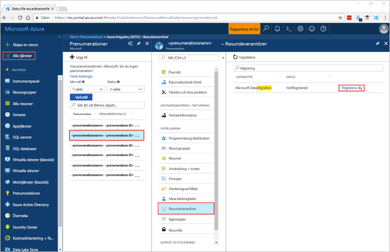
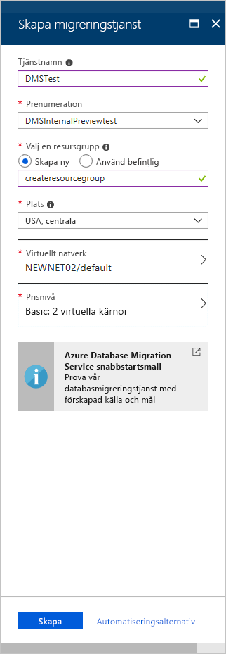
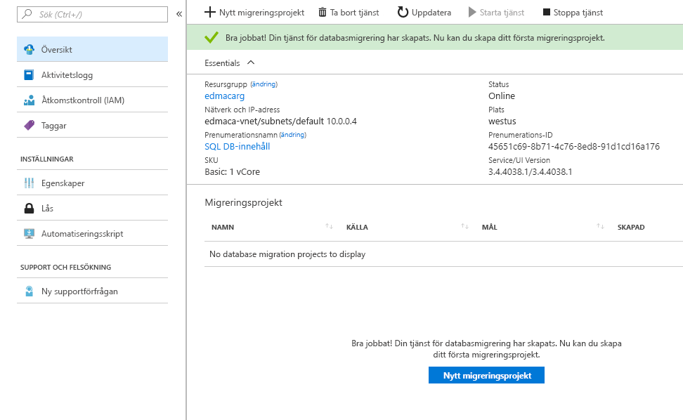

# Snabbstart: Skapa en instans av Azure Database Migration Service med hjälp av Azure-portalen

I den här snabb starten använder du Azure Portal för att skapa en instans av Azure Database Migration Service.  När du har skapat instansen kan du använda den för att migrera data från SQL Server till Azure SQL Database.

Om du inte har en Azure-prenumeration kan du skapa ett [kostnadsfritt](https://azure.microsoft.com/free/) konto innan du börjar.

## Logga in på Azure Portal

Öppna webbläsaren, gå till [Microsoft Azure-portalen](https://portal.azure.com/) och logga in genom att ange dina autentiseringsuppgifter.

Standardvyn är instrumentpanelen.

> [!NOTE]
> Du kan skapa upp till 10 instanser av DMS per prenumeration. Om du behöver ett större antal instanser skapar du ett support ärende.

## Registrera resursprovidern

Registrera resursprovidern Microsoft.DataMigration innan du skapar din första instans av Database Migration Service.

1. Gå till Azure-portalen och välj **Alla tjänster** och sedan **Prenumerationer**.

2. Välj den prenumeration där du vill skapa instansen av Azure Database Migration Service och välj sedan **resurs leverantörer**.

3. Sök efter migrering och välj sedan **Registrera** till höger om **Microsoft. data migration**.

    

## Skapar en instans av tjänsten

1. Välj +**skapa en resurs** för att skapa en instans av Azure Database migration service.

2. Sök efter ”migration” på Marketplace och välj **Azure Database Migration Service**. På skärmen **Azure Database Migration Service** väljer du sedan **Skapa**.

3. På skärmen **Skapa migreringstjänst**:

    - Välj ett **tjänst namn** som är minnes värt och unikt för att identifiera din instans av Azure Database migration service.
    - Välj den Azure-**prenumeration** där du vill skapa instansen.
    - Välj en befintlig **resurs grupp** eller skapa en ny.
    - Välj den **plats** som ligger närmast din käll- eller målserver.
    - Välj ett befintligt **virtuellt nätverk** eller skapa ett.

        Det virtuella nätverket ger Azure Database Migration Service åtkomst till käll databasen och mål miljön.

        Mer information om hur du skapar ett virtuellt nätverk i Azure Portal finns i artikeln [skapa ett virtuellt nätverk med hjälp av Azure Portal](../virtual-network/quick-create-portal.md).

    - Välj Basic: 1 virtuell kärna för **Prisnivå**.

        

4. Välj **Skapa**.

    Efter en liten stund skapas din instans av Azure Database migration service och är redo att användas. Azure Database Migration Service visas på det sätt som visas i följande bild:

    

## Rensa resurser

Rensa alla resurser som du har skapat i den här snabbstarten genom att ta bort [Azure-resursgruppen](../azure-resource-manager/management/overview.md). Ta bort resursgruppen genom att navigera till instansen av Azure Database Migration Service som du skapade. Markera **resursgruppsnamnet** och välj sedan **Ta bort resursgrupp**. Den här åtgärden tar bort alla resurser i resursgruppen samt själva gruppen.

## Nästa steg

> [!div class="nextstepaction"]
> [Migrera SQL Server till Azure SQL Database](tutorial-sql-server-to-azure-sql.md)