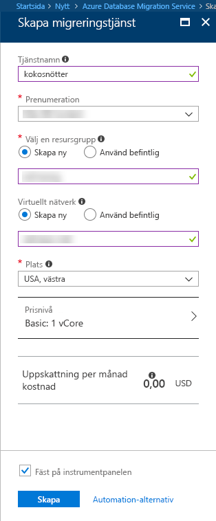

# Skapa en instans av Azure Database Migration Service med hjälp av Azure-portalen
I den här snabbstarten använder du Azure-portalen för att skapa en instans av Azure Database Migration Service.  När du har skapat tjänsten kan du använda den för att migrera data från en lokal SQL Server till en Azure SQL-databas.

Om du inte har en Azure-prenumeration kan du skapa ett [kostnadsfritt](https://azure.microsoft.com/free/) konto innan du börjar.

## Logga in på Azure Portal
Öppna webbläsaren, gå till [Microsoft Azure-portalen](https://portal.azure.com/) och logga in genom att ange dina autentiseringsuppgifter.

Standardvyn är instrumentpanelen.

## Registrera resursprovidern
Registrera resursprovidern Microsoft.DataMigration innan du skapar din första instans av Database Migration Service.

1. Gå till Azure-portalen och välj **Alla tjänster** och sedan **Prenumerationer**.

2. Välj den prenumeration där du vill skapa en instans av Azure Database Migration Service och välj sedan **Resursprovidrar**.

3. Sök efter migreringen och välj sedan **Registrera** till höger om Microsoft.DataMigration.

## Skapar en instans av tjänsten
1. Klicka på **+ Skapa en resurs** om du vill skapa en instans av Azure Database Migration Service, som för närvarande finns som förhandsversion.

2. Sök i Marketplace efter ”migration” och välj **Azure Database Migration Service**. Klicka sedan, på skärmen **Azure Database Migration Service (förhandsversion)**, på **Skapa**.

3. På skärmen **Database Migration Service**: 

    - Välj ett **tjänstnamn** som är lätt att komma ihåg och unikt för att identifiera din instans av Azure Database Migration Service.
    - Välj den Azure-**prenumeration** där du vill skapa instansen.
    - Skapa ett nytt **Nätverk** med ett unikt namn.
    - Välj den **plats** som ligger närmast din käll- eller målserver.
    - Välj Basic: 1 virtuell kärna för **Prisnivå**.

    
4. Välj **Skapa**.

Efter en liten stund har din instans av Azure Database Migration Service skapats och är redo att användas. Database Migration Service visas som på den här bilden:

## Rensa resurser
Rensa alla resurser som du har skapat i den här snabbstarten genom att ta bort [Azure-resursgruppen](../azure-resource-manager/resource-group-overview.md).  Ta bort resursgruppen genom att navigera till instansen av Azure Database Migration Service som du skapade. Markera **resursgruppsnamnet** och välj sedan **Ta bort resursgrupp**.  Den här åtgärden tar bort alla resurser i resursgruppen samt själva gruppen.

## Nästa steg
> [!div class="nextstepaction"]
> [Migrera lokal SQL Server till Azure SQL Database](tutorial-sql-server-to-azure-sql.md)