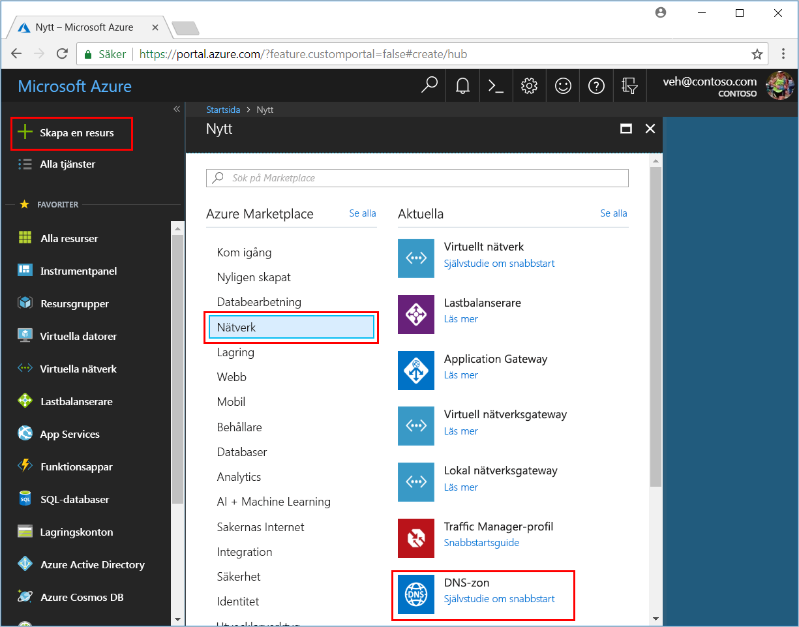
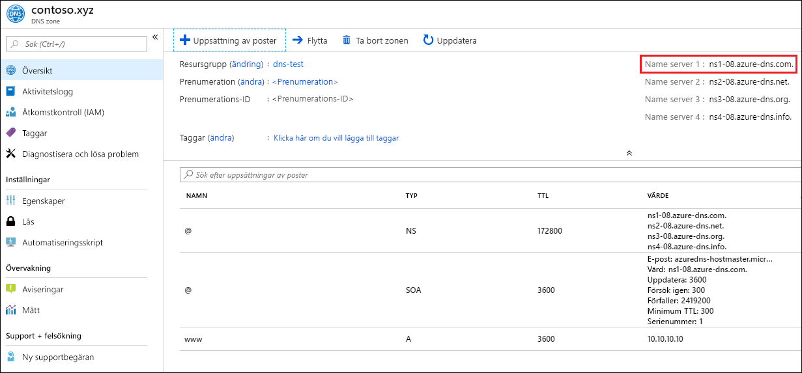

# Komma igång med Azure DNS med hjälp av Azure Portal

> [!div class="op_single_selector"]
> * [Azure Portal](dns-getstarted-portal.md)
> * [PowerShell](dns-getstarted-powershell.md)
> * [Azure CLI 2.0](dns-getstarted-cli.md)

Den här artikeln visar hur du skapa din första DNS-zon och DNS-post med Azure Portal. Du kan också utföra dessa steg med Azure PowerShell eller plattformsoberoende Azure CLI.

En DNS-zon används som värd åt DNS-posterna för en viss domän. Om du vill låta Azure DNS vara värd för din domän så måste du skapa en DNS-zon för det domännamnet. Varje DNS-post för din domän skapas sedan i den här DNS-zonen. Om du vill publicera din DNS-zon på Internet måste du konfigurera namnservrarna för domänen. Vart och ett av dessa steg beskrivs i följande steg.

## Skapa en DNS-zon

1. Logga in på Azure Portal
2. Klicka på **Nytt > Nätverk >** på navmenyn och klicka sedan på **DNS-zon** för att öppna sidan **Skapa DNS-zon**.

    

4. På sidan **Skapa DNS-zon** anger du följande värden och klickar sedan på **Skapa**:

   | **Inställning** | **Värde** | **Detaljer** |
   |---|---|---|
   |**Namn**|contoso.com|Namnet på DNS-zonen|
   |**Prenumeration**|[Din prenumeration]|Välj en prenumeration att skapa DNS-zonen i.|
   |**Resursgrupp**|**Skapa ny:** contosoDNSRG|Skapa en resursgrupp. Resursgruppens namn måste vara unikt inom den prenumeration du valde. Mer information om resursgrupper finns i [översikten över Resource Manager](../azure-resource-manager/resource-group-overview.md?toc=%2fazure%2fdns%2ftoc.json#resource-groups).|
   |**Plats**|Västra USA||

> [!NOTE]
> Resursgruppen refererar till platsen för resursgruppen och har ingen inverkan på DNS-zonen. Platsen för DNS-zonen är alltid "global" och visas inte.

## Skapa en DNS-post

Följande exempel visar hur du skapar en ny "A"-post. Information om andra posttyper och hur du ändrar befintliga poster finns i [Hantera DNS-poster och postuppsättningar med Azure Portal](dns-operations-recordsets-portal.md) (på engelska). 

1. I Azure Portal klickar du på **Alla resurser** i rutan **Favoriter** för den DNS-zon du skapade. Klicka på DNS-zonen **contoso.com** på sidan Alla resurser. Om den prenumeration du valde redan har flera resurser kan du ange **contoso.com** i rutan **Filtrera efter namn...** när du ska hitta din DNS-zon.

1. Välj **+ Postuppsättning** längst upp på sidan **DNS-zon** för att öppna sidan **Lägg till uppsättning av poster**.

1. Ange följande värden på sidan **Lägg till uppsättning av poster** och klicka på **OK**. I det här exemplet skapar du en A-post.

   |**Inställning** | **Värde** | **Detaljer** |
   |---|---|---|
   |**Namn**|www|Namnet på posten|
   |**Typ**|A| Den typ av DNS-post som du vill skapa. Godkända värden är A, AAAA, CNAME, MX, NS, SRV, TXT och PTR.  Mer information om posttyper finns i [Översikt över DNS-zoner och poster](dns-zones-records.md)|
   |**TTL**|1|Time-to-live för DNS-begäran.|
   |**TTL-enhet**|Timmar|Tidsmått för TTL-värde.|
   |**IP-adress**|ipAddressValue| Det här värdet är den IP-adress som DNS-posten matchar till.|

## Visa poster

På den nedre delen av sidan DNS-zon visas posterna för DNS-zonen. Du bör se DNS- och SOA-standardposterna (dessa skapas i varje zon) plus eventuella nya poster som du har skapat.

## Uppdatera namnservrar

När du är nöjd med konfigurationen av DNS-zonen och DNS-posterna måste du konfigurera ditt domännamn för användning med Azure DNS-namnservrarna. Det gör att andra användare på Internet kan hitta dina DNS-poster.

Namnservrarna för din zon anges på Azure Portal:

Dessa namnservrar ska konfigureras med domännamnsregistratorn (där du köpte domännamnet). Registratorn erbjuder möjligheten att konfigurera namnservrar för domänen. Mer information finns i [Delegera en domän till Azure DNS](dns-domain-delegation.md).

## Ta bort alla resurser

Så här tar du bort alla resurser som skapats i den här artikeln:

1. Klicka på **Alla resurser** i rutan **Favoriter** i Azure Portal. Klicka på resursgruppen **MyResourceGroup** på sidan Alla resurser. Om den prenumeration du valde redan har flera resurser kan du ange **MyResourceGroup** i rutan **Filtrera efter namn** när du ska hitta resursgruppen.
1. Klicka på knappen **Ta bort** på sidan **MyResourceGroup**.
1. Du måste ange namnet på resursgruppen i portalen som bekräftelse på att du vill ta bort den. Klicka på **Ta bort**, skriv *MyResourceGroup* som resursgruppnamn och klicka sedan på **Ta bort**. När du tar bort en resursgrupp så tas alla resurser i resursgruppen bort, så du måste alltid kontrollera innehållet i en resursgrupp innan du tar bort den. Portalen tar bort alla resurser som finns i resursgruppen och sedan tas själva resursgruppen bort. Den här processen tar flera minuter.

## Nästa steg

Läs mer om Azure DNS i [Översikt över Azure DNS](dns-overview.md).

Mer information om hur du hanterar DNS-poster i Azure DNS finns i [Hantera DNS-poster och postuppsättningar med Azure Portal](dns-operations-recordsets-portal.md) (på engelska).

