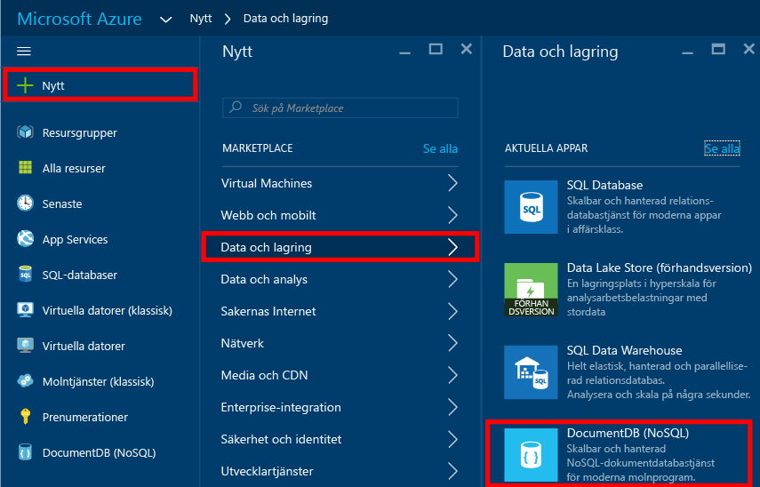
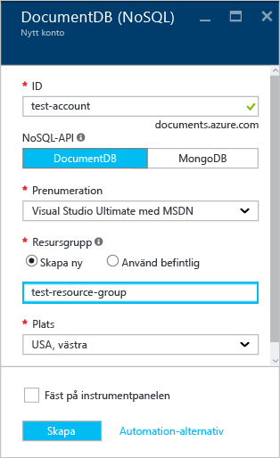
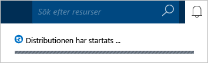
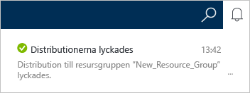
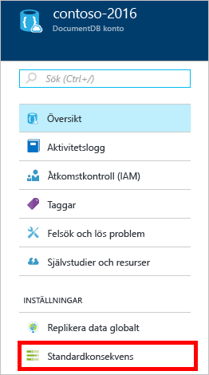
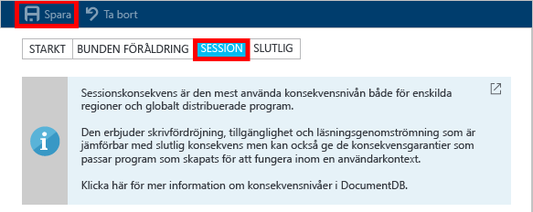

# Så här skapar du ett DocumentDB NoSQL-konto med Azure Portal
> [!div class="op_single_selector"]
> * [Azure Portal](documentdb-create-account.md)
> * [Azure CLI 1.0](documentdb-automation-resource-manager-cli-nodejs.md)
> * [Azure CLI 2.0](documentdb-automation-resource-manager-cli.md)
> * [Azure PowerShell](documentdb-manage-account-with-powershell.md)

Om du vill skapa en databas med Microsoft Azure DocumentDB måste du:

* Ha ett Azure-konto. Om du inte redan har ett kan du skapa ett [kostnadsfritt Azure-konto](https://azure.microsoft.com/free).
* Skapa ett DocumentDB-konto.  

Du kan skapa ett DocumentDB-konto via Azure Portal, Azure Resource Manager-mallar eller kommandoradsgränssnittet (CLI) i Azure. I den här artikeln beskrivs hur man skapar ett DocumentDB-konto i Azure Portal. Om du vill skapa ett konto med Azure Resource Manager eller Azure CLI finns det mer information i [Skapa DocumentDB-databaskonton automatiskt](documentdb-automation-resource-manager-cli.md).

Har du inte använt DocumentDB förut? Titta på [den här](https://azure.microsoft.com/documentation/videos/create-documentdb-on-azure/) fyra minuter långa videon av Scott Hanselman, så får du se hur du utför de vanligaste uppgifterna i onlineportalen.

1. Logga in på [Azure Portal](https://portal.azure.com/).
2. I det vänstra navigeringsfönstret klickar du på **Ny**, **Databaser** och sedan på **NoSQL (DocumentDB)**.

     
3. På **Nytt konto**-bladet anger du önskad konfiguration för DocumentDB-kontot.

    

   * I **ID**-rutan, anger du ett namn för att identifiera DocumentDB-kontot.  När **ID**:n har verifierats, visas en grön kryssmarkering i **ID**-rutan. **ID**-värdet blir värdnamnet inom URI:n. **ID**:n får bara innehålla gemener, siffror och bindestreck och måste vara mellan 3 och 50 tecken. Observera att *documents.azure.com* läggs till i slutpunktsnamnet du väljer, och resultatet blir slutpunkten för ditt DocumentDB-konto.
   * I rutan **NoSQL API** markerar du den programmeringsmodell som ska användas:

     * **DocumentDB**: API:t för DocumentDB är tillgängligt via [SDK:er](documentdb-sdk-dotnet.md) för .NET, Java, Node.js, Python och JavaScript, samt HTTP [REST](https://msdn.microsoft.com/library/azure/dn781481.aspx), och omfattar programmeringsåtkomst till alla DocumentDB-funktioner.
     * **MongoDB**: DocumentDB omfattar också [support på protokollnivå](documentdb-protocol-mongodb.md) för API:er för **MongoDB**. När du väljer MongoDB API-alternativet kan du använda befintliga SDK:er och [verktyg](documentdb-mongodb-mongochef.md) för MongoDB för att kommunicera med DocumentDB. Du kan [flytta](documentdb-import-data.md) dina befintliga MongoDB-appar för att använda DocumentDB [utan att kodändringar krävs](documentdb-connect-mongodb-account.md), och utnyttja en fullständigt hanterad databas som en tjänst, med obegränsad skala, global replikering och andra funktioner.
   * För **Prenumeration** väljer du den Azure-prenumeration som du vill ange för DocumentDB-kontot. Om ditt konto bara har en prenumeration så väljs det kontot som standard.
   * I **Resursgrupp** väljer eller skapar du en resursgrupp för ditt DocumentDB-konto.  Som standard skapas en ny resursgrupp. Mer information finns i [Using the Azure portal to manage your Azure resources](../azure-portal/resource-group-portal.md) (Hantera Azure-resurser med hjälp av Azure Portal).
   * Använd **Plats** för att ange den geografiska platsen där du vill att DocumentDB-kontots värd ska finnas.
4. När de nya DocumentDB-kontoalternativen har konfigurerats, klickar du på **Skapa**. Kontrollera meddelandehubben för att se statusen för distributionen.  

     

   
5. När DocumentDB-kontot har skapats är det redo att användas med standardinställningarna. Standardkonsekvensen för DocumentDB-kontot har angetts till **Session**.  Du kan justera standardkonsekvensen genom att klicka på **Standardkonsekvens** på resursmenyn. Mer information om de konsekvensnivåer som finns för DocumentDB finns i [Konsekvensnivåer i DocumentDB](documentdb-consistency-levels.md).

     

     

[How to: Create a DocumentDB account]: #Howto
[Next steps]: #NextSteps

## Nästa steg
Nu när du har ett DocumentDB-konto är nästa steg att skapa en DocumentDB-samling och -databas.

Du kan skapa en ny samling och databas genom att använda något av följande:

* Azure Portal, enligt beskrivningen i [Skapa en DocumentDB-samling med Azure Portal](documentdb-create-collection.md).
* Omfattande självstudier, inklusive exempeldata: [.NET](documentdb-get-started.md), [.NET MVC](documentdb-dotnet-application.md), [Java](documentdb-java-application.md), [Node.js](documentdb-nodejs-application.md), eller [Python](documentdb-python-application.md).
* Exempelkoden för [.NET](documentdb-dotnet-samples.md#database-examples), [Node.js](documentdb-nodejs-samples.md#database-examples) eller [Python](documentdb-python-samples.md#database-examples) som är tillgänglig i GitHub.
* SDK:er för [.NET](documentdb-sdk-dotnet.md), [.NET Core](documentdb-sdk-dotnet-core.md), [Node.js](documentdb-sdk-node.md), [Java](documentdb-sdk-java.md), [Python](documentdb-sdk-python.md) och [REST](https://msdn.microsoft.com/library/azure/mt489072.aspx).

När du har skapat databasen och samlingen behöver du [lägga till dokument ](documentdb-view-json-document-explorer.md) i samlingarna.

När du har dokument i en samling kan du använda [DocumentDB SQL](documentdb-sql-query.md) för att [köra frågor](documentdb-sql-query.md#ExecutingSqlQueries) mot dokumenten. Du kan köra frågor genom att använda [Frågeutforskaren](documentdb-query-collections-query-explorer.md) i portalen, [REST API:t](https://msdn.microsoft.com/library/azure/dn781481.aspx) eller en av [SDK:erna](documentdb-sdk-dotnet.md).

### Läs mer
Mer information om DocumentDB finns i följande resurser:

* [Utbildningsväg för DocumentDB](https://azure.microsoft.com/documentation/learning-paths/documentdb/)
* [Hierarkisk resursmodell och begrepp i DocumentDB](documentdb-resources.md)

