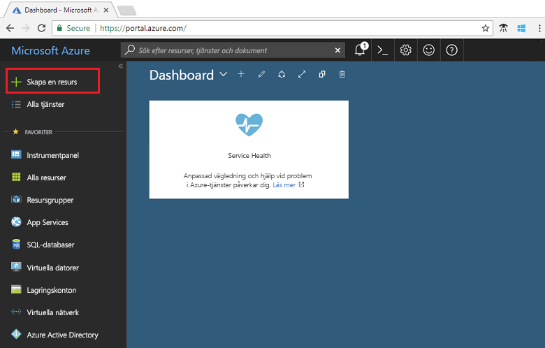
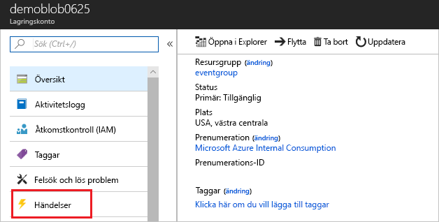

# <a name="create-and-route-blob-storage-events-with-the-azure-portal-and-event-grid"></a>Skapa och dirigera Blob Storage-händelser med Azure Portal och Event Grid

Azure Event Grid är en händelsetjänst för molnet. I den här artikeln använder du Azure Portal för att skapa ett Blob Storage-konto, prenumerera på händelser för blobblagringen och utlösa en händelse för att visa resultatet. Normalt kan du skicka händelser till en slutpunkt som bearbetar informationen om händelsen och utför åtgärder. Men för att enkelt beskriva den här artikeln kan skicka du händelser till en webbapp som samlar in och visar meddelanden.

[!INCLUDE [quickstarts-free-trial-note.md](../../includes/quickstarts-free-trial-note.md)]

När du är klar kan se du att händelsedata som har skickats till webbappen.


## <a name="create-a-storage-account"></a>skapar ett lagringskonto

Om du vill använda Blob Storage-händelser behöver du antingen ett [Blob Storage-konto](../storage/common/storage-create-storage-account.md?toc=%2fazure%2fstorage%2fblobs%2ftoc.json#blob-storage-accounts) eller ett [GPv2-konto (General Purpose v2)](../storage/common/storage-account-options.md#general-purpose-v2). **GPv2-konton (General Purpose v2)** är lagringskonton som stöder alla funktionerna för alla lagringstjänster, som blobbar, filer, köer och tabeller. Ett **Blob Storage-konto** är ett specialiserat lagringskonto för lagring av ostrukturerade data som blobbar (objekt) i Azure Storage. Blob Storage-konton liknar allmänna lagringskonton och har samma höga hållbarhet, tillgänglighet, skalbarhet och prestanda som du använder idag, inklusive 100 % API-konsekvens för blockblobbar och tilläggsblobbar. För program som bara behöver lagring av block- eller tilläggsblobbar, rekommenderar vi att du använder Blob-lagringskonton. 

1. Logga in på [Azure-portalen](https://portal.azure.com/).

1. Om du vill skapa ett Blob Storage-konto väljer du **Skapa en resurs**. 

   

1. Välj **Storage** (Lagring) för att filtrera de tillgängliga alternativen och välj **Storage-konto – blob, fil, tabell, kö**.

   

1. Ange värden för Blob Storage-kontot och ge det ett unikt namn. Välj kontotypen **Blobblagring**. För plats väljer du en av de [platser](overview.md) som stöder Event Grid. När du har angett alla värden väljer du **Skapa**.

   

## <a name="create-a-message-endpoint"></a>Skapa en slutpunkt för meddelanden

Innan du prenumererar på händelserna för Blob Storage-kontot ska vi skapa slutpunkten för händelsemeddelandet. Slutpunkten utför vanligtvis åtgärder baserat på informationen om händelsen. För att förenkla den här snabbstarten kan du distribuera en [förskapad webbapp](https://github.com/dbarkol/azure-event-grid-viewer) som visar meddelanden om händelser. Den distribuerade lösningen innehåller en App Service-plan,en webbapp för App Service och källkod från GitHub.

1. Välj **Deploy to Azure** (Distribuera till Azure) för att distribuera lösningen till din prenumeration. Ange parametervärdena i Azure Portal.

   <a href="https://portal.azure.com/#create/Microsoft.Template/uri/https%3A%2F%2Fraw.githubusercontent.com%2Fdbarkol%2Fazure-event-grid-viewer%2Fmaster%2Fazuredeploy.json" target="_blank"></a>

1. Det kan ta några minuter att slutföra distributionen. Efter distributionen har slutförts kan du visa webbappen för att kontrollera att den körs. I en webbläsare navigerar du till: `https://<your-site-name>.azurewebsites.net`

1. Du ser webbplatsen men det har inte publicerats händelser till den än.

   

## <a name="subscribe-to-the-blob-storage"></a>Prenumerera på Blob Storage

Du prenumererar på ett ämne därför att du vill ange för Event Grid vilka händelser du vill följa och vart du vill skicka händelserna.

1. Välj ditt Blob Storage-konto i portalen och välj **Händelser**.

   

1. För att skicka händelser till visningsprogrammet använder du en webhook för slutpunkten. Välj **Fler alternativ** och **Webhook**.

   

1. Händelseprenumerationen fylls i automatiskt med värden för ditt Blob Storage-konto. För webhookens slutpunkt anger du webbappens webbadress och lägger till `api/updates` till startsidans webbadress. Namnge prenumerationen. Välj **Skapa** när du är klar.

   

1. Visa ditt webbprogram igen och observera att en händelse för verifieringen av prenumerationen har skickats till den. Välj ögonikonen för att utöka informationen om händelsen. Händelserutnätet skickar valideringshändelsen så att slutpunkten kan bekräfta att den vill ta emot händelsedata. Webbappen inkluderar kod för att verifiera prenumerationen.

   

Nu ska vi utlösa en händelse och se hur Event Grid distribuerar meddelandet till slutpunkten.

## <a name="send-an-event-to-your-endpoint"></a>Skicka en händelse till din slutpunkt

Du kan utlösa en händelse för Blob Storage-kontot genom att ladda upp en fil. Filen behöver inte innehålla något specifikt. Artiklarna förutsätter att du har en fil med namnet testfile.txt, men du kan använda vilken fil som helst.

1. Välj **Blobbar** för ditt Blob Storage-konto.

   

1. Välj **+ Behållare**. Namnge behållaren och använd valfri åtkomstnivå.

   

1. Välj din nya behållare.

   

1. Välj **Ladda upp** för att ladda upp en fil.

   

1. Bläddra till testfilen och ladda upp den.

1. Du har utlöst händelsen och Event Grid skickade meddelandet till den slutpunkt som du konfigurerade när du prenumererade. Visa din webbapp och notera att en skapad blobhändelse tagits emot. 

  ```json
  {
    "topic": "/subscriptions/{subscription-id}/resourceGroups/eventgroup/providers/Microsoft.Storage/storageAccounts/demoblob0625",
    "subject": "/blobServices/default/containers/eventcontainer/blobs/testfile.txt",
    "eventType": "Microsoft.Storage.BlobCreated",
    "eventTime": "2018-06-25T22:50:41.1823131Z",
    "id": "89a2f9da-c01e-00bb-13d6-0c599506e4e3",
    "data": {
      "api": "PutBlockList",
      "clientRequestId": "41341a9b-e977-4a91-9000-c64125039047",
      "requestId": "89a2f9da-c01e-00bb-13d6-0c5995000000",
      "eTag": "0x8D5DAEE13C8F9ED",
      "contentType": "text/plain",
      "contentLength": 4,
      "blobType": "BlockBlob",
      "url": "https://demoblob0625.blob.core.windows.net/eventcontainer/testfile.txt",
      "sequencer": "00000000000000000000000000001C24000000000004712b",
      "storageDiagnostics": {
        "batchId": "ef633252-32fd-464b-8f5a-0d10d68885e6"
      }
    },
    "dataVersion": "",
    "metadataVersion": "1"
  }
  ```

## <a name="clean-up-resources"></a>Rensa resurser

Om du planerar att fortsätta arbeta med den här händelsen ska du inte rensa upp bland de resurser som skapades i den här artikeln. I annat fall tar du bort alla resurser som du har skapat i den här artikeln.

Välj resursgruppen och sedan **Ta bort resursgrupp**.

## <a name="next-steps"></a>Nästa steg

Nu när du vet hur du skapar anpassade ämnen och prenumerationer på händelser kan du läsa mer om vad Event Grid kan hjälpa dig med:

- [Om Event Grid](overview.md)
- [Dirigera Blob Storage-händelser till en anpassad webbslutpunkt](../storage/blobs/storage-blob-event-quickstart.md?toc=%2fazure%2fevent-grid%2ftoc.json)
- [Övervaka ändringar på virtuella maskiner med Azure Event Grid och Logic Apps](monitor-virtual-machine-changes-event-grid-logic-app.md)
- [Strömma stordata till ett datalager](event-grid-event-hubs-integration.md)
