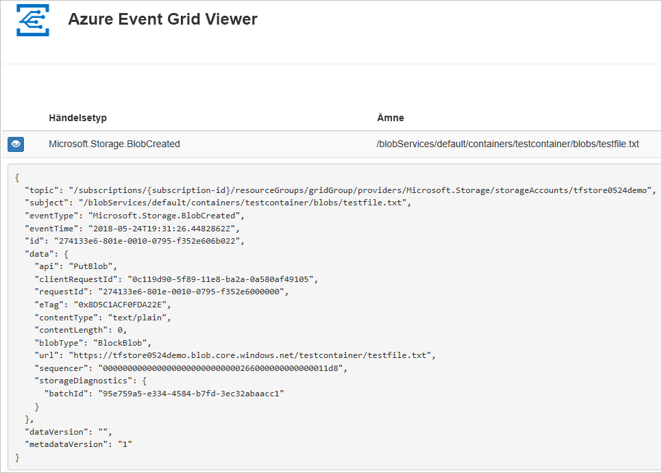
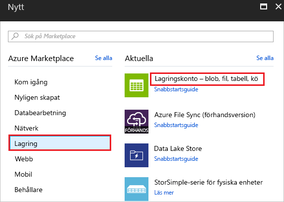
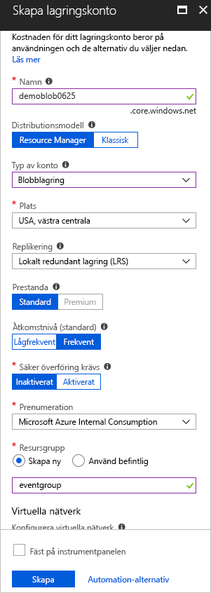
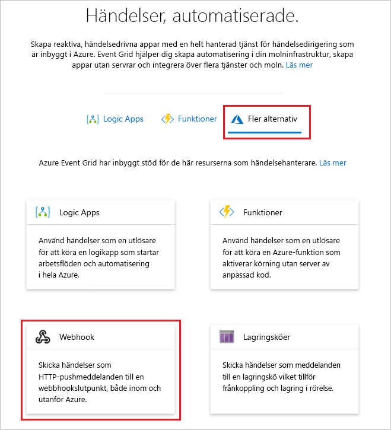
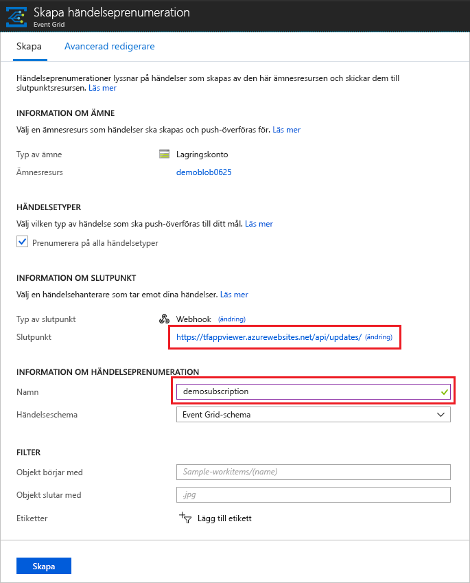
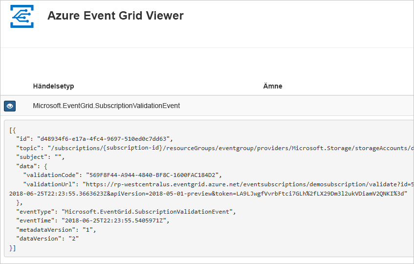
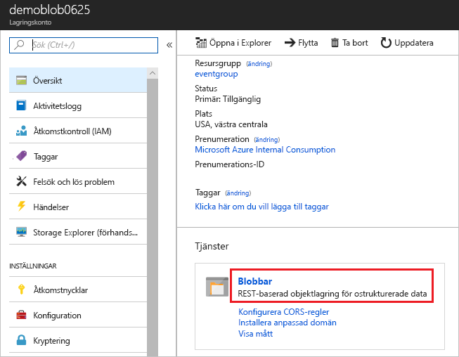
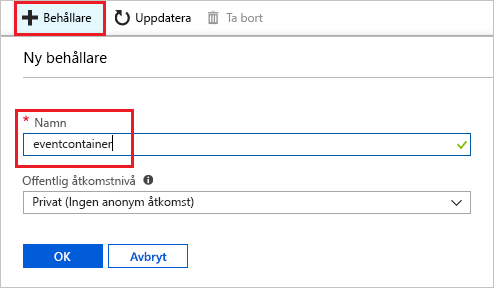
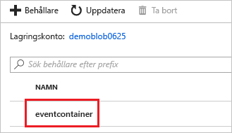
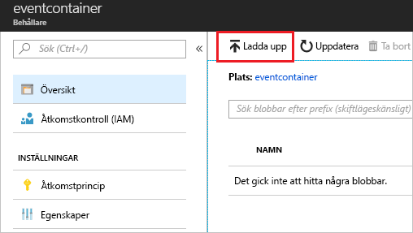

# Snabb start: dirigera Blob Storage-händelser till webb slut punkt med Azure Portal

Azure Event Grid är en händelsetjänst för molnet. I den här artikeln använder du Azure Portal för att skapa ett Blob Storage-konto, prenumerera på händelser för blobblagringen och utlösa en händelse för att visa resultatet. Normalt kan du skicka händelser till en slutpunkt som bearbetar informationen om händelsen och utför åtgärder. Men för att enkelt beskriva den här artikeln kan skicka du händelser till en webbapp som samlar in och visar meddelanden.

[!INCLUDE [quickstarts-free-trial-note.md](../../includes/quickstarts-free-trial-note.md)]

När du är klar kan se du att händelsedata som har skickats till webbappen.

## skapar ett lagringskonto

1. Logga in på [Azure Portal](https://portal.azure.com/).

1. Om du vill skapa ett Blob Storage-konto väljer du **Skapa en resurs**. 

1. Välj **Storage** (Lagring) för att filtrera de tillgängliga alternativen och välj **Storage-konto – blob, fil, tabell, kö**.

   

   Skapa ett v2-lagringskonto för allmän användning eller ett Blob Storage-konto om du vill prenumerera på händelser.
   
1. Utför följande steg på sidan **skapa lagrings konto** :
    1. Välj din Azure-prenumeration. 
    2. För **resurs grupp** skapar du en ny resurs grupp eller väljer en befintlig. 
    3. Ange namnet på lagringskontot. 
    4. Välj **Granska + skapa**. 

           
    5. På sidan **Granska + skapa** granskar du inställningarna och väljer **skapa**. 

        >[!NOTE]
        > Endast lagrings konton av typen **StorageV2 (generell användning v2)** och **BlobStorage** -stöd för händelse integrering. **Lagring (Genral Purpose v1)** stöder *inte* integrering med event Grid.

## Skapa en slutpunkt för meddelanden

Innan du prenumererar på händelserna för Blob Storage-kontot ska vi skapa slutpunkten för händelsemeddelandet. Slutpunkten utför vanligtvis åtgärder baserat på informationen om händelsen. För att förenkla den här snabbstarten kan du distribuera en [förskapad webbapp](https://github.com/Azure-Samples/azure-event-grid-viewer) som visar meddelanden om händelser. Den distribuerade lösningen innehåller en App Service-plan,en webbapp för App Service och källkod från GitHub.

1. Välj **Deploy to Azure** (Distribuera till Azure) för att distribuera lösningen till din prenumeration. 

   
2. Utför följande steg på sidan **Anpassad distribution** : 
    1. För **resurs grupp** väljer du den resurs grupp som du skapade när du skapade lagrings kontot. Det blir enklare för dig att rensa efter att du är klar med självstudien genom att ta bort resurs gruppen.  
    2. För **webbplats namn** anger du ett namn för webbappen.
    3. Ange ett namn för den App Service plan som ska användas som värd för webbappen för **värd Plans namn**.
    4. Markera kryss rutan för **Jag accepterar villkoren som anges ovan**. 
    5. Välj **Köp**. 

       
1. Det kan ta några minuter att slutföra distributionen. Välj aviseringar (klock ikon) i portalen och välj sedan **gå till resurs grupp**. 

    
4. På sidan **resurs grupp** i listan över resurser väljer du den webbapp som du skapade. Du ser också App Service plan och lagrings kontot i den här listan. 

    
5. På sidan **App Service** för din webbapp väljer du webb adressen för att navigera till webbplatsen. URL: en ska ha följande format: `https://<your-site-name>.azurewebsites.net` .
    
    

6. Bekräfta att du ser platsen men inga händelser har publicerats till den ännu.

   

[!INCLUDE [event-grid-register-provider-portal.md](../../includes/event-grid-register-provider-portal.md)]

## Prenumerera på Blob Storage

Du prenumererar på ett ämne därför att du vill ange för Event Grid vilka händelser du vill följa och vart du vill skicka händelserna.

1. I portalen navigerar du till ditt Azure Storage konto som du skapade tidigare. Välj **alla resurser** på den vänstra menyn och välj ditt lagrings konto. 
2. På sidan **lagrings konto** väljer du **händelser** på den vänstra menyn. 
1. Välj **Fler alternativ** och **Webhook**. Du skickar händelser till visnings programmet med en webhook för slut punkten. 

   
3. Utför följande steg på sidan **Skapa händelse prenumeration** : 
    1. Ange ett **namn** för händelse prenumerationen.
    2. Ange ett **namn** för **system-ämnet**. Information om system ämnen finns i [Översikt över system ämnen](system-topics.md).

       
    2. Välj **Web Hook** för **slut punkts typ**. 

       
4. För **slut punkt** klickar du på **Välj en slut punkt** och anger URL: en för din webbapp och lägger till `api/updates` på Start sidans URL (t. ex `https://spegridsite.azurewebsites.net/api/updates` .:) och väljer sedan **Bekräfta markering**.

   
5. Gå nu till sidan **Skapa händelse prenumeration** och välj **skapa** för att skapa händelse prenumerationen. 

   

1. Visa ditt webbprogram igen och observera att en händelse för verifieringen av prenumerationen har skickats till den. Välj ögonikonen för att utöka informationen om händelsen. Händelserutnätet skickar valideringshändelsen så att slutpunkten kan bekräfta att den vill ta emot händelsedata. Webbappen inkluderar kod för att verifiera prenumerationen.

   

Nu ska vi utlösa en händelse och se hur Event Grid distribuerar meddelandet till slutpunkten.

## Skicka en händelse till din slutpunkt

Du kan utlösa en händelse för Blob Storage-kontot genom att ladda upp en fil. Filen behöver inte innehålla något specifikt. Artiklarna förutsätter att du har en fil med namnet testfile.txt, men du kan använda vilken fil som helst.

1. I Azure Portal navigerar du till ditt Blob Storage-konto och väljer **behållare** på sidan **Översikt** .

   

1. Välj **+ Container**. Ge behållaren ett namn och Använd valfri åtkomst nivå och välj **skapa**. 

   

1. Välj din nya container.

   

1. Välj **Ladda upp** för att ladda upp en fil. På sidan **Ladda upp BLOB** bläddrar du till och väljer en fil som du vill överföra för testning och väljer sedan **Ladda upp** på sidan. 

   

1. Bläddra till testfilen och ladda upp den.

1. Du har utlöst händelsen och Event Grid skickade meddelandet till den slutpunkt som du konfigurerade när du prenumererade. Meddelandet är i JSON-format och innehåller en matris med en eller flera händelser. I följande exempel innehåller JSON-meddelandet en matris med en händelse. Visa din webbapp och Lägg märke till att en händelse för **blob som skapats** togs emot. 

   

## Rensa resurser

Om du planerar att fortsätta arbeta med den här händelsen ska du inte rensa upp bland de resurser som skapades i den här artikeln. I annat fall tar du bort alla resurser som du har skapat i den här artikeln.

Välj resursgruppen och sedan **Ta bort resursgrupp**.

## Nästa steg

Nu när du vet hur du skapar anpassade ämnen och prenumerationer på händelser kan du läsa mer om vad Event Grid kan hjälpa dig med:

- [Om Event Grid](overview.md)
- [Dirigera Blob Storage-händelser till en anpassad webbslutpunkt](../storage/blobs/storage-blob-event-quickstart.md?toc=%2fazure%2fevent-grid%2ftoc.json)
- [Övervaka ändringar på virtuella maskiner med Azure Event Grid och Logic Apps](monitor-virtual-machine-changes-event-grid-logic-app.md)
- [Strömma stordata till ett datalager](event-grid-event-hubs-integration.md)
