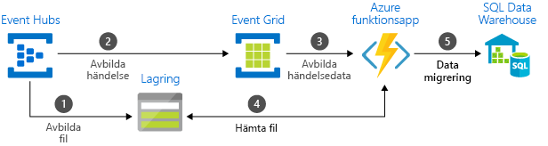

# Välj mellan Azure-tjänster som levererar meddelanden

Azure erbjuder tre tjänster som hjälp med att leverera händelsemeddelanden i en lösning. Dessa tjänster är:

* [Event Grid](/azure/event-grid/)
* [Event Hubs](/azure/event-hubs/)
* [Service Bus](/azure/service-bus-messaging/)

Även om de har vissa likheter är varje tjänst utformad för särskilda scenarier. I den här artikeln beskrivs skillnaderna mellan dessa tjänster, vilket hjälper dig förstå vilken som ska väljas för ditt program. I många fall kompletterar meddelandetjänsterna varandra och kan användas tillsammans.

## Händelser jämfört med meddelandetjänster

Det finns en viktig skillnad mellan tjänster som levererar en händelse och tjänster som levererar ett meddelande.

### Händelse

En händelse är ett enkelt meddelande om ett villkor eller en statusändring. Utgivaren av händelsen har ingen förväntan om hur händelsen ska hanteras. Händelsekonsumenten avgör vad man gör med meddelandet. Händelser kan vara diskreta enheter eller ingå i en serie.

Diskreta händelser rapporterar statusändringar och har handlingsbarhet. För att gå vidare behöver konsumenten endast veta att något hände. Händelsedata innehåller information om vad som har hänt, men har inte de data som utlöste händelsen. Till exempel meddelar en händelse konsumenten att en fil har skapats. De kan innehålla allmän information om filen, men innehåller inte själva filen. Diskreta händelser är idealiska för serverlösa lösningar som behöver vara skalbara.

Seriehändelser rapporterar ett tillstånd och går att analysera. Händelserna är tidssorterade och överlappande. Konsumenten måste ha den sekventiella händelseserien för att kunna analysera vad hände.

### Meddelande

Ett meddelande är rådata som genereras av en tjänst och som ska förbrukas eller lagras någon annanstans. Meddelandet innehåller de data som utlöste meddelandets pipeline. Utgivaren av meddelandet har en förväntan på hur konsumenten ska hantera meddelandet. Det finns ett kontrakt mellan de två sidorna. Utgivaren skickar exempelvis ett meddelande med rådata och förväntar sig att konsumenten skapar en fil från dessa data, samt skickar ett svar när arbetet utförts.

## Jämförelse av tjänster

| Tjänst | Syfte | Typ | När du ska använda detta |
| ------- | ------- | ---- | ----------- |
| Event Grid | Reaktiv programmering | Händelsedistribution (diskret) | Reagera på statusändringar |
| Event Hubs | Pipeline för stordata | Händelseströmning (serie) | Telemetri och distribuerade strömmande data |
| Service Bus | Företagsmeddelanden med högt värde | Meddelande | Orderbearbetning och finansiella transaktioner |

### Event Grid

Event Grid är en händelsebakplan som möjliggör händelsedriven och reaktiv programmering. Den använder en publicera/prenumerera-modell. Utgivarna genererar händelser, men har ingen förväntan på vilka händelser som hanteras. Prenumeranterna bestämmer vilka händelser de vill hantera.

Event Grid är djupt integrerat med Azures tjänster och kan även integreras med tjänster från tredje part. Det förenklar händelsekonsumtionen och sänker kostnaderna genom att eliminera behovet av konstant avsökning. Event Grid dirigerar effektivt och tillförlitligt händelser från resurser, oavsett om de kommer från Azure eller ej. Det distribuerar händelserna till registrerade prenumerantslutpunkter. Händelsemeddelandet innehåller den information du behöver för att kunna reagera på ändringar i tjänster och program. Event Grid är inte en datapipeline och levererar inte själva objektet som uppdaterades.

Den har följande egenskaper:

* dynamiskt skalbart
* låg kostnad
* serverlöst
* leverans minst en gång

### Event Hubs

Azure Event Hubs är en pipeline för stordata. Det underlättar avbildning, kvarhållning och återuppspelning av telemetri och händelsedataströmmar. Datan kan komma från många samtidiga källor. Med Event Hubs kan telemetri och händelsedata göras tillgängliga för en mängd olika tjänster för bearbetning av dataströmmar, infrastrukturer och analyser. Det är tillgängligt som dataströmmar eller paketerade händelsegrupper. Tjänsten innehåller en enskild lösning för snabb datahämtning till realtidsbearbetning, samt upprepad återuppspelning av lagrade rådata. Den kan avbilda strömmande data till en fil för bearbetning och analys.

Den har följande egenskaper:

* låg fördröjning
* kan ta emot och bearbeta miljontals händelser per sekund
* leverans minst en gång

### Service Bus

Service Bus är avsett för traditionella företagsprogram. Dessa företagsprogram kräver transaktioner, sortering, dubblettidentifiering och omedelbar konsekvens. Med Service Bus kan program i molnet tillhandahålla tillförlitlig övergångshantering för tillstånd i affärsprocesser. Om du hanterar viktiga meddelanden som inte får försvinna eller dupliceras, bör du använda Azure Service Bus. Service Bus underlättar också säker kommunikation i hybridmolnlösningar och kan ansluta befintliga lokala system till molnlösningar.

Service Bus är en asynkron meddelandetjänst. Den lagrar meddelanden på ett tillförlitligt sätt i en ”asynkron meddelandekö” tills konsumenten är redo att ta emot meddelandena.

Den har följande egenskaper:

* tillförlitlig asynkron leverans av meddelanden (företagsmeddelanden som en tjänst) som kräver avsökning
* avancerade meddelandefunktioner som FIFO, batchbearbetning/sessioner, transaktioner, obeställbara meddelanden, tidsbaserad kontroll, routning och filtrering, samt dubblettidentifiering
* leverans exakt en gång

## Använda tjänsterna tillsammans

I vissa fall kan du använda tjänsterna sida vid sida för att uppfylla olika roller. En e-handelsplats kan exempelvis använda Service Bus till att bearbeta beställningen, Event Hubs för att samla in telemetri för platsen och Event Grid för att svara på händelser, som t.ex. när ett objekt levererades.

I andra fall kan du koppla ihop dem för att skapa en händelse och datapipeline. Du använder Event Grid till att svara på händelser i de andra tjänsterna. Ett exempel på hur Event Grid används tillsammans med Event Hubs för att migrera data till ett informationslager, finns i [Strömma stordata till ett informationslager](event-grid-event-hubs-integration.md). Följande bild visar arbetsflödet för att strömma datan.

## Nästa steg

* Mer information om Azure-meddelandetjänsterna som finns i blogginlägget [Händelser, datapunkter och meddelanden – Välja rätt Azure-meddelandetjänst för dina data](https://azure.microsoft.com/blog/events-data-points-and-messages-choosing-the-right-azure-messaging-service-for-your-data/).
* En introduktion till Event Grid finns i [Om Event Grid](overview.md).
* Kom igång med Event Grid genom att läsa [Skapa och dirigera anpassade händelser med Azure Event Grid](custom-event-quickstart.md).
* Kom igång med Event Hubs genom att läsa [Skapa ett namnområde för Event Hubs och en händelsehubb med hjälp av Azure Portal](../event-hubs/event-hubs-create.md).
* Kom igång med Service Bus genom att läsa [Skapa ett namnområde för Service Bus med hjälp av Azure Portal](../service-bus-messaging/service-bus-create-namespace-portal.md).
