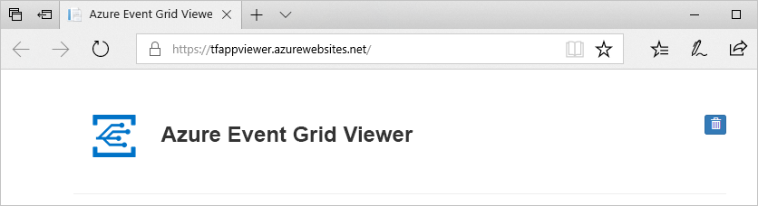

# <a name="build-your-own-disaster-recovery-for-custom-topics-in-event-grid"></a>Skapa din egen haveri beredskap för anpassade ämnen i Event Grid
Haveriberedskap handlar om att återställa från en betydande förlust av programfunktion. Den här självstudien vägleder dig genom hur du konfigurerar din händelsearkitektur för att återställa om Event Grid-tjänsten blir skadad i en viss region.

I den här självstudien lär du dig att skapa aktiv-passiv redundansarkitektur för anpassade ämnen i Event Grid. Du utför redundans genom att spegla dina ämnen och prenumerationer mellan två regioner och hanterar sedan redundans när ett ämne blir skadat. Arkitekturen i den här självstudien redundansväxlar över all ny trafik. Det är viktigt att känna till att händelser som redan är på gång inte återställs i den här konfigurationen förrän den skadade regionen återställs igen.

> [!NOTE]
> Event Grid stöder automatisk geo haveri beredskap (följande geodr) på Server sidan nu. Du kan fortfarande implementera katastrof återställnings logik på klient sidan om du vill ha en större kontroll över redundansväxlingen. Mer information om automatisk följande geodr finns i avsnittet [om geo haveri beredskap på Server sidan i Azure Event Grid](geo-disaster-recovery.md).

## <a name="create-a-message-endpoint"></a>Skapa en slutpunkt för meddelanden

För att testa redundanskonfigurationen behöver du en slutpunkt där du kan ta emot händelser. Slutpunkten ingår inte i redundansinfrastrukturen, men kommer att fungera som händelsehanterare för att göra det enklare att testa.

För att förenkla testningen distribuerar du en [förskapad webbapp](https://github.com/Azure-Samples/azure-event-grid-viewer) som visar händelsemeddelandena. Den distribuerade lösningen innehåller en App Service-plan,en webbapp för App Service och källkod från GitHub.

1. Välj **Deploy to Azure** (Distribuera till Azure) för att distribuera lösningen till din prenumeration. Ange parametervärdena i Azure Portal.

   <a href="https://portal.azure.com/#create/Microsoft.Template/uri/https%3A%2F%2Fraw.githubusercontent.com%2FAzure-Samples%2Fazure-event-grid-viewer%2Fmaster%2Fazuredeploy.json" target="_blank"></a>

1. Det kan ta några minuter att slutföra distributionen. Efter distributionen har slutförts kan du visa webbappen för att kontrollera att den körs. I en webbläsare navigerar du till: `https://<your-site-name>.azurewebsites.net`
Se till att anteckna den här URL:en, eftersom du behöver den senare.

1. Du ser webbplatsen men det har inte publicerats händelser till den än.

   

[!INCLUDE [event-grid-register-provider-portal.md](../../includes/event-grid-register-provider-portal.md)]


## <a name="create-your-primary-and-secondary-topics"></a>Skapa dina primära och sekundära ämnen

Skapa först två Event Grid-ämnen. De här avsnitten fungerar som din primära och sekundära. Som standard flödar dina händelser genom ditt primära ämne. Om det sker ett tjänstavbrott i den primära regionen tar den sekundära över.

1. Logga in på [Azure-portalen](https://portal.azure.com). 

1. Från det övre vänstra hörnet på huvudmenyn i Azure väljer du **Alla tjänster** > sök efter **Event Grid** > välj **Event Grid-ämnen**.

   

    Välj stjärnan intill Event Grid-ämnen för att lägga till det i resursmenyn för enklare åtkomst i framtiden.

1. På menyn Event Grid-ämnen väljer du **+ADD** (+Lägg till) för att skapa ditt primära ämne.

   * Ge ämnet ett logiskt namn och lägg till ”-primärt” som suffix så att det blir enklare att spåra.
   * Det här avsnittets region blir den primära regionen.

     

1. När ämnet har skapats går du till det och kopierar **ämnesslutpunkten**. Du behöver URI senare.

    

1. Hämta åtkomstnyckeln för ämnet. Du behöver även den senare. Klicka på **Åtkomstnycklar** på resursmenyn och kopiera Key 1 (Nyckel 1).

    

1. I bladet Ämne klickar du på **+Event Subscription** (+Händelseprenumeration) för att skapa en prenumeration som ansluter prenumerationen till den händelsemottagarwebbplats som du skapade i förutsättningarna för självstudien.

   * Ge händelseprenumerationen ett logiskt namn och lägg till ”-primärt” som suffix så att den blir enklare att spåra.
   * Välj Endpoint Type Web Hook (Webhook av slutpunktstyp).
   * Ange slutpunkten till din händelsemottagares händelse-URL, som bör se ut ungefär så här: `https://<your-event-reciever>.azurewebsites.net/api/updates`

     

1. Upprepa samma flöde för att skapa ditt sekundära ämne och prenumerationen. Den här gången ersätter du suffixet ”-primärt” med ”-sekundärt” för enklare spårning. Slutligen placerar du det i en annan Azure-region. Du kan placera det var du vill, men det rekommenderas att du använder [länkade Azure-regioner](../best-practices-availability-paired-regions.md). Genom att placera det sekundära ämnet och prenumerationen i en annan region säkerställer du att nya händelser flödar även om den primära regionen slutar fungera.

Du bör nu ha:

   * En händelsemottagarwebbplats för testning.
   * Ett primärt ämne i den primära regionen.
   * En primär händelseprenumeration som ansluter ditt primära ämne till händelsemottagarwebbplatsen.
   * Ett sekundärt avsnitt i den sekundära regionen.
   * En sekundär händelseprenumeration som ansluter ditt primära ämne till händelsemottagarwebbplatsen.

## <a name="implement-client-side-failover"></a>Implementera redundans på klientsidan

Nu när du har konfigurerat ett regionalt redundant par med ämnen och prenumerationer är du redo att implementera redundans på klientsidan. Det finns flera sätt att göra det, men alla implementeringar av redundans har en gemensam funktion: om ett ämne inte längre är felfritt omdirigeras trafik till det andra ämnet.

### <a name="basic-client-side-implementation"></a>Grundläggande implementering på klientsidan

Följande exempel kod är en enkel .NET-utgivare som alltid kommer att försöka publicera till ditt primära ämne först. Om det inte lyckas redundansväxlar den det sekundära ämnet. I båda fallen kontrollerar den även hälso-API för det andra ämnet genom att göra en GET på `https://<topic-name>.<topic-region>.eventgrid.azure.net/api/health`. Ett felfritt ämne bör alltid svara med **200 OK** när en GET görs på slutpunkten **/api/health**.

```csharp
using System;
using System.Net.Http;
using System.Collections.Generic;
using Microsoft.Azure.EventGrid;
using Microsoft.Azure.EventGrid.Models;
using Newtonsoft.Json;

namespace EventGridFailoverPublisher
{
    // This captures the "Data" portion of an EventGridEvent on a custom topic
    class FailoverEventData
    {
        [JsonProperty(PropertyName = "teststatus")]
        public string TestStatus { get; set; }
    }

    class Program
    {
        static void Main(string[] args)
        {
            // TODO: Enter the endpoint each topic. You can find this topic endpoint value
            // in the "Overview" section in the "Event Grid Topics" blade in Azure Portal..
            string primaryTopic = "https://<primary-topic-name>.<primary-topic-region>.eventgrid.azure.net/api/events";
            string secondaryTopic = "https://<secondary-topic-name>.<secondary-topic-region>.eventgrid.azure.net/api/events";

            // TODO: Enter topic key for each topic. You can find this in the "Access Keys" section in the
            // "Event Grid Topics" blade in Azure Portal.
            string primaryTopicKey = "<your-primary-topic-key>";
            string secondaryTopicKey = "<your-secondary-topic-key>";

            string primaryTopicHostname = new Uri( primaryTopic).Host;
            string secondaryTopicHostname = new Uri(secondaryTopic).Host;

            Uri primaryTopicHealthProbe = new Uri("https://" + primaryTopicHostname + "/api/health");
            Uri secondaryTopicHealthProbe = new Uri("https://" + secondaryTopicHostname + "/api/health");

            var httpClient = new HttpClient();

            try
            {
                TopicCredentials topicCredentials = new TopicCredentials(primaryTopicKey);
                EventGridClient client = new EventGridClient(topicCredentials);

                client.PublishEventsAsync(primaryTopicHostname, GetEventsList()).GetAwaiter().GetResult();
                Console.Write("Published events to primary Event Grid topic.");

                HttpResponseMessage health = httpClient.GetAsync(secondaryTopicHealthProbe).Result;
                Console.Write("\n\nSecondary Topic health " + health);
            }
            catch (Microsoft.Rest.Azure.CloudException e)
            {
                TopicCredentials topicCredentials = new TopicCredentials(secondaryTopicKey);
                EventGridClient client = new EventGridClient(topicCredentials);

                client.PublishEventsAsync(secondaryTopicHostname, GetEventsList()).GetAwaiter().GetResult();
                Console.Write("Published events to secondary Event Grid topic. Reason for primary topic failure:\n\n" + e);

                HttpResponseMessage health = httpClient.GetAsync(primaryTopicHealthProbe).Result;
                Console.Write("\n\nPrimary Topic health " + health);
            }

            Console.ReadLine();
        }

        static IList<EventGridEvent> GetEventsList()
        {
            List<EventGridEvent> eventsList = new List<EventGridEvent>();

            for (int i = 0; i < 5; i++)
            {
                eventsList.Add(new EventGridEvent()
                {
                    Id = Guid.NewGuid().ToString(),
                    EventType = "Contoso.Failover.Test",
                    Data = new FailoverEventData()
                    {
                        TestStatus = "success"
                    },
                    EventTime = DateTime.Now,
                    Subject = "test" + i,
                    DataVersion = "2.0"
                });
            }

            return eventsList;
        }
    }
}
```

### <a name="try-it-out"></a>Prova

Nu när du har alla komponenter på plats kan du testa implementeringen av redundans. Kör exemplet ovan i Visual Studio Code eller din favoritmiljö. Ersätt följande fyra värden med slutpunkterna och nycklarna från dina ämnen:

   * primaryTopic – slutpunkten för det primära ämnet.
   * secondaryTopic – slutpunkten för det sekundära ämnet.
   * primaryTopicKey – nyckeln för det primära ämnet.
   * secondaryTopicKey – nyckeln för det sekundära ämnet.

Prova att köra händelseutgivaren. Din testhändelser bör hamna i Event Grid-visningsprogrammet såsom det visas nedan.


För att säkerställa att redundansen fungerar kan du ändra några tecken i det primära ämnets nyckel så att den inte längre är giltig. Prova att köra utgivaren igen. Nya händelser bör visas i Event Grid-visningsprogrammet, men i konsolen bör du se att de nu publiceras via det sekundära ämnet.

### <a name="possible-extensions"></a>Möjliga tillägg

Det finns många sätt att utöka det här exemplet utifrån dina behov. För scenarier med stora volymer kan det vara bra att regelbundet kontrollera ämnet hälso-API oberoende. Om ett ämne slutar fungera behöver du då inte kontrollera det vid varje publicering. När du vet att ett ämne inte är felfritt kan du som standard publicera till det sekundära ämnet.

På samma sätt kan du behöva implementera felåterställningslogik baserat på dina specifika behov. Om publicering till det närmaste datacentret är viktigt för att du ska kunna minska svarstiden kan du regelbundet avsöka hälso-API för ett ämne som har redundansväxlat. När det är felfritt igen vet du att det är säkert att återställning till det närmare datacentret.

## <a name="next-steps"></a>Nästa steg

- Lär dig hur du [tar emot händelser på en http-slutpunkt](./receive-events.md)
- Upptäck hur du [dirigerar händelser till Hybridanslutningar](./custom-event-to-hybrid-connection.md)
- Lär dig om [haveriberedskap med hjälp av Azure DNS och Traffic Manager](../networking/disaster-recovery-dns-traffic-manager.md)
