# <a name="create-and-route-custom-events-with-the-azure-portal-and-event-grid"></a>Skapa och dirigera anpassade händelser med Azure Portal och Event Grid

Azure Event Grid är en händelsetjänst för molnet. I den här artikeln använder du Azure Portal för att skapa ett anpassat ämne, prenumerera på ämnet och utlösa händelsen för att visa resultatet. Du kan skicka händelsen till en Azure-funktion som loggar händelsedata. När du är klar ser du att händelsedata har skickats till en slutpunkt och loggats.

[!INCLUDE [quickstarts-free-trial-note.md](../../includes/quickstarts-free-trial-note.md)]

## <a name="create-a-custom-topic"></a>Skapa en anpassat ämne

Ett event grid-ämne tillhandahåller en användardefinierad slutpunkt där du publicerar dina händelser. 

1. Logga in på [Azure-portalen](https://portal.azure.com/).

1. Om du vill skapa ett anpassat ämne, så välj **Skapa en resurs**. 

   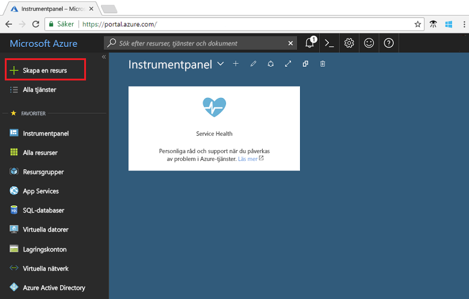

1. Sök efter *Event Grid-ämne* och välj bland de tillgängliga alternativen.

   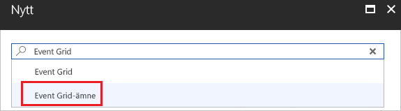

1. Välj **Skapa**.

   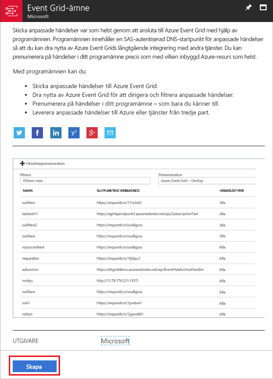

1. Ge det anpassade ämnet ett unikt namn. Ämnesnamnet måste vara unikt eftersom det representeras av en DNS-post. Använd inte det namn som visas på bilden. Skapa ett eget namn istället. Välj en av de [regioner som stöds](overview.md). Ge resursgruppen ett namn. Välj **Skapa**.

   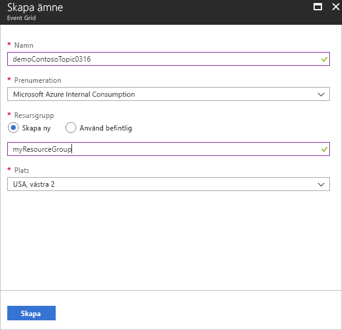

1. När du har skapat det anpassade ämnet visas ett meddelande om detta.

   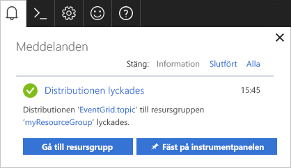

   Om distributionen inte lyckades, så ta reda på vad som orsakade felet. Välj **Distributionen misslyckades**.

   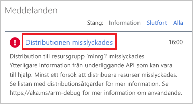

   Välj ett felmeddelande.

   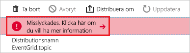

   Följande bild visar en distribution som misslyckades eftersom det anpassade ämnets namn redan används. Om du råkar ut för det här felet, så gör ett nytt försök med ett annat namn.

   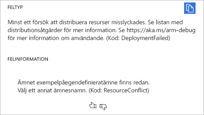

## <a name="create-an-azure-function"></a>Skapa en Azure-funktion

Innan du prenumererar på ämnet ska vi ska slutpunkten för händelsemeddelandet. I den här artikeln använder du Azure Functions för att skapa en funktionsapp för slutpunkten.

1. Om du vill skapa en funktion, så välj **Skapa en resurs**.

   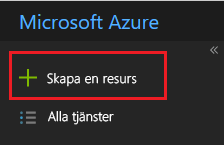

1. Välj **Beräkna** och **Funktionsapp**.

   

1. Ge Azure-funktionen ett unikt namn. Använd inte det namn som visas på bilden. Välj den resursgrupp som du skapade i den här artikeln. Använd **Förbrukningsplan** som värdplan. Använda det föreslagna nya lagringskontot. Du kan stänga av Application Insights. När du har angett värdena, så välj **Skapa**.

   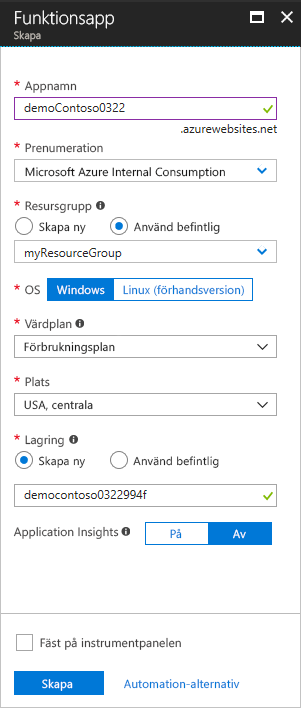

1. När distributionen är klar väljer du **Gå till resurs**.

   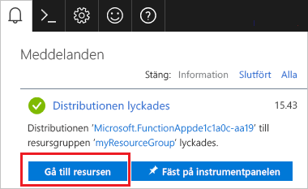

1. Välj **+** bredvid **Funktioner**.

   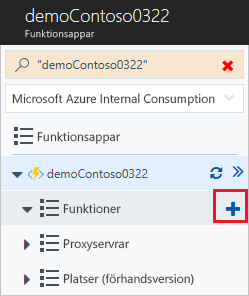

1. Välj **Anpassad funktion** bland de tillgängliga alternativen.

   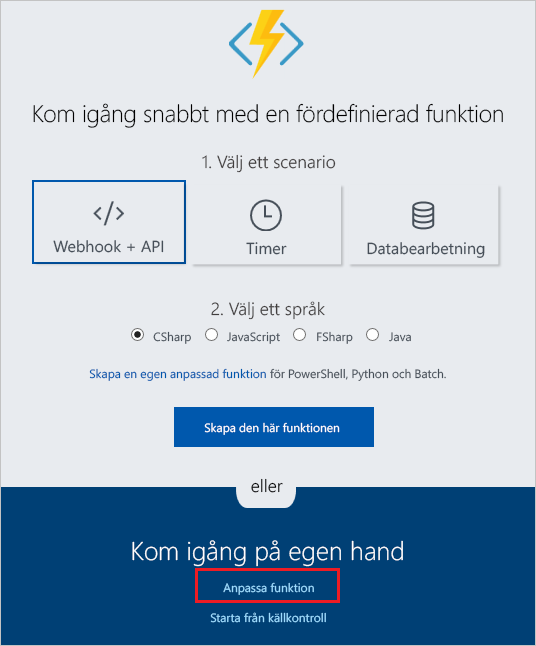

1. Rulla nedåt tills du hittar **Event Grid-utlösare**. Välj **C#**.

   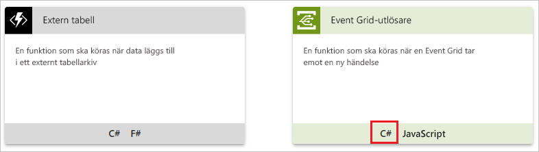

1. Acceptera standardvärdena och välj **Skapa**.

   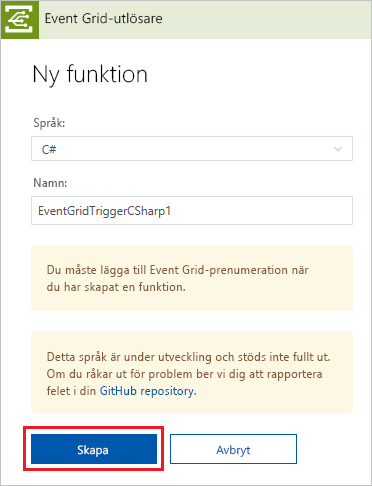

Din funktion kan nu ta emot händelser.

## <a name="subscribe-to-a-topic"></a>Prenumerera på ett ämne

Du prenumererar på ett ämne därför att du vill ange för Event Grid vilka händelser du vill följa och vart du vill skicka händelserna.

1. Välj **Lägg till Event Grid-prenumeration** i din Azure-funktion.

   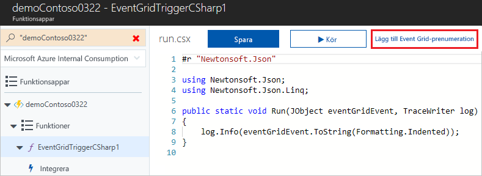

1. Ange värden för prenumerationen. Välj **Event Grid-ämnen** som ämnestyp. När det gäller prenumeration- och resursgrupp, så markera den prenumerations- och resursgrupp där du skapade ditt anpassade ämne. Välj t.ex. ditt anpassade ämnes namn. Prenumerationsslutpunkten fylls automatiskt med funktionens URL.

   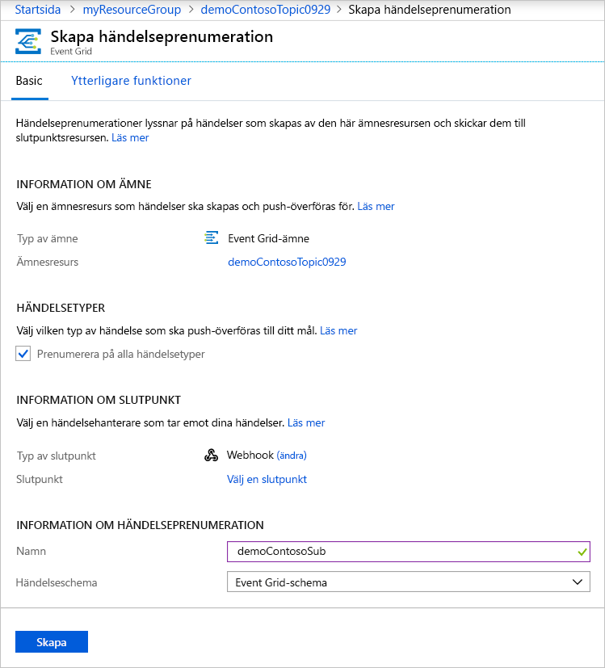

1. Öppna funktionens loggfiler innan händelsen utlöses, så att du kan se händelseinformationen när den skickas. Välj **Loggar** längst ned i Azure-funktionen.

   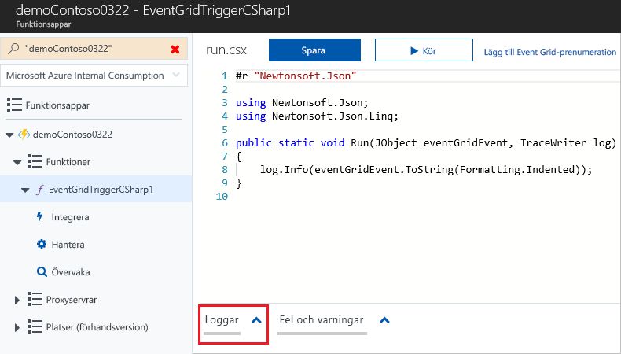

Nu ska vi utlösa en händelse och se hur Event Grid distribuerar meddelandet till slutpunkten. Du kan förenkla den här artikeln genom att skicka exempelhändelsedata till det anpassade ämnet med Cloud Shell. Ett program eller en Azure-tjänst skulle vanligtvis skicka sådana händelsedata.

[!INCLUDE [cloud-shell-try-it.md](../../includes/cloud-shell-try-it.md)]

## <a name="send-an-event-to-your-topic"></a>Skicka en händelse till ditt ämne

Du kan använda antingen Azure CLI eller PowerShell och skicka en testhändelse till det anpassade ämnet.

I det första exemplet används Azure CLI. URL och nyckel för ämnet hämtas, och exempeldata för händelsen. Använd ditt ämnesnamn för `<topic_name>`. Använd `echo "$body"` om du vill se den fullständiga händelsen. Elementet `data` av JSON är händelsens nyttolast. All välformulerad JSON kan stå i det här fältet. Du kan också använda ämnesfältet för avancerad omdirigering och filtrering. CURL är ett verktyg som skickar HTTP-förfrågningar.

```azurecli-interactive
endpoint=$(az eventgrid topic show --name <topic_name> -g myResourceGroup --query "endpoint" --output tsv)
key=$(az eventgrid topic key list --name <topic_name> -g myResourceGroup --query "key1" --output tsv)

body=$(eval echo "'$(curl https://raw.githubusercontent.com/Azure/azure-docs-json-samples/master/event-grid/customevent.json)'")

curl -X POST -H "aeg-sas-key: $key" -d "$body" $endpoint
```

I det andra exemplet används PowerShell för att utföra liknande steg.

```azurepowershell-interactive
$endpoint = (Get-AzureRmEventGridTopic -ResourceGroupName gridResourceGroup -Name <topic-name>).Endpoint
$keys = Get-AzureRmEventGridTopicKey -ResourceGroupName gridResourceGroup -Name <topic-name>

$eventID = Get-Random 99999

#Date format should be SortableDateTimePattern (ISO 8601)
$eventDate = Get-Date -Format s

#Construct body using Hashtable
$htbody = @{
    id= $eventID
    eventType="recordInserted"
    subject="myapp/vehicles/motorcycles"
    eventTime= $eventDate   
    data= @{
        make="Ducati"
        model="Monster"
    }
    dataVersion="1.0"
}

#Use ConvertTo-Json to convert event body from Hashtable to JSON Object
#Append square brackets to the converted JSON payload since they are expected in the event's JSON payload syntax
$body = "["+(ConvertTo-Json $htbody)+"]"

Invoke-WebRequest -Uri $endpoint -Method POST -Body $body -Headers @{"aeg-sas-key" = $keys.Key1}
```

Du har utlöst händelsen och Event Grid skickade meddelandet till den slutpunkt som du konfigurerade när du prenumererade. Titta på loggarna om du vill se händelseinformationen.

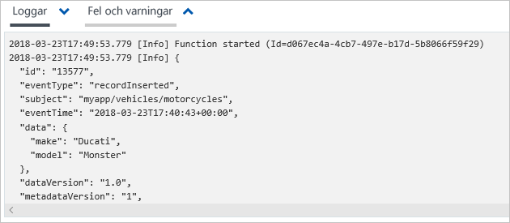

## <a name="clean-up-resources"></a>Rensa resurser

Om du planerar att fortsätta arbeta med den här händelsen ska du inte rensa upp bland de resurser som skapades i den här artikeln. I annat fall tar du bort alla resurser som du har skapat i den här artikeln.

Välj resursgruppen och sedan **Ta bort resursgrupp**.

## <a name="next-steps"></a>Nästa steg

Nu när du vet hur du skapar anpassade ämnen och prenumerationer på händelser kan du läsa mer om vad Event Grid kan hjälpa dig med:

- [Om Event Grid](overview.md)
- [Dirigera Blob Storage-händelser till en anpassad webbslutpunkt](../storage/blobs/storage-blob-event-quickstart.md?toc=%2fazure%2fevent-grid%2ftoc.json)
- [Övervaka ändringar på virtuella maskiner med Azure Event Grid och Logic Apps](monitor-virtual-machine-changes-event-grid-logic-app.md)
- [Strömma stordata till ett datalager](event-grid-event-hubs-integration.md)
