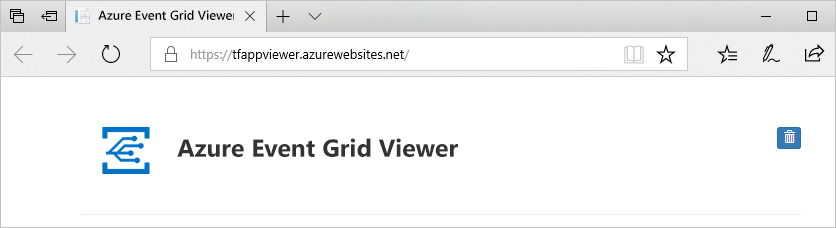

# <a name="quickstart-route-custom-events-to-web-endpoint-with-the-azure-portal-and-event-grid"></a>Snabb start: dirigera anpassade händelser till webb slut punkten med Azure Portal och Event Grid

Azure Event Grid är en händelsetjänst för molnet. I den här artikeln använder du Azure-portalen för att skapa ett anpassat ämne, prenumerera på det anpassade ämnet och utlösa händelsen för att visa resultatet. Normalt kan du skicka händelser till en slutpunkt som bearbetar informationen om händelsen och utför åtgärder. Men för att enkelt beskriva den här artikeln kan skicka du händelser till en webbapp som samlar in och visar meddelanden.

## <a name="prerequisites"></a>Förutsättningar
[!INCLUDE [quickstarts-free-trial-note.md](../../includes/quickstarts-free-trial-note.md)]

[!INCLUDE [event-grid-register-provider-portal.md](../../includes/event-grid-register-provider-portal.md)]

## <a name="create-a-custom-topic"></a>Skapa en anpassat ämne

Ett event grid-ämne tillhandahåller en användardefinierad slutpunkt där du publicerar dina händelser. 

1. Logga in på [Azure Portal](https://portal.azure.com/).
2. I Sök fältet i avsnittet skriver du **Event Grid ämnen** och väljer **Event Grid ämnen** i list rutan. 

    :::image type="content" source="./media/custom-event-quickstart-portal/select-event-grid-topics.png" alt-text="Sök efter och välj Event Grid ämnen":::
3. På sidan **Event Grid ämnen** väljer du **+ Lägg till** i verktygsfältet. 

    :::image type="content" source="./media/custom-event-quickstart-portal/add-event-grid-topic-button.png" alt-text="Knappen Lägg till Event Grid ämne":::
4. Följ dessa steg på sidan **skapa ämne** :
    1. Välj din Azure- **prenumeration**.
    2. Välj en befintlig resurs grupp eller Välj **Skapa ny** och ange ett **namn** för **resurs gruppen**.
    3. Ange ett unikt **namn** för det anpassade ämnet. Ämnesnamnet måste vara unikt eftersom det representeras av en DNS-post. Använd inte det namn som visas på bilden. I stället skapar du ett eget namn som måste bestå av 3–50 tecken och enbart får innehålla a-z, A-Z, 0-9 och ”-”.
    4. Välj en **plats** för Event Grid-ämnet.
    5. Välj **Granska + skapa** längst ned på sidan. 

        :::image type="content" source="./media/custom-event-quickstart-portal/create-custom-topic.png" alt-text="Sidan skapa ämne":::
    6. På fliken **Granska + skapa** på sidan **skapa ämne** väljer du **skapa**. 
    
        :::image type="content" source="./media/custom-event-quickstart-portal/review-create-page.png" alt-text="Granska inställningar och skapa":::
5. När distributionen har slutförts skriver du **Event Grid ämnen** i Sök fältet igen och väljer **Event Grid ämnen** i list rutan som du gjorde tidigare. 
6. Välj det avsnitt som du skapade i listan. 

    :::image type="content" source="./media/custom-event-quickstart-portal/select-event-grid-topic.png" alt-text="Välj ditt ämne i listan":::

7. Du ser sidan **Event Grid ämne** för ditt ämne. Behåll sidan öppen. Du använder det senare i snabb starten. 

    :::image type="content" source="./media/custom-event-quickstart-portal/event-grid-topic-home-page.png" alt-text="Start sida för Event Grid ämne":::

## <a name="create-a-message-endpoint"></a>Skapa en slutpunkt för meddelanden
Innan du skapar en prenumeration för det anpassade ämnet skapar du en slut punkt för händelse meddelandet. Slutpunkten utför vanligtvis åtgärder baserat på informationen om händelsen. För att förenkla den här snabbstarten kan du distribuera en [förskapad webbapp](https://github.com/Azure-Samples/azure-event-grid-viewer) som visar meddelanden om händelser. Den distribuerade lösningen innehåller en App Service-plan,en webbapp för App Service och källkod från GitHub.

1. På sidan artikel väljer du **distribuera till Azure** för att distribuera lösningen till din prenumeration. Ange parametervärdena i Azure Portal.

   <a href="https://portal.azure.com/#create/Microsoft.Template/uri/https%3A%2F%2Fraw.githubusercontent.com%2FAzure-Samples%2Fazure-event-grid-viewer%2Fmaster%2Fazuredeploy.json" target="_blank"></a>
1. Det kan ta några minuter att slutföra distributionen. Efter distributionen har slutförts kan du visa webbappen för att kontrollera att den körs. I en webbläsare navigerar du till: `https://<your-site-name>.azurewebsites.net`

    Om distributionen Miss lyckas, kontrol lera fel meddelandet. Det kan bero på att webbplats namnet redan är upptaget. Distribuera mallen igen och välj ett annat namn för platsen. 
1. Du ser webbplatsen men det har inte publicerats händelser till den än.

   

## <a name="subscribe-to-custom-topic"></a>Prenumerera på anpassat ämne

Du prenumererar på ett Event Grid-ämne därför att du vill ange för Event Grid vilka händelser du vill följa och vart du vill skicka händelserna.

1. På sidan **Event Grid ämne** för ditt anpassade ämne väljer du **+ händelse prenumeration** i verktygsfältet.

    :::image type="content" source="./media/custom-event-quickstart-portal/new-event-subscription.png" alt-text="Knappen Lägg till händelse prenumeration":::
2. Följ dessa steg på sidan **Skapa händelse prenumeration** :
    1. Ange ett **namn** för händelse prenumerationen.
    3. Välj **Web Hook** som **typ av slut punkt**. 
    4. Välj **Välj en slut punkt**. 

        :::image type="content" source="./media/custom-event-quickstart-portal/provide-subscription-values.png" alt-text="Ange värden för händelseprenumerationen":::
    5. För webhookens slutpunkt anger du webbappens webbadress och lägger till `api/updates` till startsidans webbadress. Välj **Bekräfta val**.

        :::image type="content" source="./media/custom-event-quickstart-portal/provide-endpoint.png" alt-text="Ange slutpunktens webbadress":::
    6. Gå tillbaka till sidan **Skapa händelse prenumeration** och välj **skapa**.

3. Visa ditt webbprogram igen och observera att en händelse för verifieringen av prenumerationen har skickats till den. Välj ögonikonen för att utöka informationen om händelsen. Händelserutnätet skickar valideringshändelsen så att slutpunkten kan bekräfta att den vill ta emot händelsedata. Webbappen inkluderar kod för att verifiera prenumerationen.

    

## <a name="send-an-event-to-your-topic"></a>Skicka en händelse till ditt ämne

Nu ska vi utlösa en händelse och se hur Event Grid distribuerar meddelandet till slutpunkten. Du kan använda antingen Azure CLI eller PowerShell och skicka en testhändelse till det anpassade ämnet. Ett program eller en Azure-tjänst skulle vanligtvis skicka sådana händelsedata.

I det första exemplet används Azure CLI. URL och nyckel för det anpassade ämnet hämtas, och exempeldata för händelsen. Använd ditt anpassade ämnesnamn för `<topic name>`. Exempelhändelsedata skapas. Elementet `data` av JSON är händelsens nyttolast. All välformulerad JSON kan stå i det här fältet. Du kan också använda ämnesfältet för avancerad omdirigering och filtrering. CURL är ett verktyg som skickar HTTP-förfrågningar.


### <a name="azure-cli"></a>Azure CLI
1. I Azure Portal väljer du **Cloud Shell**. Cloud Shell öppnas i den nedre rutan i webbläsaren. 

    :::image type="content" source="./media/custom-event-quickstart-portal/select-cloud-shell.png" alt-text="Välj Cloud Shell ikon":::
1. Välj **bash** i det övre vänstra hörnet i Cloud Shells fönstret. 

    
1. Kör följande kommando för att hämta **slut punkten** för ämnet: när du har kopierat och klistrat in kommandot uppdaterar du **ämnes namnet** och **resurs gruppens namn** innan du kör kommandot. Du kommer att publicera exempel händelser till den här avsnitts slut punkten. 

    ```azurecli
    endpoint=$(az eventgrid topic show --name <topic name> -g <resource group name> --query "endpoint" --output tsv)
    ```
2. Kör följande kommando för att hämta **nyckeln** för det anpassade ämnet: när du har kopierat och klistrat in kommandot uppdaterar du **ämnes namnet** och **resurs gruppens** namn innan du kör kommandot. Det här är den primära nyckeln i Event Grid ämnet. Om du vill hämta den här nyckeln från Azure Portal växlar du till fliken **åtkomst nycklar** på **ämnes** sidan för Event Grid. För att kunna publicera en händelse i ett anpassat ämne behöver du åtkomst nyckeln. 

    ```azurecli
    key=$(az eventgrid topic key list --name <topic name> -g <resource group name> --query "key1" --output tsv)
    ```
3. Kopiera följande instruktion med händelse definitionen och tryck på **RETUR**. 

    ```json
    event='[ {"id": "'"$RANDOM"'", "eventType": "recordInserted", "subject": "myapp/vehicles/motorcycles", "eventTime": "'`date +%Y-%m-%dT%H:%M:%S%z`'", "data":{ "make": "Ducati", "model": "Monster"},"dataVersion": "1.0"} ]'
    ```
4. Kör följande **spiral** kommando för att publicera händelsen: i kommandot `aeg-sas-key` är sidhuvudet inställt på den åtkomst nyckel du fick tidigare. 

    ```
    curl -X POST -H "aeg-sas-key: $key" -d "$event" $endpoint
    ```

### <a name="azure-powershell"></a>Azure PowerShell
I det andra exemplet används PowerShell för att utföra liknande steg.

1. I Azure Portal väljer du **Cloud Shell** (du kan också gå till `https://shell.azure.com/` ). Cloud Shell öppnas i den nedre rutan i webbläsaren. 

    :::image type="content" source="./media/custom-event-quickstart-portal/select-cloud-shell.png" alt-text="Välj Cloud Shell ikon":::
1. I **Cloud Shell** väljer du **PowerShell** i det övre vänstra hörnet i Cloud Shells fönstret. Se exemplet på **Cloud Shell** fönstret i Azure CLI-avsnittet.
2. Ange följande variabler. När du har kopierat och klistrat in varje kommando uppdaterar du **ämnes namnet** och **resurs gruppens namn** innan du kör kommandot:

    **Resurs grupp**:
    ```powershell
    $resourceGroupName = "<resource group name>"
    ```

    **Event Grid ämnes namn**:    
    ```powershell
    $topicName = "<topic name>"
    ```
3. Kör följande kommandon för att hämta **slut punkten** och **nycklarna** för ämnet:

    ```powershell
    $endpoint = (Get-AzEventGridTopic -ResourceGroupName $resourceGroupName -Name $topicName).Endpoint
    $keys = Get-AzEventGridTopicKey -ResourceGroupName $resourceGroupName -Name $topicName
    ```
4. Förbered händelsen. Kopiera och kör instruktionerna i fönstret Cloud Shell. 

    ```powershell
    $eventID = Get-Random 99999

    #Date format should be SortableDateTimePattern (ISO 8601)
    $eventDate = Get-Date -Format s

    #Construct body using Hashtable
    $htbody = @{
        id= $eventID
        eventType="recordInserted"
        subject="myapp/vehicles/motorcycles"
        eventTime= $eventDate   
        data= @{
            make="Ducati"
            model="Monster"
        }
        dataVersion="1.0"
    }
    
    #Use ConvertTo-Json to convert event body from Hashtable to JSON Object
    #Append square brackets to the converted JSON payload since they are expected in the event's JSON payload syntax
    $body = "["+(ConvertTo-Json $htbody)+"]"
    ```
5. Använd cmdleten **Invoke-WebRequest** för att skicka händelsen. 

    ```powershell
    Invoke-WebRequest -Uri $endpoint -Method POST -Body $body -Headers @{"aeg-sas-key" = $keys.Key1}
    ```

### <a name="verify-in-the-event-grid-viewer"></a>Verifiera i Event Grid Viewer
Du har utlöst händelsen och Event Grid skickade meddelandet till den slutpunkt som du konfigurerade när du prenumererade. Visa din webbapp om du vill se händelsen som du har skickat.

:::image type="content" source="./media/custom-event-quickstart-portal/event-grid-viewer-end.png" alt-text="Event Grid Viewer":::

## <a name="clean-up-resources"></a>Rensa resurser
Om du planerar att fortsätta arbeta med den här händelsen ska du inte rensa upp bland de resurser som skapades i den här artikeln. I annat fall tar du bort alla resurser som du har skapat i den här artikeln.

1. Välj **resurs grupper** på den vänstra menyn. Om du inte ser det på den vänstra menyn väljer du **alla tjänster** i den vänstra menyn och väljer **resurs grupper**. 

    
1. Välj den resurs grupp där du vill starta sidan **resurs grupp** . 
1. Välj **ta bort resurs grupp** i verktygsfältet. 
1. Bekräfta borttagningen genom att ange namnet på resurs gruppen och välj **ta bort**. 

    Den andra resurs gruppen som visas i avbildningen har skapats och används av Cloud Shells fönstret. Ta bort det om du inte planerar att använda fönstret Cloud Shell senare. 

## <a name="next-steps"></a>Nästa steg

Nu när du vet hur du skapar anpassade ämnen och prenumerationer på händelser kan du läsa mer om vad Event Grid kan hjälpa dig med:

- [Om Event Grid](overview.md)
- [Dirigera Blob Storage-händelser till en anpassad webbslutpunkt](../storage/blobs/storage-blob-event-quickstart.md?toc=%2fazure%2fevent-grid%2ftoc.json)
- [Övervaka ändringar på virtuella maskiner med Azure Event Grid och Logic Apps](monitor-virtual-machine-changes-event-grid-logic-app.md)
- [Strömma stordata till ett datalager](event-grid-event-hubs-integration.md)
