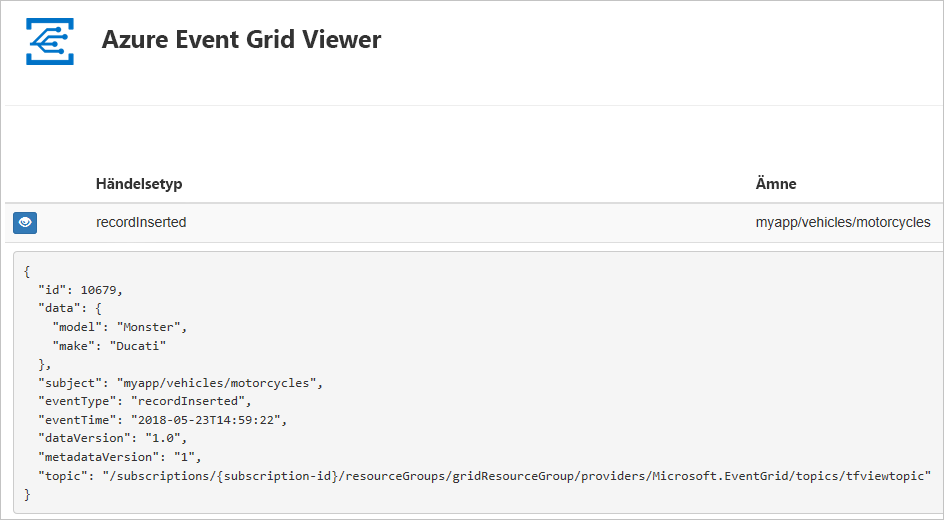
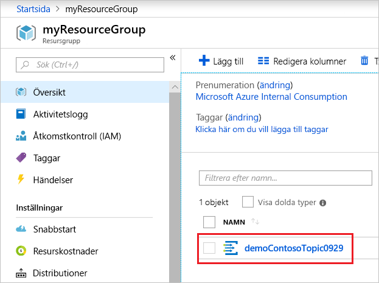
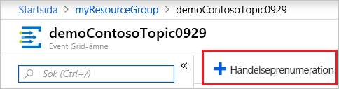
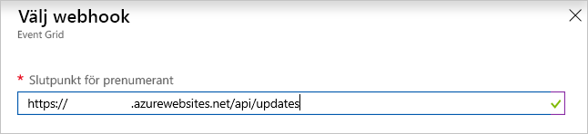

# <a name="quickstart-route-custom-events-to-web-endpoint-with-the-azure-portal-and-event-grid"></a>Snabbstart: Dirigera anpassade händelser till en webbslutpunkt med Azure Portal och Event Grid

Azure Event Grid är en händelsetjänst för molnet. I den här artikeln använder du Azure-portalen för att skapa ett anpassat ämne, prenumerera på det anpassade ämnet och utlösa händelsen för att visa resultatet. Normalt kan du skicka händelser till en slutpunkt som bearbetar informationen om händelsen och utför åtgärder. Men för att enkelt beskriva den här artikeln kan skicka du händelser till en webbapp som samlar in och visar meddelanden.

När du är klar kan se du att händelsedata som har skickats till webbappen.



[!INCLUDE [quickstarts-free-trial-note.md](../../includes/quickstarts-free-trial-note.md)]

[!INCLUDE [event-grid-register-provider-portal.md](../../includes/event-grid-register-provider-portal.md)]

## <a name="create-a-custom-topic"></a>Skapa en anpassat ämne

Ett event grid-ämne tillhandahåller en användardefinierad slutpunkt där du publicerar dina händelser. 

1. Logga in på [Azure-portalen](https://portal.azure.com/).

1. Om du vill skapa ett anpassat ämne, så välj **Skapa en resurs**. 

   

1. Sök efter *Event Grid-ämne* och välj bland de tillgängliga alternativen.

   

1. Välj **Skapa**.

   

1. Ge det anpassade ämnet ett unikt namn. Ämnesnamnet måste vara unikt eftersom det representeras av en DNS-post. Använd inte det namn som visas på bilden. I stället skapar du ett eget namn som måste bestå av 3–50 tecken och enbart får innehålla a-z, A-Z, 0-9 och ”-”. Ge resursgruppen ett namn. Välj **Skapa**.

   

1. När du har skapat det anpassade ämnet visas ett meddelande om detta.

   

   Om distributionen inte lyckades, så ta reda på vad som orsakade felet. Välj **Distributionen misslyckades**.

   

   Välj ett felmeddelande.

   

   Följande bild visar en distribution som misslyckades eftersom det anpassade ämnets namn redan används. Om du råkar ut för det här felet, så gör ett nytt försök med ett annat namn.

   

## <a name="create-a-message-endpoint"></a>Skapa en slutpunkt för meddelanden

Innan du prenumererar på det anpassade ämnet ska vi ska slutpunkten för händelsemeddelandet. Slutpunkten utför vanligtvis åtgärder baserat på informationen om händelsen. För att förenkla den här snabbstarten kan du distribuera en [förskapad webbapp](https://github.com/Azure-Samples/azure-event-grid-viewer) som visar meddelanden om händelser. Den distribuerade lösningen innehåller en App Service-plan,en webbapp för App Service och källkod från GitHub.

1. Välj **Deploy to Azure** (Distribuera till Azure) för att distribuera lösningen till din prenumeration. Ange parametervärdena i Azure Portal.

   <a href="https://portal.azure.com/#create/Microsoft.Template/uri/https%3A%2F%2Fraw.githubusercontent.com%2FAzure-Samples%2Fazure-event-grid-viewer%2Fmaster%2Fazuredeploy.json" target="_blank"></a>

1. Det kan ta några minuter att slutföra distributionen. Efter distributionen har slutförts kan du visa webbappen för att kontrollera att den körs. I en webbläsare navigerar du till: `https://<your-site-name>.azurewebsites.net`

1. Du ser webbplatsen men det har inte publicerats händelser till den än.

   

## <a name="subscribe-to-custom-topic"></a>Prenumerera på anpassat ämne

Du prenumererar på ett Event Grid-ämne därför att du vill ange för Event Grid vilka händelser du vill följa och vart du vill skicka händelserna.

1. Välj det anpassade ämnet i portalen.

   

1. Välj **+ Händelseprenumeration**.

   

1. Välj **Webhook** som typ av slutpunkt. Ange ett namn för händelseprenumerationen.

   

1. Välj **Välj en slutpunkt**. 

1. För webhookens slutpunkt anger du webbappens webbadress och lägger till `api/updates` till startsidans webbadress. Välj **Bekräfta val**.

   

1. När du är klar att tillhandahålla händelseprenumerationens värden väljer du **Skapa**.

Visa ditt webbprogram igen och observera att en händelse för verifieringen av prenumerationen har skickats till den. Välj ögonikonen för att utöka informationen om händelsen. Händelserutnätet skickar valideringshändelsen så att slutpunkten kan bekräfta att den vill ta emot händelsedata. Webbappen inkluderar kod för att verifiera prenumerationen.


## <a name="send-an-event-to-your-topic"></a>Skicka en händelse till ditt ämne

Nu ska vi utlösa en händelse och se hur Event Grid distribuerar meddelandet till slutpunkten. Du kan använda antingen Azure CLI eller PowerShell och skicka en testhändelse till det anpassade ämnet. Ett program eller en Azure-tjänst skulle vanligtvis skicka sådana händelsedata.

I det första exemplet används Azure CLI. URL och nyckel för det anpassade ämnet hämtas, och exempeldata för händelsen. Använd ditt anpassade ämnesnamn för `<topic_name>`. Exempelhändelsedata skapas. Elementet `data` av JSON är händelsens nyttolast. All välformulerad JSON kan stå i det här fältet. Du kan också använda ämnesfältet för avancerad omdirigering och filtrering. CURL är ett verktyg som skickar HTTP-förfrågningar.

```azurecli-interactive
endpoint=$(az eventgrid topic show --name <topic_name> -g myResourceGroup --query "endpoint" --output tsv)
key=$(az eventgrid topic key list --name <topic_name> -g myResourceGroup --query "key1" --output tsv)

event='[ {"id": "'"$RANDOM"'", "eventType": "recordInserted", "subject": "myapp/vehicles/motorcycles", "eventTime": "'`date +%Y-%m-%dT%H:%M:%S%z`'", "data":{ "make": "Ducati", "model": "Monster"},"dataVersion": "1.0"} ]'

curl -X POST -H "aeg-sas-key: $key" -d "$event" $endpoint
```

I det andra exemplet används PowerShell för att utföra liknande steg.

```azurepowershell-interactive
$endpoint = (Get-AzureRmEventGridTopic -ResourceGroupName gridResourceGroup -Name <topic-name>).Endpoint
$keys = Get-AzureRmEventGridTopicKey -ResourceGroupName gridResourceGroup -Name <topic-name>

$eventID = Get-Random 99999

#Date format should be SortableDateTimePattern (ISO 8601)
$eventDate = Get-Date -Format s

#Construct body using Hashtable
$htbody = @{
    id= $eventID
    eventType="recordInserted"
    subject="myapp/vehicles/motorcycles"
    eventTime= $eventDate   
    data= @{
        make="Ducati"
        model="Monster"
    }
    dataVersion="1.0"
}

#Use ConvertTo-Json to convert event body from Hashtable to JSON Object
#Append square brackets to the converted JSON payload since they are expected in the event's JSON payload syntax
$body = "["+(ConvertTo-Json $htbody)+"]"

Invoke-WebRequest -Uri $endpoint -Method POST -Body $body -Headers @{"aeg-sas-key" = $keys.Key1}
```

Du har utlöst händelsen och Event Grid skickade meddelandet till den slutpunkt som du konfigurerade när du prenumererade. Visa din webbapp om du vill se händelsen som du har skickat.

```json
[{
  "id": "1807",
  "eventType": "recordInserted",
  "subject": "myapp/vehicles/motorcycles",
  "eventTime": "2017-08-10T21:03:07+00:00",
  "data": {
    "make": "Ducati",
    "model": "Monster"
  },
  "dataVersion": "1.0",
  "metadataVersion": "1",
  "topic": "/subscriptions/{subscription-id}/resourceGroups/{resource-group}/providers/Microsoft.EventGrid/topics/{topic}"
}]
```


## <a name="clean-up-resources"></a>Rensa resurser

Om du planerar att fortsätta arbeta med den här händelsen ska du inte rensa upp bland de resurser som skapades i den här artikeln. I annat fall tar du bort alla resurser som du har skapat i den här artikeln.

Välj resursgruppen och sedan **Ta bort resursgrupp**.

## <a name="next-steps"></a>Nästa steg

Nu när du vet hur du skapar anpassade ämnen och prenumerationer på händelser kan du läsa mer om vad Event Grid kan hjälpa dig med:

- [Om Event Grid](overview.md)
- [Dirigera Blob Storage-händelser till en anpassad webbslutpunkt](../storage/blobs/storage-blob-event-quickstart.md?toc=%2fazure%2fevent-grid%2ftoc.json)
- [Övervaka ändringar på virtuella maskiner med Azure Event Grid och Logic Apps](monitor-virtual-machine-changes-event-grid-logic-app.md)
- [Strömma stordata till ett datalager](event-grid-event-hubs-integration.md)
