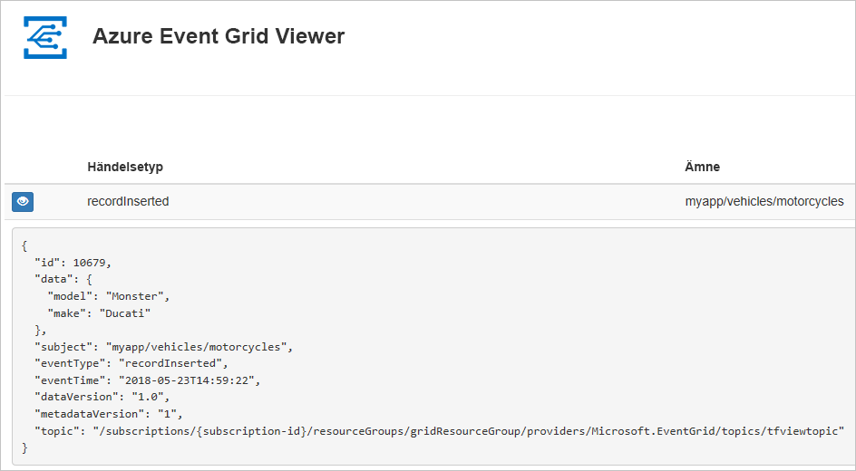
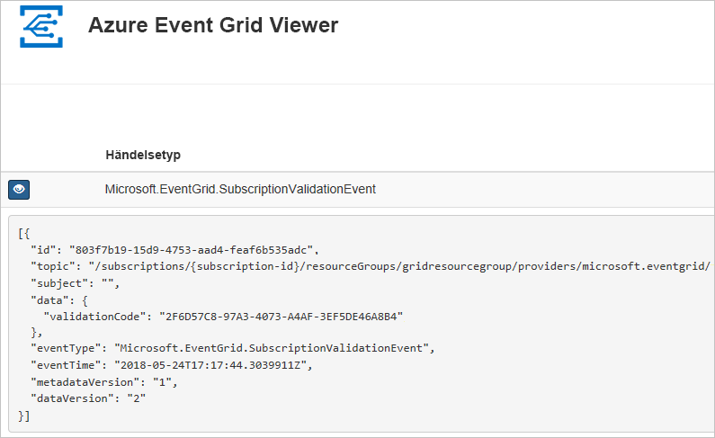

# <a name="create-and-route-custom-events-with-azure-powershell-and-event-grid"></a>Skapa och dirigera anpassade händelser med Azure PowerShell och Event Grid

Azure Event Grid är en händelsetjänst för molnet. I den här artikeln använder du Azure PowerShell för att skapa ett anpassat ämne, prenumerera på ämnet och utlösa händelsen för att visa resultatet. Normalt kan du skicka händelser till en slutpunkt som bearbetar informationen om händelsen och utför åtgärder. Men för att enkelt beskriva den här artikeln kan skicka du händelser till en webbapp som samlar in och visar meddelanden.

När du är klar kan se du att händelsedata som har skickats till webbappen.



[!INCLUDE [quickstarts-free-trial-note.md](../../includes/quickstarts-free-trial-note.md)]

Den här artikeln kräver att du kör den senaste versionen av Azure PowerShell. Om du behöver installera eller uppgradera kan du läsa [Installera och konfigurera Azure PowerShell](/powershell/azure/install-azurerm-ps).

## <a name="create-a-resource-group"></a>Skapa en resursgrupp

Event Grid-ämnen är Azure-resurser och måste placeras i en Azure-resursgrupp. Resursgruppen är en logisk samling där Azure-resurser distribueras och hanteras.

Skapa en resursgrupp med kommandot [New-AzureRmResourceGroup](/powershell/module/azurerm.resources/new-azurermresourcegroup).

I följande exempel skapas en resursgrupp med namnet *gridResourceGroup* på platsen *westus2*.

```powershell-interactive
New-AzureRmResourceGroup -Name gridResourceGroup -Location westus2
```

[!INCLUDE [event-grid-register-provider-powershell.md](../../includes/event-grid-register-provider-powershell.md)]

## <a name="create-a-custom-topic"></a>Skapa en anpassat ämne

Ett event grid-ämne tillhandahåller en användardefinierad slutpunkt där du publicerar dina händelser. I följande exempel skapas det anpassade ämnet i din resursgrupp. Ersätt `<your-topic-name>` med ett unikt namn för ditt ämne. Ämnesnamnet måste vara unikt eftersom det är en del av DNS-posten.

```powershell-interactive
$topicname="<your-topic-name>"

New-AzureRmEventGridTopic -ResourceGroupName gridResourceGroup -Location westus2 -Name $topicname
```

## <a name="create-a-message-endpoint"></a>Skapa en slutpunkt för meddelanden

Innan du prenumererar på ämnet ska vi ska slutpunkten för händelsemeddelandet. Slutpunkten utför vanligtvis åtgärder baserat på informationen om händelsen. För att förenkla den här snabbstarten kan du distribuera en [förskapad webbapp](https://github.com/Azure-Samples/azure-event-grid-viewer) som visar meddelanden om händelser. Den distribuerade lösningen innehåller en App Service-plan,en webbapp för App Service och källkod från GitHub.

Ersätt `<your-site-name>` med ett unikt namn för din webbapp. Webbappnamnet måste vara unikt eftersom det är en del av DNS-posten.

```powershell-interactive
$sitename="<your-site-name>"

New-AzureRmResourceGroupDeployment `
  -ResourceGroupName gridResourceGroup `
  -TemplateUri "https://raw.githubusercontent.com/Azure-Samples/azure-event-grid-viewer/master/azuredeploy.json" `
  -siteName $sitename `
  -hostingPlanName viewerhost
```

Det kan ta några minuter att slutföra distributionen. Efter distributionen har slutförts kan du visa webbappen för att kontrollera att den körs. I en webbläsare navigerar du till: `https://<your-site-name>.azurewebsites.net`

Webbplatsen bör visas utan några meddelanden.

## <a name="subscribe-to-a-topic"></a>Prenumerera på ett ämne

Du prenumererar på ett ämne därför att du vill ange för Event Grid vilka händelser du vill följa och vart du vill skicka händelserna. I följande exempel prenumererar vi på det ämne du just skapat, och URL från din webbapp skickas som slutpunkt för händelseavisering.

Slutpunkten för ditt webbprogram måste innehålla suffixet `/api/updates/`.

```powershell-interactive
$endpoint="https://$sitename.azurewebsites.net/api/updates"

New-AzureRmEventGridSubscription `
  -EventSubscriptionName demoViewerSub `
  -Endpoint $endpoint `
  -ResourceGroupName gridResourceGroup `
  -TopicName $topicname
```

Visa ditt webbprogram igen och observera att en händelse för verifieringen av prenumerationen har skickats till den. Välj ögonikonen för att utöka informationen om händelsen. Händelserutnätet skickar valideringshändelsen så att slutpunkten kan bekräfta att den vill ta emot händelsedata. Webbappen inkluderar kod för att verifiera prenumerationen.



## <a name="send-an-event-to-your-topic"></a>Skicka en händelse till ditt ämne

Nu ska vi utlösa en händelse och se hur Event Grid distribuerar meddelandet till slutpunkten. Först måste vi ta fram URL och nyckel för ämnet.

```powershell-interactive
$endpoint = (Get-AzureRmEventGridTopic -ResourceGroupName gridResourceGroup -Name $topicname).Endpoint
$keys = Get-AzureRmEventGridTopicKey -ResourceGroupName gridResourceGroup -Name $topicname
```

Låt oss skapa exempelhändelsedata att skicka till det anpassade ämnet för att förenkla den här artikeln. Ett program eller en Azure-tjänst skulle vanligtvis skicka sådana händelsedata. I följande exempel används en Hashtable för att konstruera händelsedata `htbody` som sedan konverteras till korrekt JSON-nyttolastobjekt `$body`:

```powershell-interactive
$eventID = Get-Random 99999

#Date format should be SortableDateTimePattern (ISO 8601)
$eventDate = Get-Date -Format s

#Construct body using Hashtable
$htbody = @{
    id= $eventID
    eventType="recordInserted"
    subject="myapp/vehicles/motorcycles"
    eventTime= $eventDate   
    data= @{
        make="Ducati"
        model="Monster"
    }
    dataVersion="1.0"
}

#Use ConvertTo-Json to convert event body from Hashtable to JSON Object
#Append square brackets to the converted JSON payload since they are expected in the event's JSON payload syntax
$body = "["+(ConvertTo-Json $htbody)+"]"
```

Om `$body` visas så ser du den fullständiga händelsen. Elementet `data` av JSON är händelsens nyttolast. All välformulerad JSON kan stå i det här fältet. Du kan också använda ämnesfältet för avancerad omdirigering och filtrering.

Skicka nu händelsen till ditt ämne.

```powershell-interactive
Invoke-WebRequest -Uri $endpoint -Method POST -Body $body -Headers @{"aeg-sas-key" = $keys.Key1}
```

Du har utlöst händelsen och Event Grid skickade meddelandet till den slutpunkt som du konfigurerade när du prenumererade. Visa din webbapp om du vill se händelsen som du har skickat.

```json
[{
  "id": "1807",
  "eventType": "recordInserted",
  "subject": "myapp/vehicles/motorcycles",
  "eventTime": "2018-01-25T15:58:13",
  "data": {
    "make": "Ducati",
    "model": "Monster"
  },
  "dataVersion": "1.0",
  "metadataVersion": "1",
  "topic": "/subscriptions/{subscription-id}/resourceGroups/{resource-group}/providers/Microsoft.EventGrid/topics/{topic}"
}]
```

## <a name="clean-up-resources"></a>Rensa resurser

Om du planerar att fortsätta arbeta med den här händelsen eller händelsevisningsappen ska du inte rensa upp bland de resurser som skapades i den här artikeln. I annat fall kan du använda kommandona nedan för att ta bort alla resurser som har skapats i den här artikeln.

```powershell
Remove-AzureRmResourceGroup -Name gridResourceGroup
```

## <a name="next-steps"></a>Nästa steg

Nu när du vet hur du skapar ämnen och prenumerationer på händelser kan du läsa mer om vad Event Grid kan hjälpa dig med:

- [Om Event Grid](overview.md)
- [Dirigera Blob Storage-händelser till en anpassad webbslutpunkt](../storage/blobs/storage-blob-event-quickstart.md?toc=%2fazure%2fevent-grid%2ftoc.json)
- [Övervaka ändringar på virtuella maskiner med Azure Event Grid och Logic Apps](monitor-virtual-machine-changes-event-grid-logic-app.md)
- [Strömma stordata till ett datalager](event-grid-event-hubs-integration.md)
