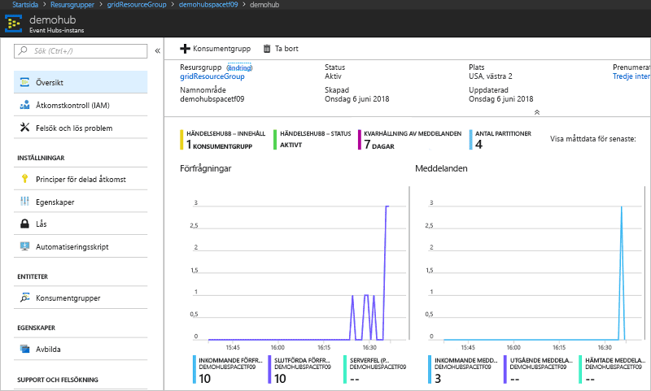

# <a name="route-custom-events-to-azure-event-hubs-with-azure-cli-and-event-grid"></a>Dirigera anpassade händelser till Azure Queue Storage med Azure CLI och Event Grid

Azure Event Grid är en händelsetjänst för molnet. Azure Event Hubs är en av de händelsehanterare som stöds. I den här artikeln använder du Azure CLI för att skapa ett anpassat ämne, prenumerera på det anpassade ämnet och utlösa händelsen för att visa resultatet. Skicka händelser till en händelsehubb.

[!INCLUDE [quickstarts-free-trial-note.md](../../includes/quickstarts-free-trial-note.md)]

## <a name="create-a-resource-group"></a>Skapa en resursgrupp

Event Grid-ämnen är Azure-resurser och måste placeras i en Azure-resursgrupp. Resursgruppen är en logisk samling där Azure-resurser distribueras och hanteras.

Skapa en resursgrupp med kommandot [az group create](/cli/azure/group#az-group-create). 

I följande exempel skapas en resursgrupp med namnet *gridResourceGroup* på platsen *westus2*.

```azurecli-interactive
az group create --name gridResourceGroup --location westus2
```

[!INCLUDE [event-grid-register-provider-cli.md](../../includes/event-grid-register-provider-cli.md)]

## <a name="create-a-custom-topic"></a>Skapa en anpassat ämne

Ett event grid-ämne tillhandahåller en användardefinierad slutpunkt där du publicerar dina händelser. I följande exempel skapas det anpassade ämnet i din resursgrupp. Ersätt `<your-topic-name>` med ett unikt namn för ditt anpassade ämne. Namnet på det anpassade ämnet måste vara unikt eftersom det representeras av en DNS-post.

```azurecli-interactive
topicname=<your-topic-name>
az eventgrid topic create --name $topicname -l westus2 -g gridResourceGroup
```

## <a name="create-event-hub"></a>Skapa händelsehubb

Innan du prenumererar på det anpassade ämnet ska vi ska slutpunkten för händelsemeddelandet. Du skapar en händelsehubb för att samla in händelserna.

```azurecli-interactive
namespace=<unique-namespace-name>
hubname=demohub

az eventhubs namespace create --name $namespace --resource-group gridResourceGroup
az eventhubs eventhub create --name $hubname --namespace-name $namespace --resource-group gridResourceGroup
```

## <a name="subscribe-to-a-custom-topic"></a>Prenumerera på ett anpassat ämne

Du prenumererar på ett Event Grid-ämne för att ange för Event Grid vilka händelser du vill följa. Följande exempel prenumererar på det anpassat ämne som du skapade och skickar resurs-ID för händelsehubben för slutpunkten. Slutpunkten är i formatet:

`/subscriptions/<subscription-id>/resourceGroups/<resource-group-name>/providers/Microsoft.EventHub/namespaces/<namespace-name>/eventhubs/<hub-name>`

Följande skript hämtar resurs-ID för händelsehubben och prenumererar på ett avsnitt i händelserutnätet. Det ställer in slutpunktstypen på `eventhub` och använder händelsehubb-ID:t för slutpunkten.

```azurecli-interactive
hubid=$(az eventhubs eventhub show --name $hubname --namespace-name $namespace --resource-group gridResourceGroup --query id --output tsv)

az eventgrid event-subscription create \
  --topic-name $topicname \
  -g gridResourceGroup \
  --name subtoeventhub \
  --endpoint-type eventhub \
  --endpoint $hubid
```

Det konto som skapar händelseprenumerationen måste ha skrivåtkomst till händelsehubben.

## <a name="send-an-event-to-your-custom-topic"></a>Skicka en händelse till det anpassade ämnet

Nu ska vi utlösa en händelse och se hur Event Grid distribuerar meddelandet till slutpunkten. Först måste vi ta fram URL och nyckel för det anpassade ämnet.

```azurecli-interactive
endpoint=$(az eventgrid topic show --name $topicname -g gridResourceGroup --query "endpoint" --output tsv)
key=$(az eventgrid topic key list --name $topicname -g gridResourceGroup --query "key1" --output tsv)
```

För att göra den här artikeln enklare använder du exempelhändelsedata för att skicka till det anpassade ämnet. Ett program eller en Azure-tjänst skulle vanligtvis skicka sådana händelsedata. CURL är ett verktyg som skickar HTTP-förfrågningar. I den här artikeln använder du CURL för att skicka händelsen till det anpassade ämnet.  Följande exempel skickar tre händelser till Event Grid-ämnet:

```azurecli-interactive
for i in 1 2 3
do
   event='[ {"id": "'"$RANDOM"'", "eventType": "recordInserted", "subject": "myapp/vehicles/motorcycles", "eventTime": "'`date +%Y-%m-%dT%H:%M:%S%z`'", "data":{ "make": "Ducati", "model": "Monster"},"dataVersion": "1.0"} ]'
   curl -X POST -H "aeg-sas-key: $key" -d "$event" $endpoint
done
```

Gå till händelsehubben i portalen och kontrollera att Event Grid skickade de tre händelserna till händelsehubben.



Vanligtvis skapar du ett program som hämtar händelser från händelsehubben. Om du vill skapa ett program som får meddelanden från en händelsehubb, se:

* [Börja ta emot meddelanden med EventProcessorHost i .NET Standard](../event-hubs/event-hubs-dotnet-standard-getstarted-receive-eph.md)
* [Ta emot händelser från Azure Event Hubs med Java](../event-hubs/event-hubs-java-get-started-receive-eph.md)
* [Ta emot händelser från Event Hubs med Apache Storm](../event-hubs/event-hubs-storm-getstarted-receive.md)

## <a name="clean-up-resources"></a>Rensa resurser
Om du planerar att fortsätta arbeta med den här händelsen ska du inte rensa upp bland de resurser som skapades i den här artikeln. I annat fall kan du använda kommandona nedan för att ta bort alla resurser som har skapats i den här artikeln.

```azurecli-interactive
az group delete --name gridResourceGroup
```

## <a name="next-steps"></a>Nästa steg

Nu när du vet hur du skapar ämnen och prenumerationer på händelser kan du läsa mer om vad Event Grid kan hjälpa dig med:

- [Om Event Grid](overview.md)
- [Dirigera Blob Storage-händelser till en anpassad webbslutpunkt](../storage/blobs/storage-blob-event-quickstart.md?toc=%2fazure%2fevent-grid%2ftoc.json)
- [Övervaka ändringar på virtuella maskiner med Azure Event Grid och Logic Apps](monitor-virtual-machine-changes-event-grid-logic-app.md)
- [Strömma stordata till ett datalager](event-grid-event-hubs-integration.md)
