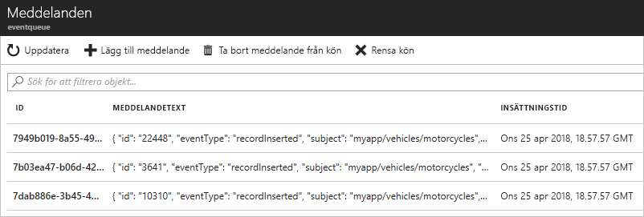

# <a name="quickstart-route-custom-events-to-azure-queue-storage-with-azure-cli-and-event-grid"></a>Snabb start: dirigera anpassade händelser till Azure Queue Storage med Azure CLI och Event Grid

Azure Event Grid är en händelsetjänst för molnet. Azure Queue Storage är en av de händelsehanterare som stöds. I den här artikeln använder du Azure CLI för att skapa ett anpassat ämne, prenumerera på det anpassade ämnet och utlösa händelsen för att visa resultatet. Du skickar händelser till Queue Storage.

[!INCLUDE [quickstarts-free-trial-note.md](../../includes/quickstarts-free-trial-note.md)]

[!INCLUDE [azure-cli-prepare-your-environment.md](../../includes/azure-cli-prepare-your-environment.md)]

- Den här artikeln kräver version 2.0.56 eller senare av Azure CLI. Om du använder Azure Cloud Shell är den senaste versionen redan installerad.

- Om du använder Azure PowerShell på den lokala datorn i stället för att använda Cloud Shell i Azure Portal, kontrollerar du att du har Azure PowerShell version 1.1.0 eller senare. Ladda ned den senaste versionen av Azure PowerShell på din Windows-dator från [Azure downloads - Command-line tools](https://azure.microsoft.com/downloads/) (Azure-nedladdningar – Kommandoradsverktyg). 

Den här artikeln innehåller kommandon för att använda Azure CLI. 

## <a name="create-a-resource-group"></a>Skapa en resursgrupp

Event Grid-ämnen är Azure-resurser och måste placeras i en Azure-resursgrupp. Resursgruppen är en logisk samling där Azure-resurser distribueras och hanteras.

Skapa en resursgrupp med kommandot [az group create](/cli/azure/group#az-group-create). 

I följande exempel skapas en resursgrupp med namnet *gridResourceGroup* på platsen *westus2*.

```azurecli-interactive
az group create --name gridResourceGroup --location westus2
```

[!INCLUDE [event-grid-register-provider-cli.md](../../includes/event-grid-register-provider-cli.md)]

## <a name="create-a-custom-topic"></a>Skapa en anpassat ämne

Ett event grid-ämne tillhandahåller en användardefinierad slutpunkt där du publicerar dina händelser. I följande exempel skapas det anpassade ämnet i din resursgrupp. Ersätt `<topic_name>` med ett unikt namn för ditt anpassade ämne. Ämnesnamnet för händelserutnätet måste vara unikt eftersom det representeras av en DNS-post.

```azurecli-interactive
az eventgrid topic create --name <topic_name> -l westus2 -g gridResourceGroup
```

## <a name="create-queue-storage"></a>Skapa Queue Storage

Innan du prenumererar på det anpassade ämnet ska vi ska slutpunkten för händelsemeddelandet. Du skapar en Queue Storage för att samla in händelserna.

```azurecli-interactive
storagename="<unique-storage-name>"
queuename="eventqueue"

az storage account create -n $storagename -g gridResourceGroup -l westus2 --sku Standard_LRS
az storage queue create --name $queuename --account-name $storagename
```

## <a name="subscribe-to-a-custom-topic"></a>Prenumerera på ett anpassat ämne

Du prenumererar på ett anpassat ämne för att se Event Grid vilka händelser du vill spåra. I följande exempel prenumererar du på det anpassade ämne som du skapade och skickar resurs-ID för Queue Storage för slut punkten. Med Azure CLI skickar du Queue Storage-ID:t som slutpunkten. Slutpunkten är i formatet:

`/subscriptions/<subscription-id>/resourcegroups/<resource-group-name>/providers/Microsoft.Storage/storageAccounts/<storage-name>/queueservices/default/queues/<queue-name>`

Följande skript hämtar lagringskontots resurs-ID för kön. Det skapar ID för Queue Storage och prenumererar på ett Event Grid-ämne. Det ställer in slutpunktstypen på `storagequeue` och använder kö-ID:t för slutpunkten.

```azurecli-interactive
storageid=$(az storage account show --name $storagename --resource-group gridResourceGroup --query id --output tsv)
queueid="$storageid/queueservices/default/queues/$queuename"
topicid=$(az eventgrid topic show --name <topic_name> -g gridResourceGroup --query id --output tsv)

az eventgrid event-subscription create \
  --source-resource-id $topicid \
  --name <event_subscription_name> \
  --endpoint-type storagequeue \
  --endpoint $queueid \
  --expiration-date "<yyyy-mm-dd>"
```

Det konto som skapar händelseprenumerationen måste ha skrivbehörighet till Queue Storage. Observera att ett [förfallodatum](concepts.md#event-subscription-expiration) har angetts för prenumerationen.

Om du använder REST API:et för att skapa prenumerationen skickar du ID:t för lagringskontot och namnet på kön som en separat parameter.

```json
"destination": {
  "endpointType": "storagequeue",
  "properties": {
    "queueName":"eventqueue",
    "resourceId": "/subscriptions/<subscription-id>/resourcegroups/<resource-group-name>/providers/Microsoft.Storage/storageAccounts/<storage-name>"
  }
  ...
```

## <a name="send-an-event-to-your-custom-topic"></a>Skicka en händelse till ditt anpassade ämne

Nu ska vi utlösa en händelse och se hur Event Grid distribuerar meddelandet till slutpunkten. Först måste vi ta fram URL och nyckel för det anpassade ämnet. Använd återigen ditt anpassade ämnesnamn för `<topic_name>`.

```azurecli-interactive
endpoint=$(az eventgrid topic show --name <topic_name> -g gridResourceGroup --query "endpoint" --output tsv)
key=$(az eventgrid topic key list --name <topic_name> -g gridResourceGroup --query "key1" --output tsv)
```

För att förenkla den här artikeln skickar du exempelhändelsedata till det anpassade ämnet. Ett program eller en Azure-tjänst skulle vanligtvis skicka sådana händelsedata. CURL är ett verktyg som skickar HTTP-förfrågningar. I den här artikeln använder du CURL för att skicka händelsen till det anpassade ämnet.  Följande exempel skickar tre händelser till Event Grid-ämnet:

```azurecli-interactive
for i in 1 2 3
do
   event='[ {"id": "'"$RANDOM"'", "eventType": "recordInserted", "subject": "myapp/vehicles/motorcycles", "eventTime": "'`date +%Y-%m-%dT%H:%M:%S%z`'", "data":{ "make": "Ducati", "model": "Monster"},"dataVersion": "1.0"} ]'
   curl -X POST -H "aeg-sas-key: $key" -d "$event" $endpoint
done
```

Gå till Queue Storage i portalen och kontrollera att Event Grid skickade de tre händelserna till kön.




## <a name="clean-up-resources"></a>Rensa resurser
Om du planerar att fortsätta arbeta med den här händelsen ska du inte rensa upp bland de resurser som skapades i den här artikeln. I annat fall kan du använda kommandona nedan för att ta bort alla resurser som har skapats i den här artikeln.

```azurecli-interactive
az group delete --name gridResourceGroup
```

## <a name="next-steps"></a>Nästa steg

Nu när du vet hur du skapar ämnen och prenumerationer på händelser kan du läsa mer om vad Event Grid kan hjälpa dig med:

- [Om Event Grid](overview.md)
- [Dirigera Blob Storage-händelser till en anpassad webbslutpunkt](../storage/blobs/storage-blob-event-quickstart.md?toc=%2fazure%2fevent-grid%2ftoc.json)
- [Övervaka ändringar på virtuella maskiner med Azure Event Grid och Logic Apps](monitor-virtual-machine-changes-event-grid-logic-app.md)
- [Strömma stordata till ett datalager](event-grid-event-hubs-integration.md)
