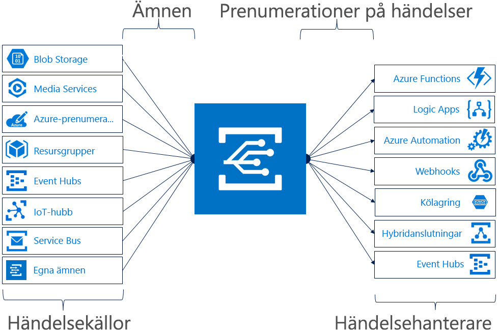

# Vad är Azure Event Grid?

Med Azure Event Grid kan du enkelt skapa program med händelsebaserade arkitekturer. Du börjar med att välja Azure-resursen som du vill prenumerera på och anger sedan händelsehanteraren eller WebHook-slutpunkten som händelsen ska skickas till. Event Grid har inbyggt stöd för händelser som kommer från Azure-tjänster, som lagringsblobar och resursgrupper. Du kan också använda egna händelser med Event Grid, med hjälp av anpassade ämnen. 

Du kan använda filter för att dirigera specifika händelser till olika slutpunkter, använda multicast till flera slutpunkter och kontrollera att din händelser levereras på ett tillförlitligt sätt.

Azure Event Grid är för närvarande tillgängligt i alla offentliga regioner. Tjänsten är inte tillgänglig i Azure-moln för Tyskland, Kina eller statliga myndigheter än.

Den här artikeln innehåller en översikt för Azure Event Grid. Om du vill komma igång med Event Grid kan du läsa [Skapa och dirigera anpassade händelser med Azure Event Grid](custom-event-quickstart.md). 

Den här bilden illustrerar hur Event Grid ansluter källor och hanterare och är inte en heltäckande lista över integreringar som stöds.

## Händelsekällor

Fullständig information om funktionerna för varje källa samt relaterade artiklar finns i avsnittet om [händelsekällor](event-sources.md). För närvarande stöder följande Azure-tjänster att skicka händelser till Event Grid:

* Azure-prenumerationer (hanteringsåtgärder)
* Container Registry
* Anpassade ämnen
* Event Hubs
* IoT Hub
* Media Services
* Resursgrupper (hanteringsåtgärder)
* Service Bus
* Storage Blob
* Allmän lagring v2 (GPv2)

## Händelsehanterare

Fullständig information om funktionerna för varje hanterare samt relaterade artiklar finns i avsnittet om [händelsehanterare](event-handlers.md). För närvarande stöder följande Azure-tjänster hantering av händelser från Event Grid: 

* Azure Automation
* Azure Functions
* Event Hubs
* Hybridanslutningar
* Logic Apps
* Microsoft Flow
* Queue Storage
* WebHooks

## Begrepp

Det finns fem begrepp i Azure Event Grid som hjälper dig igång:

* **Händelser** – Vad hände?
* **Händelsekällor** – där händelsen ägde rum.
* **Ämnen** – Slutpunkten som utgivarna skickar händelser till.
* **Händelseprenumerationer** – Den slutpunkt eller inbyggda mekanism som dirigerar händelser, ibland till fler än en hanterare. Prenumerationer används också av hanterarna för att filtrera inkommande händelser på ett intelligent sätt.
* **Händelsehanterare** – Den app eller tjänst som reagerar på händelsen.

Mer information om de här begreppen finns i [Begrepp i Azure Event Grid](concepts.md).

## Funktioner

Här följer några viktiga funktioner i Azure Event Grid:

* **Enkelhet** – Peka och klicka för att dirigera händelser från Azure-resursen till valfri händelsehanterare eller slutpunkt.
* **Avancerad filtrering** – Filtrera på händelsetyp eller händelsens publiceringssökväg för att säkerställa att händelsehanterarna endast får relevanta händelser.
* **Förgrena** – Prenumerera på flera slutpunkter till samma händelse för att kunna skicka kopior av händelsen till så många platser som det behövs.
* **Tillförlitlighet** – 24-timmars omförsök med exponentiellt intervall för att se till att händelser levereras.
* **Betala per händelse** – Betala endast för hur mycket du använder Event Grid.
* **Högt dataflöde** – Skapa arbetsbelastningar med hög volym i Event Grid med stöd för miljontals händelser per sekund.
* **Inbyggda händelser** – Kom igång snabbt med resursdefinierade inbyggda händelser.
* **Anpassade händelser** – Använd Event Grid-dirigering, filtrera och leverera anpassade händelser i din app på ett tillförlitligt sätt.

En jämförelse av Event Grid, Event Hubs och Service Bus finns i [Välj mellan Azure-tjänster som levererar meddelanden](compare-messaging-services.md).

## Vad kan jag göra med Event Grid?

Azure Event Grid innehåller flera funktioner som avsevärt förbättrar åtgärdsautomatisering och [integreringsarbete](http://azure.com/integration) utan server: 

### Arkitekturer för program utan server

Event Grid kopplar samman datakällor och händelsehanterare. Använd till exempel Event Grid för att utlösa en serverlös funktion som analyserar bilder när de läggs till i en Blob Storage-container. 

### Automatisering av åtgärder

Event Grid ger snabbare automatisering och enklare principtillämpning. Använd till exempel Event Grid för att meddela Azure Automation när en virtuell dator eller SQL-databas skapas. Använd de här händelserna för att automatiskt kontrollera att tjänstkonfigurationer följer standard, placera metadata i åtgärdsverktyg, tagga virtuella datorer eller arkivera arbetsobjekt.

### Integrering av program

Event Grid ansluter din app till andra tjänster. Skapa till exempel ett anpassat ämne för att skicka appens händelsedata till Event Grid och dra nytta av dess tillförlitliga leverans, avancerade dirigering och direkta integrering med Azure. Du kan även använda Event Grid med Logic Apps för att bearbeta data var som helst, utan att skriva någon kod. 

## Hur mycket kostar Event Grid?

Azure Event Grid använder en prismodell med betalning per händelse, så du betalar bara för det du använder. De första 100 000 åtgärderna per månad är gratis. Åtgärder definieras som händelsens ingång, leveransförsök av prenumeration, hanteringsanrop och filtrering av ämnessuffix. Se [sidan med våra priser](https://azure.microsoft.com/pricing/details/event-grid/) för mer information.

## Nästa steg

* [Dirigera Storage Blob-händelser](../storage/blobs/storage-blob-event-quickstart.md?toc=%2fazure%2fevent-grid%2ftoc.json)  
  Svara på Storage Blob-händelser med hjälp av Event Grid.
* [Skapa och prenumerera på anpassade händelser](custom-event-quickstart.md)  
  Kom igång direkt och börja skicka dina egna anpassade händelser till valfri slutpunkt med hjälp av snabbstarten för Azure Event Grid.
* [Använda Logic Apps som händelsehanterare](monitor-virtual-machine-changes-event-grid-logic-app.md)  
  En självstudie om hur du skapar en app med hjälp av Logic Apps, för att kunna reagera på händelser som skickas av Event Grid.
* [Strömma stordata till ett datalager](event-grid-event-hubs-integration.md)  
  En självstudie som använder Azure Functions till att strömma data från Event Hubs till SQL Data Warehouse.
* [REST API-referens för Event Grid](/rest/api/eventgrid)  
  Innehåller referensinnehåll för hantering av händelseprenumerationer, routning och filtrering.
