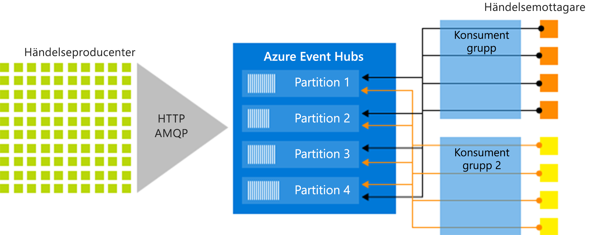

# Vad är Azure Event Hubs?

Azure Event Hubs är en strömningstjänst för stordata och händelseinmatningstjänst som kan ta emot och bearbeta flera miljoner händelser per sekund. Azure Event Hubs kan bearbeta och lagra händelser, data eller telemetri som produceras av distribuerade program och enheter. Data som skickas till en händelsehubb kan omvandlas och lagras med valfri provider för realtidsanalys eller batchbearbetnings-/lagringsadaptrar. 

Event Hubs används i några av följande vanliga scenarier:

- Avvikelseidentifiering (bedrägeri/avvikare)
- Programloggning
- Analyspipelines, till exempel klickströmmar
- Instrumentpaneler i realtid
- Dataarkivering
- Transaktionsbearbetning
- Bearbetning av användartelemetri
- Strömning av enhetstelemetri 

## Varför ska jag använda Event Hubs?

Data är bara värdefulla om det finns ett enkelt sätt att bearbeta och få snabba insikter från datakällor. Event Hubs är en distribuerad plattform för strömningsbearbetning med låg fördröjning och smidig integrering som har data- och analystjänster inuti och utanför Azure för att skapa en fullständig stordatapipeline.

Event Hubs utgör ”dörren” för en händelsepipeline, ofta kallad en *händelseinmatare* i lösningsarkitekturer. En händelseinmatare är en komponent eller tjänst som placeras mellan händelseutgivare och -konsumenter och frikopplar produktion av en händelseström från användningen av de händelserna. Event Hubs ger en enhetlig strömningsplattform med tidkvarhållningsbuffert vilket frikopplar händelseproducenter från händelsekonsumenter. 

I följande avsnitt beskrivs viktiga funktioner i Azure Event Hubs-tjänsten: 

## Fullständigt hanterad PaaS 

Event Hubs är en hanterad tjänst med låga omkostnader för konfiguration och hantering så att du kan fokusera på affärslösningarna. Med [Event Hubs för Apache Kafka-ekosystem](event-hubs-for-kafka-ecosystem-overview.md) får du PaaS Kafka-funktionerna utan att behöva hantera, konfigurera eller köra dina kluster.

## Stöd för realtidsbearbetning och satsvis bearbetning

Mata in, buffra, lagra och bearbeta din dataström i realtid för att få användbara insikter. Event Hubs använder en [partitionerad konsumentmodell](event-hubs-features.md#partitions) som gör att flera program kan bearbeta dataströmmen samtidigt och att du får kontroll över bearbetningens hastighet.

[Samla in](event-hubs-capture-overview.md) data i nära realtid i en [Azure Blob-lagring](https://azure.microsoft.com/services/storage/blobs/) eller [Azure Data Lake Store](https://azure.microsoft.com/services/data-lake-store/) för långsiktig kvarhållning eller bearbetning av mindre batchar. Du kan åstadkomma detta i samma dataström som du använder för att få fram analys i realtid. Det går snabbt att konfigurera Capture (Insamling), det finns inga administrativa kostnader för att köra den, och den skalar automatiskt med Event Hubs  [genomflödesenheter](event-hubs-features.md#throughput-units). Med Event Hubs Capture kan du rikta in dig på databearbetning i stället för på datainsamling.

Azure Event Hubs är även integrerat med [Azure Functions](/azure/azure-functions/) för att ge en serverlös arkitektur.

## Skalbar 

Med Event Hubs kan du börja med dataströmmar i megabytestorlek och växa till gigabyte eller terabyte. Funktionen [Automatisk ökning](event-hubs-auto-inflate.md) är en av de många tillgängliga alternativ för att skala antalet dataflödesenheter som uppfyller dina användningsbehov. 

## Stort ekosystem

Med [Event Hubs för Apache Kafka-ekosystem](event-hubs-for-kafka-ecosystem-overview.md) kan [Apache Kafka-klienter och -program (1.0 och senare)](https://kafka.apache.org/) kommunicera med Event Hubs utan hantering av kluster.
 
Med ett brett ekosystem som är tillgängligt i olika [språk (.NET, Java, Python, Go och Node.js)](https://github.com/Azure/azure-event-hubs) kan du enkelt börjar bearbeta dataströmmarna från Event Hubs. Alla klientspråk som stöds ger lågnivåintegrering.

## Nyckelkomponenter i arkitektur

Event Hubs tillhandahåller funktioner för hantering av meddelandeströmmar men har egenskaper som skiljer sig från traditionell meddelandehantering för företag. Funktionerna i Event Hubs är byggda för scenarier med högt genomflöde och intensiv händelsebearbetning. Event Hubs innehåller följande [viktiga element](event-hubs-features.md):

- **Händelseutfärdare**: En entitet som skickar data till en händelsehubb. Händelseutfärdare kan utfärda händelser med hjälp av HTTPS, AMQP 1.0 eller Apache Kafka (1.0 och senare)
- **Partitioner**: Varje konsument läser endast en specifik delmängd, eller partition, av meddelandeströmmen.
- **Konsumentgrupper**: En vy (tillstånd, position eller offset) av en hel händelsehubb. Konsumentgrupper gör det möjligt för flera användningsprogram att vart och ett ha en separat vy över händelseströmmen och att oberoende läsa strömmen i egen takt och med sina egna offset.
- **Genomflödesenheter**: Förköpta kapacitetsenheter som styr genomflödeskapaciteten i Event Hubs.
- **Händelsemottagare**: Alla entiteter som läser händelsedata från en händelsehubb. Alla Event Hubs-konsumenter ansluter via AMQP 1.0-sessionen, och händelser levereras via sessionen när de blir tillgängliga.

Följande bild visar strömhanteringsarkitekturen i Event Hubs:

## Nästa steg

Om du vill komma igång med Event Hubs kan du läsa följande artiklar:

* [Mata in till Event Hubs](event-hubs-quickstart-portal.md)
* [Översikt över Event Hubs-funktioner](event-hubs-features.md)
* [Vanliga frågor och svar](event-hubs-faq.md)

