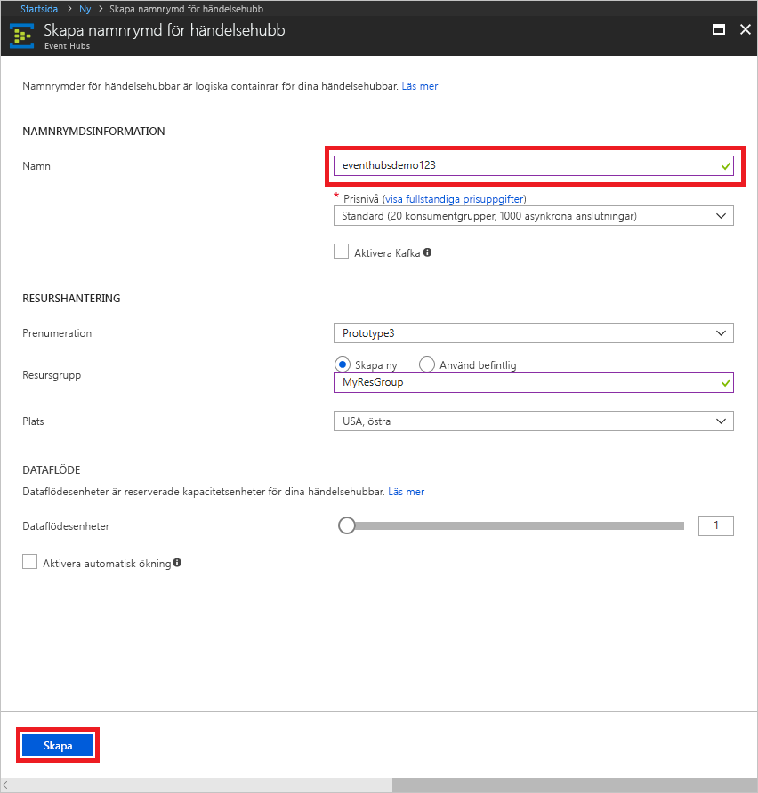

# Skapa ett Event Hubs-namnområde och en event hub med Azure-portalen

## Skapa ett Event Hubs-namnområde

1. Logga in på den [Azure-portalen][Azure portal], och klicka på **skapa en resurs** på upp till vänster på skärmen.
2. Klicka på **Sakernas Internet** och sedan på **Event Hubs**.
   
    

3. Under **Skapa namnområde** anger du ett namn för namnområdet. Systemet kontrollerar omedelbart om namnet är tillgängligt.  

4. När du har kontrollerat att namnområdet är tillgängligt väljer du prisnivå (Basic eller Standard). Välj även en Azure-prenumeration, resursgrupp och plats där du vill skapa resursen.
 
5. Klicka på **Skapa** för att skapa namnområdet. Du kan behöva vänta några minuter på att systemet ska bli klart med att etablera resurserna.

    

6. Klicka på det nyligen skapade namnområdet i listan med namnområden i Portal.

7. Klicka på **Principer för delad åtkomst** och sedan på **RootManageSharedAccessKey**.
    
    

8. Klicka på kopieringsknappen för att kopiera anslutningssträngen **RootManageSharedAccessKey** till Urklipp. Spara den här anslutningssträngen på en tillfällig plats, till exempel i Anteckningar, för senare användning.
    
    

## Skapa en händelsehubb

1. I listan över händelsehubbarnas namnområden klickar du på det nyligen skapade namnområdet.      
   
     

2. Klicka på namnområdesbladet och på **Händelsehubbar**.
   
    

3. Överst på bladet klickar du på **+ Event Hub**.
   
    
4. Skriv ett namn för din händelsehubb och klicka sedan på **Skapa**. 

Din händelsehubb har nu skapats och du har anslutningssträngar för måste du skicka och ta emot händelser.

## Nästa steg

Mer information om Händelsehubbar finns i följande länkar:

* [Event Hubs-översikt](event-hubs-what-is-event-hubs.md)
* [Event Hubs API-översikt](event-hubs-api-overview.md)

[Azure portal]: https://portal.azure.com/