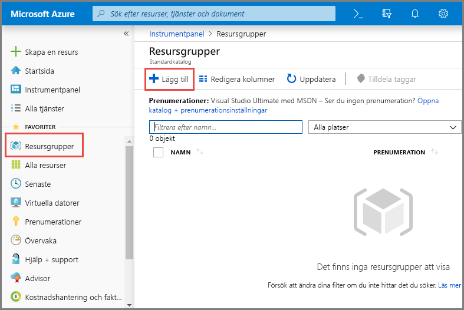
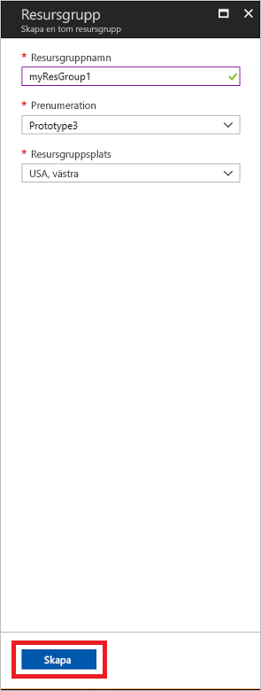
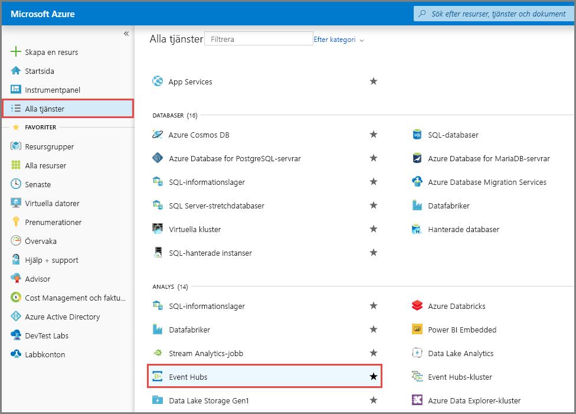
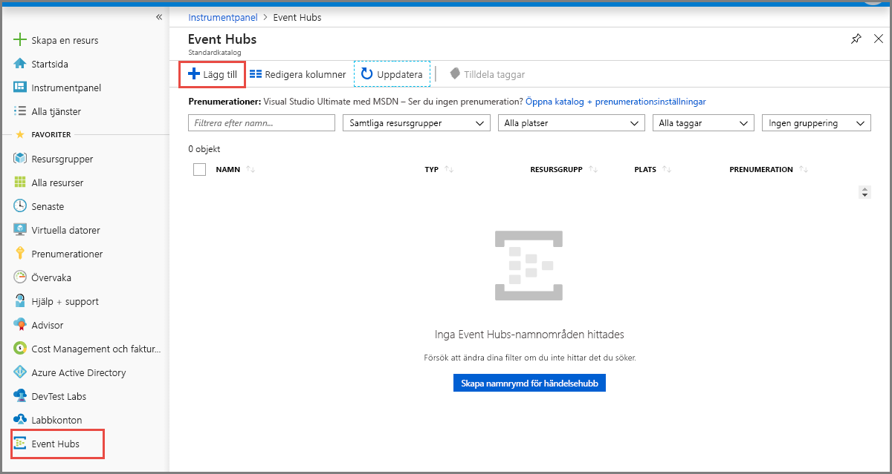
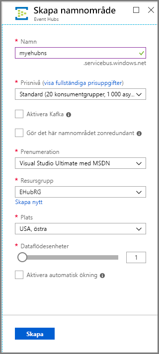
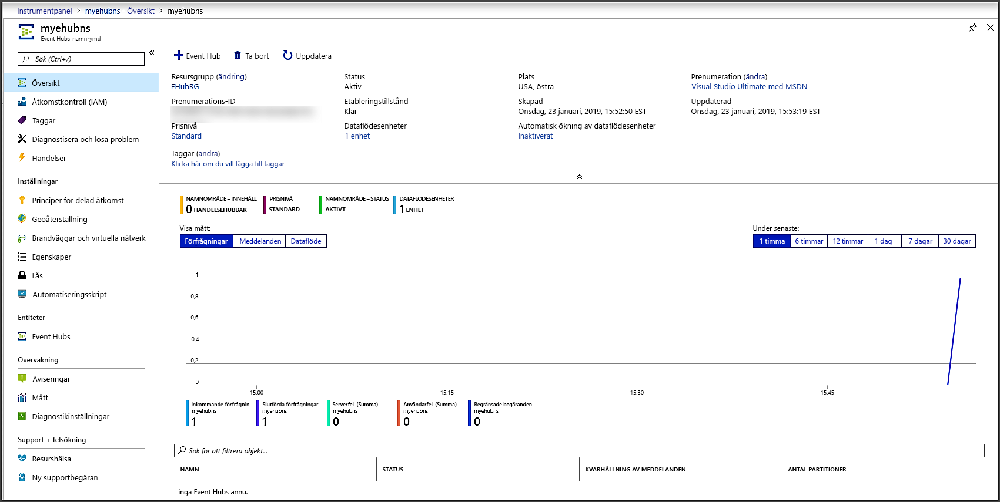
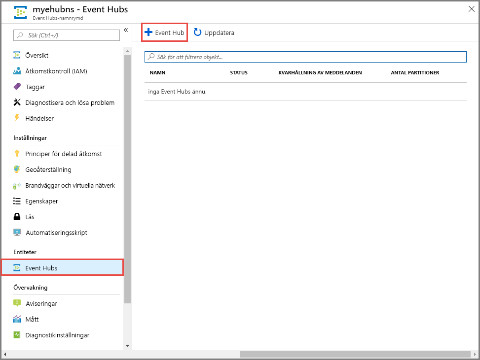
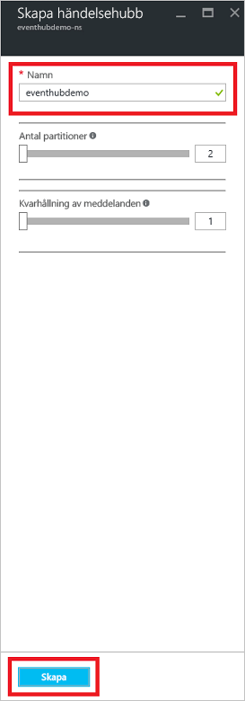
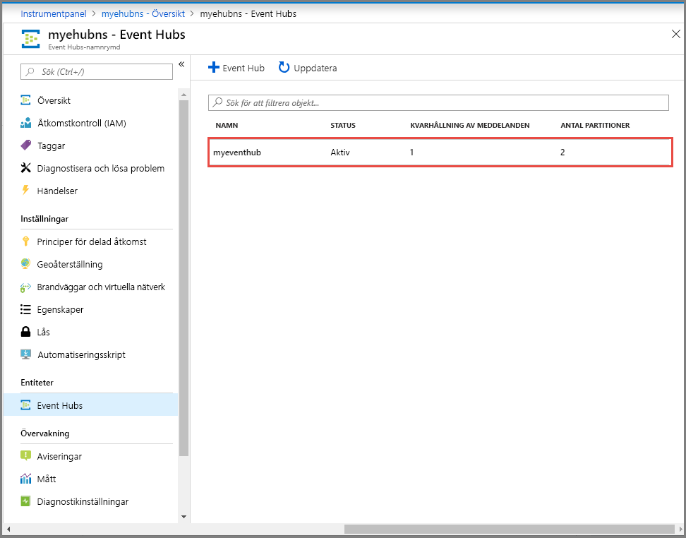

# Snabbstart: Skapa en händelsehubb med hjälp av Azure Portal
Azure Event Hubs är en stor data strömnings plattform och händelse inmatnings tjänst som kan ta emot och bearbeta miljon tals händelser per sekund. Event Hubs kan bearbeta och lagra händelser, data eller telemetri som producerats av distribuerade program och enheter. Data som skickas till en händelsehubb kan omvandlas och lagras med valfri provider för realtidsanalys eller batchbearbetnings-/lagringsadapter. En detaljerad översikt över Event Hubs finns i [Översikt över Event Hubs](event-hubs-about.md) och [Event Hubs-funktioner](event-hubs-features.md).

I den här snabbstarten skapar du en händelsehubb med hjälp av [Azure-portalen](https://portal.azure.com).

## Förutsättningar

För att slutföra den här snabbstarten behöver du följande:

- En Azure-prenumeration. Om du inte har ett konto kan du [skapa ett kostnadsfritt konto](https://azure.microsoft.com/free/) innan du börjar.

## Skapa en resursgrupp

En resursgrupp är en logisk samling Azure-resurser. Alla resurser distribueras och hanteras i en resursgrupp. Så här skapar du en resursgrupp:

1. Logga in på [Azure-portalen](https://portal.azure.com).
1. Välj **resurs grupper** i det vänstra navigerings fältet. Välj **Lägg till**.

   

1. För **Prenumeration** väljer du namnet på den Azure-prenumeration som du vill skapa resursgruppen i.
1. Ange ett unikt **namn på resursgruppen**. Systemet kontrollerar direkt om namnet är tillgängligt i den valda Azure-prenumerationen.
1. Välj en **region** för resursgruppen.
1. Välj **Granska + skapa**.

   
1. Välj **Granska** i fönstret **Granska + Skapa**. 

## Skapa ett Event Hubs-namnområde

Ett Event Hubs-namnområde innehåller en unik omfångs behållare där du skapar en eller flera händelse nav. Gör följande om du vill skapa ett namnområde i din resursgrupp med Portal:

1. I Azure-portalen väljer du **Skapa en resurs** högst upp till vänster på skärmen.
1. Välj **Alla tjänster** på den vänstra menyn och välj **stjärnan (`*`)** bredvid **Event Hubs** i kategorin **Analytics**. Bekräfta att **Event Hubs** läggs till i **FAVORITER** på den vänstra navigeringsmenyn. 
    
   
1. Välj **Event Hubs** under **FAVORITER** på den vänstra navigeringsmenyn och välj **Lägg till** i verktygsfältet.

   
1. Gör följande på sidan **Skapa namnområde**:  
   1. Välj den **prenumeration** som du vill skapa namnområdet i.  
   1. Välj den **resurs grupp** som du skapade i föregående steg.   
   1. Ange ett **namn** för namn området. Systemet kontrollerar omedelbart om namnet är tillgängligt.  
   1. Välj en **plats** för namnområdet.
   1. Välj **pris nivå** (Basic eller standard). Mer information om skillnaderna mellan nivåerna Basic och standard finns i [Event Hubs priser](https://azure.microsoft.com/pricing/details/event-hubs/), [skillnader mellan nivåer](event-hubs-faq.md#what-is-the-difference-between-event-hubs-basic-and-standard-tiers)och [kvoter och begränsningar](event-hubs-quotas.md). 
   1. Lämna inställningarna för **data flödes enheter** som de är. Genomflödesenheter är färdiga kapacitetsenheter. Läs mer om data flödes enheter i [Event Hubs skalbarhet](event-hubs-scalability.md#throughput-units).  
   1. Välj **Granska + skapa** längst ned på sidan.
      
      
   1. På sidan **Granska + skapa** granskar du inställningarna och väljer **skapa**. Vänta tills distributionen har slutförts. 
      
      
      
   1. På sidan **distribution** väljer du **gå till resurs** för att navigera till sidan för ditt namn område. 
      
        
   1. Bekräfta att du ser sidan **Event Hubs namn område** som liknar följande exempel:   
      
             

      > [!NOTE]
      > Azure Event Hubs ger dig en Kafka-slutpunkt. Den här slut punkten gör det möjligt för Event Hubs namn området att förstå [Apache Kafka](https://kafka.apache.org/intro) meddelande protokoll och API: er. Med den här funktionen kan du kommunicera med dina Event Hub på samma sätt som med Kafka-ämnen utan att ändra protokoll klienter eller köra egna kluster. Event Hubs stöder [Apache Kafka version 1,0](https://kafka.apache.org/10/documentation.html) och senare. Mer information finns i [använda Event Hubs från Apache Kafka-program](event-hubs-for-kafka-ecosystem-overview.md).
    
## Skapa en händelsehubb

Gör följande om du vill skapa en händelsehubb i namnområdet:

1. På sidan Event Hubs-namnområde väljer du **Event Hubs** på den vänstra menyn.
1. Längst upp i fönstret väljer du **+ Event Hub**.
   
    
1. Ange ett namn för händelsehubben och välj sedan **skapa**.
   
    

    Med inställningen **antal partitioner** kan du parallellisera förbrukningen för många konsumenter. Mer information finns i [partitioner](event-hubs-scalability.md#partitions).

    Inställningen för **kvarhållning av meddelanden** anger hur länge Event Hubs tjänsten behåller data. De maximala gränserna för den här inställningen finns i [kvoter och begränsningar](event-hubs-quotas.md).
1. Du kan kontrollera status för skapandet av händelsehubben i aviseringarna. När händelsehubben har skapats visas den i listan över händelse nav.

    
    
## Nästa steg

I den här artikeln har du skapat en resursgrupp, en Event Hubs-namnrymd och en händelsehubb. Steg-för-steg-instruktioner för att skicka händelser till (eller) ta emot händelser från en händelsehubben finns i följande Självstudier: 

- [.NET Core](event-hubs-dotnet-standard-getstarted-send.md)
- [Java](event-hubs-java-get-started-send.md)
- [Python](event-hubs-python-get-started-send.md)
- [JavaScript](event-hubs-node-get-started-send.md)
- [Kör](event-hubs-go-get-started-send.md)
- [C (skickar endast)](event-hubs-c-getstarted-send.md)
- [Apache Storm (tar endast emot)](event-hubs-storm-getstarted-receive.md)

[Azure portal]: https://portal.azure.com/
[3]: ./media/event-hubs-quickstart-portal/sender1.png
[4]: ./media/event-hubs-quickstart-portal/receiver1.png
