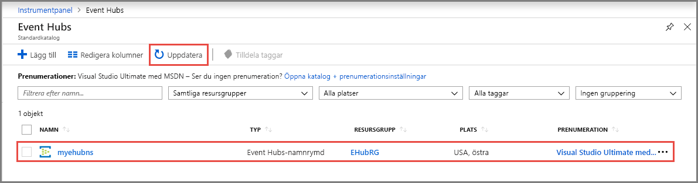

# Snabbstart: Skapa en händelsehubb med Azure Portal
Azure Event Hubs är en strömningstjänst för stordata och händelseinmatningstjänst som kan ta emot och bearbeta flera miljoner händelser per sekund. Azure Event Hubs kan bearbeta och lagra händelser, data eller telemetri som produceras av distribuerade program och enheter. Data som skickas till en händelsehubb kan omvandlas och lagras med valfri provider för realtidsanalys eller batchbearbetnings-/lagringsadaptrar. En detaljerad översikt över Event Hubs finns i [Översikt över Event Hubs](event-hubs-about.md) och [Event Hubs-funktioner](event-hubs-features.md).

I den här snabbstarten skapar du en händelsehubb med hjälp av [Azure-portalen](https://portal.azure.com).

## Nödvändiga komponenter

För att slutföra den här snabbstarten behöver du följande:

- En Azure-prenumeration. Om du inte har ett konto kan du [skapa ett kostnadsfritt konto](https://azure.microsoft.com/free/) innan du börjar.
- [Visual Studio 2017 Update 3 (version 15.3, 26730.01)](https://www.visualstudio.com/vs) eller senare.
- [SDK för .NET Standard](https://www.microsoft.com/net/download/windows) version 2.0 eller senare.

## Skapa en resursgrupp

En resursgrupp är en logisk samling Azure-resurser. Alla resurser distribueras och hanteras i en resursgrupp. Så här skapar du en resursgrupp:

1. Logga in på [Azure-portalen](https://portal.azure.com).
2. Klicka på **Resursgrupper** i det vänstra navigeringsfönstret. Klicka sedan på **Lägg till**.

   

2. För **Prenumeration** väljer du namnet på den Azure-prenumeration som du vill skapa resursgruppen i.
3. Ange ett unikt **namn på resursgruppen**. Systemet kontrollerar direkt om namnet är tillgängligt i den valda Azure-prenumerationen.
4. Välj en **region** för resursgruppen.
5. Välj **Granska + Skapa**.

   
6. Välj **Granska**  i fönstret **Granska + Skapa**. 

## Skapa ett Event Hubs-namnområde

Ett Event Hubs-namnområde innehåller en unik omfattningscontainer som refereras till av dess fullständigt kvalificerade domännamn, där du skapar en eller flera händelsehubbar. Gör följande om du vill skapa ett namnområde i din resursgrupp med Portal:

1. I Azure-portalen klickar du på **Skapa en resurs** högst upp till vänster på skärmen.
2. Välj **Alla tjänster** på den vänstra menyn och välj **stjärnan (`*`)** bredvid **Event Hubs** i kategorin **Analytics**. Bekräfta att **Event Hubs** läggs till i **FAVORITER** på den vänstra navigeringsmenyn. 
    
   
3. Välj **Event Hubs** under **FAVORITER** på den vänstra navigeringsmenyn och välj **Lägg till** i verktygsfältet.

   
4. Gör följande på sidan **Skapa namnområde**:
    1. Ange ett namn för namnområdet. Systemet kontrollerar omedelbart om namnet är tillgängligt.
    2. Välj prisnivå (Basic eller Standard).
    3. Välj den **prenumeration** som du vill skapa namnområdet i.
    4. Välj en **plats** för namnområdet.
    5. Välj **Skapa**. Du kan behöva vänta några minuter på att systemet ska bli klart med att etablera resurserna.

       
5. Uppdatera sidan **Händelsehubbar** och se händelsehubbens namnområde. Du kan kontrollera status för skapandet av händelsehubben i aviseringarna. 

    
6. Välj namnområdet. Du kan se startsidan för ditt **Event Hubs-namnområde** i portalen. 

   
    
## Skapa en händelsehubb

Gör följande om du vill skapa en händelsehubb i namnområdet:

1. På sidan Event Hubs-namnområde väljer du **Event Hubs** på den vänstra menyn.
1. Klicka på **+ Event Hub** längst upp i fönstret.
   
    
1. Skriv ett namn för din händelsehubb och klicka sedan på **Skapa**.
   
    
4. Du kan kontrollera status för skapandet av händelsehubben i aviseringarna. När händelsehubben har skapats kan se du den i listan över händelsehubbar som visas på följande bild:

    

Grattis! Du har skapat ett Event Hubs-namnområde och en händelsehubb i namnområdet med Portal. 

## Nästa steg

I den här artikeln har du skapat en resursgrupp, en Event Hubs-namnrymd och en händelsehubb. Stegvisa instruktioner för att skicka händelser till eller ta emot händelser från en händelsehubb finns i följande självstudier:  

- **Skicka händelser till en händelsehubb**: [.NET Core](event-hubs-dotnet-standard-getstarted-send.md), [.NET Framework](event-hubs-dotnet-framework-getstarted-send.md), [Java](event-hubs-java-get-started-send.md), [Python](event-hubs-python-get-started-send.md), [Node.js](event-hubs-node-get-started-send.md), [Go](event-hubs-go-get-started-send.md), [C](event-hubs-c-getstarted-send.md)
- **Ta emot händelser från en händelsehubb**: [.NET Core](event-hubs-dotnet-standard-getstarted-receive-eph.md), [.NET Framework](event-hubs-dotnet-framework-getstarted-receive-eph.md), [Java](event-hubs-java-get-started-receive-eph.md), [Python](event-hubs-python-get-started-receive.md), [Node.js](event-hubs-node-get-started-receive.md), [Go](event-hubs-go-get-started-receive-eph.md), [Apache Storm](event-hubs-storm-getstarted-receive.md)

[Azure portal]: https://portal.azure.com/
[3]: ./media/event-hubs-quickstart-portal/sender1.png
[4]: ./media/event-hubs-quickstart-portal/receiver1.png
