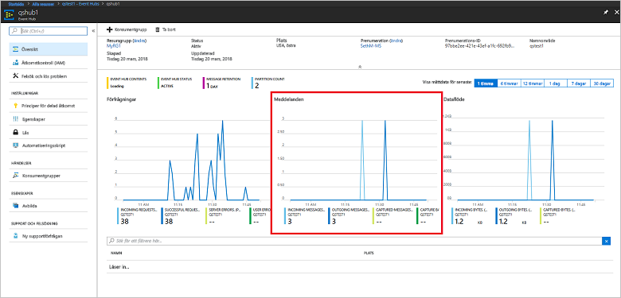

# <a name="quickstart-create-an-event-hub-using-azure-cli"></a>Snabbstart: Skapa en händelsehubb med Azure CLI

Azure Event Hubs är en mycket skalbar dataströmningsplattform och inmatningstjänst som kan ta emot och bearbeta flera miljoner händelser per sekund. Den här snabbstarten visar hur du skapar Event Hubs-resurser med Azure CLI och sedan skickar och tar emot händelseströmmar från en händelsehubb med Java-kod.

Du behöver en Azure-prenumeration för att kunna utföra den här snabbstarten. Om du inte har ett konto kan du [skapa ett kostnadsfritt konto][] innan du börjar.

## <a name="prerequisites"></a>Krav

[!INCLUDE [cloud-shell-try-it.md](../../includes/cloud-shell-try-it.md)]

Om du väljer att installera och använda Azure CLI lokalt kräver de här självstudierna att du kör Azure CLI version 2.0.4 eller senare. Kör `az --version` för att kontrollera vilken version du har. Om du behöver installera eller uppgradera kan du läsa [Installera Azure CLI 2.0]( /cli/azure/install-azure-cli).

## <a name="log-on-to-azure"></a>Logga in i Azure

Följande steg krävs inte om du kör kommandon i Cloud Shell. Om du kör CLI lokalt måste du utföra följande steg för att logga in i Azure och ange din aktuella prenumeration:

Kör följande kommando för att logga in i Azure:

```azurecli-interactive
az login
```

Ange den aktuella prenumerationskontexten. Ersätt `MyAzureSub` med namnet på den Azure-prenumeration som du vill använda:

```azurecli-interactive
az account set --subscription MyAzureSub
``` 

## <a name="provision-resources"></a>Etablera resurser

Utfärda följande kommandon för att etablera Event Hubs-resurser. Se till att ersätta platshållarna `myResourceGroup`, `namespaceName`, `eventHubName` och `storageAccountName` med lämpliga värden:

```azurecli-interactive
# Create a resource group
az group create --name myResourceGroup --location eastus

# Create an Event Hubs namespace
az eventhubs namespace create --name namespaceName --resource-group myResourceGroup -l eastus2

# Create an event hub
az eventhubs eventhub create --name eventHubName --resource-group myResourceGroup --namespace-name namespaceName

# Create a general purpose standard storage account
az storage account create --name storageAccountName --resource-group myResourceGroup --location eastus2 --sku Standard_RAGRS --encryption blob

# List the storage account access keys
az storage account keys list --resource-group myResourceGroup --account-name storageAccountName

# Get namespace connection string
az eventhubs namespace authorization-rule keys list --resource-group myResourceGroup --namespace-name namespaceName --name RootManageSharedAccessKey
```

Kopiera och klistra in anslutningssträngen på en tillfällig plats, till exempel i Anteckningar, för senare användning.

## <a name="stream-into-event-hubs"></a>Strömma till Event Hubs

Nästa steg är att ladda ned exempelkoden som strömmar händelser till en händelsehubb och tar emot dessa händelser med Event Processor Host. Börja med att skicka meddelandena:

Klona [Event Hubs GitHub-lagringsplatsen](https://github.com/Azure/azure-event-hubs) genom att utfärda följande kommando:

```bash
git clone https://github.com/Azure/azure-event-hubs.git
```

Navigera till mappen **SimpleSend**: `\azure-event-hubs\samples\Java\Basic\SimpleSend\src\main\java\com\microsoft\azure\eventhubs\samples\SimpleSend`. Öppna filen SimpleSend.java och ersätt strängen `"Your Event Hubs namaspace name"` med Event Hubs-namnområdet du fick i avsnittet "Skapa ett Event Hubs-namnområde" i den här artikeln.

Ersätt `"Your event hub"` med namnet på den händelsehubb som du skapade i det namnområdet och `"Your policy name"` med namnet på policyn för delad åtkomst för namnområdet. Om du inte har skapat en ny princip är standardvärdet **RootManageSharedAccessKey**. 

Slutligen ersätter du `"Your primary SAS key"` med värdet för SAS-nyckeln för principen i föregående steg.

### <a name="build-the-application"></a>Skapa programmet 

Gå tillbaka till mappen `\azure-event-hubs\samples\Java\Basic\SimpleSend` och kör följande genereringskommando:

```shell
mvn clean package -DskipTests
```

### <a name="receive"></a>Ta emot

Nu laddar du ned Event Processor Host-exemplet som mottar de meddelanden som du precis skickade. Navigera till mappen **EventProcessorSample**: `\azure-event-hubs\samples\Java\Basic\EventProcessorSample\src\main\java\com\microsoft\azure\eventhubs\samples\eventprocessorsample`.

I filen EventProcessorSample.java ersätter du värdet `----EventHubsNamespaceName-----` med det Event Hubs-namnområde som du erhöll i avsnittet "Skapa ett Event Hubs-namnområde" i den här artikeln. 

Ersätt de andra strängvärdena i den här filen: ersätt `----EventHubName-----` med namnet på den händelsehubb som du skapade i det namnområdet och ersätt `-----SharedAccessSignatureKeyName-----` med namnet på principen för delad åtkomst för namnområdet. Om du inte har skapat en ny princip är standardvärdet **RootManageSharedAccessKey**.

Ersätt `---SharedAccessSignatureKey----` med värdet för SAS-nyckeln för principen i föregående steg, ersätt `----AzureStorageConnectionString----` med anslutningssträngen för det lagringskonto som du skapade och ersätt `----StorageContainerName----` med namnet på behållaren under det lagringskonto som du skapade. 

Slutligen ersätter du `----HostNamePrefix----` med namnet på lagringskontot.

### <a name="build-the-receiver"></a>Skapa mottagaren 

Du skapar det mottagande programmet genom att gå till mappen `\azure-event-hubs\samples\Java\Basic\EventProcessorSample` och köra följande kommando:

```shell
mvn clean package -DskipTests
```

### <a name="run-the-apps"></a>Köra apparna

Om versionerna skapas utan fel är du redo att skicka och ta emot händelser. Kör först programmet **SimpleSend** och observera händelserna som skickas. Om du vill köra programmet går du till mappen `\azure-event-hubs\samples\Java\Basic\SimpleSend` och kör följande kommando:

```shell
java -jar ./target/simplesend-1.0.0-jar-with-dependencies.jar
```

Kör sedan appen **EventProcessorSample** och observera händelserna som mottas. Om du vill köra programmet går du till mappen `\azure-event-hubs\samples\Java\Basic\EventProcessorSample` och kör följande kommando:
   
```shell
java -jar ./target/eventprocessorsample-1.0.0-jar-with-dependencies.jar
```

När du har kört båda programmen kan du kontrollera antalet inkommande och utgående meddelanden på översiktssidan för händelsehubben i Azure-portalen:



## <a name="clean-up-resources"></a>Rensa resurser

Kör följande kommando för att ta bort resursgruppen, namnområdet, lagringskontot och alla relaterade resurser. Ersätt `myResourceGroup` med namnet på den resursgrupp som du skapade:

```azurecli
az group delete --resource-group myResourceGroup
```

## <a name="understand-the-sample-code"></a>Förstå exempelkoden

Det här avsnittet innehåller mer information om vad exempelkoden gör.

### <a name="send"></a>Skicka

I filen SimpleSend.java utförs det mesta av jobbet i metoden main(). Först används en `ConnectionStringBuilder`-instans för att skapa anslutningssträngen med hjälp av användardefinierade värden för namnet på namnområdet, namnet på händelsehubben, namnet på SAS-nyckeln och själva SAS-nyckeln:

```java
final ConnectionStringBuilder connStr = new ConnectionStringBuilder()
        .setNamespaceName("Your Event Hubs namespace name")
        .setEventHubName("Your event hub")
        .setSasKeyName("Your policy name")
        .setSasKey("Your primary SAS key");
```

Det Java-objekt som innehåller händelsens nyttolast konverteras sedan till Json:

```java
final Gson gson = new GsonBuilder().create();

final PayloadEvent payload = new PayloadEvent(1);
byte[] payloadBytes = gson.toJson(payload).getBytes(Charset.defaultCharset());
EventData sendEvent = EventData.create(payloadBytes);  
```

Event Hubs-klienten skapas på den här kodraden:

```java
final EventHubClient ehClient = EventHubClient.createSync(connStr.toString(), executorService);
```

Blocket try/finally skickar en händelseresursallokering till en ej angiven partition:

```java
try {
    for (int i = 0; i < 100; i++) {

        String payload = "Message " + Integer.toString(i);
        //PayloadEvent payload = new PayloadEvent(i);
        byte[] payloadBytes = gson.toJson(payload).getBytes(Charset.defaultCharset());
        EventData sendEvent = EventData.create(payloadBytes);

        // Send - not tied to any partition
        // Event Hubs service will round-robin the events across all EventHubs partitions.
        // This is the recommended & most reliable way to send to EventHubs.
        ehClient.sendSync(sendEvent);
    }

    System.out.println(Instant.now() + ": Send Complete...");
    System.in.read();
} finally {
    ehClient.closeSync();
    executorService.shutdown();
}
```

### <a name="receive"></a>Ta emot 

Mottagningsåtgärden sker i filen EventProcessorSample.java. Först deklareras konstanter för Event Hubs-namnområdesnamnet och andra autentiseringsuppgifter:

```java
String consumerGroupName = "$Default";
String namespaceName = "----NamespaceName----";
String eventHubName = "----EventHubName----";
String sasKeyName = "----SharedAccessSignatureKeyName----";
String sasKey = "----SharedAccessSignatureKey----";
String storageConnectionString = "----AzureStorageConnectionString----";
String storageContainerName = "----StorageContainerName----";
String hostNamePrefix = "----HostNamePrefix----";
```

På liknande sätt som för programmet SimpleSend skapas sedan en ConnectionStringBuilder-instans för att skapa anslutningssträngen:

```java
ConnectionStringBuilder eventHubConnectionString = new ConnectionStringBuilder()
    .setNamespaceName(namespaceName)
    .setEventHubName(eventHubName)
    .setSasKeyName(sasKeyName)
    .setSasKey(sasKey);
```

*Event Processor Host* är en klass som förenklar mottagandet av händelser från händelsehubbar genom hantering av permanenta kontrollpunkter och parallella mottaganden från händelsehubbar. Nu skapar koden en instans av `EventProcessorHost`:

```java
EventProcessorHost host = new EventProcessorHost(
    EventProcessorHost.createHostName(hostNamePrefix),
    eventHubName,
    consumerGroupName,
    eventHubConnectionString.toString(),
    storageConnectionString,
    storageContainerName);
```

Efter deklarering av felhanteringskod definierar appen sedan klassen `EventProcessor` som är en implementering av gränssnittet `IEventProcessor`. Den här klassen bearbetar de mottagna händelserna:

```java
public static class EventProcessor implements IEventProcessor
{
    private int checkpointBatchingCount = 0;
    ...
```

Metoden `onEvents()` anropas när händelser mottas på den här partitionen av händelsehubben:

```java
@Override
public void onEvents(PartitionContext context, Iterable<EventData> events) throws Exception
{
    System.out.println("SAMPLE: Partition " + context.getPartitionId() + " got event batch");
    int eventCount = 0;
    for (EventData data : events)
    {
        try
        {
         System.out.println("SAMPLE (" + context.getPartitionId() + "," + data.getSystemProperties().getOffset() + "," +
                data.getSystemProperties().getSequenceNumber() + "): " + new String(data.getBytes(), "UTF8"));
             eventCount++;
                
         // Checkpointing persists the current position in the event stream for this partition and means that the next
         // time any host opens an event processor on this event hub+consumer group+partition combination, it will start
         // receiving at the event after this one. Checkpointing is usually not a fast operation, so there is a tradeoff
         // between checkpointing frequently (to minimize the number of events that will be reprocessed after a crash, or
         // if the partition lease is stolen) and checkpointing infrequently (to reduce the impact on event processing
         // performance). Checkpointing every five events is an arbitrary choice for this sample.
         this.checkpointBatchingCount++;
         if ((checkpointBatchingCount % 5) == 0)
         {
            System.out.println("SAMPLE: Partition " + context.getPartitionId() + " checkpointing at " +
                    data.getSystemProperties().getOffset() + "," + data.getSystemProperties().getSequenceNumber());
            // Checkpoints are created asynchronously. It is important to wait for the result of checkpointing
            // before exiting onEvents or before creating the next checkpoint, to detect errors and to ensure proper ordering.
            context.checkpoint(data).get();
         }
    }
        catch (Exception e)
        {
            System.out.println("Processing failed for an event: " + e.toString());
        }
    }
    System.out.println("SAMPLE: Partition " + context.getPartitionId() + " batch size was " + eventCount + " for host " + context.getOwner());
}
```

## <a name="next-steps"></a>Nästa steg

I den här artikeln skapade du ett Event Hubs-namnområde och de andra resurserna som krävs för att skicka och ta emot meddelanden från din händelsehubb. Fortsätt med följande självstudie om du vill veta mer:

> [!div class="nextstepaction"]
> [Visualisera dataavvikelser i Event Hubs-dataströmmar](event-hubs-tutorial-visualize-anomalies.md)

[Skapa ett kostnadsfritt konto]: https://azure.microsoft.com/free/?ref=microsoft.com&utm_source=microsoft.com&utm_medium=docs&utm_campaign=visualstudio
[Install Azure CLI 2.0]: /cli/azure/install-azure-cli
[az group create]: /cli/azure/group#az-group-create
[fully qualified domain name]: https://wikipedia.org/wiki/Fully_qualified_domain_name
