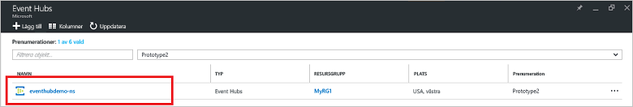
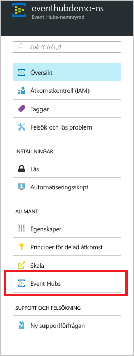
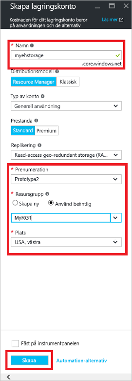
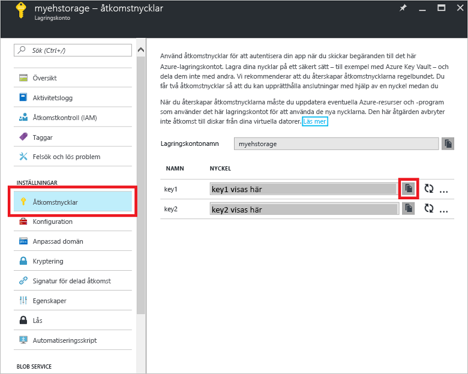

# Snabbstart: Bearbeta händelseströmmar med Azure-portalen och .NET

Azure Event Hubs är en mycket skalbar dataströmningsplattform och inmatningstjänst som kan ta emot och bearbeta flera miljoner händelser per sekund. Den här snabbstarten visar hur du skapar en händelsehubb med [Azure-portalen](https://portal.azure.com) och sedan skickar till och tar emot från en händelsehubb med SDK för .NET Standard.

Du behöver en Azure-prenumeration för att kunna utföra den här snabbstarten. Om du inte har ett konto kan du [skapa ett kostnadsfritt konto][] innan du börjar.

## Krav

Kontrollera att du har följande så att du kan utföra den här snabbstarten:

- [Visual Studio 2017 Update 3 (version 15.3, 26730.01)](http://www.visualstudio.com/vs) eller senare.
- [SDK för .NET Standard](https://www.microsoft.com/net/download/windows) version 2.0 eller senare.

## Skapa en resursgrupp

En resursgrupp är en logisk samling Azure-resurser. Alla resurser distribueras och hanteras i en resursgrupp. Skapa en resursgrupp på följande sätt:

1. Klicka på **Resursgrupper** i det vänstra navigeringsfönstret. Klicka sedan på **Lägg till**.

   ![][1]

2. Ange ett unikt namn för resursgruppen. Systemet kontrollerar direkt om namnet är tillgängligt i den valda Azure-prenumerationen.

3. I **Prenumeration** klickar du på namnet på den Azure-prenumeration som du vill skapa resursgruppen i.

4. Välj en geografisk plats för resursgruppen.

5. Klicka på **Skapa**.

   ![][2]

## Skapa ett Event Hubs-namnområde

Ett Event Hubs-namnområde innehåller en unik omfattningscontainer som refereras till av dess fullständigt kvalificerade domännamn, där du skapar en eller flera händelsehubbar. Gör följande om du vill skapa ett namnområde i din resursgrupp med Portal:

1. Logga in på [Azure-portalen][] och klicka på **Skapa en resurs** högst upp till vänster på skärmen.

2. Klicka på **Sakernas Internet** och sedan på **Event Hubs**.

3. Under **Skapa namnområde** anger du ett namn för namnområdet. Systemet kontrollerar omedelbart om namnet är tillgängligt.

   

4. När du har kontrollerat att namnområdet är tillgängligt väljer du prisnivå (Basic eller Standard). Välj även en Azure-prenumeration, resursgrupp och plats där du vill skapa resursen.
 
5. Klicka på **Skapa** för att skapa namnområdet. Du kan behöva vänta några minuter på att systemet ska bli klart med att etablera resurserna.

6. Klicka på det nyligen skapade namnområdet i listan med namnområden i Portal.

7. Klicka på **Principer för delad åtkomst** och sedan på **RootManageSharedAccessKey**.
    
8. Klicka på kopieringsknappen för att kopiera anslutningssträngen **RootManageSharedAccessKey** till Urklipp. Spara den här anslutningssträngen på en tillfällig plats, till exempel i Anteckningar, för senare användning.
    
## Skapa en händelsehubb

Gör följande om du vill skapa en händelsehubb i namnområdet:

1. I listan över händelsehubbarnas namnområden klickar du på det nyligen skapade namnområdet.      
   
     

2. Klicka på **Händelsehubbar** i namnområdesfönstret.
   
    

1. Klicka på **+ Lägg till händelsehubb** längst upp i fönstret.
   
    
1. Skriv ett namn för din händelsehubb och klicka sedan på **Skapa**.
   
    

Grattis! Du har skapat ett Event Hubs-namnområde och en händelsehubb i namnområdet med Portal.

## Skapa ett lagringskonto för Event Processor Host

Event Processor Host är en smart agent som gör det enklare att ta emot händelser från Event Hubs genom hantering av permanenta kontrollpunkter och parallella mottaganden. För att kunna använda kontrollpunkter måste Event Processor Host ha ett lagringskonto. I följande exempel visas hur du skapar ett lagringskonto och hur du kommer åt dess åtkomstnycklar:

1. Logga in på [Azure-portalen][Azure-portalen] och klicka på **Ny** högst upp till vänster på skärmen.

2. Klicka på **Lagring** och sedan på **Lagringskonto**.
   
    

3. I **Skapa lagringskonto** anger du ett namn för lagringskontot. Välj en Azure-prenumeration, resursgrupp och plats där du vill skapa resursen. Klicka sedan på **Skapa**.
   
    

4. Klicka på det nyligen skapade lagringskontot i listan över lagringskonton.

5. Klicka på **Åtkomstnycklar** i lagringskontofönstret. Kopiera värdet för **key1** för senare bruk.
   
    

## Ladda ned och kör exemplen

Nästa steg är att köra exempelkoden som skickar händelser till en händelsehubb och tar emot dessa händelser med Event Processor Host. 

Ladda först ned exemplen [SampleSender](https://github.com/Azure/azure-event-hubs/tree/master/samples/DotNet/Microsoft.Azure.EventHubs/SampleSender) och [SampleEphReceiver](https://github.com/Azure/azure-event-hubs/tree/master/samples/DotNet/Microsoft.Azure.EventHubs/SampleEphReceiver) från GitHub, eller klona [lagringsplatsen azure-event-hubs](https://github.com/Azure/azure-event-hubs).

### Avsändare

1. Öppna Visual Studio. Klicka på **Open** (Öppna) på menyn **File** (Arkiv) och sedan på **Project/Solution** (Projekt/lösning).

2. Leta reda på exempelmappen **SampleSender** som du laddade ned tidigare och dubbelklicka sedan på filen SampleSender.sln för att läsa in projektet i Visual Studio.

3. Dubbelklicka på Program.cs i Solution Explorer för att öppna filen i Visual Studio-redigeraren.

4. Ersätt värdet för `EventHubConnectionString` med den anslutningssträng som du fick när du skapade namnområdet.

5. Ersätt `EventHubName` med namnet på den händelsehubb som du skapade i det här namnområdet.

6. Klicka på **Build Solution** (Skapa lösning) på menyn **Build** (Skapa) och kontrollera att det inte finns några fel.

### Mottagare

1. Öppna Visual Studio. Klicka på **Open** (Öppna) på menyn **File** (Arkiv) och sedan på **Project/Solution** (Projekt/lösning).

2. Leta reda på exempelmappen **SampleEphReceiver** som du laddade ned i steg 1 och dubbelklicka sedan på filen SampleEphReceiver.sln för att läsa in projektet i Visual Studio.

3. Dubbelklicka på Program.cs i Solution Explorer för att öppna filen i Visual Studio-redigeraren.

4. Ersätt följande variabelvärden:
    1. `EventHubConnectionString`: Ersätt med den anslutningssträng som du fick när du skapade namnområdet.
    2. `EventHubName`: Namnet på den händelsehubb som du skapade i det här namnområdet.
    3. `StorageContainerName`: Namnet på en lagringscontainer. Ge den ett unikt namn så skapas containern åt dig när du kör appen.
    4. `StorageAccountName`: Namnet på det lagringskonto som du skapade.
    5. `StorageAccountKey`: Den lagringskontonyckel som du fick från Azure-portalen.

5. Klicka på **Build Solution** (Skapa lösning) på menyn **Build** (Skapa) och kontrollera att det inte finns några fel.

### Köra apparna

Kör först appen **SampleSender** och observera att 100 meddelanden skickas. Tryck på **Retur** för att avsluta programmet.

![][3]

Kör sedan appen **SampleEphReceiver** och observera meddelandena som tas emot i Event Processor Host.

![][4]
 
## Rensa resurser

Du kan använda portalen för att ta bort lagringskontot, namnområdet och händelsehubben. 

1. Klicka på **Alla resurser** i det vänstra fönstret i Azure-portalen. 
2. Klicka på lagringskontot eller namnområdet som du vill ta bort. När du tar bort namnområdet tas även alla eventuella händelsehubbar i namnområdet bort.
3. Klicka på **Ta bort** på menyraden längst upp på skärmen. Bekräfta borttagningen. 

## Nästa steg

I den här artikeln skapade du ett Event Hubs-namnområde och andra resurser som krävs för att skicka och ta emot meddelanden från din händelsehubb. Fortsätt med följande självstudie om du vill veta mer:

> [!div class="nextstepaction"]
> [Visualisera dataavvikelser på Event Hubs-dataströmmar](event-hubs-tutorial-visualize-anomalies.md)

[Skapa ett kostnadsfritt konto]: https://azure.microsoft.com/free/?ref=microsoft.com&utm_source=microsoft.com&utm_medium=docs&utm_campaign=visualstudio
[Azure-portalen]: https://portal.azure.com/
[1]: ./media/event-hubs-quickstart-portal/resource-groups1.png
[2]: ./media/event-hubs-quickstart-portal/resource-groups2.png
[3]: ./media/event-hubs-quickstart-portal/sender1.png
[4]: ./media/event-hubs-quickstart-portal/receiver1.png
