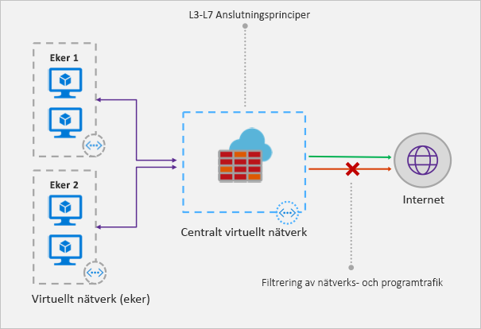

# Vad är Azure Firewall?

Azure Firewall är en hanterad, molnbaserad tjänst för nätverkssäkerhet som skyddar dina Azure Virtual Network-resurser. Det är en helt tillståndskänslig brandvägg som en tjänst med inbyggd hög tillgänglighet och obegränsad molnskalbarhet. 

Du kan centralt skapa, framtvinga och logga principer för tillämpning och nätverksanslutning över prenumerationer och virtuella nätverk. Azure Firewall använder en statisk offentlig IP-adress för din virtuella nätverksresurser som tillåter att externa brandväggar identifierar trafik som kommer från ditt virtuella nätverk.  Tjänsten är helt integrerad med Azure Monitor för loggning och analys.

## Funktioner

Azure Firewall erbjuder följande funktioner:

### Inbyggd hög tillgänglighet
Hög tillgänglighet är inbyggt, så det krävs inga ytterligare lastbalanserare och du behöver inte konfigurera något.

### Obegränsad molnskalbarhet 
Azure Firewall kan skala upp så mycket du behöver för att hantera föränderliga nätverkstrafikflöden, så du behöver inte budgetera för hög trafikbelastning.

### Programmets FQDN-filtreringsregler

Du kan begränsa utgående HTTP/S-trafik till en angiven lista med fullständigt kvalificerade domännamn (FQDN), inklusive jokertecken. Den här funktionen kräver inte SSL-avslutning.

### Regler för filtrering av nätverkstrafik

Du kan centralt skapa nätverksfiltreringsreglerna *tillåt* eller *neka* efter källans och målets IP-adress, port och protokoll. Azure Firewall är helt tillståndskänslig så att den kan identifiera legitima paket för olika typer av anslutningar. Regler tillämpas och loggas i flera prenumerationer och virtuella nätverk.

### FQDN-taggar

FQDN-taggar gör det enkelt att tillåta välkänd Azure-tjänstnätverkstrafik via brandväggen. Anta exempelvis att du vill tillåta Windows Update-nätverkstrafik via brandväggen. Du skapar en programregel och inkluderar Windows Update-taggen. Nätverkstrafik från Windows Update kan nu flöda genom brandväggen.

### Stöd för utgående SNAT

Alla IP-adresser för utgående trafik över virtuellt nätverk översätts till den offentliga Azure Firewall-IP-adressen (Source Network Address Translation). Du kan identifiera och tillåta trafik som kommer från ditt virtuella nätverk till fjärranslutna Internetmål.

### Stöd för inkommande DNAT

Inkommande nätverkstrafik till din brandväggs offentliga IP-adress översätts (Destination Network Address Translation) och filtreras till de privata IP-adresserna på dina virtuella nätverk. 

### Azure Monitor-loggning

Alla händelser är integrerade med Azure Monitor, vilket gör att du kan arkivera loggar till ett lagringskonto, strömma händelser till din händelsehubb eller skicka dem till Log Analytics.

## Kända problem

Azure Firewall har följande kända problem:

|Problem  |Beskrivning  |Åtgärd  |
|---------|---------|---------|
|Konflikt med Azure Security Center (ASC) Just-in-Time-funktionen (JIT)|Om åtkomst till en virtuell dator sker via JIT, och den är i ett undernät med en användardefinierad väg som pekar på Azure Firewall som en standard-gateway, fungerar inte ASC JIT. Det här är ett resultat av asymmetrisk routning – ett paket kommer in via den virtuella datorns offentliga IP-adress (JIT öppnade åtkomsten), men returnvägen är via brandväggen, som släpper paketet eftersom ingen session har upprättats i brandväggen.|Du kan kringgå problemet genom att placera de virtuella JIT-datorerna på ett separat undernät som inte har en användardefinierad väg till brandväggen.|
|Nav och ekrar med global peering fungerar inte|Modellen med nav och ekrar, där navet och brandväggen distribueras i en Azure-region och ekrarna är i en annan Azure-region, har inte stöd för anslutning via Global VNet-peering.|Mer information finns på sidan om att [skapa, ändra eller ta bort en virtuell nätverkspeering](https://docs.microsoft.com/azure/virtual-network/virtual-network-manage-peering#requirements-and-constraints)|
Nätverksfiltreringsregler för icke-TCP-/UDP-protokoll (till exempel ICMP) fungerar inte för Internetbunden trafik|Nätverksfiltreringsregler för icke-TCP-/UDP-protokoll fungerar inte med SNAT till din offentliga IP-adress. Icke-TCP-/UDP-protokoll stöds mellan ekerundernät och virtuella nätverk.|Azure Firewall använder Standard Load Balancer, [som för närvarande inte stöder SNAT för IP-protokoll](https://docs.microsoft.com/azure/load-balancer/load-balancer-standard-overview#limitations). Vi utforskar alternativ för att stödja det här scenariot i en framtida version.|
|Destination NAT (DNAT) fungerar inte för port 80 och 22.|Målportsfältet i NAT-regelsamlingen kan inte innehålla port 80 eller port 22.|Vi arbetar för att åtgärda detta inom en snar framtid. Under tiden kan du använda en annan port som målport i NAT-regler. Port 80 eller 22 kan fortfarande användas som den översatta porten (till exempel kan du mappa offentligt ip:81 till privat ip:80).|
|Saknat PowerShell- och CLI-stöd för ICMP|Azure PowerShell och CLI stöder inte ICMP som ett giltigt protokoll i nätverksregler.|Du kan fortfarande använda ICMP som protokoll via portalen och REST API. Vi jobbar på att lägga till ICMP i PowerShell och CLI snart.|
|FQDN-taggar kräver att protokoll: port anges|Programregler med FQDN-taggar kräver port: protokoll-definition.|Du kan använda **https** som port: protokoll-värde. Vi jobbar på att göra det här fältet valfritt när FQDN-taggar används.|
|Det går inte att flytta en brandvägg till en annan resursgrupp eller prenumeration.|Det går inte att flytta en brandvägg till en annan resursgrupp eller prenumeration.|Stöd för den här funktionen finns i vår planering. För att kunna flytta en brandvägg till en annan resursgrupp eller prenumeration måste du ta bort den aktuella instansen och återskapa den i den nya resursgruppen eller prenumerationen.|

## Nästa steg

- [Självstudie: Distribuera och konfigurera Azure Firewall med hjälp av Azure-portalen](tutorial-firewall-deploy-portal.md)
- [Distribuera Azure Firewall med hjälp av en mall](deploy-template.md)
- [Skapa en testmiljö för Azure Firewall](scripts/sample-create-firewall-test.md)

