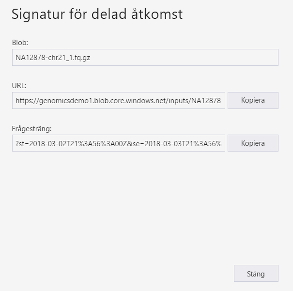
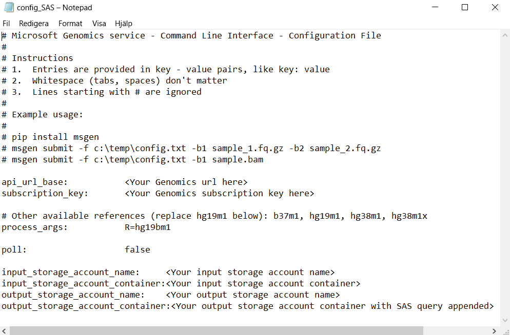

# <a name="submit-a-workflow-to-microsoft-genomics-using-a-sas-instead-of-a-storage-account-key"></a>Skicka ett arbetsflöde till Microsoft Genomics med en SAS istället för en lagringskontonyckel 

Den här artikeln visar hur du skickar ett arbets flöde till Microsoft Genomics tjänsten med hjälp av en config.txt-fil som innehåller [signaturer för delad åtkomst (SAS)](../storage/common/storage-sas-overview.md) i stället för lagrings konto nycklar. Den här funktionen är användbar om det finns några säkerhetsproblemen med lagringskontonyckeln som är synliga i filen config.txt. 

I den här artikeln förutsätts det att du redan har installerat och kört `msgen`-klienten och att du vet hur du använder Azure Storage. Om du har skickat ett arbets flöde med hjälp av de tillhandahållna exempel data, är du redo att fortsätta med den här artikeln. 

## <a name="what-is-a-sas"></a>Vad är en SAS?
En [signatur för delad åtkomst (Shared Access Signature, SAS)](../storage/common/storage-sas-overview.md) ger delegerad åtkomst till resurser på ditt lagringskonto. Med en SAS kan du bevilja åtkomst till resurser i ditt lagringskonto utan att dela dina kontonycklar. Det här är en viktig aspekt av att använda signaturer för delad åtkomst i dina program – en SAS är ett säkert sätt att dela dina lagringsresurser utan att kompromissa med lagringsnycklar.

SAS som skickas till Microsoft Genomics ska vara en [SAS för tjänst](/rest/api/storageservices/Constructing-a-Service-SAS) som endast delegerar åtkomst till bloben eller containern där indata- och utdatafiler lagras. 

URI:n för en SAS-token (signatur för delad åtkomst) består av resursens URI för vilken SAS delegerar åtkomst, följt av SAS-token. SAS-token är frågesträngen som innehåller all information som krävs för att autentisera SAS, samt för att ange resursen, de behörigheter som krävs för åtkomst, tidsintervallet då signaturen är giltig, IP-adresser eller adressintervallet som stöds från vilka begäran kan härstamma från, protokollet som stöds som en begäran kan göras med, en valfri principidentifierare för åtkomst som är kopplad till begäran och själva signaturen. 

## <a name="sas-needed-for-submitting-a-workflow-to-the-microsoft-genomics-service"></a>SAS som krävs för att skicka ett arbetsflöde till tjänsten Microsoft Genomics
Två eller fler SAS-token krävs för varje arbetsflöde som skickas till tjänsten Microsoft Genomics, en för varje indatafil och en för utdatacontainern.

SAS för indatafilerna ska ha följande egenskaper:
 - Omfattning (konto, container, blob): blob
 - Utgångsdatum: om 48 timmar
 - Behörigheter: läsa

SAS för utdatacontainern ska ha följande egenskaper:
 - Omfattning (konto, container, blob): container
 - Utgångsdatum: om 48 timmar
 - Behörigheter: läsa, skriva, ta bort


## <a name="create-a-sas-for-the-input-files-and-the-output-container"></a>Skapa en SAS för indatafiler och utdatacontainern
Det finns två sätt att skapa ett SAS-token, antingen med Azure Storage Explorer eller programmässigt.  Om du skriver kod kan du skapa ditt SAS själv, eller använda Azure Storage SDK:n på det språk du önskar.


### <a name="set-up-create-a-sas-using-azure-storage-explorer"></a>Konfigurera: Skapa en SAS med Azure Storage Explorer

[Azure Storage Explorer](https://azure.microsoft.com/features/storage-explorer/) är ett verktyg för att hantera resurser som du har lagrat i Azure Storage.  Du kan läsa mer om att använda Azure Storage Explorer [här](../vs-azure-tools-storage-manage-with-storage-explorer.md).

SAS för indatafilerna ska vara begränsad till den specifika indatafilen (bloben). Skapa en SAS-token genom att följa [anvisningarna](../storage/blobs/storage-quickstart-blobs-storage-explorer.md). När du har skapat SAS tillhandahålls en fullständig URL med både frågesträngen och frågesträngen fristående som kan kopieras från nästa skärm.

 


### <a name="set-up-create-a-sas-programmatically"></a>Konfigurera: skapa en SAS program mässigt

Om du vill skapa en SAS med Azure Storage SDK läser du den befintliga dokumentationen på flera språk, som [.NET](../storage/common/storage-sas-overview.md), [Python](../storage/blobs/storage-quickstart-blobs-python.md) och [Node.js](../storage/blobs/storage-quickstart-blobs-nodejs.md). 

Om du vill skapa en SAS utan SDK kan du skapa SAS-frågesträngen direkt, inklusive all nödvändig information för att autentisera din SAS. Dessa [instruktioner](/rest/api/storageservices/constructing-a-service-sas) innehåller information om komponenterna i SAS-frågesträngen och hur du skapar den. SAS-signaturen som krävs skapas via generering av en HMAC med blobens/containerns autentiseringsinformation, som beskrivs i de här [instruktionerna](/rest/api/storageservices/service-sas-examples).


## <a name="add-the-sas-to-the-configtxt-file"></a>Lägga till SAS till filen config.txt
Om du vill köra ett arbetsflöde via tjänsten Microsoft Genomics med en SAS-frågesträng redigerar du filen config.txt för att ta bort nycklarna från config.txt-filen. Lägg sedan till SAS-frågesträngen (som börjar med ett `?`) till utdatacontainerns namn, som du ser. 



Med Microsoft Genomics Python-klienten kan du skicka ditt arbetsflöde med följande kommando, och lägga till motsvarande SAS-frågesträng till varje sträng för varje inkommande blobnamn:

```python
msgen submit -f [full path to your config file] -b1 [name of your first paired end read file, SAS query string appended] -b2 [name of your second paired end read file, SAS query string appended]
```

### <a name="if-adding-the-input-file-names-to-the-configtxt-file"></a>Om du lägger till indatafilnamnet till filen config.txt
Namnen på de kopplade slutläsningsfilerna kan också läggas till direkt i filen config.txt, och token för SAS-fråga enligt nedan:


I det här fallet kan du använda Microsoft Genomics Python-klienten för att skicka ditt arbetsflöde med följande kommando, vilket utesluter kommandona `-b1` och `-b2`:

```python
msgen submit -f [full path to your config file] 
```

## <a name="next-steps"></a>Nästa steg
I den här artikeln har du använt SAS-token istället för kontonycklar för att skicka ett arbetsflöde till Microsoft Genomics-tjänsten via `msgen` Python-klienten. Ytterligare information om att skicka arbetsflöden och andra kommandon som du kan använda med tjänsten Microsoft Genomics finns i [vanliga frågor och svar](frequently-asked-questions-genomics.md).