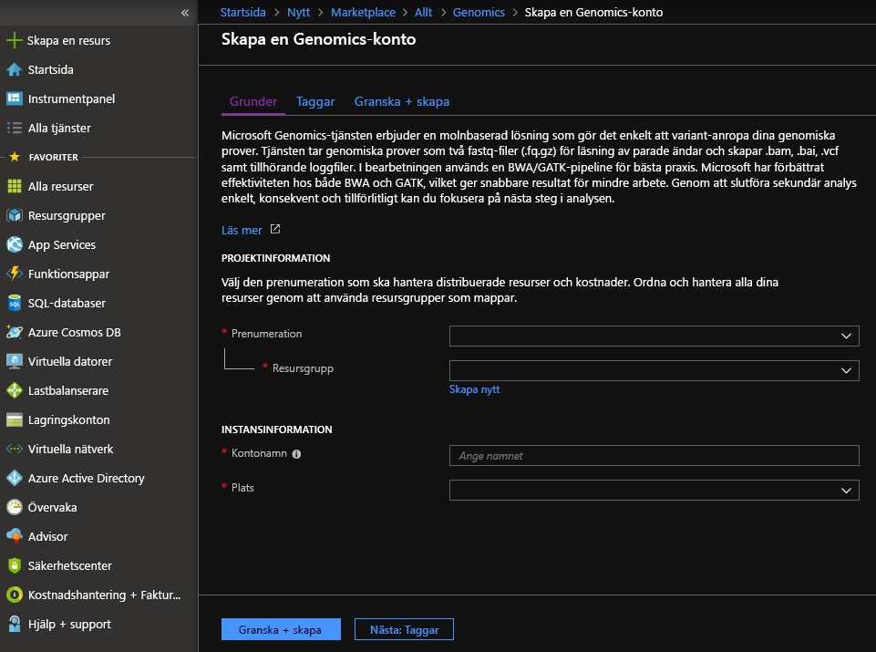
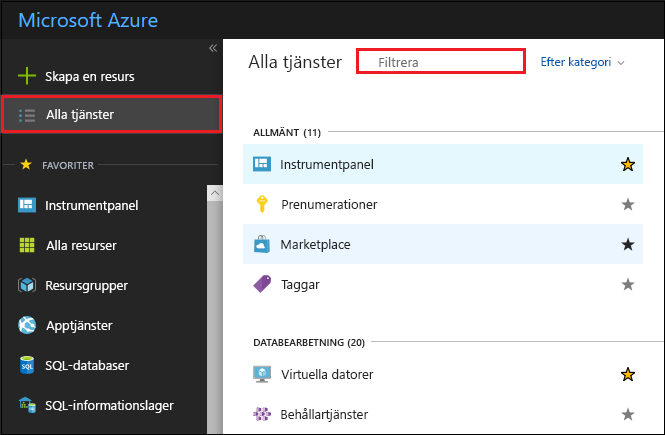
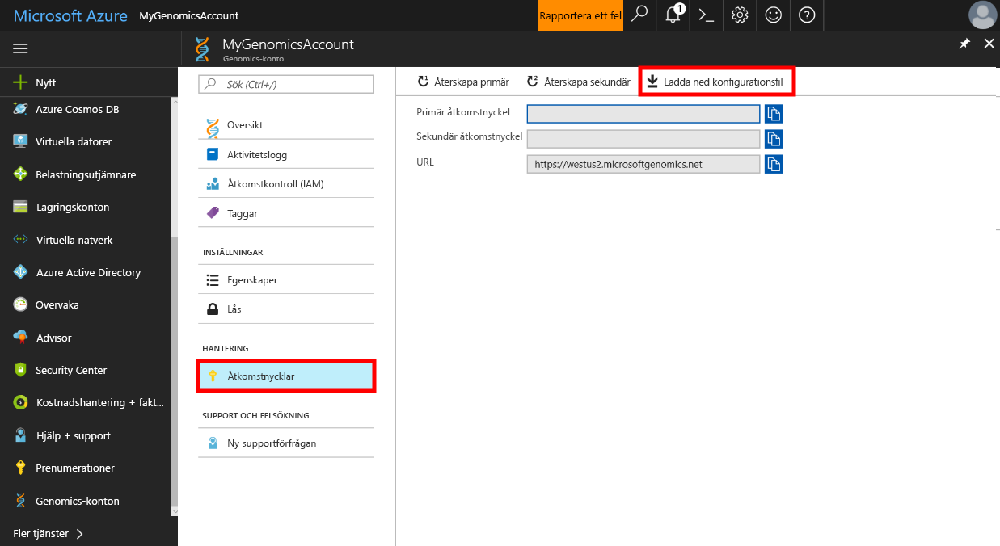
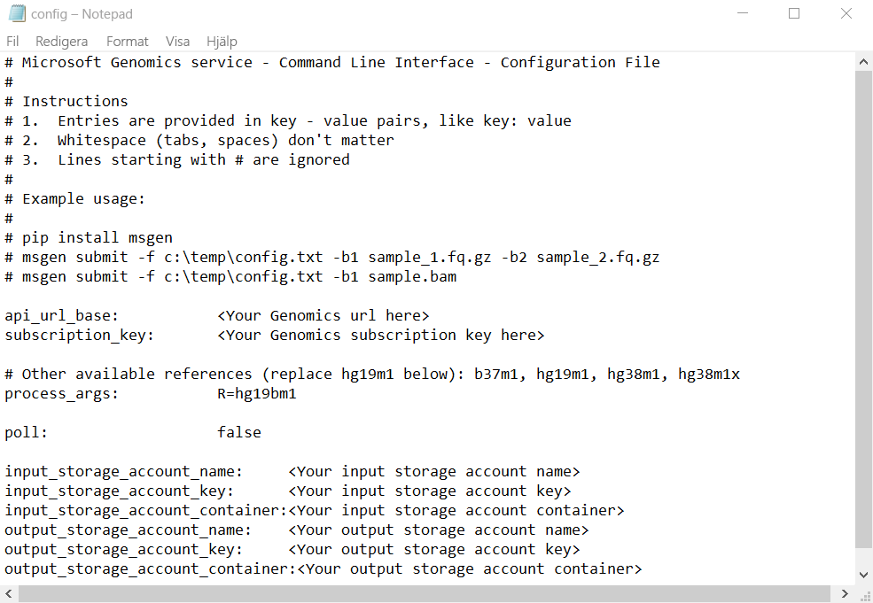

# <a name="quickstart-run-a-workflow-through-the-microsoft-genomics-service"></a>Snabbstart: Köra ett arbetsflöde genom Microsoft Genomics-tjänsten

I den här snabb starten laddar du upp indata till ett Azure Blob Storage-konto och kör ett arbets flöde via Microsoft Genomics tjänsten med hjälp av python-klienten för python. Microsoft Genomics är en skalbar, säker tjänst för sekundär analys som snabbt kan bearbeta ett genom, från råläsningar till produktion av anpassade läsningar och variantanrop. 

## <a name="prerequisites"></a>Förutsättningar

- Ett Azure-konto med en aktiv prenumeration. [Skapa ett konto kostnads fritt](https://azure.microsoft.com/free/?ref=microsoft.com&utm_source=microsoft.com&utm_medium=docs&utm_campaign=visualstudio). 
- [Python 2.7.12 +](https://www.python.org/downloads/release/python-2714/), med `pip` installerat och `python` i din system Sök väg. Den Microsoft Genomics klienten är inte kompatibel med python 3. 

## <a name="set-up-create-a-microsoft-genomics-account-in-the-azure-portal"></a>Konfigurera: Skapa ett Microsoft Genomics-konto på Azure Portal

Om du vill skapa ett Microsoft Genomics konto går du till [skapa ett genomik-konto](https://portal.azure.com/#create/Microsoft.Genomics) i Azure Portal. Om du ännu inte har en Azure-prenumeration kan du skapa en innan du skapar ett Microsoft Genomics-konto. 



Skapa ditt Genomics-konto med följande information (se föregående bild): 

 |**Inställning**          |  **Föreslaget värde**  | **Fältbeskrivning** |
 |:-------------       |:-------------         |:----------            |
 |Prenumeration         | Ditt prenumerationsnamn|Detta är faktureringsenheten för dina Azure-tjänster – mer information om din prenumeration finns under [Prenumerationer](https://account.azure.com/Subscriptions) |      
 |Resursgrupp       | MinResursgrupp       |  Resursgrupper gör att du kan gruppera flera Azure-resurser (lagringskonto, Genomics-konto, o.s.v.) i en enda grupp för enkel hantering. Mer information finns i [Resursgrupper](../azure-resource-manager/management/overview.md#resource-groups). Information om giltiga resursgruppnamn finns under [Namngivningsregler](/azure/architecture/best-practices/resource-naming) |
 |Kontonamn         | MittGenomicsKonto     |Välj ett unikt konto-ID. Se [Namngivningsregler](/azure/architecture/best-practices/resource-naming) för giltiga namn |
 |Plats                   | USA, västra 2                    |    Tjänsten är tillgänglig i USA, västra 2, Europa, västra och Sydostasien |

Du kan välja **meddelanden** i det övre meny fältet för att övervaka distributions processen.


Mer information om Microsoft Genomics finns i [Vad är Microsoft Genomics?](overview-what-is-genomics.md)

## <a name="set-up-install-the-microsoft-genomics-python-client"></a>Konfigurera: Installera Microsoft Genomics Python-klienten

Du måste installera både python och Microsoft Genomics python-klienten `msgen` i din lokala miljö. 

### <a name="install-python"></a>Installera Python

Microsoft Genomics python-klienten är kompatibel med python 2.7.12 eller en senare version av 2.7. xx. 2.7.14 är den föreslagna versionen. Du hittar nedladdningen [här](https://www.python.org/downloads/release/python-2714/). 

> [!IMPORTANT]
> Python 3.x är inte kompatibelt med Python 2.7.xx.  `msgen` är ett python 2,7-program. När du kör `msgen` kontrollerar du att din aktiva python-miljö använder en 2.7. xx-version av python. Du kan få fel meddelanden när du försöker använda `msgen` med en 3. x-version av python.

### <a name="install-the-microsoft-genomics-python-client-msgen"></a>Installera Microsoft Genomics python-klienten `msgen`

Använd python `pip` för att installera Microsoft Genomics-klienten `msgen` . Följande instruktioner förutsätter att Python2. x redan finns i System Sök vägen. Om du har problem med att `pip` installationen inte känns igen, måste du lägga till python och undermappen skript till din system Sök väg.

```
pip install --upgrade --no-deps msgen
pip install msgen
```

Om du inte vill installera `msgen` som en systemomfattande binärfil och ändra systemomfattande python-paket, använder du `–-user` flaggan med `pip` .
När du använder den Package-baserade installationen eller setup.py installeras alla nödvändiga paket.

### <a name="test-msgen-python-client"></a>Testa `msgen` python-klienten
Om du vill testa Microsoft Genomics klienten laddar du ned konfigurations filen från ditt genomik-konto. I Azure Portal navigerar du till ditt genomik-konto genom att välja **alla tjänster** längst upp till vänster och sedan söka efter och välja genomik-konton.



Välj det konto för genomik som du nyss har skapat, navigera till **åtkomst nycklar** och ladda ned konfigurations filen.



Kontrollera att Microsoft Genomics Python-klienten fungerar med följande kommando

```Python
msgen list -f "<full path where you saved the config file>"
```

## <a name="create-a-microsoft-azure-storage-account"></a>Skapa ett Microsoft Azure Storage konto 
I Microsoft Genomics-tjänsten förväntas indata lagras som blockblobar i ett Azure Storage-konto. Utdatafilerna skrivs också som blockblobar till en container som angetts av användaren i ett Azure Storage-konto. In- och utdata kan finnas i olika lagringskonton.
Om du redan har data i ett Azure Storage-konto behöver du bara se till att det finns på samma plats som Genomics-kontot. Annars uppstår utgående kostnader när Microsoft Genomicss tjänsten körs. Om du ännu inte har ett Azure Storage-konto måste du skapa ett och ladda upp dina data. Du hittar mer information om Azure Storage-konton [här](../storage/common/storage-account-create.md), inklusive vad ett lagrings konto är och vilka tjänster det tillhandahåller. Om du vill skapa ett Azure Storage-konto navigerar du till [skapa lagrings konto](https://portal.azure.com/#create/Microsoft.StorageAccount-ARM) i Azure Portal.  


Konfigurera ditt lagrings konto med följande information, som du ser i föregående bild. Använd de flesta standard alternativen för ett lagrings konto och ange endast att kontot är BlobStorage, inte generell användning. Blob-lagring kan vara 2–5 gånger snabbare för ned- och uppladdningar.  Standard distributions modellen Azure Resource Manager rekommenderas.  

 |**Inställning**          |  **Föreslaget värde**  | **Fältbeskrivning** |
 |:-------------------------       |:-------------         |:----------            |
 |Prenumeration         | Din Azure-prenumeration |Mer information om din prenumeration finns i [Prenumerationer](https://account.azure.com/Subscriptions) |      
 |Resursgrupp       | MinResursgrupp       |  Du kan välja samma resurs grupp som ditt genomik-konto. För giltiga resurs grupps namn, se [namngivnings regler](/azure/architecture/best-practices/resource-naming) |
 |Lagringskontonamn         | MittLagringskonto     |Välj ett unikt konto-ID. För giltiga namn, se [namngivnings regler](/azure/architecture/best-practices/resource-naming) |
 |Plats                  | USA, västra 2                  | Använd samma plats som platsen för ditt genomik-konto, för att minska utgående kostnader och minska svars tiden.  | 
 |Prestanda                  | Standard                   | Standardinställningen är Standard. Mer information om standard-och Premium lagrings konton finns i [Introduktion till Microsoft Azure Storage](../storage/common/storage-introduction.md)    |
 |Typ av konto       | BlobStorage       |  Blob-lagring kan vara 2–5 gånger snabbare än lagring generell användning för ned- och uppladdningar. |
 |Replikering                  | Lokalt redundant lagring                  | Med lokalt redundant lagring replikeras dina data i datacentret i den region där du har skapat ditt lagringskonto. Mer information finns i [Azure Storage replikering](../storage/common/storage-redundancy.md)    |
 |Åtkomstnivå                  | Frekvent                   | Frekvent åtkomst indikerar att objekten på lagringskontot kommer att användas oftare.    |

Välj sedan **Granska och skapa** för att skapa ditt lagrings konto. Precis som du gjorde när du skapade ditt genomik-konto kan du välja **meddelanden** i det övre meny fältet för att övervaka distributions processen. 

## <a name="upload-input-data-to-your-storage-account"></a>Ladda upp indata till ditt lagringskonto

Den Microsoft Genomics tjänsten förväntar sig kopplade slut läsningar (fastq-eller BAM-filer) som indatafiler. Du kan välja att antingen ladda upp dina egna data eller utforska med offentligt tillgängliga exempeldata som du får. Om du vill använda offentligt tillgängliga exempeldata finns de här:

[https://msgensampledata.blob.core.windows.net/small/chr21_1.fq.gz](https://msgensampledata.blob.core.windows.net/small/chr21_1.fq.gz)
[https://msgensampledata.blob.core.windows.net/small/chr21_2.fq.gz](https://msgensampledata.blob.core.windows.net/small/chr21_2.fq.gz)

I ditt lagringskonto måste du skapa en blob-container för dina indata och en andra blob-container för dina utdata.  Ladda upp indata till blob-containern för indata. Du kan använda olika verktyg för att göra detta, inklusive [Microsoft Azure Storage Explorer](https://azure.microsoft.com/features/storage-explorer/), [BlobPorter](https://github.com/Azure/blobporter)eller [AzCopy](../storage/common/storage-use-azcopy-v10.md?toc=%252fazure%252fstorage%252fblobs%252ftoc.json). 

## <a name="run-a-workflow-through-the-microsoft-genomics-service-using-the-msgen-python-client"></a>Köra ett arbets flöde via Microsoft Genomics tjänsten med `msgen` python-klienten

Om du vill köra ett arbets flöde via Microsoft Genomics tjänsten redigerar du *config.txt* -filen för att ange lagrings behållaren för indata och utdata för dina data.
Öppna *config.txt* -filen som du laddade ned från ditt genomik-konto. De avsnitt du behöver ange är prenumerations nyckeln och de sex objekten längst ned, lagrings kontots namn, nyckel och behållar namn för både indata och utdata. Du kan hitta den här informationen genom att navigera i Azure Portal för att **komma åt nycklar** för ditt lagrings konto, eller direkt från Azure Storage Explorer.  



Ange parametern till om du vill köra GATK4 `process_name` `gatk4` .

Som standard visar Genomics-tjänsten VCF-filer. Om du vill ha en gVCF-utdata i stället för en VCF-utmatning (motsvarar `-emitRefConfidence` i användas 3. x och `emit-ref-confidence` i användas 4. x) lägger du till `emit_ref_confidence` parametern till din *config.txt* och anger den till `gvcf` , som visas i föregående bild.  Om du vill ändra tillbaka till VCF-utdata tar du antingen bort den från *config.txt* -filen eller anger `emit_ref_confidence` parametern till `none` . 

`bgzip` är ett verktyg som komprimerar VCF-eller gvcf-filen och `tabix` skapar ett index för den komprimerade filen. Som standard körs Genomiks tjänsten `bgzip` följt av `tabix` på ". g. vcf"-utdata men kör inte dessa verktyg som standard för ". vcf"-utdata. När det körs genererar tjänsten ". gz" (bgzip output) och ". TBI" (tabix output). Argumentet är ett booleskt värde som är inställt på false som standard för ". vcf"-utdata och True som standard för utdata av typen ". g. vcf". Om du vill använda på kommando raden anger du `-bz` eller `--bgzip-output` som `true` (kör bgzip och tabix) eller `false` . Om du vill använda det här argumentet i *config.txt* -filen lägger `bgzip_output: true` du till eller `bgzip_output: false` till filen.

### <a name="submit-your-workflow-to-the-microsoft-genomics-service-using-the-msgen-python-client"></a>Skicka ditt arbets flöde till Microsoft Genomics tjänsten med `msgen` python-klienten

Använd Microsoft Genomics Python-klienten för att skicka ditt arbetsflöde med följande kommando:

```python
msgen submit -f [full path to your config file] -b1 [name of your first paired end read] -b2 [name of your second paired end read]
```

Du kan visa statusen för dina arbetsflöden med hjälp av följande kommando: 
```python
msgen list -f c:\temp\config.txt 
```

När arbets flödet har slutförts kan du Visa utdatafilerna i ditt Azure Storage-konto i behållaren för utdata som du har konfigurerat. 

## <a name="next-steps"></a>Nästa steg

I den här artikeln har du laddat upp exempel indata till Azure Storage och skickat ett arbets flöde till Microsoft Genomics tjänsten via `msgen` python-klienten. Mer information om andra typer av indatafiler som kan användas med Microsoft Genomics-tjänsten finns på följande sidor: [parad fastq](quickstart-input-pair-FASTQ.md)  |  [BAM](quickstart-input-BAM.md)  |  [Multiple fastq eller BAM](quickstart-input-multiple.md). Du kan också utforska den här självstudien med vårt [Azure Notebooks exempel](https://aka.ms/genomicsnotebook) genom att hämta filen "robots. ipynb" och använda en Notebook-läsare som [Jupyter](../notebooks/tutorial-create-run-jupyter-notebook.md) för att öppna filen och köra den.