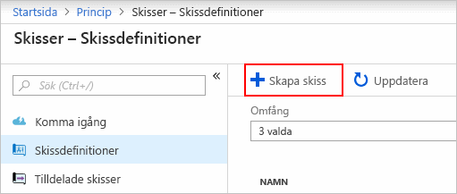
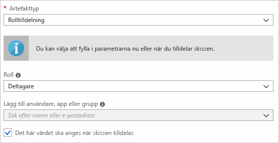
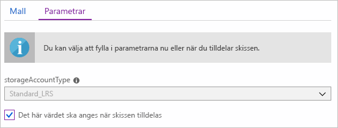
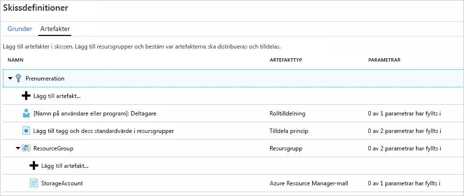
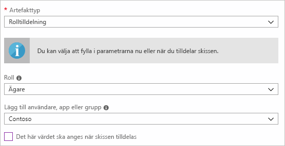
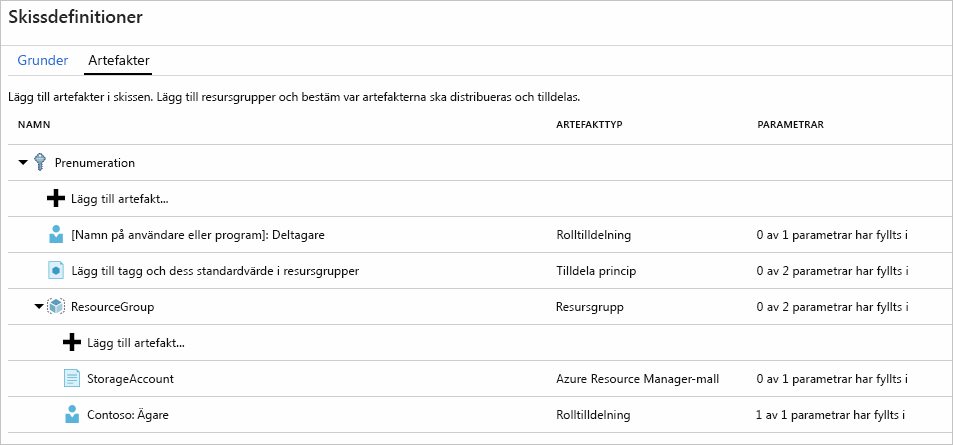
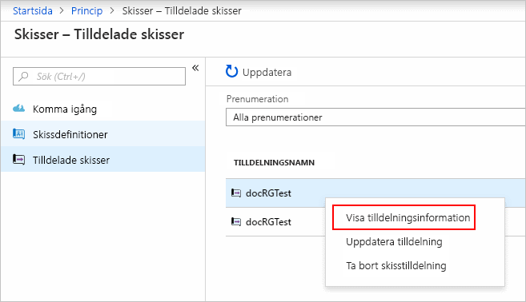

# <a name="define-and-assign-a-blueprint-in-the-portal"></a>Definiera och tilldela en skiss i portalen

När du lär dig hur du skapar och tilldelar skisser kan du definiera vanliga mönster för att utveckla återanvändbara och som snabbt kan konfigurationer baserat på Azure Resource Manager-mallar, principer, säkerhet och mer. I den här självstudien får du lära dig att använda Azure skisser utföra några av de vanliga uppgifter som rör skapa, publicera och tilldela en skiss inom din organisation. Dessa åtgärder omfattar:

> [!div class="checklist"]
> - Skapa en ny skiss och lägga till olika artefakter som stöds
> - Göra ändringar i en befintlig skiss som fortfarande har **utkaststatus**
> - Markera en skiss som redo att tilldelas med **Publicerad**
> - Tilldela en skiss till en befintlig prenumeration
> - Kontrollera statusen och förloppet för en tilldelad skiss
> - Ta bort en skiss som en prenumeration har tilldelats

Om du inte har en Azure-prenumeration kan du skapa ett [kostnadsfritt konto](https://azure.microsoft.com/free) innan du börjar.

## <a name="create-a-blueprint"></a>Skapa en skiss

Det första steget när du definierar ett standardmönster för efterlevnad är att skapa en skiss från de tillgängliga resurserna. I det här exemplet skapar du en ny skiss med namnet **MyBlueprint** konfigurera roll och principtilldelningar för prenumerationen. Sedan lägger du till en ny resursgrupp och skapa en tilldelning av Resource Manager-mallen och rollen på den nya resursgruppen.

1. Välj **Alla tjänster** i den vänstra rutan. Sök efter och välj **Skisser**.

1. Välj **skiss definitioner** från sidan till vänster och välj den **+ skapa skiss** längst upp på sidan.

   Eller välj **skapa** från den **komma igång** sidan om du vill gå direkt till att skapa en skiss.

   

1. Ange en **skissnamn** som **MyBlueprint**. (Använd upp till 48 bokstäver och siffror, men inga blanksteg eller specialtecken). Lämna **skiss beskrivning** tomt tills vidare.

1. I den **definitionsplats** rutan väljer du de tre punkterna till höger, Välj den [hanteringsgruppen](../management-groups/overview.md) eller en prenumeration där du vill spara skissen och välj **Välj**.

1. Kontrollera att informationen är korrekt. Den **skissnamn** och **definitionsplats** fält kan inte ändras senare. Välj sedan **nästa: Artefakter** längst ned på sidan eller på fliken **Artefakter** högst upp på sidan.

1. Lägg till en rolltilldelning på prenumerationsnivå:

   1. Välj den **+ Lägg till artefakt** rad **prenumeration**. Den **Lägg till artefakt** öppnas på höger sida i webbläsaren.

   1. Välj **rolltilldelning** för **artefakttypen**.

   1. Under **rollen**väljer **deltagare**. Lämna den **Lägg till användare, app eller grupp** med kryssrutan som anger en dynamisk parameter.

   1. Välj **Lägg till** att lägga till den här artefakten i skissen.

   

   > [!NOTE]
   > De flesta artefakter stöder parametrar. En parameter som har tilldelats ett värde under skissen skapandet är en *Statiska parametern*. Om parametern har tilldelats under skisstilldelningen, det är en *dynamisk parameter*. Mer information finns [Skissparametrar](./concepts/parameters.md).

1. Lägg till en principtilldelning på prenumerationsnivå:

   1. Välj den **+ Lägg till artefakt** rad under rolltilldelningsartefakten.

   1. Välj **principtilldelning** för **artefakttypen**.

   1. Ändra **typ** till **inbyggda**. I **Search**, ange **taggen**.

   1. Klicka på **Sök** om du vill genomföra filtrering. Välj **Lägg till tagg och dess standardvärde i resursgrupper**.

   1. Välj **Lägg till** att lägga till den här artefakten i skissen.

1. Välj raden i principtilldelningen **Lägg till tagg och dess standardvärde i resursgrupper**.

1. Fönstret för att ange parametrar för att artefakten som en del av skissdefinitionen öppnas och kan använda för att ange parametrarna för alla tilldelningar (statisk parametrar) baserat på den här skissen i stället för under tilldelningen (dynamiska parametrar). Det här exemplet använder dynamiska parametrar under skisstilldelningen, så vi standardinställningar och välj **Avbryt**.

1. Lägg till en resursgrupp på prenumerationsnivå:

   1. Välj den **+ Lägg till artefakt** rad **prenumeration**.

   1. Välj **resursgrupp** för **artefakttypen**.

   1. Lämna den **artefakt visningsnamn**, **Resursgruppsnamn**, och **plats** rutorna tom, men se till att kryssrutan är markerad för varje parameter-egenskap så att de dynamiska parametrar.

   1. Välj **Lägg till** att lägga till den här artefakten i skissen.

1. Lägga till en mall under resursgrupp:

   1. Välj den **+ Lägg till artefakt** rad den **ResourceGroup** posten.

   1. Välj **Azure Resource Manager-mall** för **artefakttypen**anger **artefakt visningsnamn** till **StorageAccount**, och lämna  **Beskrivning av** tom.

   1. Klistra in följande Resource Manager-mall i redigeringsrutan på fliken **Mall**.
      När du klistrar in mallen, väljer du den **parametrar** fliken och Observera att mallparametrarna **storageAccountType** och **plats** upptäcktes. Varje parameter har automatiskt identifierade fylls i och konfigurerad som en dynamisk parameter.

      > [!IMPORTANT]
      > Om du importerar mallen, kontrollera att filen är endast JSON och innehåller inte HTML. När du är du pekar på en URL på GitHub, se till att du har valt **RAW** få ren JSON-filen och inte en paketerad HTML för visning på GitHub. Ett fel inträffar om den importerade mallen inte är ren JSON.

      ```json
      {
          "$schema": "https://schema.management.azure.com/schemas/2015-01-01/deploymentTemplate.json#",
          "contentVersion": "1.0.0.0",
          "parameters": {
              "storageAccountType": {
                  "type": "string",
                  "defaultValue": "Standard_LRS",
                  "allowedValues": [
                      "Standard_LRS",
                      "Standard_GRS",
                      "Standard_ZRS",
                      "Premium_LRS"
                  ],
                  "metadata": {
                      "description": "Storage Account type"
                  }
              },
              "location": {
                  "type": "string",
                  "defaultValue": "[resourceGroup().location]",
                  "metadata": {
                      "description": "Location for all resources."
                  }
              }
          },
          "variables": {
              "storageAccountName": "[concat('store', uniquestring(resourceGroup().id))]"
          },
          "resources": [{
              "type": "Microsoft.Storage/storageAccounts",
              "name": "[variables('storageAccountName')]",
              "location": "[parameters('location')]",
              "apiVersion": "2018-07-01",
              "sku": {
                  "name": "[parameters('storageAccountType')]"
              },
              "kind": "StorageV2",
              "properties": {}
          }],
          "outputs": {
              "storageAccountName": {
                  "type": "string",
                  "value": "[variables('storageAccountName')]"
              }
          }
      }
      ```

   1. Rensa den **storageAccountType** kryssrutan och Observera att den nedrullningsbara listan innehåller endast de värden som ingår i Resource Manager-mallen under **allowedValues**. Markera kryssrutan om du vill ställa tillbaka till en dynamisk parameter.

   1. Välj **Lägg till** att lägga till den här artefakten i skissen.

   

1. Din färdiga skiss bör se ut som i det följande. Observera att varje artefakten har  **_x_ av _y_ parametrar har fyllts i** i den **parametrar** kolumn. Dynamiska parametrar anges under varje tilldelning av skissen.

   

1. Nu när alla planerade artefakter har lagts till, Välj **spara utkast** längst ned på sidan.

## <a name="edit-a-blueprint"></a>Redigera en skiss

I [skapa en skiss](#create-a-blueprint), du inte ange en beskrivning eller lägga till rolltilldelningen i den nya resursgruppen. Du kan åtgärda både genom att följa dessa steg:

1. Välj **Skissdefinitioner** till vänster på sidan.

1. I listan över skisser, högerklickar du på det som du skapade tidigare och välj **redigera skiss**.

1. I **Skissbeskrivning** anger du information om skissen och de artefakter som ingår i den. I det här fallet kan du skriva något som liknar följande: **Denna skiss anger taggtilldelningen för principen och rollen på prenumerationen, skapar en resursgrupp och distribuerar en resurstilldelning för mallen och rollen till den resursgruppen.**

1. Välj **Nästa: Artefakter** längst ned på sidan eller på fliken **Artefakter** högst upp på sidan.

1. Lägg till en rolltilldelning under resursgrupp:

   1. Välj den **+ Lägg till artefakt** rad direkt under den **ResourceGroup** posten.

   1. Välj **rolltilldelning** för **artefakttypen**.

   1. Under **rollen**väljer **ägare**, och avmarkera kryssrutan under den **Lägg till användare, app eller grupp** box.

   1. Sök efter och välj en användare, app eller grupp att lägga till. Den här artefakten använder en statisk parameteruppsättning samma i alla tilldelningar för skissen.

   e. Välj **Lägg till** att lägga till den här artefakten i skissen.

   

1. Din färdiga skiss bör se ut som i det följande. Lägg märke till att nyligen tillagda rolltilldelningen visar **1 av 1 parametrar har fyllts i**. Det innebär att det är en statisk parameter.

   

1. Välj **spara utkast** nu när den har uppdaterats.

## <a name="publish-a-blueprint"></a>Publicera en skiss

Nu när alla de planerade artefakterna har lagts till i skissen är det dags att publicera den.
Publicering gör skissen tillgängliga som ska tilldelas till en prenumeration.

1. Välj **Skissdefinitioner** till vänster på sidan.

1. I listan över skisser, högerklickar du på det som du skapade tidigare och välj **publicera skiss**.

1. I fönstret som öppnas anger du en **Version** (bokstäver, siffror och bindestreck med en maximal längd på 20 tecken), till exempel **v1**. Du kan också ange text i **ändra anteckningar**, till exempel **först publicera**.

1. Välj **publicera** längst ned på sidan.

## <a name="assign-a-blueprint"></a>Tilldela en skiss

När en skiss har publicerats kan kan den tilldelas till en prenumeration. Tilldela skissen som du skapade till någon av prenumerationerna under din grupphierarki för hantering. Om skissen sparas till en prenumeration kan den endast tilldelas till den prenumerationen.

1. Välj **Skissdefinitioner** till vänster på sidan.

1. I listan över skisser, högerklickar du på det som du skapade tidigare (eller välj ellipsen) och välj **tilldela skissen**.

1. På den **tilldela skissen** sidan den **prenumeration** listrutan, väljer de prenumerationer som du vill distribuera den här skissen till.

   Om det finns Enterprise-erbjudanden som stöds tillgängliga från [Azure-fakturering](../../billing/index.md) aktiveras länken **Skapa nytt** under rutan **Prenumeration**. Följ de här stegen:

   1. Välj länken **Skapa nytt** för att skapa en ny prenumeration i stället för att välja befintliga.

   1. Ange ett **Visningsnamn** för den nya prenumerationen.

   1. Välj de tillgängliga **erbjuder** från den nedrullningsbara listan.

   1. Använd de tre punkterna för att välja den [hanteringsgruppen](../management-groups/index.md) att prenumerationen är en underordnad.

   1. Välj **Skapa** längst ned på sidan.

   

   > [!IMPORTANT]
   > Ny prenumeration skapas direkt när du har valt **skapa**.

   > [!NOTE]
   > En uppgift skapas för varje prenumeration som du väljer. Du kan ändra en enskild prenumeration tilldelning vid ett senare tillfälle utan tvingande ändringar på resten av de valda prenumerationerna.

1. För **tilldelningsnamn**, ange ett unikt namn för den här tilldelningen.

1. I **plats**, Välj en region för den hanterade identitet och prenumeration distributionsobjektet skapas i. Azure Blueprint använder den här hanterade identiteten för att distribuera alla artefakter i den tilldelade skissen. Mer information finns i [Hanterade identiteter för Azure-resurser](../../active-directory/managed-identities-azure-resources/overview.md).

1. Lämna den **skissen definitionsversion** listrutan val av **publicerad** versioner på den **v1** posten. (Standard är den senast publicerade versionen.)

1. Låt standardvärdet **Lås inte** vara för **Lås tilldelning**. Mer information finns i [skisser resource låsning](./concepts/resource-locking.md).

   

1. Under **hanterade identiteter**, låt standardvärdet **systemtilldelad**.

1. Rolltilldelningen på prenumerationsnivå **[Användargrupp eller programnamn]: Deltagare**, sök efter och välj en användare, en app eller en grupp.

1. Prenumeration på principtilldelning, ange **taggnamnet** till **CostCenter** och **Taggvärdet** till **ContosoIT**.

1. För **ResourceGroup**, ange en **namn** av **StorageAccount** och en **plats** av **östra USA 2** från listrutan.

   > [!NOTE]
   > För varje artefakt som du har lagt till under resursgrupp under skissdefinitionen dras in den artefakten så att den överensstämmer med den resursgrupp eller det objekt som du distribuerar den med.
   > Artefakter som antingen inte parametrar eller har inga parametrar definieras vid tilldelning visas endast för kontextinformation.

1. På Azure Resource Manager-mallen **StorageAccount**väljer **Standard_GRS** för den **storageAccountType** parametern.

1. Läs informationsrutan längst ned på sidan och välj sedan **tilldela**.

## <a name="track-deployment-of-a-blueprint"></a>Spåra distributionen av en skiss

När en skiss har tilldelats till en eller flera prenumerationer händer två saker:

- Skissen har lagts till i den **tilldelade skisser** för varje prenumeration.
- Processen för att distribuera alla artefakter som definieras av skissen börjar.

Nu när skissen har tilldelats till en prenumeration, kontrollera förloppet för distributionen:

1. Välj **Tilldelade skisser** på sidan till vänster.

1. I listan över skisser, högerklickar du på det som du tidigare tilldelat och välj **visa tilldelningsinformation**.

   

1. På den **skiss tilldelning** sidan, verifiera att alla artefakter har distribuerats och att det fanns inga fel under distributionen. Om fel som inträffat [felsökning skisser](./troubleshoot/general.md) för åtgärder för att avgöra vad som gick fel.

## <a name="unassign-a-blueprint"></a>Ta bort en skisstilldelning

Om du inte längre behöver en skisstilldelningen kan du ta bort den från en prenumeration. Skissen kanske har ersatts av en nyare skiss med uppdaterade mönster, principer och design. När en skiss tas bort blir artefakterna som tilldelats som en del av skissen kvar. Följ dessa steg om du vill ta bort en skisstilldelning:

1. Välj **Tilldelade skisser** på sidan till vänster.

1. I listan över skisser, väljer du den modell som du vill ta bort tilldelningen. Välj sedan den **otilldelad skissen** längst upp på sidan.

1. Läs bekräftelsemeddelandet och välj sedan **OK**.

## <a name="delete-a-blueprint"></a>Ta bort en skiss

1. Välj **Skissdefinitioner** till vänster på sidan.

1. Högerklicka på det som du vill ta bort och välj **ta bort skissen**. Välj sedan **Ja** i den bekräftande dialogrutan.

> [!NOTE]
> Tar bort en skiss i den här metoden tar även bort alla publicerade versioner av valda skissen.
> Ta bort en version genom att öppna skissen, Välj den **publicerade versioner** väljer du den version som du vill ta bort och välj sedan **ta bort den här versionen**. Dessutom kan du ta bort en skiss förrän du har tagit bort alla skisstilldelningen av den skissdefinitionen.

## <a name="next-steps"></a>Nästa steg

- Lär dig mer om den [skiss livscykel](./concepts/lifecycle.md).
- Förstå hur du använder [statiska och dynamiska parametrar](./concepts/parameters.md).
- Lär dig hur du anpassar [sekvensordningen för en skiss](./concepts/sequencing-order.md).
- Lär dig hur du använder [resurslåsning för en skiss](./concepts/resource-locking.md).
- Lär dig hur du [uppdaterar befintliga tilldelningar](./how-to/update-existing-assignments.md).
- Lös problem som kan uppstå vid tilldelningen av en skiss med [allmän felsökning](./troubleshoot/general.md).