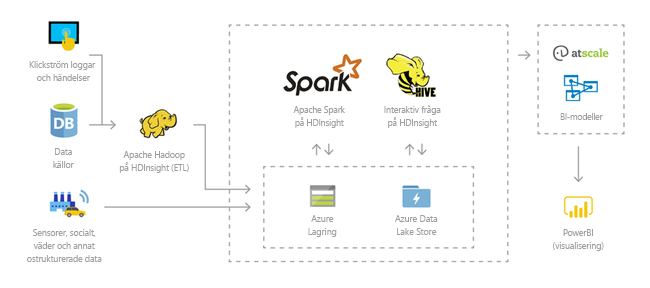
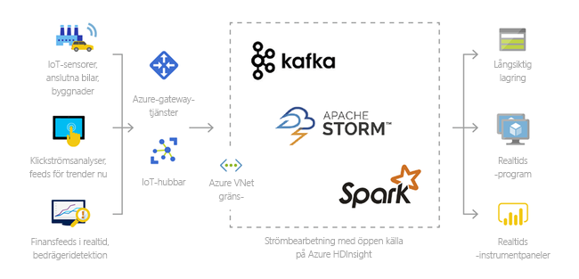
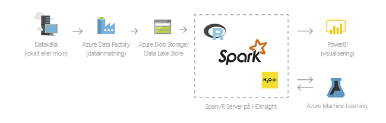

# Vad är AzureHDInsight och Hadoop-teknikstacken

Den här artikeln ger en introduktion till Apache Hadoop i Azure HDInsight. Azure HDInsight är en fullständigt hanterad analystjänst med fullständigt spektrum med öppen källkod för företag. Du kan använda ramverk baserade på öppen källkod, till exempel Hadoop, Spark, Hive, LLAP, Kafka, Storm, R med flera. 

[!INCLUDE [hdinsight-price-change](../../../includes/hdinsight-enhancements.md)]

## Vad är HDInsight och Hadoop-teknikstacken?

[Apache Hadoop](http://hadoop.apache.org/) refererar till ett ekosystem av program med öppen källkod som är ett ramverk för distribuerad bearbetning och analys av stordata-uppsättningar i kluster. Hadoop-teknikstacken innehåller relaterade program och verktyg, inklusive Apache Hive, HBase, Spark, Kafka och många andra.

Azure HDInsight är en molndistribution av Hadoop-komponenter från [Hortonworks Data Platform (HDP)](https://hortonworks.com/products/data-center/hdp/). Med Azure HDInsight kan du bearbeta stora mängder data på ett enkelt, snabbt och kostnadseffektivt sätt. Du kan använda de mest populära ramverken baserade på öppen källkod, till exempel Hadoop, Spark, Hive, LLAP, Kafka, Storm, R med flera. Med de här ramverken möjliggörs en mängd olika scenarier, t.ex. extrahering, transformering och inläsning (ETL), informationslagerhantering, maskininlärning och IoT.

Mer information om tillgängliga stackkomponenter med Hadoop-teknik i HDInsight finns i [Komponenter och versioner som är tillgängliga med HDInsight][component-versioning]. Mer information om Hadoop i HDInsight finns på [sidan om Azure-funktioner för HDInsight](https://azure.microsoft.com/services/hdinsight/).

## Vad är stordata?

Stordata samlas in i ständigt växande volymer, med allt högre hastighet och i fler olika format än någonsin tidigare. De kan vara historiska (dvs. lagrade) eller realtidsdata (vilket innebär att de strömmas direkt från källan). Under [Scenarier för att använda HDInsight](#scenarios-for-using-hdinsight) kan du läsa mer om vanliga användningsområden för stordata.

## Varför ska jag använda Hadoop i HDInsight?

Det här avsnittet visar funktionerna i Azure HDInsight.

|Funktion  |Beskrivning  |
|---------|---------|
|Molnbaserat     |     Med Azure HDInsight kan du skapa optimerade kluster för [Hadoop](apache-hadoop-linux-tutorial-get-started.md), [Spark](../spark/apache-spark-jupyter-spark-sql.md), [Interactive query (LLAP)](../interactive-query/apache-interactive-query-get-started.md), [Kafka](../kafka/apache-kafka-get-started.md), [Storm](../storm/apache-storm-tutorial-get-started-linux.md), [HBase](../hbase/apache-hbase-tutorial-get-started-linux.md) och  [ML Services](../r-server/r-server-get-started.md) i Azure. HDInsight tillhandahåller även ett serviceavtal från slutpunkt till slutpunkt för alla produktionsarbetsbelastningar.  |
|Billigt och skalbart     | Med HDInsight kan du [skala](../hdinsight-administer-use-portal-linux.md)  upp eller ned arbetsbelastningar. Du kan minska kostnaderna genom att  [skapa kluster på begäran](../hdinsight-hadoop-create-linux-clusters-adf.md) och endast betala för det som du använder. Du kan också skapa datapipelines för att operationalisera dina jobb. Frikopplad beräkning och lagring ger bättre prestanda och flexibilitet. |
|Säkert och följer standarder    | Med HDInsight kan du skydda företagets datatillgångar med [Azure Virtual Network](../hdinsight-extend-hadoop-virtual-network.md), [kryptering](../hdinsight-hadoop-create-linux-clusters-with-secure-transfer-storage.md) och integrering med [Azure Active Directory](../domain-joined/apache-domain-joined-introduction.md). HDInsight uppfyller också de vanligaste [efterlevnadskraven](https://azure.microsoft.com/overview/trusted-cloud) för olika branscher och myndigheter.        |
|Övervakning    | Azure HDInsight kan integreras med [Azure Log Analytics](../hdinsight-hadoop-oms-log-analytics-tutorial.md) så att du får ett enda gränssnitt som du kan använda för att övervaka alla dina kluster.        |
|Global tillgänglighet | HDInsight är tillgängligt i fler  [regioner](https://azure.microsoft.com/regions/services/) än något annat erbjudande för stordataanalys. Azure HDInsight är också tillgängligt i Azure Government, Kina och Tyskland så att du kan uppfylla företagets behov i viktiga områden. |  
|Produktivitet     |  Med Azure HDInsight kan du använda omfattande produktiva verktyg för Hadoop och Spark med de utvecklingsmiljöer du föredrar. Dessa utvecklingsmiljöer omfattar stöd för [Visual Studio](apache-hadoop-visual-studio-tools-get-started.md), [VSCode](../hdinsight-for-vscode.md), [Eclipse](../spark/apache-spark-eclipse-tool-plugin.md) och [IntelliJ](../spark/apache-spark-intellij-tool-plugin.md) för Scala, Python, R, Java och .NET. Dataexperter kan också samarbeta med vanliga anteckningsböcker som [Jupyter](../spark/apache-spark-jupyter-notebook-kernels.md) och [Zeppelin](../spark/apache-spark-zeppelin-notebook.md).    |
|Utökningsbarhet     |  Du kan utöka HDInsight-klustren genom att installera komponenter (Hue, Presto osv.) med hjälp av [skriptåtgärder](../hdinsight-hadoop-customize-cluster-linux.md), genom att [lägga till gränsnoder](../hdinsight-apps-use-edge-node.md) eller genom [integrering med andra stordatacertifierade program](../hdinsight-apps-install-applications.md). HDInsight ger enkel integrering med de vanligaste stordatalösningarna med distribution med [ett klick](https://azure.microsoft.com/services/hdinsight/partner-ecosystem/).|

## Scenarier för att använda HDInsight

Azure HDInsight kan användas inom olika scenarier inom stordatabearbetning. Det kan vara historiska data (data som redan har samlats in och lagrats) eller realtidsdata (data som strömmas direkt från källan). Dessa scenarier för bearbetning av sådana data kan sammanfattas i följande kategorier: 

### Batchbearbetning (ETL)

Extrahering, transformering och laddning (ETL) är en process där ostrukturerade eller strukturerade data extraheras från heterogena datakällor. De transformeras sedan till ett strukturerat format och laddas in i ett datalager. Du kan använda transformerade data för datavetenskap eller datalagerhantering.

### Datalagerhantering

Du kan använda HDInsight för att köra interaktiva frågor i petabyte-skala på strukturerade eller ostrukturerade data i valfritt format. Du kan också skapa modeller för att koppla dem till BI-verktyg. Om du vill ha mer information kan du [läsa den här kundberättelsen](https://customers.microsoft.com/story/milliman). 

### Sakernas Internet (IoT)

Du kan använda HDInsight för att bearbeta strömmande data som tas emot i realtid från olika enheter. Om du vill ha mer information kan du [läsa det här blogginlägget från Azure som tillkännager den offentliga förhandsversionen av Apache Kafka på HDInsight med Azure Managed Disks](https://azure.microsoft.com/blog/announcing-public-preview-of-apache-kafka-on-hdinsight-with-azure-managed-disks/).

 

### Data science

Du kan använda HDInsight för att skapa program som utvinner viktiga insikter från data. Du kan också använda Azure Machine Learning ovanpå detta för att förutspå framtida trender för din verksamhet. Om du vill ha mer information kan du [läsa den här kundberättelsen](https://customers.microsoft.com/story/pros).

### Hybrid

Med HDInsight kan du utöka din befintliga lokala infrastruktur för stordata till Azure så att du kan dra nytta av avancerade analysfunktioner i molnet.

## Klustertyper i HDInsight
HDInsight omfattar specifika klustertyper och anpassningsmöjligheter för klustret, till exempel funktioner för att lägga till komponenter, verktyg och språk. HDInsight erbjuder följande klustertyper:

* **[Apache Hadoop](https://wiki.apache.org/hadoop)**: Ett ramverk som använder [HDFS](#hdfs), [YARN](#yarn)-resurshantering och en enkel [MapReduce](#mapreduce)-programmeringsmodell för att behandla och analysera batchdata parallellt.

* **[Apache Spark](http://spark.apache.org/)**: Ett ramverk för parallellbearbetning med öppen källkod som stöder intern bearbetning för att höja prestandan hos program för stordataanalys. Se [Vad är Apache Spark i HDInsight?](../spark/apache-spark-overview.md)

* **[Apache HBase](http://hbase.apache.org/)**: En NoSQL-databas som bygger på Hadoop och ger direktåtkomst och stark konsekvens för stora mängder ostrukturerade och delstrukturerade data, potentiellt miljarder rader gånger miljoner kolumner. Se [Vad är HBase på HDInsight?](../hbase/apache-hbase-overview.md)

* **[ML Services](https://msdn.microsoft.com/microsoft-r/rserver)**: En server som fungerar som värd och hanterar parallella, distribuerade R-processer. Den förser på begäran dataforskare, statistiker och R-programmerare med åtkomst till skalbara och distribuerade analysmetoder på HDInsight. Se [Översikt över ML Services på HDInsight](../r-server/r-server-overview.md).

* **[Apache Storm](https://storm.incubator.apache.org/)**: Ett distribuerat system för beräkningar i realtid för snabb bearbetning av stora dataströmmar. Storm finns som ett hanterat kluster i HDInsight. Se [Analysera sensordata i realtid med Storm och Hadoop](../storm/apache-storm-sensor-data-analysis.md).

* **[Apache Interactive Query-förhandsgranskning (även kallat: Live Long and Process)](https://cwiki.apache.org/confluence/display/Hive/LLAP)**: Minnesintern cachelagring för interaktiva och snabba Hive-frågor. Se [Använda Interactive Query i HDInsight](../interactive-query/apache-interactive-query-get-started.md).

* **[Apache Kafka](https://kafka.apache.org/)**: En öppen källkodsplattform som används för att skapa strömmande datapipelines och program. Kafka tillhandahåller även en meddelandeköfunktion med vilken du kan publicera och prenumerera på dataströmmar. Se [Introduktion till Apache Kafka på HDInsight](../kafka/apache-kafka-introduction.md).

## Komponenter med öppen källkod i HDInsight

Med Azure HDInsight kan du skapa kluster med ramverk med öppen källkod, till exempel Hadoop, Spark, Hive, LLAP, Kafka, Storm, HBase och R. Dessa kluster har som standard andra komponenter med öppen källkod som ingår i klustret, till exempel [Ambari](https://github.com/apache/ambari/blob/trunk/ambari-server/docs/api/v1/index.md), [Avro](http://avro.apache.org/docs/current/spec.html), [Hive](http://hive.apache.org), [HCatalog](https://cwiki.apache.org/confluence/display/Hive/HCatalog/), [Mahout](https://mahout.apache.org/), [MapReduce](http://wiki.apache.org/hadoop/MapReduce), [YARN](http://hadoop.apache.org/docs/current/hadoop-yarn/hadoop-yarn-site/YARN.html), [Phoenix](http://phoenix.apache.org/), [Pig](http://pig.apache.org/), [Sqoop](http://sqoop.apache.org/), [Tez](http://tez.apache.org/), [Oozie](http://oozie.apache.org/) och [ZooKeeper](http://zookeeper.apache.org/).  

## Programmeringsspråk i HDInsight
HDInsight-kluster, inklusive Hadoop, HBase, Kafka, Spark med flera, stöder ett antal programmeringsspråk. Vissa programmeringsspråk är inte installerade som standard. När det gäller bibliotek, moduler eller paket som inte är installerade som standard [använder du en skriptåtgärd för att installera komponenten](../hdinsight-hadoop-script-actions-linux.md).

|Programmeringsspråk  |Information  |
|---------|---------|
|Programmeringsspråk som stöds som standard     | Som standard stöder HDInsight-kluster:<ul><li>Java</li><li>Python</li></ul> Du kan installera ytterligare språk med [skriptåtgärder](../hdinsight-hadoop-script-actions-linux.md).       |
|Java Virtual Machine-språk (JVM)     | Många andra språk än Java kan köras på en Java Virtual Machine (JVM). Om du kör vissa av dessa språk kan det dock hända att du måste installera ytterligare komponenter på klustret. Följande JVM-baserade språk stöds i HDInsight-kluster: <ul><li>Clojure</li><li>Jython (Python för Java)</li><li>Scala</li></ul>     |
|Hadoop-specifika språk     | HDInsight-kluster stöder följande språk som är specifika för Hadoop-teknikstacken: <ul><li>Pig Latin för Pig-jobb</li><li>HiveQL för Hive-jobb och SparkSQL</li></ul>        |
 

## Business intelligence i HDInsight
Välbekanta verktyg för Business Intelligence (BI) hämtar, analyserar och rapporterar data som integreras med HDInsight med antingen Power Query-tillägget eller ODBC-drivrutinen för Microsoft Hive:

* [Apache Spark BI med hjälp av datavisualiseringsverktyg med Azure HDInsight](../spark/apache-spark-use-bi-tools.md)

* [Visualisera Hive-data med Microsoft Power BI i Azure HDInsight](apache-hadoop-connect-hive-power-bi.md) 

* [Visualisera Interactive Query Hive-data med Power BI i Azure HDInsight](../interactive-query/apache-hadoop-connect-hive-power-bi-directquery.md)

* [Ansluta Excel till Hadoop med Power Query](apache-hadoop-connect-excel-power-query.md) (kräver Windows) 

* [Ansluta Excel till Hadoop med Microsoft Hive ODBC-drivrutin](apache-hadoop-connect-excel-hive-odbc-driver.md) (kräver Windows) 

* [Använda SQL Server Analysis Services med HDInsight](https://msdn.microsoft.com/library/dn749857.aspx)

* [Använda SQL Server Reporting Services med HDInsight](https://msdn.microsoft.com/library/dn749856.aspx)

## Nästa steg

I den här artikeln har lärt dig vad Azure HDInsight är och hur det tillhandahåller Hadoop och andra klustertyper i Azure. Gå vidare till nästa artikel om du vill veta hur man skapar ett Apache Hadoop-kluster i HDInsight.

> [!div class="nextstepaction"]
> [Skapa Hadoop-kluster i HDInsight](apache-hadoop-linux-create-cluster-get-started-portal.md)

[component-versioning]: ../hdinsight-component-versioning.md
[zookeeper]: http://zookeeper.apache.org/
