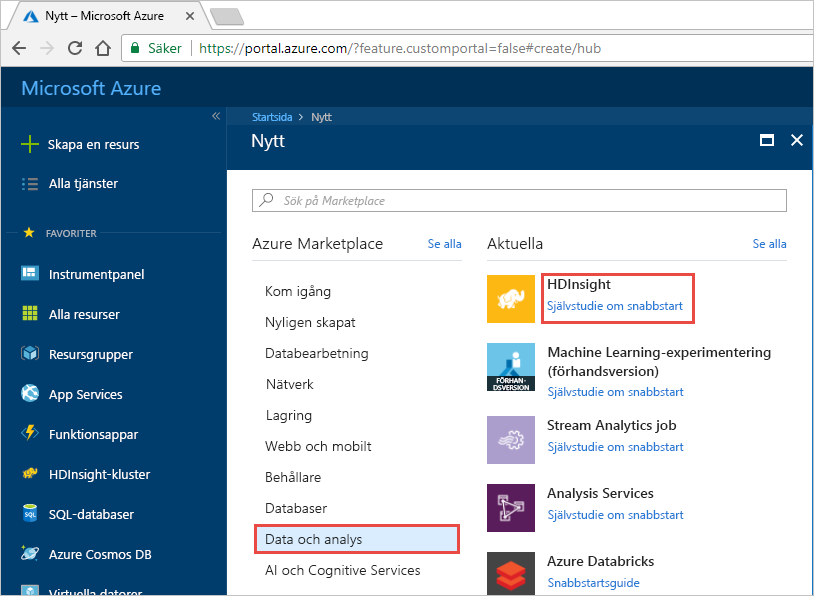
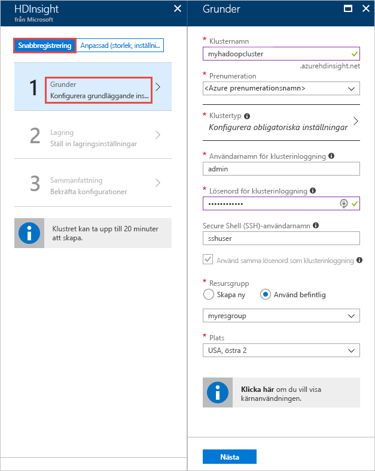
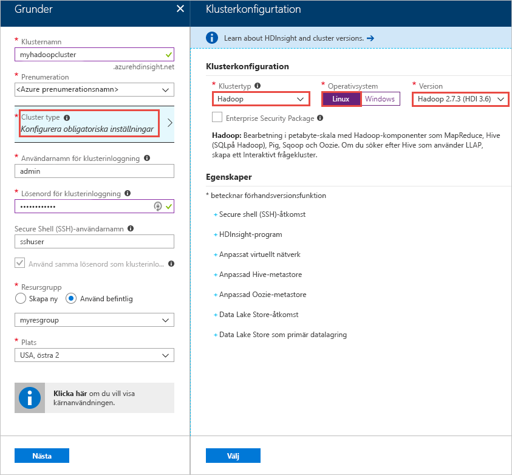
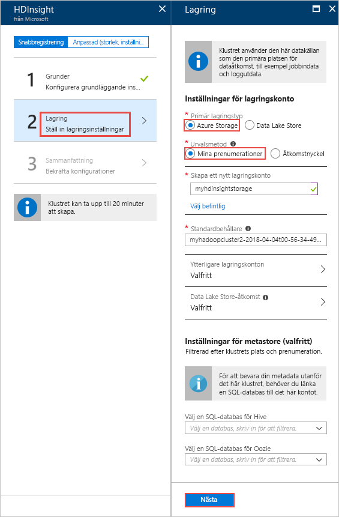
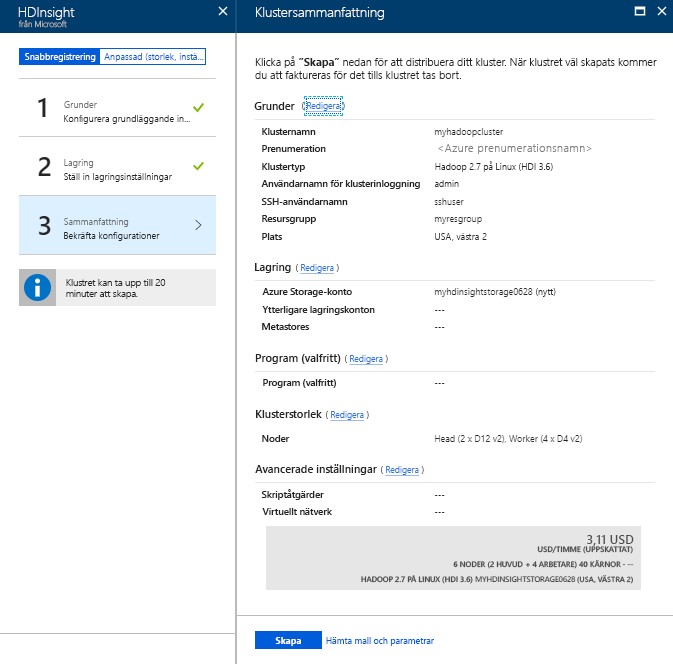

# Snabbstart: Komma igång med Apache Hadoop och Apache Hive i Azure HDInsight med Azure-portalen

I den här artikeln får du lära dig hur du skapar [Apache Hadoop](https://hadoop.apache.org/)-kluster i HDInsight med Azure-portalen och sedan kör Apache Hive-jobb i HDInsight. De flesta Hadoop-jobb är batchjobb. Du skapar ett kluster, kör vissa jobb och tar sedan bort klustret. I den här artikeln utför du alla tre aktiviteterna.

I den här snabbstarten använder du Azure Portal för att skapa ett HDInsight Hadoop-kluster. Du kan också skapa ett kluster med hjälp av [Azure Resource Manager-mallen](apache-hadoop-linux-tutorial-get-started.md).

För närvarande innehåller HDInsight [sju olika klustertyper](./apache-hadoop-introduction.md#cluster-types-in-hdinsight). Varje typ av kluster har stöd för olika komponentuppsättningar. Samtliga klustertyper stöder Hive. En lista över komponenter som stöds och som hanteras i HDInsight finns i [Vad är nytt i de Apache Hadoop-klusterversioner som tillhandahålls av HDInsight?](../hdinsight-component-versioning.md)  

Om du inte har en Azure-prenumeration kan du [skapa ett kostnadsfritt konto ](https://azure.microsoft.com/free/) innan du börjar.

## Skapa ett Apache Hadoop-kluster

I det här avsnittet skapar du ett Hadoop-kluster i HDInsight med hjälp av Azure Portal. 

1. Logga in på [Azure Portal](https://portal.azure.com).

1. Välj **Skapa en resurs** > **Data + analys** > **HDInsight** i Azure Portal. 

    

2. Ande de värden som föreslås i följande skärmbild under **HDInsight** > **Snabbregistrering** > **Grunder**:

    

    Ange eller välj följande värden:
    
    |Egenskap   |Beskrivning  |
    |---------|---------|
    |**Klusternamn**     | Ange ett namn för Hadoop-klustret. Eftersom alla kluster i HDInsight delar samma DNS-namnområde måste namnet vara unikt. Namnet kan bestå av upp till 59 tecken, inklusive bokstäver, siffror och bindestreck. De första och sista tecknen i namnet får inte vara bindestreck. |
    |**Prenumeration**     |  Välj din Azure-prenumeration. |
    |**Klustertyp**     | Hoppa över detta nu. Du kan ange dessa indata i nästa steg i den här proceduren.|
    |**Användarnamn och lösenord för klusterinloggning**     | Standardinloggningsnamnet är **admin**. Lösenordet måste bestå av minst 10 tecken och måste innehålla åtminstone en siffra, en versal, en gemen, ett alfanumeriskt tecken (förutom tecknen ' " ` \). Se till att du **inte anger** vanliga lösenord som Pass@word1.|
    |**SSH-användarnamn** | Standardanvändarnamnet är **sshuser**.  Du kan ange ett annat namn som SSH-användarnamn. |
    | **Använd samma lösenord som klusterinloggning** | Markera kryssrutan om du vill använda samma lösenord för SSH-användare som du angav för klusterinloggningsanvändare.|
    |**Resursgrupp**     | Skapa en resursgrupp eller välj en befintlig resursgrupp.  En resursgrupp är en container med Azure-komponenter.  I det här fallet innehåller resursgruppen HDInsight-klustret och det beroende Azure Storage-kontot. |
    |**Plats**     | Välj en Azure-plats där du vill skapa klustret.  Välj en plats närmare så får du bättre prestanda. |
        
3. Välj **Klustertyp** och ange sedan de indata som visas på följande skärmbild:

    

    Välj följande värden:
    
    |Egenskap   |Beskrivning  |
    |---------|---------|
    |**Typ av kluster**     | Välj **Hadoop** |
    |**Operativsystem**     | Välj **Linux** |
    |**Version**     | Välj **Hadoop 2.7.3 (HDI 3.6)**|

    Klicka på **Välj** och klicka sedan på **Nästa**.

4. Tillhandahåll de indata som visas på följande skärmbild på fliken **Storage**:

    

    Välj följande värden:
    
    |Egenskap   |Beskrivning  |
    |---------|---------|
    |**Primär lagringstyp**     | Använd Azure Storage Blob som standardlagringskonto för den här artikeln genom att välja **Azure Storage**. Du kan även använda Azure Data Lake Storage som standardlagringsutrymme. |
    |**Urvalsmetod**     |  Använd ett lagringskonto från din Azure-prenumeration för den här artikeln genom att välja **Mina prenumerationer**. Om du vill använda ett lagringskonto från någon annan prenumeration väljer du **Åtkomstnyckel** och anger sedan kontots åtkomstnyckel. |
    |**Skapa ett nytt lagringskonto**     | Ange ett namn för lagringskontot.|

    Acceptera alla övriga standardvärden och välj sedan **Nästa**.

5. Verifiera de värden som du valt i föregående steg på fliken **Sammanfattning**.

    
      
4. Välj **Skapa**. Du ser en ny panel som heter **Skicka distribution för HDInsight** på portalens instrumentpanel. Det tar cirka 20 minuter att skapa ett kluster.

    

4. När klustret har skapats visas en klusteröversiktssida i Azure Portal.
   
        
    
    Varje kluster är beroende av ett [Azure Storage-konto](../hdinsight-hadoop-use-blob-storage.md) eller ett [Azure Data Lake-konto](../hdinsight-hadoop-use-data-lake-store.md). Det kallas Storage-konto av standardtyp. HDInsight-kluster och Storage-kontot av standardtyp måste finnas i samma Azure-region. Lagringskontot tas inte bort om du tar bort kluster.

    > [!NOTE]  
    > Mer information om andra metoder för att skapa kluster och förstå de egenskaper som tillämpas i de här självstudierna finns i [Skapa HDInsight-kluster](../hdinsight-hadoop-provision-linux-clusters.md).       

## Köra Apache Hive-frågor

[Apache Hive](hdinsight-use-hive.md) är den populäraste komponenten som används i HDInsight. Det finns många sätt att köra Hive-jobb i HDInsight. I den här självstudiekursen ska du använda Ambari Hive-vyn från portalen. Andra metoder för att skicka Hive-jobb beskrivs i [Använda Hive-data i HDInsight](hdinsight-use-hive.md).

1. Öppna Ambari genom att välja **Klusterinstrumentpanel** i föregående skärmbild.  Du kan också gå till  **https://&lt;Klusternamn>.azurehdinsight.net**, där &lt;Klusternamn> är klustret du skapade i föregående avsnitt.

    

2. Ange det Hadoop-användarnamn och -lösenord som du angav när du skapade klustret. Standardanvändarnamnet är **admin**.

3. Öppna **Hive-vy** så som det visas på följande skärmbild:
   
    

4. På fliken **FRÅGA** klistrar du in följande HiveQL-instruktioner i kalkylbladet:
   
        SHOW TABLES;

         

5. Välj **Kör**. Fliken **RESULTAT** visas under fliken **FRÅGA** och visar information om jobbet. 
   
    När frågan har slutförts visas resultatet av åtgärden på fliken **FRÅGA**. En tabell med namnet **hivesampletable** bör visas. Detta exempel på en Hive-tabell kommer med alla HDInsight-kluster.
   
    

6. Upprepa steg 4 och 5 för att köra följande fråga:
   
        SELECT * FROM hivesampletable;
   
7. Du kan också spara frågans resultat. Välj menyknappen till höger och ange om du vill ladda ned resultatet som en CSV-fil eller lagra den på lagringskontot som är associerat till klustret.

    

När du har slutfört ett Hive-jobb kan du [exportera resultaten till Azure SQL Database eller SQL Server-databasen](apache-hadoop-use-sqoop-mac-linux.md) och även [visualisera resultat i Excel](apache-hadoop-connect-excel-power-query.md). Mer information om hur du använder Hive i HDInsight finns i [Använda Apache Hive och HiveQL med Apache Hadoop i HDInsight för att analysera ett exempel i en Apache log4j-fil](hdinsight-use-hive.md).

## Felsöka

Om du får problem med att skapa HDInsight-kluster läser du [åtkomstkontrollkrav](../hdinsight-hadoop-create-linux-clusters-portal.md).

## Rensa resurser
När du har slutfört vägledningen kanske du vill ta bort klustret. Med HDInsight lagras dina data i Azure Storage så att du på ett säkert sätt kan ta bort ett kluster när det inte används. Du debiteras också för ett HDInsight-kluster, även när det inte används. Eftersom avgifterna för klustret är flera gånger större än avgifterna för lagring är det ekonomiskt sett bra att ta bort kluster när de inte används. 

> [!NOTE]  
> Om du *omedelbart* fortsätter till nästa kurs för att lära dig hur man kör ETL-åtgärder med Hadoop på HDInsight vill du kanske låta klustret köra vidare. Det beror i självstudien måste du skapa ett Hadoop-kluster igen. Men om du inte tänker göra nästa kurs direkt måste du ta bort klustret nu.
> 
>  

**Ta bort klustret och/eller Storage-kontot av standardtyp**

1. Gå tillbaka till webbläsarfliken där du har Azure-portalen. Du bör vara på översiktssidan för klustret. Om du endast vill ta bort klustret men behålla standardlagringskontot kan du klicka på **Ta bort**.

    

2. Om du vill ta bort klustret och standardlagringskontot öppnar du resursgruppssidan genom att välja resursgruppens namn (markerat i föregående skärmbild).

3. Ta bort resursgruppen som innehåller klustret och standardlagringskontot genom att välja **Ta bort resursgrupp**. Tänk på att lagringskontot tas bort om du tar bort resursgruppen. Välj att bara ta bort klustret om du vill behålla Storage-kontot.

## Nästa steg
I den här självstudien har du fått veta hur du skapar ett Linux-baserat HDInsight-kluster med en Resource Manager-mall och hur du utför grundläggande Hive-frågor. I nästa artikel får du lära dig hur du utför en extraktions-, transformations- eller inläsningsåtgärd (ETL) med Hadoop på HDInsight.

> [!div class="nextstepaction"]
>[Extrahera, transformera och läsa in data med hjälp av Apache Hive på HDInsight](../hdinsight-analyze-flight-delay-data-linux.md)

Om du är redo att börja arbeta med dina egna data och vill veta mer om hur data lagras i HDInsight eller om att hämta data till HDInsight, hittar du mer information i följande artiklar:

* Mer information om hur HDInsight använder Azure Storage finns i [Använda Azure Storage med HDInsight](../hdinsight-hadoop-use-blob-storage.md).
* Information om hur du skapar ett HDInsight-kluster med Data Lake Storage finns i [Snabbstart: Konfigurera kluster i HDInsight](../../storage/data-lake-storage/quickstart-create-connect-hdi-cluster.md)
* Mer information om hur du överför data till HDInsight finns i [Överföra data till HDInsight](../hdinsight-upload-data.md).
* [Använda Azure Data Lake Storage Gen2 med Azure HDInsight-kluster](../hdinsight-hadoop-use-data-lake-storage-gen2.md)

Mer information om att analysera data med HDInsight finns i följande artiklar:

* Mer information om att använda Hive med HDInsight, inklusive hur du utför Hive-frågor från Visual Studio, finns i [Använda Apache Hive med HDInsight](hdinsight-use-hive.md).
* Du kan läsa mer om Pig, ett språk som används för att omvandla data, i [Använda Apache Pig med HDInsight](hdinsight-use-pig.md).
* Du kan läsa mer om MapReduce, ett sätt att skriva appar som bearbetar data i Hadoop, i [Använda MapReduce med HDInsight](hdinsight-use-mapreduce.md).
* Du kan läsa mer om hur du använder HDInsight Tools för Visual Studio för att analysera data i HDInsight i [Komma igång med Visual Studio Hadoop-verktyg för HDInsight](apache-hadoop-visual-studio-tools-get-started.md).

Mer information om att skapa eller hantera HDInsight-kluster hittar du i följande artiklar:

* Mer information om att hantera ditt Linux-baserade HDInsight-kluster finns i [Hantera HDInsight-kluster med Apache Ambari](../hdinsight-hadoop-manage-ambari.md).
* Mer information om de alternativ som du kan välja när du skapar ett HDInsight-kluster finns i [Skapa HDInsight i Linux med anpassade alternativ](../hdinsight-hadoop-provision-linux-clusters.md).

[1]: ../HDInsight/apache-hadoop-visual-studio-tools-get-started.md

[hdinsight-provision]: hdinsight-provision-linux-clusters.md
[hdinsight-upload-data]: hdinsight-upload-data.md
[hdinsight-use-hive]: hdinsight-use-hive.md
[hdinsight-use-pig]: hdinsight-use-pig.md

