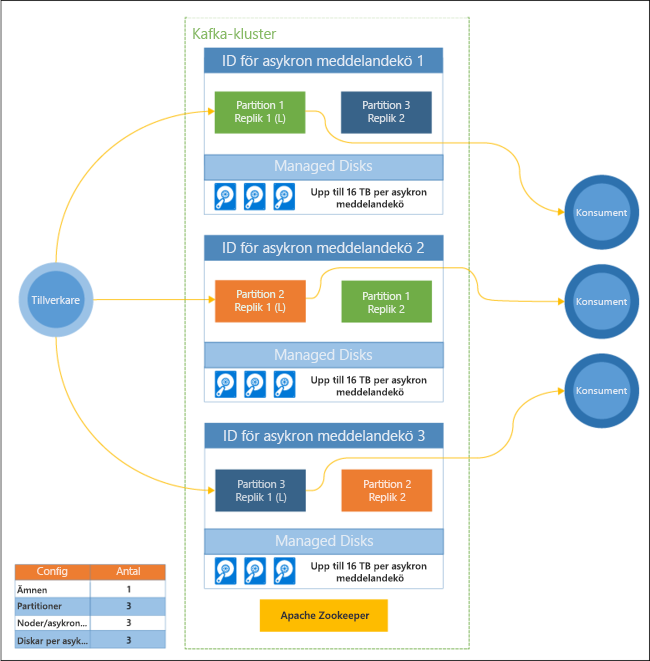

# Vad är Apache Kafka på HDInsight?

[Apache Kafka](https://kafka.apache.org) är en distribuerad direktuppspelningsplattform med öppen källkod som kan användas för att skapa realtidsuppspelade datapipelines och program. Kafka tillhandahåller även funktionen för asynkron meddelandekö som liknar en meddelandekö där du kan publicera och prenumerera på namngivna dataströmmar. 

Följande är kännetecknen för Kafka på HDInsight:

* Det är en hanterad tjänst som tillhandahåller en förenklad konfigurationsprocess. Resultatet är en konfiguration som har testats av och som stöds av Microsoft.

* Microsoft tillhandahåller ett 99,9 % serviceavtal (SLA) för Kafkas driftstid. Mer information finns i dokumentet [SLA-information för HDInsight](https://azure.microsoft.com/support/legal/sla/hdinsight/v1_0/).

* Den använder hanterade diskar i Azure som lagringsenhet för Kafka. Hanterade diskar kan tillhandahålla upp till 16 TB lagringsutrymme per asynkron Kafka-meddelandekö. Se [Ökad skalbalhet med Kafta på HDInsight](apache-kafka-scalability.md) för mer information om att konfigurera hanterade diskar med Kafka på HDInsight.

    För mer information om hanterade diskar, se [Hanterade Azure-diskar](../../virtual-machines/windows/managed-disks-overview.md).

* Kafka har utformats med en enda dimensionell vy av ett rack. Azure delar ett rack i två dimensioner – uppdateringsdomäner (UD) och feldomäner (FD). Microsoft tillhandahåller verktyg som balanserar om Kafka-partitioner och -repliker mellan uppdateringsdomäner och feldomäner. 

    Mer information finns i [Hög tillgänglighet med Kafka i HDInsight](apache-kafka-high-availability.md).

* I HDInsight kan du ändra antalet arbetarnoder (som är värdar för den asynkrona Kafka-meddelandekön) när klustret har skapats. Du kan utföra skalningen från Azure-portalen, Azure PowerShell och andra Azure-hanteringsgränssnitt. För Kafka bör du balansera om partitionsrepliker efter eventuell skalning. När du balanserar om partitionerna kan Kafka dra nytta av nya antalet arbetarnoder.

    Mer information finns i [Hög tillgänglighet med Kafka i HDInsight](apache-kafka-high-availability.md).

* Azure Log Analytics kan användas för att övervaka Kafka på HDInsight. I Log Analytics kan du se information på virtuell dator-nivå, som diskar, nätverksmått och JMX-mått, från Kafka.

    Mer information finns i [Analysera loggar för Kafka i HDInsight](apache-kafka-log-analytics-operations-management.md).

### Kafka på HDInsight-arkitektur

Följande diagram visar en typisk Kafka-konfiguration som använder konsumentgrupper, partitionering och replikering för att erbjuda parallell läsning av händelser med feltolerans:

Apache ZooKeeper hanterar Kafka-klustrets status. Zookeeper är utformat för samtidiga och flexibla transaktioner med kort svarstid. 

Kafka lagrar poster (data) i **ämnen**. Poster produceras av **producenter**, och används av **konsumenter**. Producenter skickar poster till **asynkrona Kafka-meddelandeköer**. Varje arbetsnod i HDInsight-klustret är en asynkron Kafka-meddelandekö. 

Ämnen delar upp poster över meddelandeköer. När du förbrukar poster, kan du använda en konsument per partition för att uppnå parallell bearbetning av data.

Replikering används för att duplicera partitioner mellan noder, vilket skyddar mot avbrott på noder (meddelandeköer). En partition som är markerad med *(L)* i diagrammet är ledande för den angivna partitionen. Producenttrafik dirigeras till varje ledande nod med det tillstånd som hanteras av ZooKeeper.

## Varför använda Kafka på HDInsight?

Följande är vanliga uppgifter och mönster som kan utföras med hjälp av Kafka på HDInsight:

* **Replikering av Kafka-data**: Kafka innehåller verktyget MirrorMaker som replikerar data mellan olika Kafka-kluster.

    Information om hur du använder MirrorMaker finns i [Replicate Kafka topics with Kafka on HDInsight](apache-kafka-mirroring.md) Replikera Kafka-ämnen med Kafka i HDInsight.

* **Meddelandemönster av typen publicera-prenumerera**: Kafka innehåller ett producent-API för publicering av poster till ett Kafka-ämne. Konsument-API används när det finns en prenumererar på ett ämne.

    Mer information finns i [Kom igång med Kafka i HDInsight](apache-kafka-get-started.md).

* **Dataströmsbearbetning**: Kafka används ofta med Apache Storm eller Spark för bearbetning av dataströmmar i realtid. Kafka 0.10.0.0 (HDInsight version 3.5 och 3.6) införde en strömmande API som gör att du kan skapa direktuppspelade lösningar utan Storm eller Spark.

    Mer information finns i [Kom igång med Kafka i HDInsight](apache-kafka-get-started.md).

* **Vågrät skala**: Kafka partitionerar dataströmmar mellan noderna i HDInsight-klustret. Konsumentprocesser kan associeras med enskilda partitioner för att ge belastningsutjämning när poster används.

    Mer information finns i [Kom igång med Kafka i HDInsight](apache-kafka-get-started.md).

* **Leverans i ordning**: Inom varje partition lagras posterna i strömmen i den ordning som de togs emot. Genom att associera en konsumentprocess per partition bearbetas posterna garanterat i ordning.

    Mer information finns i [Kom igång med Kafka i HDInsight](apache-kafka-get-started.md).

## Användningsfall

* **Meddelanden**: Eftersom den stöder meddelandemönstret publicera-prenumerera används Kafka ofta som en asynkron meddelandekö.

* **Aktivitetsspårning**: Eftersom Kafka innehåller i ordningsbaserad loggning av poster kan den användas för att spåra och återskapa aktiviteter. Till exempel användaråtgärder på en webbplats eller i ett program.

* **Sammanställning**: Med hjälp av strömbearbetning kan du sammanställa information från olika strömmar för att kombinera och centralisera information till användningsdata.

* **Omvandling**: Med dataströmsbearbetning kan du kombinera och utöka data från flera inkommande avsnitt i ett eller flera utdataämnen.

## Nästa steg

Använd följande länkar om du vill veta om hur du använder Apache Kafka på HDInsight:

* [Snabbstart: Skapa Kafka på HDInsight](apache-kafka-get-started.md)

* [Självstudier: Använda Apache Spark med Kafka på HDInsight](../hdinsight-apache-spark-with-kafka.md)

* [Självstudier: Använda Apache Storm med Kafka på HDInsight](../hdinsight-apache-storm-with-kafka.md)
