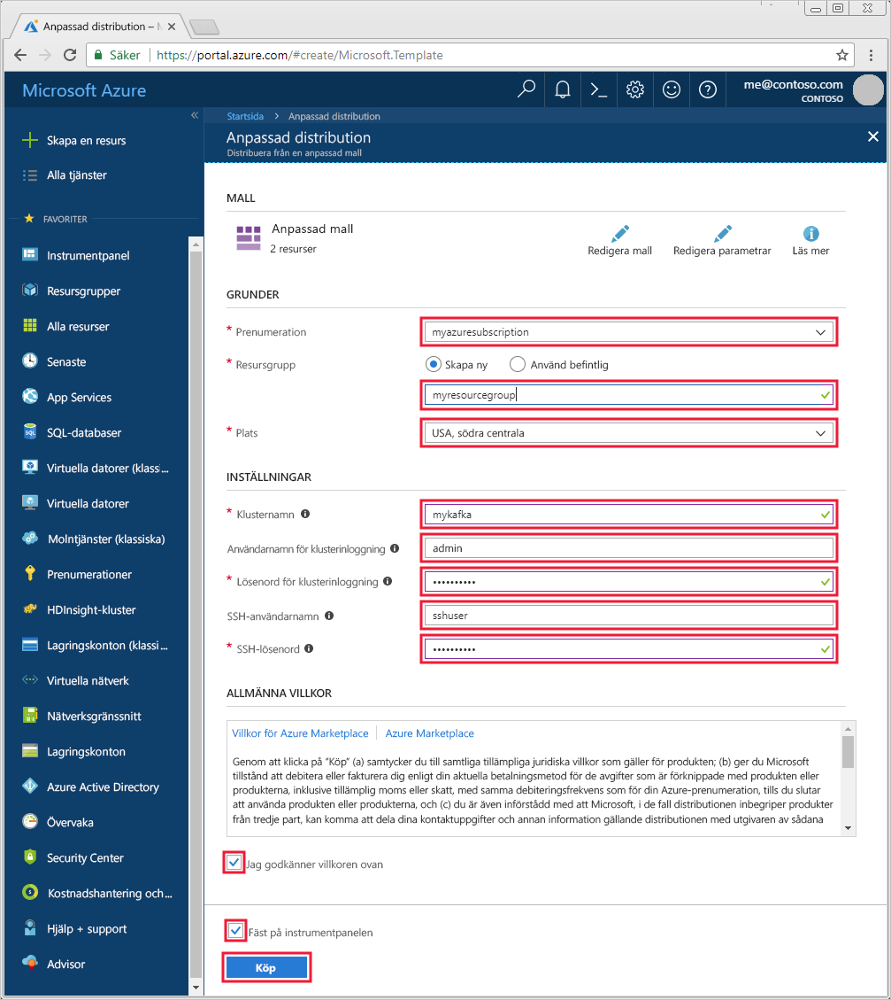

# <a name="quickstart-create-an-apache-kafka-on-hdinsight-cluster"></a>Snabbstart: Skapa ett Apache Kafka på HDInsight-kluster

[Apache Kafka](https://kafka.apache.org/) är en distribuerad strömningsplattform med öppen källkod. Den används ofta som en asynkron meddelandekö eftersom den innehåller funktioner som påminner om en publicera-prenumerera-meddelandekö. 

I den här snabbstarten lär du dig hur du skapar ett [Apache Kafka](https://kafka.apache.org)-kluster på Azure HDInsight med hjälp av en Azure Resource Manage-mall. Du kommer också lära dig hur du kan använda de inkluderade verktygen för att skicka och ta emot meddelanden med Kafka. Liknande mallar kan läsas på [Azures snabbstartsmallar](https://azure.microsoft.com/resources/templates/?resourceType=Microsoft.Hdinsight&pageNumber=1&sort=Popular). Mallreferensen finns [här](https://docs.microsoft.com/azure/templates/microsoft.hdinsight/allversions).

[!INCLUDE [delete-cluster-warning](../../../includes/hdinsight-delete-cluster-warning.md)]

> [!IMPORTANT]  
> Kafka-API:et kan endast användas av resurser i samma virtuella nätverk. I den här snabbstarten har du direkt åtkomst till klustret med SSH. Om du vill ansluta andra tjänster, nätverk eller virtuella datorer till Kafka måste du först skapa ett virtuellt nätverk och sedan skapa resurser i nätverket.
>
> Mer information finns i dokumentet [Anslut till Apache Kafka via ett virtuellt nätverk](apache-kafka-connect-vpn-gateway.md).

## <a name="prerequisites"></a>Nödvändiga komponenter

* En Azure-prenumeration. Om du inte har en Azure-prenumeration kan du skapa ett [kostnadsfritt konto](https://azure.microsoft.com/free/?WT.mc_id=A261C142F) innan du börjar.

* En SSH-klient. Stegen i det här dokumentet använder SSH för att ansluta till klustret.

    Kommandot `ssh` tillhandahålls som standard i Linux-, Unix- och macOS-system. I Windows 10 använder du någon av följande metoder för att installera kommandot `ssh`:

  * Använd [Azure Cloud Shell](https://docs.microsoft.com/azure/cloud-shell/quickstart). Cloud Shell tillhandahåller `ssh`-kommandot och kan konfigureras för att använda antingen Bash eller PowerShell som gränssnittsmiljö.

  * [Installera Windows-undersystemet för Linux](https://docs.microsoft.com/windows/wsl/install-win10). De Linux-distributioner som är tillgängliga via Microsoft Store tillhandahåller `ssh`-kommandot.

    > [!IMPORTANT]  
    > Stegen i det här dokumentet förutsätter att du använder någon av de SSH-klienter som nämns ovan. Om du använder en annan SSH-klient och stöter på problem så sök efter en lösning i SSH-klientens dokumentation.
    >
    > Mer information finns i dokumentet [Använda SSH med HDInsight](../hdinsight-hadoop-linux-use-ssh-unix.md).

## <a name="create-an-apache-kafka-cluster"></a>Skapa ett Apache Kafka-kluster

1. Klicka på följande bild för att öppna mallen i Azure Portal.

    <a href="https://portal.azure.com/#create/Microsoft.Template/uri/https%3A%2F%2Fraw.githubusercontent.com%2FAzure-Samples%2Fhdinsight-kafka-java-get-started%2Fmaster%2Fazuredeploy.json" target="_blank"></a>

2. Om du vill skapa Kafka-klustret använder du följande värden:

    | Egenskap  | Värde |
    | --- | --- |
    | Prenumeration | Din Azure-prenumeration. |
    | Resursgrupp | Den resursgrupp i vilken klustret har skapats. |
    | Location | Den Azure-region i vilken klustret har skapats. |
    | Klusternamn | Namnet på Kafka-klustret. |
    | Användarnamn för klusterinloggning | Det kontonamn som används för att logga in på HTTPs-baserade tjänster som finns i klustret. |
    | Lösenord för klusterinloggning | Ange lösenordet för det inloggande användarnamnet. |
    | SSH-användarnamn | SSH-användarnamnet. Det här kontot har åtkomst till klustret med SSH. |
    | SSH-lösenord | Lösenord för SSH-användaren. |

    

3. Välj **Jag godkänner villkoren som anges ovan**, välj **Fäst på instrumentpanelen** och klicka sedan på **Köp**.

> [!NOTE]  
> Det kan ta upp till 20 minuter att skapa klustret.

## <a name="connect-to-the-cluster"></a>Anslut till klustret

1. Anslut till Kafka-klustrets primära huvudnod med följande kommando. Ersätt `sshuser` med SSH-användarnamnet. Ersätt `mykafka` med namnet på Kafka-klustret

    ```bash
    ssh sshuser@mykafka-ssh.azurehdinsight.net
    ```

2. När du ansluter till HDInsight första gången kan SSH-klienten visa en varning om att värdens äkthet inte kan fastställas. Skriv __ja__ när du uppmanas till detta och tryck sedan på __Retur__ så läggs värden till i SSH-klientens lista över betrodda servrar.

3. Ange SSH-användarens lösenord när du uppmanas till detta.

När du är ansluten visas ett meddelande av följande slag:

```text
Authorized uses only. All activity may be monitored and reported.
Welcome to Ubuntu 16.04.4 LTS (GNU/Linux 4.13.0-1011-azure x86_64)

 * Documentation:  https://help.ubuntu.com
 * Management:     https://landscape.canonical.com
 * Support:        https://ubuntu.com/advantage

  Get cloud support with Ubuntu Advantage Cloud Guest:
    https://www.ubuntu.com/business/services/cloud

83 packages can be updated.
37 updates are security updates.


Welcome to Kafka on HDInsight.

Last login: Thu Mar 29 13:25:27 2018 from 108.252.109.241
ssuhuser@hn0-mykafk:~$
```

## <a id="getkafkainfo"></a>Hämta information om värden i Apache Zookeeper och Broker

När du arbetar med Kafka måste du känna till *Apache Zookeeper*- och *Broker*-värdarna. Dessa värdar används med Kafka-API och många av de verktyg som levereras med Kafka.

I det här avsnittet hämtas information om värden från klustrets Ambari REST API.

1. Installera verktyget `jq` genom att använda följande kommando från SSH-anslutningen till klustret. Det här verktyget används för att parsa JSON-dokument och är användbart när du ska hämta värdinformation:
   
    ```bash
    sudo apt -y install jq
    ```

2. Använd följande kommando om du vill ange en miljövariabel i klustrets namn:

    ```bash
    read -p "Enter the Kafka on HDInsight cluster name: " CLUSTERNAME
    ```

    Ange Kafka-klustrets namn när du uppmanas till detta.

3. Använd följande kommando om du vill ange en miljövariabel med Zookeeper-värdens information:

    ```bash
    export KAFKAZKHOSTS=`curl -sS -u admin -G https://$CLUSTERNAME.azurehdinsight.net/api/v1/clusters/$CLUSTERNAME/services/ZOOKEEPER/components/ZOOKEEPER_SERVER | jq -r '["\(.host_components[].HostRoles.host_name):2181"] | join(",")' | cut -d',' -f1,2`
    ```

    Ange klusterinloggningskontots lösenord när du uppmanas till detta (inte SSH-kontot).

    > [!NOTE]  
    > Detta kommando hämtar alla Zookeeper-värdar och returnerar bara de första två posterna. Det beror på att det är bra att ha viss redundans ifall en värd inte kan nås.

4. Använd följande kommando om du vill kontrollera att miljövariabeln är korrekt:

    ```bash
     echo '$KAFKAZKHOSTS='$KAFKAZKHOSTS
    ```

    Det här kommandot returnerar information liknande följande text:

    `zk0-kafka.eahjefxxp1netdbyklgqj5y1ud.ex.internal.cloudapp.net:2181,zk2-kafka.eahjefxxp1netdbyklgqj5y1ud.ex.internal.cloudapp.net:2181`

5. Använd följande kommando om du vill ange en miljövariabel med Kafka-värdens information om asynkron meddelandekö:

    ```bash
    export KAFKABROKERS=`curl -sS -u admin -G https://$CLUSTERNAME.azurehdinsight.net/api/v1/clusters/$CLUSTERNAME/services/KAFKA/components/KAFKA_BROKER | jq -r '["\(.host_components[].HostRoles.host_name):9092"] | join(",")' | cut -d',' -f1,2`
    ```

    Ange klusterinloggningskontots lösenord när du uppmanas till detta (inte SSH-kontot).

6. Använd följande kommando om du vill kontrollera att miljövariabeln är korrekt:

    ```bash   
    echo '$KAFKABROKERS='$KAFKABROKERS
    ```

    Det här kommandot returnerar information liknande följande text:
   
    `wn1-kafka.eahjefxxp1netdbyklgqj5y1ud.cx.internal.cloudapp.net:9092,wn0-kafka.eahjefxxp1netdbyklgqj5y1ud.cx.internal.cloudapp.net:9092`

## <a name="manage-apache-kafka-topics"></a>Hantera Apache Kafka-ämnen

Kafka lagrar dataströmmar i kategorier som kallas *ämnen*. Du kan hantera ämnena med verktyget `kafka-topics.sh`.

* **Du skapar ett ämne** med följande kommando i SSH-anslutningen:

    ```bash
    /usr/hdp/current/kafka-broker/bin/kafka-topics.sh --create --replication-factor 3 --partitions 8 --topic test --zookeeper $KAFKAZKHOSTS
    ```

    Det här kommandot ansluter till Zookeeper med hjälp av värdinformationen som lagras i `$KAFKAZKHOSTS`. Det skapar sedan ett Kafka-ämne med namnet **test**. 

    * Data som lagras i det här ämnet partitioneras över åtta partitioner.

    * Varje partition replikeras mellan tre arbetarnoder i klustret.

        > [!IMPORTANT]  
        > Om du har skapat klustret i en Azure-region som tillhandahåller tre feldomäner så använd replikeringsfaktorn 3. I annat fall använder du replikeringsfaktorn 4.
        
        I områden med tre feldomäner kan replikeringsfaktorn 3 tillåta att repliker sprids till feldomänerna. I områden med två feldomäner kan replikeringsfaktorn 4 tillåta att repliker sprids jämnt över domänerna.
        
        Om du vill ha information om antalet feldomäner i en region läser du dokumentet [Availability of Linux virtual machines](../../virtual-machines/windows/manage-availability.md#use-managed-disks-for-vms-in-an-availability-set) (Tillgänglighet för virtuella Linux-datorer).

        > [!IMPORTANT]   
        > Kafka har ingen information om Azure-feldomäner. När du skapar partitionsrepliker för ämnen kanske det inte distribueras repliker korrekt för hög tillgänglighet.

        Garantera hög tillgänglighet med hjälp av [verktyget för partitionsombalansering för Apache Kafka](https://github.com/hdinsight/hdinsight-kafka-tools). Du måste köra det här verktyget från en SSH-anslutning till ditt Kafka-klusters huvudnod.

        Om du vill ha bästa möjliga tillgänglighet för dina Kafka-data måste du balansera om ämnets partitionsrepliker när:

        * Du skapar ett nytt ämne eller en ny partition

        * Du skalar upp ett kluster

* **Om du vill lista ämnena** använder du följande kommando:

    ```bash
    /usr/hdp/current/kafka-broker/bin/kafka-topics.sh --list --zookeeper $KAFKAZKHOSTS
    ```

    Det här kommandot listar de ämnen som är tillgängliga på Kafka-klustret.

* **Om du vill ta bort ett ämne** använder du följande kommando:

    ```bash
    /usr/hdp/current/kafka-broker/bin/kafka-topics.sh --delete --topic topicname --zookeeper $KAFKAZKHOSTS
    ```

    Det här kommandot tar bort ämnet med namnet `topicname`.

    > [!WARNING]  
    > Om du tar bort ämnet `test`, som du skapade tidigare, måste du återskapa det. Det används under steg senare i det här dokumentet.

Om du vill ha mer information om vilka kommandon som är tillgängliga med verktyget `kafka-topics.sh` använder du följande kommando:

```bash
/usr/hdp/current/kafka-broker/bin/kafka-topics.sh
```

## <a name="produce-and-consume-records"></a>Skapa och använda poster

Kafka lagrar *poster* i ämnen. Poster produceras av *producenter*, och används av *konsumenter*. Producenter och konsumenter kommunicerar med *Kafka-koordinator*tjänsten. Varje arbetsnod i HDInsight-klustret är en Kafka-koordinatorvärd.

Använd följande steg för att lagra poster i det testämne som du skapade tidigare och sedan läsa dem med en konsument:

1. Om du vill skriva poster i ämnet använder du verktyget `kafka-console-producer.sh` från SSH-anslutningen:
   
    ```bash
    /usr/hdp/current/kafka-broker/bin/kafka-console-producer.sh --broker-list $KAFKABROKERS --topic test
    ```
   
    Efter det här kommandot kommer du till en tom rad.

2. Skriv in ett textmeddelande på den tomma raden och tryck på Retur. Ange några meddelanden på det här sättet och använd sedan **Ctrl + C** för att komma tillbaka till den vanliga kommandotolken. Varje rad skickas som en separat post till Kafka-ämnet.

3. Om du vill läsa poster i ämnet använder du verktyget `kafka-console-consumer.sh` från SSH-anslutningen:
   
    ```bash
    /usr/hdp/current/kafka-broker/bin/kafka-console-consumer.sh --bootstrap-server $KAFKABROKERS --topic test --from-beginning
    ```
   
    Med det här kommandot hämtar du posterna från ämnet och visar dem. Med hjälp av `--from-beginning` anges att konsumenten ska starta från början av direktuppspelningen så att alla poster hämtas.

    > [!NOTE]  
    > Om du använder en äldre version av Kafka ersätter du `--bootstrap-server $KAFKABROKERS` med `--zookeeper $KAFKAZKHOSTS`.

4. Använd __Ctrl + C__ om du vill stoppa konsumenten.

Du kan också programmässigt skapa producenter och konsumenter. Ett exempel på användning av detta API finns i dokumentet [Apache Kafka-producent- och konsument-API med HDInsight](apache-kafka-producer-consumer-api.md).

## <a name="troubleshoot"></a>Felsöka

Om du får problem med att skapa HDInsight-kluster läser du [åtkomstkontrollkrav](../hdinsight-hadoop-create-linux-clusters-portal.md).

## <a name="clean-up-resources"></a>Rensa resurser

Om du vill rensa de resurser som har skapats med den här snabbstarten kan du ta bort resursgruppen. När du tar bort resursgruppen raderas även det kopplade HDInsight-klustret och eventuella andra resurser som är associerade med resursgruppen.

Ta bort en resursgrupp med Azure Portal:

1. I Azure Portal expanderar du menyn på vänster sida för att öppna tjänstemenyn och väljer sedan __Resursgrupper__ för att visa listan med dina resursgrupper.
2. Leta reda på den resursgrupp du vill ta bort och högerklicka på knappen __Mer__ (...) till höger om listan.
3. Välj __Ta bort resursgrupp__ och bekräfta.

> [!WARNING]  
> Debiteringen för HDInsight-klustret börjar när ett kluster skapas och stoppas när klustret tas bort. Debiteringen görs i förväg per minut, så du ska alltid ta bort ditt kluster när det inte används.
> 
> Om du tar bort en Kafka i ett HDInsight-kluster tas alla data som lagrats i Kafka bort.

## <a name="next-steps"></a>Nästa steg

> [!div class="nextstepaction"]
> [Använda Apache Spark med Apache Kafka](../hdinsight-apache-kafka-spark-structured-streaming.md)

