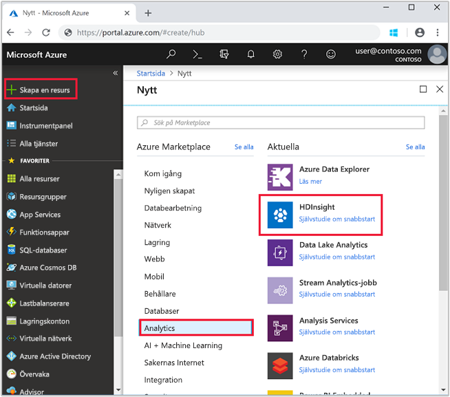

# <a name="quickstart-create-apache-spark-cluster-in-azure-hdinsight-using-azure-portal"></a>Snabb start: skapa Apache Spark kluster i Azure HDInsight med Azure Portal

Lär dig hur du skapar Apache Spark-kluster på Azure HDInsight och hur du kör Spark SQL-frågor mot Hive-tabeller. Apache Spark möjliggör snabb dataanalys och databehandling i kluster med hjälp av minnesintern bearbetning. Mer information om Spark på HDInsight finns i [Översikt: Apache Spark på Azure HDInsight](apache-spark-overview.md).

I den här snabbstarten använder du Azure Portal för att skapa ett HDInsight Spark-kluster. Klustret använder Azure Storage Blobar som klusterlagring. Mer information om att använda Data Lake Storage Gen2 finns i [Snabbstart: Konfigurera kluster i HDInsight](../../storage/data-lake-storage/quickstart-create-connect-hdi-cluster.md).

> [!IMPORTANT]  
> Fakturering för HDInsight-kluster sker proportionerligt per minut, oavsett om du använder dem eller inte. Se till att du tar bort dina kluster när du är klar med dem. Mer information finns i avsnittet [Rensa resurser](#clean-up-resources) i den här artikeln.

Om du inte har en Azure-prenumeration kan du [skapa ett kostnadsfritt konto ](https://azure.microsoft.com/free/) innan du börjar.

## <a name="create-an-hdinsight-spark-cluster"></a>Skapa ett HDInsight Spark-kluster

1. Välj **Skapa en resurs** > **Analys** > **HDInsight** i Azure Portal.

    

1. Under **Grunder**, ange följande värden:

    |Egenskap  |Beskrivning  |
    |---------|---------|
    |Prenumeration  | I listrutan, Välj en Azure-prenumeration som används för det här klustret. Prenumerationen som används för den här snabb starten är **Azure**. |
    |Resursgrupp | Ange om du vill skapa en ny resursgrupp eller använda en befintlig. En resursgrupp är en container som innehåller relaterade resurser för en Azure-lösning. Resurs grupps namnet som används för den här snabb starten är **myResourceGroup**. |
    |Klusternamn | Namnge ett HDInsight Spark-kluster. Kluster namnet som används för den här snabb starten är **myspark2019**.|
    |plats.   | Välj en plats för resursgruppen. Mallen använder den här platsen för att skapa klustret samt standardklusterlagringen. Den plats som används för den här snabb starten är **östra USA**. |
    |Kluster typ| Välj **Spark** som kluster typ.|
    |Kluster version|Det här fältet fylls i automatiskt med standard versionen när kluster typen har valts.|
    |Användarnamn för klusterinloggning| Ange användarnamnet för kluster-inloggningen.  Standard namnet är *admin*. Du kan använda det här kontot för att logga in på den Jupyter notebook senare i snabb starten. |
    |Lösenord för klusterinloggning| Ange lösenordet för klusterinloggningen: |
    |Secure Shell (SSH)-användarnamn| Ange SSH-användarnamnet. SSH-användarnamnet som användes för den här snabbstarten är **sshuser**. Som standard delar här kontot samma lösenord som kontot *användarnamn för klusterinloggning*. |

    

    Välj **Nästa: lagrings > >** för att fortsätta till **lagrings** sidan.

1. Under **Lagring**, ange följande värden:

    |Egenskap  |Beskrivning  |
    |---------|---------|
    |Primär lagrings typ|Använd standardvärdet **Azure Storage**.|
    |Urvals metod|Använd standardvärdet **Select i list**.|
    |Primärt lagringskonto|Använd det automatiskt ifyllda värdet.|
    |Container|Använd det automatiskt ifyllda värdet.|

    

    Välj **Granska + skapa** för att fortsätta.

1. Under **Granska + skapa**väljer du **skapa**. Det tar cirka 20 minuter att skapa klustret. Klustret måste skapas innan du kan fortsätta till nästa session.

Om du stöter på ett problem med att skapa HDInsight-kluster kan det bero på att du inte har rätt behörighet för att göra det. Mer information finns i [åtkomstkravkontrollen](../hdinsight-hadoop-create-linux-clusters-portal.md).

## <a name="create-a-jupyter-notebook"></a>Skapa en Jupyter-anteckningsbok

Jupyter Notebook är en interaktiv anteckningsboksmiljö som stöder flera olika datorspråk. Du kan använda anteckningsboken för att interagera med dina data, kombinera kod med markdown-text och utföra enkla visualiseringar.

1. Öppna [Azure-portalen](https://portal.azure.com).

1. Välj **HDInsight-kluster** och välj sedan det kluster som du skapade.

    

1. I portalen väljer du **Kluster-instrumentpaneler** och sedan **Jupyter Notebook**. Ange autentiseringsuppgifterna för klustret om du uppmanas att göra det.

   

1. Skapa en anteckningsbok genom att välja **Ny** > **PySpark**.

   

   En ny anteckningsbok skapas och öppnas med namnet Untitled(Untitled.pynb).

## <a name="run-spark-sql-statements"></a>Kör Spark SQL-instruktioner

SQL (Structured Query Language) är det vanligaste språket för frågor och definition av data. Spark SQL fungerar som ett tillägg till Apache Spark för bearbetning av strukturerade data med den välbekanta SQL-syntaxen.

1. Verifiera att kerneln är klar. Kerneln är klar när du ser en tom cirkel bredvid kernelnamnet i den bärbara datorn. En fylld cirkel anger att kerneln är upptagen.

    

    När du startar den bärbara datorn för första gången utför kerneln några uppgifter i bakgrunden. Vänta tills kerneln är klar.

1. Klistra in följande kod i en tom cell och tryck sedan på **SKIFT+RETUR** för att köra koden. Kommandot listar Hive-tabellerna i klustret:

    ```PySpark
    %%sql
    SHOW TABLES
    ```

    När du använder en Jupyter-anteckningsbok med ditt HDInsight Spark-kluster får du en förinställd `sqlContext` som du kan använda för att köra Hive-frågor med hjälp av Spark SQL. `%%sql` anger att Jupyter Notebook ska använda den förinställda `sqlContext` när Hive-frågan ska köras. Frågan hämtar de översta 10 raderna från en Hive-tabell (**hivesampletable**) som medföljer alla HDInsight-kluster som standard. Det tar ungefär 30 sekunder att få resultatet. De utdata som returneras ser ut så här:

    

    Varje gång du kör en fråga i Jupyter visar fönsterrubriken i webbläsaren statusen **(Upptagen)** tillsammans med anteckningsbokens titel. Du ser även en fylld cirkel bredvid **PySpark**-texten i det övre högra hörnet.

1. Kör ytterligare en fråga för att visa data i `hivesampletable`.

    ```PySpark
    %%sql
    SELECT * FROM hivesampletable LIMIT 10
    ```

    Skärmen bör uppdateras så att frågeresultatet visas.

    

1. Välj **Stäng och stoppa** på anteckningsbokens **Arkiv**-meny. När du stänger anteckningsboken frigörs klusterresurserna.

## <a name="clean-up-resources"></a>Rensa resurser

HDInsight sparar dina data i Azure Storage eller Azure Data Lake Storage så att du på ett säkert sätt kan ta bort ett kluster när det inte används. Du debiteras också för ett HDInsight-kluster, även när det inte används. Eftersom avgifterna för klustret är flera gånger större än avgifterna för lagring är det ekonomiskt sett bra att ta bort kluster när de inte används. Om du planerar att arbeta med självstudierna i [Nästa steg](#next-steps) direkt, kan du vilja behålla klustret.

Växla tillbaka till Azure Portal och välj **Ta bort**.


Du kan också välja resursgruppnamnet för att öppna resursgruppsidan. Välj sedan **Ta bort resursgrupp**. När du tar bort resursgruppen tar du bort både HDInsight Spark-klustret och standardkontot för lagring.

## <a name="next-steps"></a>Nästa steg

I den här snabbstarten har du lärt dig skapa ett HDInsight Spark-kluster och köra grundläggande Spark SQL-frågor. Gå vidare till nästa självstudier om du vill lära dig använda ett HDInsight Spark-kluster för att köra interaktiva frågor på exempeldata.

> [!div class="nextstepaction"]
> [Köra interaktiva frågor i Apache Spark](./apache-spark-load-data-run-query.md)
