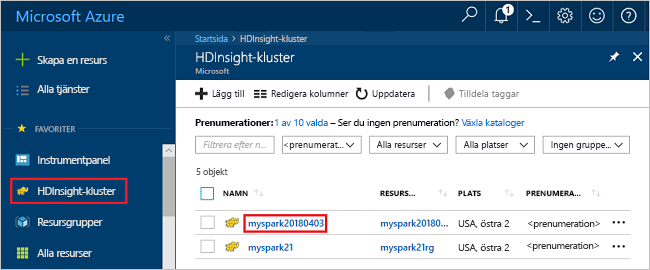
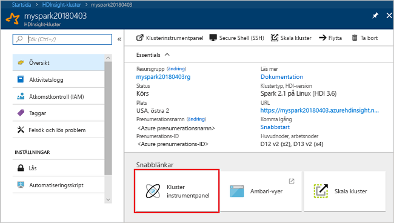
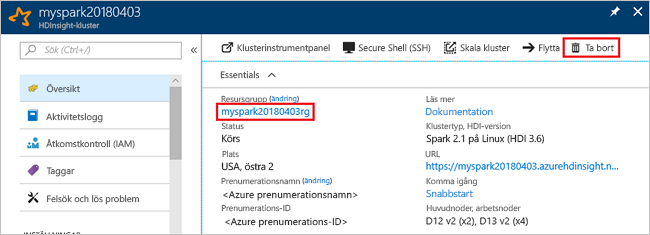

# <a name="quickstart-create-a-spark-cluster-in-hdinsight-using-powershell"></a>Snabbstart: Skapa ett Spark-kluster i HDInsight med PowerShell
Lär dig hur du skapar Apache Spark-kluster på Azure HDInsight och hur du kör Spark SQL-frågor mot Hive-tabeller. Apache Spark möjliggör snabb data-analys och kluster-computing med minnesintern bearbetning. Mer information om Spark på HDInsight finns i [Översikt: Apache Spark på Azure HDInsight](apache-spark-overview.md).

I den här snabbstarten använder du Azure PowerShell för att skapa ett HDInsight Spark-kluster. Klustret använder Azure Storage-blobbar som klusterlagring.

> [!IMPORTANT]
> Fakturering för HDInsight-kluster sker proportionerligt per minut, oavsett om du använder dem eller inte. Se till att du tar bort dina kluster när du är klar med dem. Mer information finns i avsnittet [Rensa resurser](#clean-up-resources) i den här artikeln.

Om du inte har en Azure-prenumeration kan du [skapa ett kostnadsfritt konto ](https://azure.microsoft.com/free/) innan du börjar.

## <a name="create-an-hdinsight-spark-cluster"></a>Skapa ett HDInsight Spark-kluster

Att skapa ett HDInsight-kluster innefattar att skapa följande Azure-objekt och -resurser:

- En Azure-resursgrupp. En Azure-resursgrupp är en behållare för Azure-resurser. 
- Ett Azure-lagringskonto eller en Azure Data Lake Store.  Varje HDInsight-kluster kräver en beroende datalagring. I den här snabbstarten skapar du ett lagringskonto.
- Ett HDInsight-kluster med olika klustertyper.  I den här snabbstarten skapar du ett Spark 2.2-kluster.

Du använder ett PowerShell-skript för att skapa resurserna.  När du kör skriptet uppmanas du att ange följande värden:

|Parameter|Värde|
|------|------|
|Azure-resursgruppsnamn | Ange ett unikt namn för resursgruppen.|
|Plats| Ange Azure-regionen, t.ex. Centrala USA. |
|Namn på standardlagringskonto | Ange ett unikt namn för lagringskontot. |
|Klusternamn | Ange ett unikt namn för HDInsight Spark-klustret.|
|Autentiseringsuppgifter för klusterinloggning | Du kan använda det här kontot för att ansluta till klusterinstrumentpanelen senare i snabbstarten.|
|SSH-användaruppgifter | SSH-klienterna kan användas för att skapa en fjärrkommandoradssession med HDInsight-klustret.|


1. Klicka på **Prova** i det övre högra hörnet att öppna följande kodblock för att öppna [Azure Cloud Shell](../../cloud-shell/overview.md), och följ anvisningarna för att ansluta till Azure.
2. Kopiera och klistra in följande PowerShell-skript i molngränssnittet. 

    ```azurepowershell-interactive
    ### Create a Spark 2.2 cluster in Azure HDInsight
        
    # Create the resource group
    $resourceGroupName = Read-Host -Prompt "Enter the resource group name"
    $location = Read-Host -Prompt "Enter the Azure region to create resources in, such as 'Central US'"
    New-AzureRmResourceGroup -Name $resourceGroupName -Location $location
    
    $defaultStorageAccountName = Read-Host -Prompt "Enter the default storage account name"
    
    # Create an Azure storae account and container
    New-AzureRmStorageAccount `
        -ResourceGroupName $resourceGroupName `
        -Name $defaultStorageAccountName `
        -Type Standard_LRS `
        -Location $location
    $defaultStorageAccountKey = (Get-AzureRmStorageAccountKey `
                                    -ResourceGroupName $resourceGroupName `
                                    -Name $defaultStorageAccountName)[0].Value
    $defaultStorageContext = New-AzureStorageContext `
                                    -StorageAccountName $defaultStorageAccountName `
                                    -StorageAccountKey $defaultStorageAccountKey
    
    # Create a Spark 2.2 cluster
    $clusterName = Read-Host -Prompt "Enter the name of the HDInsight cluster"
    # Cluster login is used to secure HTTPS services hosted on the cluster
    $httpCredential = Get-Credential -Message "Enter Cluster login credentials" -UserName "admin"
    # SSH user is used to remotely connect to the cluster using SSH clients
    $sshCredentials = Get-Credential -Message "Enter SSH user credentials"
    
    # Default cluster size (# of worker nodes), version, type, and OS
    $clusterSizeInNodes = "1"
    $clusterVersion = "3.6"
    $clusterType = "Spark"
    $clusterOS = "Linux"
    
    # Set the storage container name to the cluster name
    $defaultBlobContainerName = $clusterName
    
    # Create a blob container. This holds the default data store for the cluster.
    New-AzureStorageContainer `
        -Name $clusterName -Context $defaultStorageContext 
    
    $sparkConfig = New-Object "System.Collections.Generic.Dictionary``2[System.String,System.String]"
    $sparkConfig.Add("spark", "2.2")
    
    # Create the HDInsight cluster
    New-AzureRmHDInsightCluster `
        -ResourceGroupName $resourceGroupName `
        -ClusterName $clusterName `
        -Location $location `
        -ClusterSizeInNodes $clusterSizeInNodes `
        -ClusterType $clusterType `
        -OSType $clusterOS `
        -Version $clusterVersion `
        -ComponentVersion $sparkConfig `
        -HttpCredential $httpCredential `
        -DefaultStorageAccountName "$defaultStorageAccountName.blob.core.windows.net" `
        -DefaultStorageAccountKey $defaultStorageAccountKey `
        -DefaultStorageContainer $clusterName `
        -SshCredential $sshCredentials 
    
    Get-AzureRmHDInsightCluster -ResourceGroupName $resourceGroupName -ClusterName $clusterName
    ```
Det tar cirka 20 minuter att skapa klustret. Klustret måste skapas innan du kan fortsätta till nästa session.

Om du stöter på ett problem med att skapa HDInsight-kluster kan det bero på att du inte har rätt behörighet för att göra det. Mer information finns i [åtkomstkravkontrollen](../hdinsight-administer-use-portal-linux.md#create-clusters).

## <a name="create-a-jupyter-notebook"></a>Skapa en Jupyter-anteckningsbok

Jupyter Notebook är en interaktiv anteckningsboksmiljö som har stöd för olika programmeringsspråk. Miljön gör att du kan interagera med dina data, kombinera kod med markdown-text och utföra enkla visualiseringar. 

1. Öppna [Azure-portalen](https://portal.azure.com).
2. Välj **HDInsight-kluster** och välj sedan det kluster som du skapade.

    

3. Välj **Klusterinstrumentpaneler** från portalen och välj sedan **Jupyter Notebook**. Ange autentiseringsuppgifterna för klustret om du uppmanas att göra det.

   

4. Skapa en anteckningsbok genom att välja **Ny** > **PySpark**. 

   

   En ny anteckningsbok skapas och öppnas med namnet Untitled(Untitled.pynb).


## <a name="run-spark-sql-statements"></a>Kör Spark SQL-instruktioner

SQL (Structured Query Language) är det vanligaste språket för frågor och definition av data. Spark SQL fungerar som ett tillägg till Apache Spark för bearbetning av strukturerade data med den välbekanta SQL-syntaxen.

1. Verifiera att kerneln är klar. Kerneln är klar när du ser en tom cirkel bredvid kernelnamnet i den bärbara datorn. En fylld cirkel anger att kerneln är upptagen.

    

    När du startar den bärbara datorn för första gången utför kerneln några uppgifter i bakgrunden. Vänta tills kerneln är klar. 
2. Klistra in följande kod i en tom cell och tryck sedan på **SKIFT+RETUR** för att köra koden. Kommandot listar Hive-tabellerna i klustret:

    ```PySpark
    %%sql
    SHOW TABLES
    ```
    När du använder en Jupyter-anteckningsbok med ditt HDInsight Spark-kluster får du en förinställd `sqlContext` som du kan använda för att köra Hive-frågor med hjälp av Spark SQL. `%%sql` anger att Jupyter Notebook ska använda den förinställda `sqlContext` när Hive-frågan ska köras. Frågan hämtar de översta 10 raderna från en Hive-tabell (**hivesampletable**) som medföljer alla HDInsight-kluster som standard. Det tar ungefär 30 sekunder att få resultatet. De utdata som returneras ser ut så här: 

    

    Varje gång du kör en fråga i Jupyter visar fönsterrubriken i webbläsaren statusen **(Upptagen)** tillsammans med anteckningsbokens titel. Du ser även en fylld cirkel bredvid **PySpark**-texten i det övre högra hörnet.
    
2. Kör ytterligare en fråga för att visa data i `hivesampletable`.

    ```PySpark
    %%sql
    SELECT * FROM hivesampletable LIMIT 10
    ```
    
    Skärmen bör uppdateras så att frågeresultatet visas.

    

2. Välj **Stäng och stoppa** på anteckningsbokens **Arkiv**-meny. När du stänger anteckningsboken frigörs klusterresurserna.

## <a name="clean-up-resources"></a>Rensa resurser
HDInsight sparar dina data i Azure Storage eller Azure Data Lake Store så att du på ett säkert sätt kan ta bort ett kluster när det inte används. Du debiteras också för ett HDInsight-kluster, även när det inte används. Eftersom avgifterna för klustret är flera gånger större än avgifterna för lagring är det ekonomiskt sett bra att ta bort kluster när de inte används. Om du planerar att arbeta med självstudien som finns i [Nästa steg](#next-steps) direkt kanske du vill behålla klustret.

Växla tillbaka till Azure Portal och välj **Ta bort**.



Du kan också välja det resursgruppnamn som ska öppna resursgruppsidan och sedan välja **Ta bort resursgrupp**. Genom att ta bort resursgruppen tar du bort både HDInsight Spark-klustret och standardkontot för lagring.

## <a name="next-steps"></a>Nästa steg 

I den här snabbstarten beskrivs hur du skapar ett HDInsight Spark-kluster och kör en grundläggande Spark SQL-fråga. Gå vidare till nästa självstudie om du vill lära dig hur du använder ett HDInsight Spark-kluster för att köra interaktiva frågor på exempeldata.

> [!div class="nextstepaction"]
>[Köra interaktiva frågor i Spark](./apache-spark-load-data-run-query.md)
