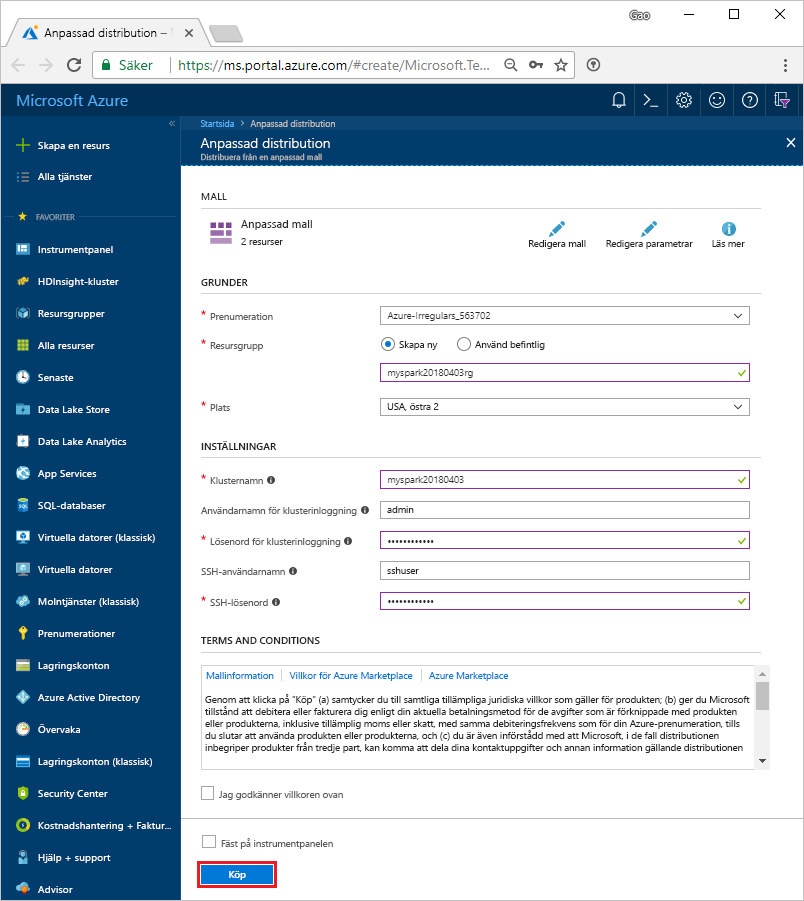

# <a name="quickstart-create-an-apache-spark-cluster-in-hdinsight-using-template"></a>Snabbstart: Skapa ett Apache Spark-kluster i HDInsight med hjälp av en mall

Lär dig hur du skapar ett [Apache Spark](https://spark.apache.org/)-kluster i Azure HDInsight och hur du kör Spark SQL-frågor mot [Apache Hive](https://hive.apache.org/)-tabeller. Apache Spark möjliggör snabb dataanalys och databehandling i kluster med hjälp av minnesintern bearbetning. Mer information om Spark på HDInsight finns i [Översikt: Apache Spark på Azure HDInsight](apache-spark-overview.md).

I den här snabbstarten använder du en Resource Manager-mall för att skapa ett HDInsight Spark-kluster. Klustret använder Azure Storage Blobar som klusterlagring. Mer information om hur du kan använda Data Lake Storage Gen2 finns i [Snabbstart: Konfigurera kluster i HDInsight](../../storage/data-lake-storage/quickstart-create-connect-hdi-cluster.md).

> [!IMPORTANT]  
> Fakturering för HDInsight-kluster sker proportionerligt per minut, oavsett om du använder dem eller inte. Se till att du tar bort dina kluster när du är klar med dem. Mer information finns i avsnittet [Rensa resurser](#clean-up-resources) i den här artikeln.

Om du inte har en Azure-prenumeration kan du [skapa ett kostnadsfritt konto ](https://azure.microsoft.com/free/) innan du börjar.

## <a name="create-an-hdinsight-spark-cluster"></a>Skapa ett HDInsight Spark-kluster

Skapa ett HDInsight Spark-kluster med hjälp av en Azure Resource Manager-mall. Du hittar mallen på [GitHub](https://azure.microsoft.com/resources/templates/101-hdinsight-spark-linux/).

1. Välj följande länk för att öppna mallen i Azure Portal i en ny flik i webbläsaren:

    <a href="https://portal.azure.com/#create/Microsoft.Template/uri/https%3A%2F%2Fraw.githubusercontent.com%2FAzure%2Fazure-quickstart-templates%2Fmaster%2F101-hdinsight-spark-linux%2Fazuredeploy.json" target="_blank">Distribuera till Azure</a>

2. Ange följande värden:

    | Egenskap | Värde |
    |---|---|
    |**Prenumeration**|Välj den Azure-prenumeration som ska användas för att skapa klustret. Prenumerationen som används för den här snabbstarten är **&lt;Azure-prenumerationsnamn**. |
    | **Resursgrupp**|Skapa en resursgrupp eller välj en befintlig. Resursgrupp används för att hantera Azure-resurser till dina projekt. Den nya resursgruppens namn som används för den här snabbstarten är **myspark20180403rg**.|
    | **Plats**|Välj en plats för resursgruppen. Mallen använder den här platsen för att skapa klustret samt standardklusterlagringen. Den plats som används för den här snabbstarten **USA, östra 2**.|
    | **ClusterName**|Ange ett namn på det HDInsight-kluster som du vill skapa. Det nya klusternamnet som används för den här snabbstarten är **myspark20180403**.|
    | **Inloggningsnamn och lösenord för klustret**|Standardinloggningsnamnet är admin. Välj ett lösenord för klusterinloggning. Inloggningsnamnet som används för den här snabbstarten är **admin**.|
    | **SSH-användarnamn och lösenord**|Välj ett lösenord för SSH-användaren. SSH-användarnamnet som används för den här snabbstarten är **sshuser**.|

    

3. Välj **Jag godkänner villkoren som anges ovan**, välj **Fäst på instrumentpanelen** och välj sedan **Köp**. En ny panel visas med rubriken **Skicka malldistribution**. Det tar cirka 20 minuter att skapa klustret. Klustret måste skapas innan du kan fortsätta till nästa session.

Om du stöter på ett problem med att skapa HDInsight-kluster kan det bero på att du inte har rätt behörighet för att göra det. Mer information finns i [åtkomstkravkontrollen](../hdinsight-hadoop-create-linux-clusters-portal.md).

## <a name="install-intellijeclipse-for-spark-application"></a>Installera IntelliJ/Eclipse för programmet Spark
Använd plugin-programmet Azure Toolkit for IntelliJ/Eclipse för att utveckla Spark-program i [Scala](https://www.scala-lang.org/) och sedan skicka dem till ett Azure HDInsight Spark-klister direkt från IntelliJ/Eclipse-IDE (Integrated Development Environment). Mer information finns i [Använd IntelliJ för att skriva/skicka Spark-program](./apache-spark-intellij-tool-plugin.md) och [Använd Eclipse för att skriva/skicka Spark-program](./apache-spark-eclipse-tool-plugin.md).

## <a name="install-vscode-for-pysparkhive-applications"></a>Installera VSCode för PySpark/hive-program
Lär dig hur du använder Azure HDInsight Tools för Visual Studio Code (VSCode) för att skapa och skicka Hive-batchjobb, interaktiva Hive-frågor, PySpark-batchjobb och interaktiva PySpark-skript. Azure HDInsight-verktyg kan installeras på de plattformar som stöds av VSCode. Dessa omfattar Windows, Linux och macOS. Mer information finns i [Använd VSCode för att skriva/skicka PySpark-program](../hdinsight-for-vscode.md).

## <a name="create-a-jupyter-notebook"></a>Skapa en Jupyter-anteckningsbok

[Jupyter Notebook](https://jupyter.org/) är en interaktiv anteckningsboksmiljö som stöder flera olika datorspråk. Du kan använda anteckningsboken för att interagera med dina data, kombinera kod med markdown-text och utföra enkla visualiseringar.

1. Öppna [Azure-portalen](https://portal.azure.com).
2. Välj **HDInsight-kluster** och välj sedan det kluster som du skapade.

    

3. I portalen går du till avsnittet **Klusterinstrumentpaneler** och klickar på **Jupyter Notebook**. Ange autentiseringsuppgifterna för klustret om du uppmanas att göra det.

   

4. Skapa en anteckningsbok genom att välja **Ny** > **PySpark**.

   

   En ny anteckningsbok skapas och öppnas med namnet Untitled(Untitled.pynb).


## <a name="run-spark-sql-statements"></a>Kör Spark SQL-instruktioner

SQL (Structured Query Language) är det vanligaste språket för frågor och transformering av data. Spark SQL fungerar som ett tillägg till Apache Spark för bearbetning av strukturerade data med den välbekanta SQL-syntaxen.

1. Verifiera att kerneln är klar. Kerneln är klar när du ser en tom cirkel bredvid kernelnamnet i den bärbara datorn. En fylld cirkel anger att kerneln är upptagen.

    

    När du startar den bärbara datorn för första gången utför kerneln några uppgifter i bakgrunden. Vänta tills kerneln är klar.
2. Klistra in följande kod i en tom cell och tryck sedan på **SKIFT+RETUR** för att köra koden. Kommandot listar Hive-tabellerna i klustret:

    ```sql
    %%sql
    SHOW TABLES
    ```
    När du använder en Jupyter-anteckningsbok med ditt HDInsight Spark-kluster får du en förinställd `spark`-session som du kan använda för att köra Hive-frågor med hjälp av Spark SQL. `%%sql` anger att Jupyter Notebook ska använda den förinställda sessionen `spark` när Hive-frågan ska köras. Frågan hämtar de översta 10 raderna från en Hive-tabell (**hivesampletable**) som medföljer alla HDInsight-kluster som standard. Första gången du skickar frågan skapar Jupyter Spark-programmet för den bärbara datorn. Det tar ungefär 30 sekunder att slutföra. När Spark-programmet är klart körs frågan i ungefär en sekund och producerar resultatet. De utdata som returneras ser ut så här:

    

    Varje gång du kör en fråga i Jupyter visar fönsterrubriken i webbläsaren statusen **(Upptagen)** tillsammans med anteckningsbokens titel. Du ser även en fylld cirkel bredvid **PySpark**-texten i det övre högra hörnet.

2. Kör ytterligare en fråga för att visa data i `hivesampletable`.

    ```sql
    %%sql
    SELECT * FROM hivesampletable LIMIT 10
    ```
    
    Skärmen bör uppdateras så att frågeresultatet visas.

    

2. Välj **Stäng och stoppa** på anteckningsbokens **Arkiv**-meny. När du stänger anteckningsboken frigörs klusterresursen, inklusive Spark-programmet.

## <a name="clean-up-resources"></a>Rensa resurser
I HDInsight sparas dina data och Jupyter Notebooks i Azure Storage eller Azure Data Lake Store för att du på ett säkert sätt ska kunna ta bort ett kluster när det inte används. Du debiteras också för ett HDInsight-kluster, även när det inte används. Eftersom avgifterna för klustret är flera gånger större än avgifterna för lagring är det ekonomiskt sett bra att ta bort kluster när de inte används. Om du planerar att arbeta med självstudierna i [Nästa steg](#next-steps) direkt, kan du vilja behålla klustret.

Växla tillbaka till Azure Portal och välj **Ta bort**.


Du kan också välja det resursgruppnamn som ska öppna resursgruppsidan och sedan välja **Ta bort resursgrupp**. När resursgruppen tas bort, tas även HDInsight Spark-klustret och standardkontot för lagring bort.

## <a name="next-steps"></a>Nästa steg

I den här snabbstarten har du lärt dig skapa ett HDInsight Spark-kluster och köra grundläggande Spark SQL-frågor. Gå vidare till nästa självstudier om du vill lära dig använda ett HDInsight Spark-kluster för att köra interaktiva frågor på exempeldata.

> [!div class="nextstepaction"]
>[Köra interaktiva frågor i Apache Spark](./apache-spark-load-data-run-query.md)


