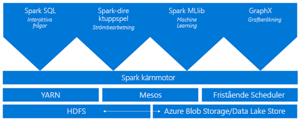
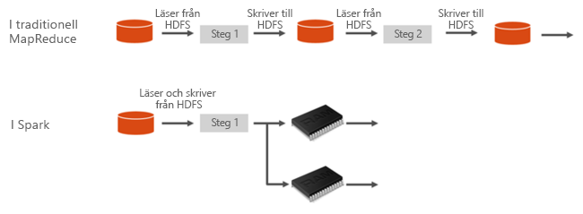
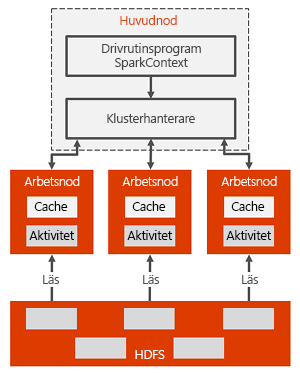

# Introduktion till Spark i HDInsight

Den här artikeln ger en introduktion till Spark i HDInsight. <a href="http://spark.apache.org/" target="_blank">Apache Spark</a> är ett ramverk för parallellbearbetning med öppen källkod som stöder intern bearbetning för att höja prestandan hos program för stordataanalys. Spark-kluster i HDInsight är kompatibelt med Azure Storage (WASB) samt Azure Data Lake Store. Därför kan dina befintliga data som lagras i Azure enkelt bearbetas via Spark-kluster.

[!INCLUDE [hdinsight-price-change](../../../includes/hdinsight-enhancements.md)]

När du skapar ett Spark-kluster i HDInsight skapas Azure-beräkningsresurser med Spark installerat och konfigurerat. Det tar bara ungefär tio minuter att skapa ett Spark-kluster i HDInsight. De data som ska bearbetas lagras i Azure Storage eller Azure Data Lake Store. Se [Använda Azure Storage med HDInsight](../hdinsight-hadoop-use-blob-storage.md).

## Spark jämfört med traditionella MapReduce

Vad är det som gör Spark snabbt? Vilka skillnader i arkitekturen för Apache Spark jämfört med traditionella MapReduce gör att det förstnämnda kan erbjuda högre prestanda för delning av data?

Spark tillhandahåller primitiver för klusterbearbetning i minnet. Ett Spark-jobb kan läsa in och cachelagra data i minnet samt köra frågor på dessa data upprepade gånger, mycket snabbare än diskbaserade system. Spark är integrerat i programmeringsspråket Scala. På så sätt kan du bearbeta distribuerade datauppsättningar på samma sätt som lokala samlingar. Det finns inget behov av att strukturera det hela i mappnings- och reduceringsåtgärder.

I Spark sker datadelningen mellan åtgärder snabbare eftersom data är inläst i minnet. Som jämförelse delar Hadoop data via HDFS, vilket resulterar i längre bearbetningstider.

## Vad är Apache Spark i Azure HDInsight?
Med Spark-kluster HDInsight får du tillgång till en helt hanterad Spark-tjänst. Fördelarna med att skapa ett Spark-kluster i HDInsight visas här.

| Funktion | Beskrivning |
| --- | --- |
| Enkelt att skapa Spark-kluster |Du kan skapa ett nytt Spark-kluster i HDInsight på bara några minuter med hjälp av Azure Portal, Azure PowerShell eller HDInsight .NET SDK. Se [Komma igång med Spark-kluster i HDInsight](apache-spark-jupyter-spark-sql.md) |
| Användbarhet |Spark-kluster i HDInsight innehåller Jupyter och Zeppelin-anteckningsböcker. Du kan de här anteckningsböckerna för interaktiv databehandling och visualisering.|
| REST API:er |HDInsight Spark innehåller [Livy](https://github.com/cloudera/hue/tree/master/apps/spark/java#welcome-to-livy-the-rest-spark-server), en REST-API-baserad Spark-jobbserver för fjärrsändning och -övervakning av jobb. |
| Stöd för Azure Data Lake Store | Spark-kluster i HDInsight kan konfigureras till att använda sig av Azure Data Lake Store som ytterligare lagringsutrymme och som primärt lagringsutrymme (enbart med HDInsight 3.5-kluster). Mer information om Data Lake Store finns i [Översikt över Azure Data Lake Store](../../data-lake-store/data-lake-store-overview.md). |
| Integrering med Azure-tjänster |Spark-kluster i HDInsight levereras med en anslutningsapp för Azure Event Hubs. Med Event Hubs kan kunderna skapa strömmade program utöver [Kafka](http://kafka.apache.org/) som redan ingår i Spark. |
| Stöd för R Server | Du kan konfigurera en R Server med HDInsight Spark-klustret och köra distribuerade R-beräkningar i de hastigheter Spark-klustret har kapacitet för. Mer information finns i [Komma igång med R Server på HDInsight](../r-server/r-server-get-started.md). |
| Integrering med tredje parts IDEs | HDInsight tillhandahåller plugin-program för IDEs som IntelliJ IDEA och Eclipse som du kan använda för att skapa och skicka program till ett HDInsight Spark-kluster. Mer information finns i [Använd Azure Toolkit för IntelliJ IDEA](apache-spark-intellij-tool-plugin.md) och [Använd Azure Toolkit för Eclipse](apache-spark-eclipse-tool-plugin.md).|
| Samtidiga frågor |Spark-kluster i HDInsight har stöd för samtidiga frågor. Det gör att flera frågor från en användare eller flera frågor från olika användare och program kan dela samma klusterresurser. |
| Cachelagring i SSD:er |Du kan välja att cachelagrade data i minnet eller i SSD:er anslutna till klusternoderna. Cachelagring i minnet ger bästa frågeprestanda, men kan vara dyrt. Cachelagring i SSD:er är ett bra alternativ för att förbättra frågeprestanda utan att behöva skapa ett kluster i den storlek som krävs för att få plats med hela datauppsättningen i minnet. |
| Integrering med BI-verktyg |Spark-kluster för HDInsight tillhandahåller anslutningsappar för BI-verktyg som [Power BI](http://www.powerbi.com/) och [Tableau](http://www.tableau.com/products/desktop) för dataanalys. |
| Förinstallerade Anaconda-bibliotek |Spark-kluster i HDInsight kommer med förinstallerade Anaconda-bibliotek. [Anaconda](http://docs.continuum.io/anaconda/) innehåller närmare 200 bibliotek för Machine Learning, dataanalys, visualisering med mera. |
| Skalbarhet |Du kan ange antalet noder i klustret när du skapar det, men du kan ibland behöva öka eller minska klustrets storlek så att det matchar arbetsbelastningen. Du kan ändra antalet noder i alla HDInsight-kluster. Dessutom kan du ta bort Spark-kluster utan någon dataförlust eftersom alla data lagras i Azure Storage eller Data Lake Store. |
| Dygnet runt-support hela veckan |Spark-kluster på HDInsight levereras med dygnet runt-support på företagsnivå veckans alla dagar och ett serviceavtal för 99,9 % drifttid. |

## Spark-klusterarkitektur

Följande beskriver Spark-klusterarkitekturen och hur den fungerar:

Huvudnoden har Spark-hanteraren som hanterar de applikationer som är mappade till Spark-drivrutinen. Varje applikation hanteras av Spark-hanteraren på olika sätt. Spark kan köras ovanpå en Mesos-, YARN- eller Spark-klusterhanterare. Klusterhanteraren tilldelar då arbetsnodresurser till en applikation. I HDInsight körs Spark ovanpå YARN-klusterhanteraren. Resurserna i klustret hanteras av Spark-hanteraren i HDInsight. Det innebär att Spark-hanteraren har kunskap om vilka resurser, t.ex. minne, som är upptagna eller lediga på arbetsnoden.

Drivrutinen kör användarens main-funktion och utför de olika parallella åtgärderna på arbetsnoderna. Drivrutinen samlar sedan in resultatet av åtgärderna. Arbetsnoderna läser data från och skriver data till HDFS-filsystemet (Hadoop Distributed File System). Arbetsnoderna cachelagrar också omvandlade data i minnet som RDD-datauppsättningar (Resilient Distributed Dataset).

När en applikation skapas i Spark-hanteraren tilldelar Spark-hanteraren resurser till apparna och skapar en körning som kallas för Spark-drivrutinen. Spark-drivrutinen skapar även SparkContext och börjar också att skapa RDD-datauppsättningar. RDD-datauppsättningarnas metadata lagras på Spark-drivrutinen.

Spark-drivrutinen ansluter till Spark-hanteraren och ansvarar för omvandling av en applikation till en riktad graf (DAG) över enskilda uppgifter som körs i en körningsprocess på arbetsnoderna. Varje applikation får en egen körningsprocess som förblir aktiv under applikationens livslängd och kör uppgifter i flera trådar.

## Hur kan Spark i HDInsight användas?
Spark-kluster i HDInsight möjliggör följande huvudsakliga scenarier:

### Interaktiv dataanalys och BI
[Titta på en genomgång](apache-spark-use-bi-tools.md)

Apache Spark i HDInsight lagrar data i Azure Storage eller Azure Data Lake Store. Affärsexperter och beslutsfattare kan analysera och skapa rapporter över dessa data och använda Microsoft Power BI till att skapa interaktiva rapporter utifrån analyserade data. Analytiker kan utgå ifrån ostrukturerade/halvstrukturerade data i klusterlagring, definiera ett schema för data med anteckningsböcker och sedan skapa datamodeller med Microsoft Power BI. Spark-kluster i HDInsight har också stöd för ett antal BI-verktyg från tredje part, bland annat Tableau. Det gör det till en utmärkt plattform för dataanalytiker, affärsexperter och beslutsfattare.

### Spark-maskininlärning
[Titta på en genomgång: Förutsäga temperaturer i en byggnad med hjälp av HVAC-data](apache-spark-ipython-notebook-machine-learning.md)

[Titta på en genomgång: Förutsäga resultatet av en livsmedelskontroll](apache-spark-machine-learning-mllib-ipython.md)

Med Apache Spark medföljer Machine Learning-biblioteket [MLlib](http://spark.apache.org/mllib/) som är byggt på Spark som du kan använda från ett Spark-kluster i HDInsight. Spark-kluster i HDInsight innehåller Anaconda, en Python-distribution med en rad olika paket för Machine Learning. Ihop med det inbyggda stödet för Jupyter- och Zeppelin-anteckningsböcker ger det en förstklassig miljö att skapa Machine Learning-program i.

### Spark-strömning och dataanalys i realtid

Spark-kluster i HDInsight innehåller omfattande stöd för att skapa lösningar för realtidsanalys. Spark har anslutningsappar för att föra in data från ett flertal källor som Kafka, Flume, Twitter, ZeroMQ och TCP-socket. Med Spark i HDInsight får du dessutom förstklassig stöd för att föra in data från Azure Event Hubs. Event Hubs är den vanligast använda kötjänsten på Azure. Det inbyggda stödet för Event Hubs gör Spark-kluster i HDInsight till en perfekt plattform för att skapa en pipeline för realtidsanalyser.

## Vilka komponenter medföljer som en del i ett Spark-kluster?
Spark-kluster i HDInsight innehåller följande komponenter som är tillgängliga i klustren som standard.

* [Spark Core](https://spark.apache.org/docs/1.5.1/). Omfattar Spark Core, Spark SQL, Spark-API:er för strömning, GraphX och MLlib.
* [Anaconda](http://docs.continuum.io/anaconda/)
* [Livy](https://github.com/cloudera/hue/tree/master/apps/spark/java#welcome-to-livy-the-rest-spark-server)
* [Jupyter Notebook](https://jupyter.org)
* [Zeppelin Notebook](http://zeppelin-project.org/)

Spark-kluster i HDInsight tillhandahåller även en [ODBC-drivrutin](http://go.microsoft.com/fwlink/?LinkId=616229) för anslutning till Spark-kluster i HDInsight från BI-verktyg som Microsoft Power BI och Tableau.

## Vad ska jag börja med?
Börja med att skapa ett Spark-kluster i HDInsight. Se [Snabbstart: skapa ett Spark-kluster i HDInsight Linux och köra exempelprogram med Jupyter](apache-spark-jupyter-spark-sql.md). 

## Nästa steg
### Scenarier
* [Spark med BI: Utföra interaktiv dataanalys med hjälp av Spark i HDInsight med BI-verktyg](apache-spark-use-bi-tools.md)
* [Spark med Machine Learning: Använda Spark i HDInsight för analys av byggnadstemperatur med HVAC-data](apache-spark-ipython-notebook-machine-learning.md)
* [Spark med Machine Learning: Använda Spark i HDInsight för att förutsäga resultatet av en livsmedelskontroll](apache-spark-machine-learning-mllib-ipython.md)
* [Webbplatslogganalys med Spark i HDInsight](apache-spark-custom-library-website-log-analysis.md)

### Skapa och köra program
* [Skapa ett fristående program med hjälp av Scala](apache-spark-create-standalone-application.md)
* [Köra jobb via fjärranslutning på ett Spark-kluster med Livy](apache-spark-livy-rest-interface.md)

### Verktyg och tillägg
* [Använda HDInsight Tools-plugin för IntelliJ IDEA till att skapa och skicka Spark Scala-appar](apache-spark-intellij-tool-plugin.md)
* [Använda HDInsight Tools-plugin för IntelliJ IDEA till att felsöka Spark-program via fjärranslutning](apache-spark-intellij-tool-plugin-debug-jobs-remotely.md)
* [Använda Zeppelin-anteckningsböcker med ett Spark-kluster i HDInsight](apache-spark-zeppelin-notebook.md)
* [Kernlar som är tillgängliga för Jupyter Notebook i Spark-klustret för HDInsight](apache-spark-jupyter-notebook-kernels.md)
* [Använda externa paket med Jupyter-anteckningsböcker](apache-spark-jupyter-notebook-use-external-packages.md)
* [Installera Jupyter på datorn och ansluta till ett HDInsight Spark-kluster](apache-spark-jupyter-notebook-install-locally.md)

### Hantera resurser
* [Hantera resurser för Apache Spark-klustret i Azure HDInsight](apache-spark-resource-manager.md)
* [Följa och felsöka jobb som körs i ett Apache Spark-kluster i HDInsight](apache-spark-job-debugging.md)
* [Kända problem i Apache Spark i Azure HDInsight](apache-spark-known-issues.md).
