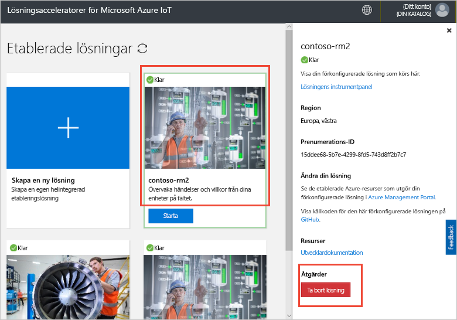

# Anslut en enhet med IoT DevKit till lösningsacceleratorn för fjärrövervakning

[!INCLUDE [iot-suite-selector-connecting](../../includes/iot-suite-selector-connecting.md)]

Den här guiden visar hur du kör ett exempelprogram på enheten IoT DevKit. Exempelkoden skickar telemetri från sensorer på enheten DevKit till utvecklingsacceleratorn.

Den [MXChip IoT DevKit](https://aka.ms/iot-devkit) är en allt-i-ett Arduino kompatibla tavla med omfattande kringutrustning och sensorer. Du kan utveckla för den med hjälp av [Azure IoT Device Workbench](https://aka.ms/iot-workbench) eller [Azure IoT Tools](https://aka.ms/azure-iot-tools) tilläggspaketet i Visual Studio Code. Den [projekt catalog](https://microsoft.github.io/azure-iot-developer-kit/docs/projects/) innehåller exempelprogram som hjälper dig att skapa prototyper IoT-lösningar.

## Innan du börjar

För att slutföra stegen i den här självstudien måste du först göra följande uppgifter:

* Förbereda din DevKit genom att följa stegen i [ansluta IoT DevKit AZ3166 på Azure IoT Hub i molnet](/azure/iot-hub/iot-hub-arduino-iot-devkit-az3166-get-started).

## Öppna exempelprojektet

Öppna exemplet fjärrövervakning i VS Code:

1. Kontrollera att din IoT DevKit inte till din dator. Starta VS Code först och sedan ansluta DevKit till din dator.

1. Klicka på `F1` för att öppna kommandopaletten, skriver du och väljer **Azure IoT Device Workbench: Öppna exempel...** . Välj sedan **IoT DevKit** som tavla.

1. Hitta **fjärrövervakning** och klicka på **öppna exemplet**. En ny VS Code-fönstret öppnas med projektmappen:

   

## Konfigurera enheten

Konfigurera anslutningssträngen för IoT Hub-enhet på enheten DevKit:

1. Växla IoT DevKit till **konfigurationsläge**:

    * Håll ned knappen **A**.
    * Push- och släpp den **återställa** knappen.

1. Skärmen visar DevKit-ID och `Configuration`.

    

1. Tryck på **F1** för att öppna kommandopaletten, skriver du och väljer **Azure IoT Device Workbench: Konfigurera Enhetsinställningar... > Config enhetens anslutningssträng**.

1. Klistra in anslutningssträngen som du kopierade tidigare och tryck på **RETUR** att konfigurera enheten.

## Skapa koden

Att skapa och överföra kod för enheten:

1. Tryck på `F1` för att öppna kommandopaletten, skriver du och väljer **Azure IoT Device Workbench: Ladda upp enheten**:

1. VS Code kompilerar och laddar upp koden till enheten DevKit:

    

1. DevKit enheten startar om och kör den kod som du laddat upp.

## Testa exemplet

Om du vill kontrollera att det exempelprogram som du laddade upp till DevKit enheten fungerar, utför du följande steg:

### Visa telemetri som skickas till lösningen för fjärrövervakning

När du kör exempelappen skickar DevKit enheten telemetri från sensorer data via Wi-Fi till utvecklingsacceleratorn. Visa telemetrin:

1. Gå till instrumentpanelen för lösningen och klicka **Device Explorer**.

1. Klicka på namnet på enheten för DevKit enheten. Du kan se telemetrin från DevKit i realtid på fliken till höger:

    

### Styra DevKit enheten

Lösningsacceleratorn för fjärrövervakning kan du styra din enhet via fjärranslutning. Exempelkoden implementerar tre metoder som du ser i den **metoden** avsnittet när du väljer enheten på den **Device Explorer** sidan:

Du kan ändra färg på en DevKit-led: ar med den **LedColor** metod:

1. Välj namnet på enheten från listan över enheter och klicka på den **jobb**:

    

1. Konfigurera jobb med hjälp av följande värden och klicka på **tillämpa**:

   * Välj jobb: **Metoden Kör**
   * Metodnamn: **LedColor**
   * Jobbnamnet: **ChangeLedColor**

     

1. Efter några sekunder ändras färgen på RGB-LED (under knappen A) på din DevKit

    

## Rensa resurser

Om du planerar att gå vidare till självstudierna låter du acceleratorn för fjärrövervakningslösningen vara distribuerad.

Om du inte längre behöver lösningsaccelerator kan ta bort den från sidan etablerade lösningar genom att markera den och sedan klicka på Ta bort lösningen:

## Problem och feedback

Om du stöter på problem, se [IoT DevKit vanliga frågor och svar](https://microsoft.github.io/azure-iot-developer-kit/docs/faq/) eller kontakta oss med hjälp av följande kanaler:

* [Gitter.im](https://gitter.im/Microsoft/azure-iot-developer-kit)
* [Stack Overflow](https://stackoverflow.com/questions/tagged/iot-devkit)

## Nästa steg

Nu när du har lärt dig hur du ansluter en enhet för DevKit till lösningsacceleratorn för fjärrövervakning, är här några nästa föreslagna steg:

* [Azure IoT acceleratorer lösningsöversikt](https://docs.microsoft.com/azure/iot-accelerators/)
* [Anpassa användargränssnittet](iot-accelerators-remote-monitoring-customize.md)
* [Ansluta IoT DevKit till programmet Azure IoT Central](../iot-central/howto-connect-devkit.md)