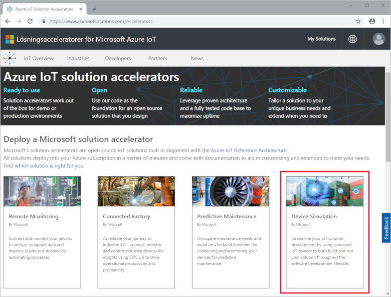
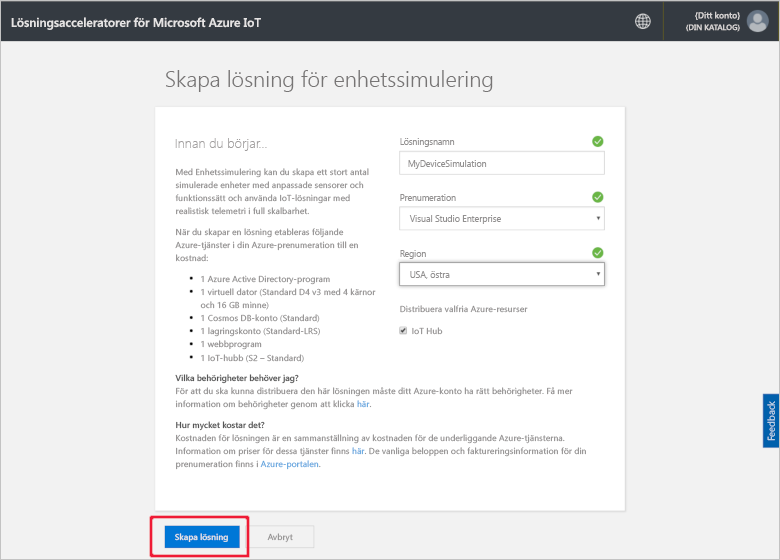
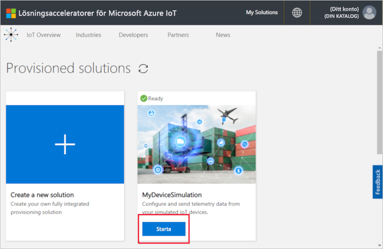
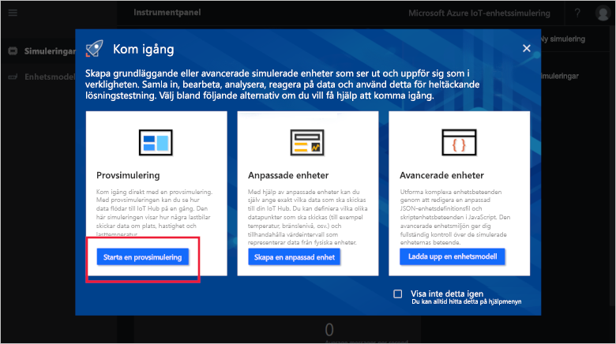
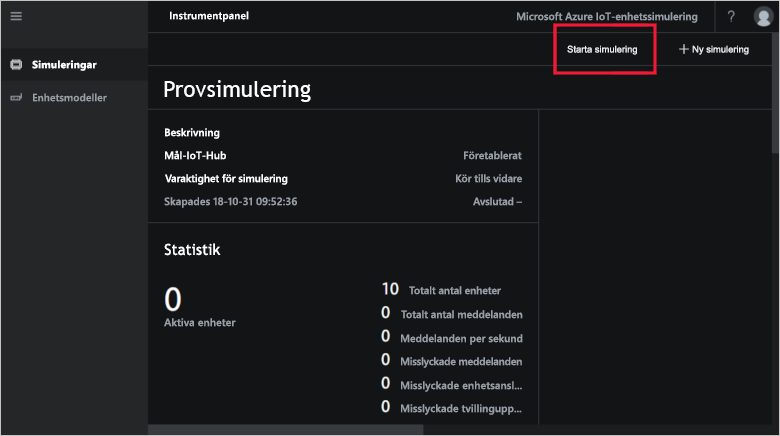
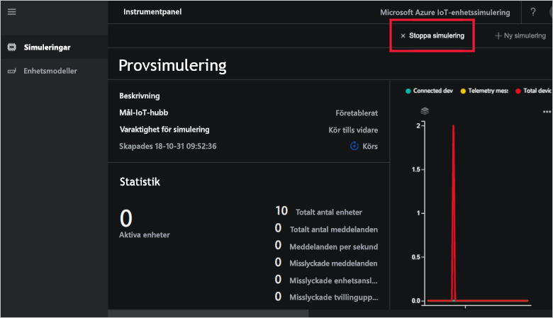
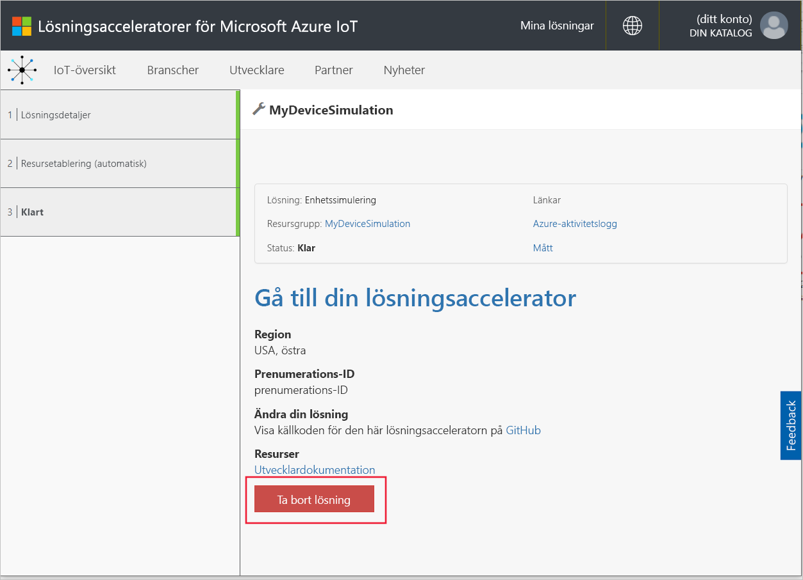

# Snabbstart: Distribuera och köra en IoT-enhetssimulering i Azure

Den här snabbstarten visar hur du distribuerar Azure IoT-enhetssimulering för att testa din IoT-lösning. När du har distribuerat lösningsacceleratorn kör du en exempelsimulering för att komma igång.

Du behöver en aktiv Azure-prenumeration för att kunna utföra den här snabbstarten.

Om du inte har en Azure-prenumeration kan du skapa ett [kostnadsfritt konto](https://azure.microsoft.com/free/?WT.mc_id=A261C142F) innan du börjar.

## Distribuera enhetssimulering

När du distribuerar enhetssimuleringen till din Azure-prenumeration måste du ange vissa konfigurationsalternativ.

Logga in på [azureiotsolutions.com](https://www.azureiotsolutions.com/Accelerators) med dina Azure-kontouppgifter.

Klicka på panelen **Enhetssimulering**:

Klicka på **Testa nu** på sidan med beskrivning av enhetssimulering:

På sidan **Skapa enhetssimuleringslösning** anger du ett unikt **Lösningsnamn**.

Välj den **prenumeration** och den **region** du vill använda för att distribuera lösningsacceleratorn. Normalt väljer du regionen närmast dig. Du måste vara [global administratör eller användare](iot-accelerators-permissions.md) i prenumerationen.

Markera rutan för att distribuera en IoT Hub som ska användas med din enhetssimuleringslösning. Du kan alltid ändra den IoT Hub-simuleringen du använder senare.

Klicka på **Skapa** för att börja etablera din lösning. Processen tar minst fem minuter att köra:

## Logga in på lösningen

När etableringsprocessen är klar kan du logga in på din instans av enhetssimulering genom att klicka på knappen **Starta**:

Klicka på **Acceptera** för att acceptera den begäran om behörigheter som instrumentpanelen för enhetssimuleringslösningen visar i webbläsaren.

Vid första öppningen ser du instrumentpanelen för enhetssimulering med en **komma igång**-guide. Klicka på den första panelen så öppnas en exempelsimulering. Om du stänger **komma igång**-guiden kan du öppna **den enkla exempelsimuleringen** från instrumentpanelen genom att klicka på dess panel:

## Exempelsimulering

Eftersom den är en exempelsimulering kan den inte redigeras. Simuleringen konfigureras med följande inställningar:

| Inställning             | Värde                       |
| ------------------- | --------------------------- |
| Mål-IoT Hub      | Använd i förväg etablerad IoT Hub |
| Enhetsmodell        | Lastbil                       |
| Antal enheter   | 10                          |
| Telemetrifrekvens | 10 sekunder                  |
| Simuleringens varaktighet | Kör utan tidsbegränsning            |

## Köra simuleringen

Klicka på **Starta simulering**. Simuleringen körs utan tidsbegränsning enligt konfigurationen. Du kan stoppa simuleringen när som helst genom att klicka på **Stoppa simulering**. Simuleringen visar statistik för den aktuella körningen.

Du kan bara köra en simulering i taget från en enhetssimuleringsinstans.

## Rensa resurser

Om du vill utforska ytterligare låter du enhetssimuleringen förbli distribuerad.

Om du inte längre behöver enhetssimuleringen tar du bort den från sidan [Etablerade lösningar](https://www.azureiotsolutions.com/Accelerators#dashboard) genom att klicka på dess panel och sedan på **Ta bort lösning**:

## Nästa steg

I den här snabbstarten har du distribuerat och kört en exempelsimulering för IoT-enheter.

> [!div class="nextstepaction"]
> [Skapa en simulering med en eller flera enhetstyper](iot-accelerators-device-simulation-create-simulation.md)