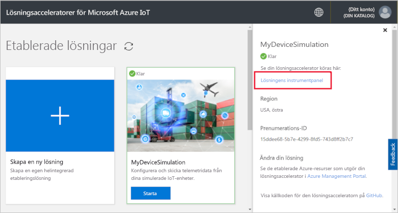
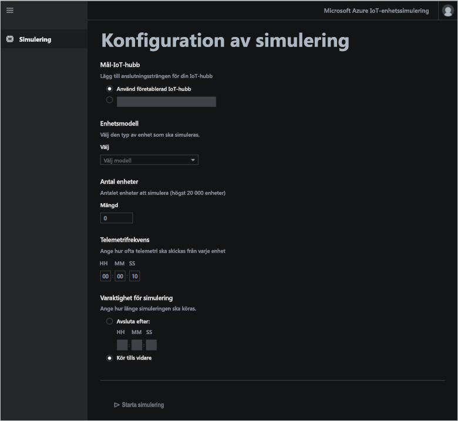
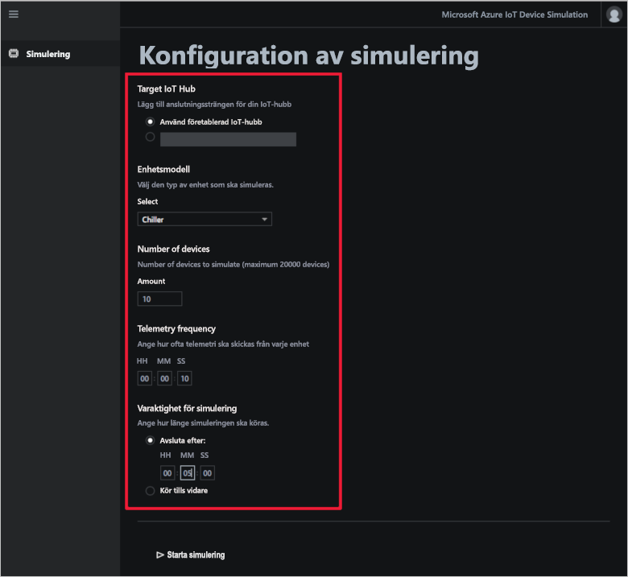
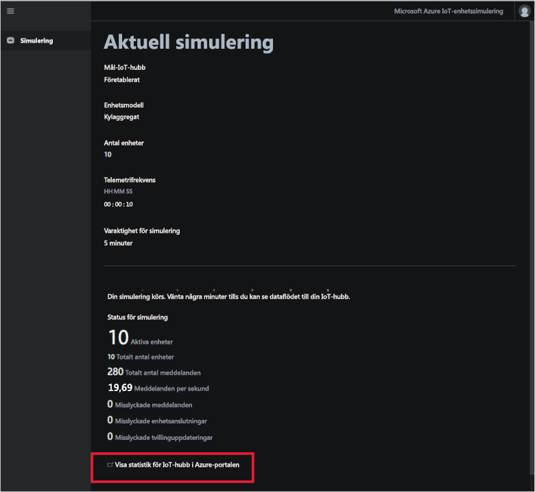

# Snabbstart: Distribuera och köra en molnbaserad lösning för enhetssimulering

Den här snabbstarten visar hur du distribuerar den lösningsaccelerator för Azure IoT-enhetssimulering du använder för att testa din IoT-lösning. När du har distribuerat lösningsacceleratorn kan du använda sidan **Simulering** för att skapa och köra en simulering.

Du behöver en aktiv Azure-prenumeration för att kunna utföra den här snabbstarten.

Om du inte har en Azure-prenumeration kan du skapa ett [kostnadsfritt konto](https://azure.microsoft.com/free/?WT.mc_id=A261C142F) innan du börjar.

## Distribuera lösningen

När du distribuerar lösningsacceleratorn till Azure-prenumerationen måste du ange några konfigurationsalternativ.

Logga in på [azureiotsolutions.com](https://www.azureiotsolutions.com/Accelerators) med dina Azure-kontouppgifter.

Klicka på **Testa nu** på panelen **Enhetssimulering**.

På sidan **Skapa enhetssimuleringslösning** anger du ett unikt **Lösningsnamn**. Anteckna namnet på lösningen, det är namnet på den Azure-resursgrupp som innehåller alla resurser för lösningen.

Välj den **prenumeration** och den **region** du vill använda för att distribuera lösningsacceleratorn. Normalt väljer du regionen närmast dig. Du måste vara [global administratör eller användare](iot-accelerators-permissions.md) i prenumerationen.

Markera rutan för att distribuera en IoT Hub som ska användas med din enhetssimuleringslösning. Du kan alltid ändra den IoT Hub-simuleringen du använder senare.

Klicka på **Skapa lösning** för att påbörja etablera lösningen. Processen tar minst fem minuter att köra:

## Logga in på lösningen

När etableringen är klar kan logga du in på instrumentpanelen för lösningsacceleratorn för enhetssimuleringen.

På sidan **Etablerade lösningar** klickar du på den nya lösningsacceleratorn för enhetssimulering:

Du kan visa information om lösningsacceleratorn för enhetssimuleringen på panelen som visas. Välj **Lösningens instrumentpanel** för att visa lösningsacceleratorn för enhetssimuleringen:

Klicka på **Acceptera** för att acceptera begäran om behörigheter som instrumentpanelen för enhetssimuleringslösningen visar i webbläsaren:

## Konfigurera simuleringen

Du konfigurerar och kör en simulering från instrumentpanelen. Använd värdena i följande tabell för att konfigurera simuleringen:

| Inställning             | Värde                       |
| ------------------- | --------------------------- |
| Mål-IoT Hub      | Använd i förväg etablerad IoT Hub |
| Enhetsmodell        | Kylaggregat                     |
| Antal enheter   | 10                          |
| Telemetrifrekvens | 10 sekunder                  |
| Simuleringens varaktighet | 5 minuter                   |

## Köra simuleringen

Klicka på **Starta simulering**. Simuleringen körs under hela den tid du har valt. Du kan stoppa simuleringen när som helst genom att klicka på **Stoppa simulering**. Simuleringen visar statistik för den aktuella körningen. Klicka på **View IoT Hub metrics in the Azure portal** (Visa IoT Hub-mått i Azure-portalen) för att se måtten som rapporteras av IoT Hub:

Du kan bara köra en simulering i taget från en etablerad instans av lösningsacceleratorn.

## Rensa resurser

Om du vill utforska ytterligare låter du lösningsacceleratorn för enhetssimuleringen förbli distribuerad.

Om du inte längre behöver lösningsacceleratorn tar du bort den från sidan [Etablerade lösningar](https://www.azureiotsolutions.com/Accelerators#dashboard) genom att välja den och sedan klicka på **Ta bort lösning**:

## Nästa steg

I den här snabbstarten har du distribuerat lösningsacceleratorn för enhetssimuleringen och kört en IoT-enhetssimulering.

I följande guide får du lära dig att använda en befintlig IoT Hub i en simulering:

> [!div class="nextstepaction"]
> [Använda en befintlig IoT Hub med lösningsaccelerator för enhetssimulering](iot-accelerators-device-simulation-choose-hub.md)
