# Snabbstart: Prova en molnbaserad fjärrövervakningslösning

I den här snabbstarten får du lära dig att distribuera Azure IoT-lösningsacceleratorn Fjärrövervakning för körning av en simulerad molnbaserad fjärrövervakningslösning. När du har distribuerat lösningsacceleratorn använder du sidan **Instrumentpanel** för lösningen för att visualisera simulerade enheter på en karta, och sidan **Underhåll** svarar på en tryckvarning från ett simulerat kylaggregat. Du kan använda den här lösningsacceleratorn som utgångspunkt för en egen implementering eller som utbildningsverktyg.

I den initiala distributionen konfigureras lösningsacceleratorn Fjärrövervakning för ett företag med namnet Contoso. Contoso hanterar olika enheter, till exempel kylaggregat, som distribuerats i olika fysiska miljöer. Ett kylaggregat skickar telemetri om temperatur, luftfuktighet och tryck till Fjärrövervakning-lösningsacceleratorn.

Du behöver en aktiv Azure-prenumeration för att kunna utföra den här snabbstarten.

Om du inte har en Azure-prenumeration kan du skapa ett [kostnadsfritt konto](https://azure.microsoft.com/free/?WT.mc_id=A261C142F) innan du börjar.

## Distribuera lösningen

När du distribuerar lösningsacceleratorn till Azure-prenumerationen måste du ange några konfigurationsalternativ.

Logga in på [azureiotsolutions.com](https://www.azureiotsolutions.com/Accelerators) med dina Azure-kontouppgifter.

Klicka på **Testa nu** på panelen **Fjärrövervakning**.

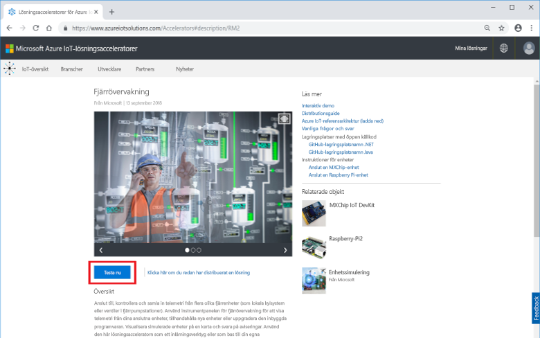

På sidan **Skapa Fjärrövervakning-lösning** väljer du en **Basic**-distribution. Om du distribuerar lösningsacceleratorn för att lära dig hur den fungerar eller för att köra en demonstration väljer du alternativet **Basic** för att minska kostnaderna.

Välj **.NET** som språk. Java- och .NET-implementeringar har identiska funktioner.

Ange ett unikt **lösningsnamn** för din Fjärrövervakning-lösningsaccelerator. I den här snabbstarten kallar vi den för **contoso-rm2**.

Välj den **prenumeration** och den **region** du vill använda för att distribuera lösningsacceleratorn. Normalt väljer du regionen närmast dig. I den här snabbstarten använder vi **Visual Studio Enterprise** och **Europa, västra**. Du måste vara [global administratör eller användare](iot-accelerators-permissions.md) i prenumerationen.

Klicka på **Skapa lösning** för att inleda distributionen. Processen tar minst fem minuter att köra:

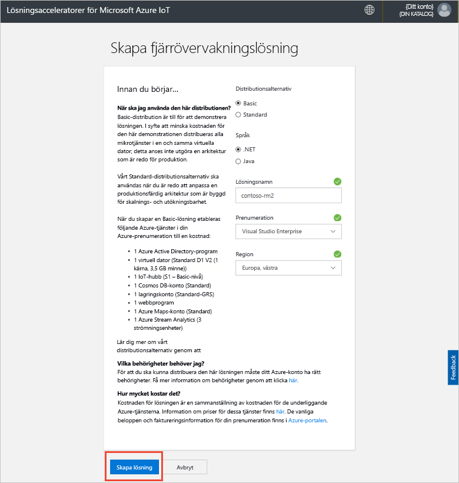

## Logga in på lösningen

När distributionen till Azure-prenumerationen är klar visas en grön bockmarkering och **Redo** på lösningspanelen. Du kan nu logga in på instrumentpanelen för lösningsacceleratorn Fjärrövervakning.

På sidan **Etablerade lösningar** klickar du på Fjärrövervakning-lösningsacceleratorn:

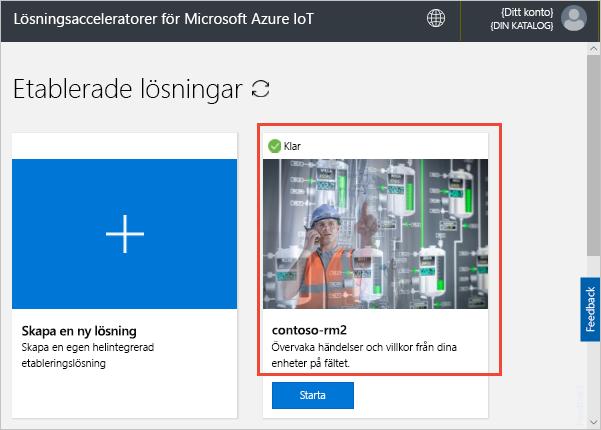

Du kan visa information om Fjärrövervakning-lösningsacceleratorn på panelen som visas. Välj **Lösningens instrumentpanel** för att visa Fjärrövervakning-lösningsacceleratorn:

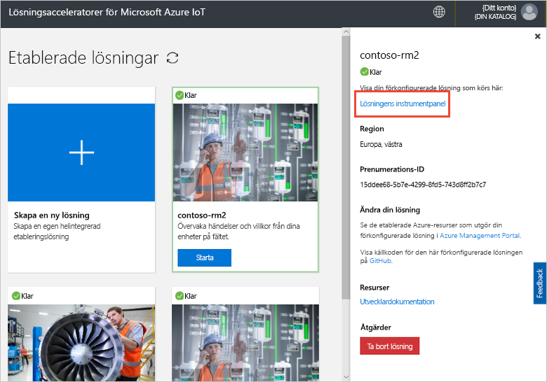

Klicka på **Acceptera** för att acceptera begäran om behörigheter som Fjärrövervakning-acceleratorn visar i webbläsaren:

[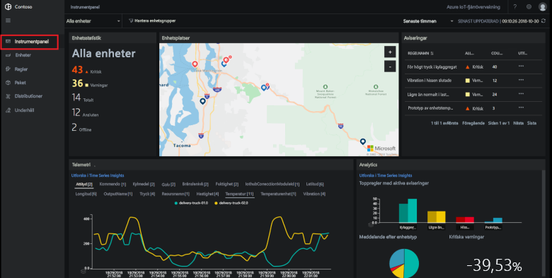](./media/quickstart-remote-monitoring-deploy/solutiondashboard-expanded.png#lightbox)

## Visa dina enheter

På lösningens instrumentpanel visas följande information om Contosos simulerade enheter:

* **Enhetsstatistik** visar sammanfattningsinformation om aviseringar och totalt antal enheter. I standarddistributionen har Contoso 10 simulerade enheter av olika typ.

* **Enhetsplatser** visar var enheterna finns fysiskt. Färgen på nålen visar när det finns aviseringar från enheten.

* **Aviseringar** visar information om aviseringar från enheterna.

* **Telemetri** visar telemetri från enheterna. Du kan visa olika telemetriströmmar genom att klicka på telemetrityperna högst upp.

* **Analys** visar kombinerad information om aviseringarna från enheterna.

## Svara på en avisering

Som operatör på Contoso kan du övervaka dina enheter via lösningens instrumentpanel. Panelen **Enhetsstatistik** visar att det har varit ett antal kritiska aviseringar och panelen **Aviseringar** visar att de flesta kommer från kylaggregatet. För Contosos kylaggregat visar ett inre tryck på över 250 PSI att enheten inte fungerar som den ska.

### Identifiera problemet

På sidan **Instrumentpanel**, på panelen **Aviseringar** ser du att aviseringen **Chiller pressure too high** (Trycket i kylaggregatet är för högt). Kylaggregatet har en röd nål på kartan (du kanske måste panorera och zooma på kartan):

[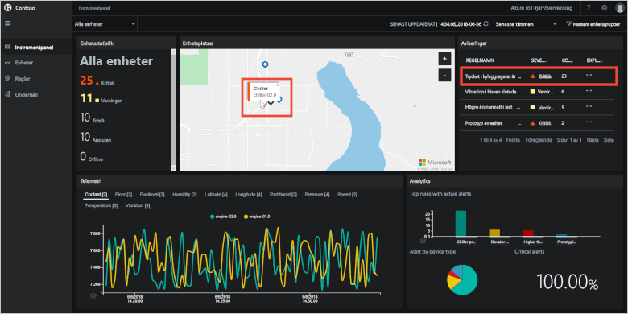](./media/quickstart-remote-monitoring-deploy/dashboardalarm-expanded.png#lightbox)

På panelen **Aviseringar** klickar du på **...** i kolumnen **Utforska** bredvid regeln **Chiller pressure too high** (Trycket i kylaggregatet är för högt). Den här åtgärden tar dig till sidan **Underhåll** där du kan visa informationen för regeln som utlöste aviseringen.

Underhållssidan för **Chiller pressure too high** (Trycket i kylaggregatet är för högt) visar information om regeln som utlöste aviseringarna. På sidan listas även när aviseringarna förekom och vilken enhet som utlöste dem:

[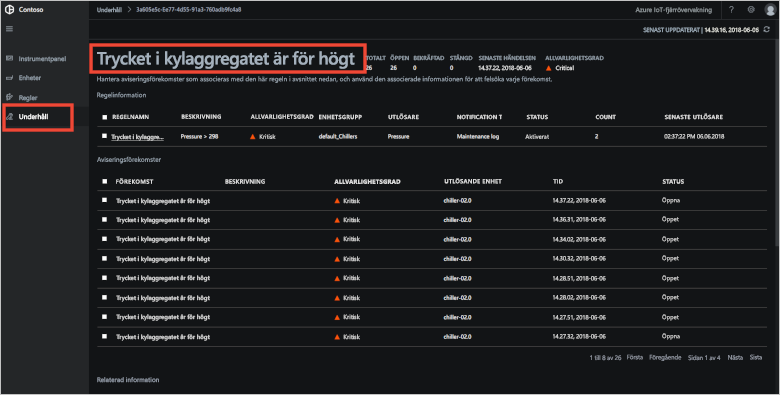](./media/quickstart-remote-monitoring-deploy/maintenancealarmlist-expanded.png#lightbox)

Nu har du identifierat problemet som utlöste aviseringen och på vilken enhet som problemet finns. Som operatör är nästa steg att bekräfta aviseringen och åtgärda problemet.

### Åtgärda problemet

Visa för andra operatörer att du arbetar med aviseringen genom att välja den och ändra **aviseringens status** till **Bekräftad**:

[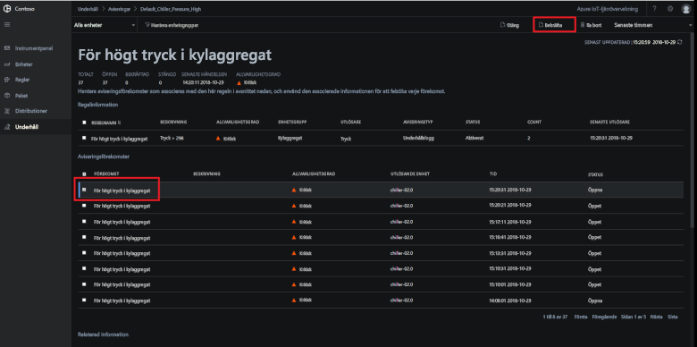](./media/quickstart-remote-monitoring-deploy/maintenanceacknowledge-expanded.png#lightbox)

Värdet i statuskolumnen ändras till **Bekräftad**.

Åtgärda kylaggregat genom att rulla ned till **Relaterad information**, välja kylaggregatet i listan **Enheter med aviseringar** och välj sedan **Jobb**:

[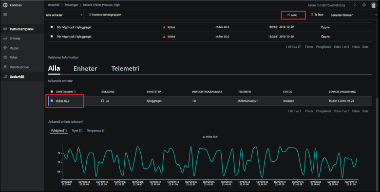](./media/quickstart-remote-monitoring-deploy/maintenanceschedule-expanded.png#lightbox)

På panelen **Jobb** väljer du **Kör metod** och sedan metoden **EmergencyValveRelease**. Lägg till Jobbnamnet **ChillerPressureRelease** och klicka på **Använd**. Inställningarna skapar ett jobb som körs direkt.

Om du vill se jobbstatusen går du tillbaka till sidan **Underhåll** och visar listan över jobb i vyn **Jobb**. Du kan behöva vänta i några sekunder innan du ser att jobbet har körts för att släppa ventiltrycket på kylaggregatet:

[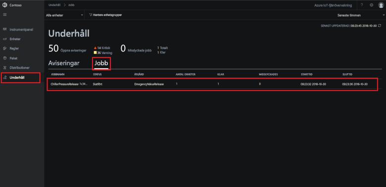](./media/quickstart-remote-monitoring-deploy/maintenancerunningjob-expanded.png#lightbox)

### Kontrollera att trycket är normalt igen

Om du vill visa trycktelemetrin för kylaggregatet går du till sidan **Instrumentpanel**, väljer **Pressure** (Tryck) i telemetripanelen och bekräftar att trycket för **chiller-02.0** är normalt igen:

[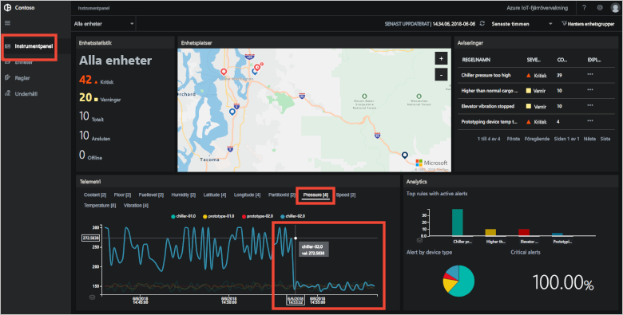](./media/quickstart-remote-monitoring-deploy/pressurenormal-expanded.png#lightbox)

Stäng incidenten genom att gå till sidan **Underhåll**, välj aviseringen och sätt statusen till **Stängd**:

[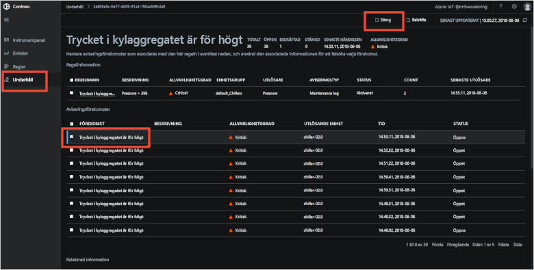](./media/quickstart-remote-monitoring-deploy/maintenanceclose-expanded.png#lightbox)

Värdet i statuskolumnen ändras till **Stängd**.

## Rensa resurser

Om du planerar att gå vidare till självstudierna låter du Fjärrövervakning-lösningsacceleratorn vara distribuerad.

Om du inte längre behöver lösningsacceleratorn tar du bort den från sidan [Etablerade lösningar](https://www.azureiotsolutions.com/Accelerators#dashboard) genom att välja den och sedan klicka på **Ta bort lösning**:

## Nästa steg

I den här snabbstarten har du distribuerat Fjärrövervakning-lösningsacceleratorn och utfört en övervakningsuppgift med hjälp av de simulerade enheterna i Contoso-standarddistributionen.

Fortsätt till nästa självstudie om du vill lära dig mer om lösningsaccelerator som använder simulerade enheter.

> [!div class="nextstepaction"]
> [Självstudier: Övervaka dina IoT-enheter](iot-accelerators-remote-monitoring-monitor.md)